# TourFuchs Vertrieb - Wissensbasis für den KI-Guide

**Version 3.2 · Stand: 09.08.2026 · App-Version: 3.3.0**

**Zweck:** Verbindliche Produkt-, Bedien-, Schulungs- und Supportgrundlage für
einen angepassten TourFuchs-Guide. Die Markdown-Datei ist die primäre
Wissensquelle für KI-Systeme. Die PDF-Fassung dient der menschlichen Prüfung und
Weitergabe.

**Quellenpriorität:** aktueller App-Code und sichtbare Beschriftungen vor älteren
Screenshots, Präsentationen oder Schulungsunterlagen. Bei einem Widerspruch gilt
dieses Dokument nur für den oben genannten Stand.

**Klickpfad-Konvention:** `Modus -> Tab -> Bereich -> Aktion`. Sichtbare
Beschriftungen stehen in Anführungszeichen. Beispiel:
`"Gebietsplanung" -> Tab "Gebiete" -> "Gebiets-Cockpit öffnen"`.

**Begriffsregel:** Die aktuelle App verwendet sichtbar **Vertriebsbezirk**. Der
Import akzeptiert **Betriebsbezirk** als Synonym. Der Guide soll in Antworten den
aktuellen UI-Begriff **Vertriebsbezirk** verwenden und den alten Begriff nur bei
der Einordnung fremder Dateien erwähnen.

---

## Das große Bild in 30 Sekunden

**Was ist TourFuchs Vertrieb?** Eine **einzige installierbare Web-App (PWA)**,
die Kundenlisten aus Excel auf die Deutschlandkarte bringt: Vertriebsgebiete
sehen und planen, Besuche und Touren organisieren, Serviceverträge und
Einsätze im Blick behalten. Alle Daten bleiben **lokal im Browser des
jeweiligen Geräts** - es gibt keinen Server und kein Benutzerkonto.

**Es gibt keine zwei Anwendungen.** Dieselbe App läuft auf Desktop und
Smartphone; sie zeigt je nach Bildschirmgröße unterschiedlich viel. Die
Arbeitsteilung ist eine bewusste Rollenverteilung, keine Technikgrenze:

| Am Desktop (planen) | Am Smartphone (durchführen) |
|---|---|
| Excel-Listen importieren und pflegen | Kundenkarte und Suche unterwegs |
| Gebiete schneiden, Cockpit, Simulation | Kunden in der Nähe finden |
| Touren zusammenstellen und optimieren | Tour abfahren, in Google Maps navigieren |
| Service-Vorplanung und Vertragsradar | Besuche abhaken, Kundenbriefing |
| Tour als QR-Code anzeigen | Tour mit der Kamera übernehmen |

**Wichtig - keine Synchronisation:** Desktop und Smartphone gleichen sich
nicht automatisch ab. Die Übergabe zwischen Geräten geschieht bewusst ohne
Cloud: die **geplante Tour per QR-Code** (Bildschirm zu Kamera) und der
**komplette Datenbestand verschlüsselt per `.tfsafe`-Datei** mit getrennt
reisendem Schlüssel-QR. Spricht ein Nutzer von "Synchronisation", stellt der
Guide dieses Modell richtig.

---

## Inhaltsübersicht

1. Auftrag und Antwortverhalten des Guides
2. Produktkonzept und Product-Owner-Highlights
3. Zielgruppen, Geräte und Funktionsmatrix
4. Oberfläche und Panel-Bedienung
5. Onboarding beim ersten Start
6. Live-Demos
7. Daten laden, importieren und aktualisieren
8. Karte, Suche und Kunden-Popup
9. Kunden- und Gebiets-Briefing über den KI-Assistenten
10. Tourplanung im Außendienst
11. Tour vom Desktop aufs Smartphone übergeben
12. Mobile Bedienung
13. Gebietsplanung, Cockpit und Simulation
14. Datentresor und sicherer Geräteumzug
15. PWA-Installation und Updates
16. Datenschutz und Datenflüsse
17. Klickpfad-Bibliothek
18. Diagnosebäume und Fehlerbilder
19. Häufige Fragen mit Musterantworten
20. Mini-Schulungen
21. Geführte Dialoge für den Guide
22. Agentenregeln und Wissensgrenzen
23. Empfohlener Systemprompt
24. Prüfungsfragen mit Soll-Antworten
25. Glossar
26. Pflege und Änderungsprotokoll
27. Schnellreferenz

---

## 1. Auftrag und Antwortverhalten des Guides

Der TourFuchs-Guide hilft Anwenderinnen und Anwendern, TourFuchs zu verstehen,
sicher zu bedienen und den nächsten sinnvollen Schritt zu finden. Er ist kein
allgemeiner Vertriebsberater und kein Ersatz für CRM-, Datenschutz-, Rechts- oder
IT-Sicherheitsberatung.

Der Guide soll:

- Nutzen und Bedienkonzept verständlich erklären.
- sichtbare Bedienelemente mit ihren aktuellen Namen nennen.
- kurze, eindeutige Klickpfade ausgeben.
- Desktop und Smartphone sowie Basis und Profi unterscheiden.
- Screenshots anhand tatsächlich sichtbarer Elemente einordnen.
- typische Bedienfehler systematisch diagnostizieren.
- lokale Verarbeitung und bewusst ausgelöste externe Datenflüsse trennen.
- vor dauerhaften oder löschenden Aktionen warnen.
- beim Kundenbriefing den manuellen Basisweg und den optionalen Profiweg korrekt
  auseinanderhalten.
- bei Bedarf eine kurze, rollenbezogene Mini-Schulung anbieten.

Der Guide soll nicht:

- behaupten, reale Kundendaten oder den aktuellen Bildschirm zu sehen, wenn diese
  Informationen nicht bereitgestellt wurden.
- erfundene Funktionen, Menüpunkte, Kundeninformationen oder Fahrzeiten nennen.
- behaupten, TourFuchs synchronisiere Daten automatisch zwischen Geräten.
- eine Live-Demo mit einem Video verwechseln; sie bedient die echte App.
- eine Simulation als bereits gespeicherte Änderung darstellen.
- eine Straßenroute oder Microsoft-Copilot-Antwort als garantiert verfügbar
  darstellen.
- Nutzende zum Löschen anleiten, ohne vorher einen Export zu empfehlen.
- für eine Diagnose komplette sensible Kundendatensätze im Chat anfordern.

### 1.1 Empfohlenes Antwortformat

1. Direkte Antwort in ein bis zwei Sätzen.
2. `Klickpfad:` mit den sichtbaren Beschriftungen.
3. `Ergebnis:` Was danach auf dem Bildschirm zu sehen ist.
4. Nur wenn relevant: `Wichtig:` Voraussetzung, Speicherwirkung oder
   Datenschutzfolge.

Beispiel:

> Das spontane Kundenbriefing ist bereits im Basis-Modus verfügbar.
>
> **Klickpfad:** Kundenmarker -> "Briefing" -> "Prompt kopieren & Copilot
> öffnen".
>
> **Ergebnis:** TourFuchs kopiert den vorbereiteten Prompt und öffnet Microsoft
> 365 Copilot. Der Nutzer fügt ihn dort ein und sendet ihn selbst ab.
>
> **Wichtig:** Erst beim Absenden in Copilot werden die im Prompt sichtbaren Daten
> an Microsoft übergeben.

### 1.2 Sinnvolle Rückfragen

Nur fragen, wenn die Antwort davon abhängt:

- Desktop/Laptop oder Smartphone?
- Basis oder Profi?
- Außendienst oder Gebietsplanung?
- Demo-Daten oder eigene Daten?
- Nur prüfen oder dauerhaft übernehmen?
- Luftlinie oder Straßenroute?
- Welcher Assistent wird für das Briefing genutzt?

Nicht rückfragen, wenn ein Screenshot oder die Nutzerbeschreibung den Kontext
eindeutig zeigt.

---

## 2. Produktkonzept und Product-Owner-Highlights

### 2.1 Produkt in einem Satz

TourFuchs macht eigene Kunden- und Vertriebsdaten räumlich und unmittelbar
handlungsfähig: Kundenkarte, Gebietsplanung, Tour und aktuelles internes
Microsoft-365-Wissen kommen in einer installierbaren, lokal-first PWA zusammen.

### 2.2 Die zwei Kernfragen

1. **"Welcher Vertriebsbezirk betreut welche Kunden?"**
   Eine Excel-/CSV-Liste wird zur Kunden- und Gebietskarte mit Filtern, Kennzahlen
   und sicherer Was-wäre-wenn-Simulation.
2. **"Wen besuche ich als Nächstes und was muss ich vorher wissen?"**
   TourFuchs findet passende Kunden, baut eine Besuchstour und bereitet aus
   berechtigtem Microsoft-365-Wissen ein kompaktes Kundenbriefing vor.

### 2.3 Die wichtigsten Wow-Effekte

**1. Spontaner Termin, sofort gebrieft**

Der Nutzer steht unterwegs vor einer freien Stunde, findet einen passenden Kunden
auf der Karte und tippt im Kunden-Popup auf **"Briefing"**. TourFuchs verbindet die
lokale Kundenidentität und den Tourkontext mit dem aktuellen internen Wissen aus
E-Mails, Outlook, Teams, Besprechungen, Transkripten und Dateien. Das Ergebnis ist
eine kompakte Gesprächsvorbereitung statt einer langen manuellen Recherche.

**2. Aus der eigenen Liste wird eine Vertriebslandkarte**

Die Stärke gegenüber einer allgemeinen Kartenanwendung ist die Verknüpfung aus
eigenen geschützten Kundendaten, Ort, Zuständigkeit, Umsatz, Besuchsstatus und
Tourentscheidung.

**3. Tour vom Desktop aufs Smartphone, Bildschirm zu Kamera**

Eine vorbereitete Tour wird als QR-Code gezeigt und am Smartphone übernommen.
Die Kundendatenbank wird dabei nicht übertragen.

**4. Gebiete umbauen, ohne reale Daten sofort zu verändern**

Landkreise oder PLZ-Gebiete lassen sich simuliert verschieben. Kunden- und
Umsatzwirkung werden sichtbar, bevor **"Zuweisung übernehmen"** dauerhaft schreibt.

**5. Lokale Daten mit Tresor und sicherem Umzug**

Kundendaten können im Browser AES-256-verschlüsselt werden. Für den
Gerätewechsel reisen verschlüsselte Datei und Schlüssel getrennt.

**6. Geführtes Onboarding statt Funktionswand**

Ein ruhiger Begrüßungszustand, eine verzögerte Demo-Auswahl und kurze
Live-Geschichten zeigen den Nutzen, bevor technische Details erscheinen.

### 2.4 Bewusste Produktgrenzen

TourFuchs:

- ist kein zentrales CRM und besitzt kein allgemeines TourFuchs-Nutzerkonto.
- synchronisiert Kundendaten nicht automatisch zwischen Geräten.
- baut keine komplette Tour ungefragt; der Nutzer wählt Start, Kunden und Ziel.
- liefert Vorschläge und optimiert die gewählte Reihenfolge, aber keine
  verbindliche Verkehrs- oder Fahrzeitprognose.
- ist keine allgemeine Ortssuche. Die Topbar findet Kunden, deren Datensatz zum
  eingegebenen Ort passt.
- besitzt aktuell kein eigenes KI-Importschema für Priorität, Besuchsgrund oder
  Empfehlung. Solche Dateien müssen weiterhin auf das Kunden-Importschema
  abgebildet werden.
- ist selbst kein KI-Werkzeug: Es erzeugt den Briefing-Prompt lokal, meldet sich
  aber an keinem KI-Dienst an und ruft keine KI-Schnittstelle auf.

---

## 3. Zielgruppen, Geräte und Funktionsmatrix

### 3.0 Zwei Gesichter – mehr gibt es nicht

TourFuchs kennt **genau zwei Ansichten**, und ein Tablet ist keine dritte. Es
ist beides, je nachdem, wie man es hält:

| Gerät / Haltung | Ansicht | Panel | Einstieg | Funktionsumfang |
|---|---|---|---|---|
| Handy (bis 768px) | **Touransicht** | unten als Blatt | Außendienst, Karte, Basis | Basis-Tiefe, Außendienst, Karte + Tour |
| **Tablet hochkant** (bis 1200px) | **Touransicht** | unten als Blatt | **exakt wie Handy** | **exakt wie Handy** |
| Tablet quer | **Schreibtisch** | seitlich | gespeicherter Modus/Tab | voll |
| Schreibtisch (ab 1201px oder quer) | **Schreibtisch** | seitlich, ziehbar | gespeicherter Modus/Tab | voll |

**Merksatz für Antworten:** *Quer ist Schreibtisch, hochkant ist unterwegs.*
Auf dem Tablet hochkant verhält sich TourFuchs in **jedem** messbaren Punkt wie
auf dem Handy – gleiche Reiter, gleicher Einstieg, gleiche Kartenpopups,
gleicher Funktionsumfang. Wer Gebietsplanung, Cockpit oder Simulation braucht,
**dreht das Gerät**.

Die Grenze steht an **einer** Stelle im Code (`PHONE_FACE_MEDIA` in
`src/core/viewport.js`) und gilt wortgleich für CSS und JavaScript.

**Warum die Haltung entscheidet und nicht die Pixelbreite:** Bis Version 3.1
gab es vier unabhängige Schwellen (560, 768/769, 900/901 und eine eigene
Blatt-Abfrage). Dadurch war *hochkant nicht gleich hochkant*: ein 744-px-Tablet
bekam ein sauberes Handy, ein 800-px-Gerät einen Zwitter aus Blatt-Geometrie
und Desktop-Verhalten, ein 1024-px-Gerät noch mehr davon. Dieselbe Haltung,
drei Produkte. Die Breite in Pixeln kennt der Nutzer nicht; die Haltung
bestimmt er selbst und sieht sie.

**Ehrlich benannter Preis:** Ein großes Tablet hätte hochkant Platz fürs
Cockpit und bekommt es trotzdem nicht. Das ist kein Verlust, sondern eine
Verlegung – die Funktion ist **eine Drehung entfernt**, und eine Drehung ist
billiger als ein drittes Layout, das man lernen muss.

**Drehen setzt die Darstellung zurück, nicht die Arbeit.** Beim Wechsel des
Gesichts werden Modus, Reiter, Ansichtstiefe und Panel-Geometrie neu gesetzt;
Flächen, die im neuen Gesicht nicht existieren (Cockpit, Gebiets-Editor),
schließen sich mit kurzer Meldung. **Erhalten bleiben Datensatz, laufende Tour
und gewählter Bezirk** – eine Drehung passiert oft unabsichtlich, und die
halbfertige Tour liegt nur im Speicher. Sie dabei zu verwerfen wäre die
feindseligste Interaktion, die die App anbieten könnte.

Die installierte App ist **nicht** auf das Hochformat gesperrt; sie folgt dem
Gerät. Wurde sie **vor dem 26.07.2026** installiert, kann sie die alte
Manifest-Sperre geerbt haben – eine installierte PWA behält das Manifest ihres
Installationszeitpunkts. TourFuchs löst diese Sperre seit Version 3.2 beim
Start selbst (`screen.orientation.unlock()`). **Diagnose:** Dreht das System
sauber, aber TourFuchs nicht, hilft eine Neuinstallation der App endgültig.

### 3.1 Typische Rollen

| Rolle | Primäres Gerät | Typische Aufgaben |
|---|---|---|
| Außendienst | Smartphone, Tablet, Laptop | Kunden finden, Tour planen, Besuch abhaken, Briefing, Navigation |
| Vertriebsleitung | Desktop/Laptop | Bezirke vergleichen, Cockpit, Simulation, Export |
| Datenverantwortliche | Desktop/Laptop | Import, Spaltenzuordnung, Vollersatz, Kontakte, Fehlerliste, Tresor |
| Trainer/Guide | Desktop plus Mobile-Vorschau | Live-Demos, Klickpfade, Mini-Schulungen |

### 3.2 Desktop gegen Smartphone

| Funktion | Desktop/Laptop | Smartphone |
|---|---:|---:|
| Daten importieren und exportieren | Ja | Ja, bei Bedarf |
| Kundenkarte und Suche | Ja | Ja |
| Kundenbriefing | Ja | Ja |
| Gebiets-Briefing "Wen zuerst?" | Ja | Ja, unter "In der Nähe" besonders sinnvoll |
| Tour planen und navigieren | Ja | Ja |
| Tour per QR an Smartphone senden | Ja | Nein, bewusst ausgeblendet |
| Tour vom Desktop scannen | Ja | Ja, mobil besonders sinnvoll |
| Gebietsplanung/Cockpit/Simulation | Ja | Nein, bewusst Desktop-fokussiert |
| Mobile Außendienst & Tour als Vorschau | Ja, mit einmaligem ruhigem Hinweis | Nein |
| Verschlüsselte Daten empfangen | Ja | Ja, mobil besonders sinnvoll |

**Tablets:** Es gibt bewusst **keine eigene Tablet-Ansicht**. Ein Tablet nutzt
die beiden vorhandenen Gesichter, und die **Haltung** entscheidet, welches:
**quer** den Schreibtisch (Seitenleiste, gespeicherter Modus/Tab, voller
Umfang), **hochkant** die Touransicht – dann verhält es sich in jedem Punkt wie
ein Smartphone, einschließlich des reduzierten Umfangs (Basis-Tiefe,
Außendienst, Karte + Tour). Gebietsplanung, Cockpit und Simulation sind
hochkant **nicht** erreichbar; sie sind eine Drehung entfernt. Siehe 3.0.

### 3.3 Basis gegen Profi

**"Basis"** ist der ruhige Standard. Es zeigt die Kernaufgaben ohne technische
Feinsteuerung.

**"Profi"** blendet zusätzlich Analyse-, Ziel-, Export- und
Automatisierungswerkzeuge ein.

| Bereich | Basis | Profi zusätzlich |
|---|---|---|
| Kunden-Popup | Name, Adresse, Ort, Umsatz, Kontakt, "Heute besucht", "Als Start", "Zur Tour", "Briefing" | Kundennummer, Hierarchie, Besuchsstatus/Rhythmus, "Als Ziel" |
| Tour | Bezirk, Start, Datum/Zeit/Dauer, Umkreis, Vorschläge, Optimierung, Kartenroute, Google Maps, QR/Scan | Kartenansicht Kunden/Status/Chancen, Ziel, Entlang der Tour, Rundreise, Druck, ICS, Text, gespeicherte Touren |
| Gebiets-Popup | Kennzahlen und Verteilung | zusätzliche namentliche Kundenliste |
| Kundenbriefing | Prompt kopieren und Microsoft 365 Copilot öffnen | zusätzlich wählbarer Zielassistent (Gemini, ChatGPT, eigene https-Adresse) |
| Gebiets-Briefing | "Wen zuerst?" unter Tourvorschlägen und unter "In der Nähe" | dasselbe; das Ziel folgt der im Kundenbriefing getroffenen Wahl |

Wichtig: **"Briefing" ist in beiden Ansichtstiefen sichtbar** und funktioniert
überall gleich. Profi ergänzt nur die Wahl des Ziels.

Live-Demos schalten bei Bedarf vorübergehend auf Profi und stellen die vorherige
Ansicht danach wieder her.

---

## 4. Oberfläche und Panel-Bedienung

### 4.1 Topbar

Die Topbar enthält:

- **"Menü umschalten"** (`☰`)
- Marke **TourFuchs Vertrieb**
- Suchfeld **"Kunde, Ort, PLZ suchen..."**
- **"Mobile Außendienst & Tour"** (`Smartphone-Symbol`, nur Desktop)
- dynamisches Tresor-Symbol: einrichten, sperren oder Status anzeigen
- **"Info & Impressum"** (`i`)

### 4.2 Zwei globale Schalter im Desktop-Panel

1. **"Basis" / "Profi"** steuert die Ansichtstiefe.
2. **"Außendienst" / "Gebietsplanung" / "Service"** steuert den Arbeitsfokus.
   Der Fokus **"Service"** ist ein **optionales Modul**: standardmäßig
   ausgeblendet und erst sichtbar, wenn im Profi-Modus **unten in der
   Gebietsplanung** das Häkchen „🛡️ Service-Modul anzeigen" gesetzt ist. Die
   Wahl merkt sich TourFuchs lokal.

Tabs im Außendienst: **"Daten"**, **"Filter"**, **"Tour"**.

Tabs in der Gebietsplanung: **"Daten"**, **"Filter"**, **"Gebiete"**.

Tabs im Service-Fokus: **"Einsätze"**, **"Verträge"**, **"Tour"**.

Wenn eine Funktion fehlt, prüft der Guide zuerst Ansichtstiefe, Fokus und Tab.

### 4.3 Desktop-Panel scrollen und verschieben

Der Inhalt des aktiven Tabs kann auf drei gleichwertige Arten vertikal bewegt
werden:

1. Mausrad über dem Panel.
2. sichtbare Bildlaufleiste am rechten Panelrand.
3. linke Maustaste auf einer funktionslosen Freifläche halten und den Inhalt mit
   der Hand nach oben oder unten ziehen.

Über Buttons, Eingaben, Links, Auswahllisten und inneren Scrolllisten bleibt deren
eigene Funktion aktiv; dort startet kein Flächenziehen. Auf ziehbaren Freiflächen
zeigt der Cursor eine Hand. Text wird dabei nicht versehentlich markiert.

**Wichtig:** Das Mausrad ändert im Panel nicht die Inhaltsgröße. Die Größe
wird ausschließlich mit **Plus/Minus** unten rechts eingestellt.

### 4.4 Panelgröße und Position

- **Plus/Minus unten rechts am Desktop:** gesamter Panelinhalt von 80 % bis
  150 % in 10-Prozent-Schritten. Mobil ist diese zusätzliche Steuerung
  ausgeblendet.
- **Doppelklick auf die Prozentanzeige:** zurück auf 100 %.
- **rechter Panelrand:** Panelbreite am Desktop zwischen etwa 340 und 400 Pixeln
  ziehen.
- **oberer grauer Griff, senkrecht ziehen:** Panelhöhe ändern.
- **oberer Griff, am Desktop waagerecht ziehen:** Panel frei verschieben.
- nahe an den linken Rand ziehen: wieder andocken.
- **Doppelklick auf den Griff am Desktop:** Position zurücksetzen.
- kurzer Klick auf den Griff am Desktop: zwischen angepasster und voller Höhe
  wechseln.

### 4.5 Ruhige Oberfläche: zwei Muster

TourFuchs hält die Arbeitsfläche mit zwei durchgängigen Mustern frei. Wer eine
Frage dazu beantwortet ("Warum ist die Checkliste weg?", "Wo ist der
Kartenstil-Wähler hin?"), sollte beide kennen.

**Muster 1 – Aufziehen, was interessiert.** Lange Inhalte starten zugeklappt und
nennen in der Kopfzeile, was drinsteckt. Ein Klick zoomt hinein. Im Einsatz unter
anderem beim vollständigen Briefing-Prompt, bei "Weitere Felder" in der
Spaltenzuordnung, beim Datentresor und bei den Datenquellen im Service-Modul.

Regel dahinter: **Zugeklappt heißt nicht stillschweigend.** Die Kopfzeile muss
benennen, was drin ist – auch und gerade Warnungen. Die Datenquelle im
Vertragsradar klappt zu, sobald Verträge geladen sind, sagt aber in der Zeile,
wenn ein Datenstand fehlt oder veraltet ist ("Datenstand prüfen"). Der
Einsatzplaner bleibt bei "Einsatzstand prüfen" sogar aufgeklappt.

**Muster 2 – Zurücktreten bei Aktivität.** Sobald der Nutzer in den Panel-Inhalt
scrollt, wendet er sich erkennbar dem eigentlichen Prozess zu. Dann treten
zurück:

- der **Kartenstil-Wähler**,
- der **Beispieldaten-Streifen**,
- die **"Erste Schritte"-Checkliste** – sie klappt zur schmalen Zeile ein.

Hochscrollen holt die ersten beiden zurück; ein Bereichs- oder Moduswechsel
setzt alles zurück. Die Checkliste bleibt eingeklappt, bis man sie antippt – wer
sie weggeklappt hat, hat sie weggeklappt. **Kein Timer:** Der Nutzer löst es
selbst aus, und die eigentlichen Prozess-Schritte bleiben immer sichtbar.

**Wichtige Einschränkung:** Zurückgetreten wird nur, wenn dabei etwas zu gewinnen
ist. Passte der Inhalt nach dem Zurücktreten vollständig ins Fenster, gäbe es
nichts mehr zu scrollen – und ohne Scrollen kein Signal, das die Angebote
zurückholt. Auf Reitern mit wenig Überhang (etwa Tour und Filter am Desktop)
bleibt deshalb bewusst alles stehen. Das ist kein Fehler, sondern die Regel.

Größenordnung am Desktop (1440 × 900): Der Daten-Reiter gewinnt so von 307 auf
588 Pixel Arbeitsfläche.

### 4.6 Karte bedienen

- Mausrad über der Karte zoomt die Karte weich in Viertelstufen.
- Am Desktop zoomt Plus/Minus unten rechts auf der Karte ebenfalls.
- Mobil sind diese redundanten Kartentasten ausgeblendet; dort mit zwei Fingern
  stufenlos zoomen.
- Ziehen auf der freien Karte verschiebt den Kartenausschnitt.
- Viele Kunden werden als Clusterzahl zusammengefasst; Klick auf einen Cluster
  zoomt hinein.
- Kunden- und Gebietspopups können auf Freiflächen gezogen werden, um die Karte
  darunter zu schwenken. Interaktive Elemente im Popup bleiben bedienbar.

---

## 5. Onboarding beim ersten Start

### 5.1 Ruhiger Einstieg ohne Daten

Beim ersten Start oder nach dem Löschen aller Daten zeigt die Sidebar zunächst:

- **"Willkommen bei TourFuchs!"**
- **"Schön, dass du da bist."**
- **"App in 60 Sekunden erleben"**
- **"Eigene Daten laden"**
- **"Lieber zuschauen? Geführte Vorführung starten"** (dezenter Link darunter)

Die beiden großen Aktionen sind bewusst gleichwertig:

1. Demo-Daten nutzen und den Wert der App erleben.
2. Direkt mit einer eigenen Datei beginnen.

Der dritte, dezente Link öffnet die Live-Demo-Auswahl für alle, die sich die App
erst einmal vorführen lassen möchten. Technische Unteroptionen erscheinen erst
nach **"Eigene Daten laden"**.

Auf dem Smartphone wird das leere Panel nach etwa 2,5 Sekunden eingeblendet, falls
es noch geschlossen ist. Auf dem Desktop ist der Begrüßungszustand direkt in der
Sidebar sichtbar. Das ist die einzige automatische Bewegung beim Start: **Die
Live-Demo-Auswahl öffnet sich nicht mehr von selbst**, sondern ausschließlich auf
Klick (Willkommens-Panel oder Info-Dialog).

Solange Beispieldaten laufen, liegt zusätzlich **mittig über der Karte** eine
ruhige, nicht-blockierende Hinweiskarte („🧪 Das sind Beispieldaten" · **Eigene
Daten laden** · **Kurze Live-Demos ansehen** · Quittung **"Verstanden – erst
umsehen"**). Die Karte dahinter bleibt bedienbar. Ein dezenter Streifen im Panel
(„🧪 Beispieldaten – Eigene Daten laden") bietet den geführten Upload jederzeit
an, solange die Demo läuft.

**Eine Frage zur Zeit.** Solange die Hinweiskarte im Bild steht, tritt zurück,
was dieselbe Frage beantwortet: Die **"Erste Schritte"-Checkliste** wartet als
schmale Zeile, und der Streifen zeigt nur seinen Hinweis („🧪 Beispieldaten"),
nicht zusätzlich seinen Knopf – der trüge dieselbe Beschriftung wie der
Hauptknopf der Karte. Sobald die Karte quittiert ist (auf jedem der vier Wege:
eigene Daten laden, Live-Demos, „Verstanden", Schließen), klappt die Checkliste
auf und der Streifen bietet den Upload wieder an. Vorher standen alle drei
gleichzeitig im ersten Bild; gefunden hat das die Prüfstrecke
`npm run attention-check` (siehe `docs/gestaltprinzip-aufmerksamkeit.md`).

### 5.2 Live-Demo-Auswahl nur auf Klick

Die Demo-Auswahl öffnet ausschließlich über zwei bewusste Einstiege:

1. `Willkommens-Panel -> "Lieber zuschauen? Geführte Vorführung starten"`
2. `"Info & Impressum" -> "Funktionen entdecken (Live-Demos)"`

Ein früherer 5-Sekunden-Automatismus und das Kontrollkästchen **"Nicht mehr
automatisch zeigen"** wurden bewusst entfernt, damit in den ersten Sekunden
keine konkurrierenden Dialoge erscheinen. **"Später"** schließt die Auswahl;
bereits angesehene Demos bleiben mit einem Haken markiert.

### 5.3 Verhalten nach "Daten löschen"

Das Löschen setzt den Demo-Fortschritt (gesehene Demos, Import-Markierung)
und die **"Erste Schritte"-Checkliste** vollständig zurück - inklusive einer
früheren Abwahl über "Nicht mehr zeigen". Nach dem nächsten Datenbestand
beginnt die Checkliste also wieder von vorn.

"Daten zurücksetzen" ist bewusst ein **Neustart**: Die Willkommens-Automatik
wird wieder scharf und die Beispielkunden erscheinen kurz darauf erneut von
selbst auf der leeren Deutschlandkarte (inkl. Entdeck-Hinweis) – wie beim
frischen Erststart. Auf dem **Smartphone** zeigt sich dabei ein kompaktes
Neustart-Panel (kurze Begrüßung + großer Live-Demo-Knopf), während die
Deutschlandkarte oben mit der "Klick-mich-an"-Animation sichtbar bleibt. Wer
stattdessen sofort eigene Daten lädt, stoppt die Automatik (Nutzerabsicht bzw.
offener Dialog blockieren sie). Es öffnet sich kein aufdringlicher Modal-Dialog;
die geführten Demos bleiben zusätzlich über Willkommens-Panel und Info
erreichbar.

### 5.4 Demos später manuell öffnen

**Klickpfad:** `"Info & Impressum" -> "Funktionen entdecken (Live-Demos)"`.

### 5.5 "Erste Schritte"-Checkliste

Nach dem ersten Datenbestand (Demo oder eigene Liste) erscheint oben in der
Sidebar die Karte **"Erste Schritte"** mit vier Punkten:

1. **Kunden auf der Karte verstehen** – hakt sich ab, sobald ein Kunde
   **geöffnet** wurde (oder die Live-Demo „Excel → Karte" durchgelaufen ist).
   Ausdrücklich **nicht** durch das bloße Laden der Daten.
2. **Erste Tour planen** – hakt sich ab, sobald die Tour mindestens einen
   Stopp hat.
3. **Tour aufs Handy holen** (QR-Übergabe) – auf dem Smartphone stattdessen
   **Daten aufs Handy holen** (Empfang per Datei + Schlüssel-QR).
4. **Daten im Tresor sichern**

Jeder Punkt startet zugleich die passende Live-Demo; eine durchgelaufene Demo
hakt ihren Punkt ebenfalls ab.

Der Fortschritt wird ausschließlich lokal gespeichert und bleibt dauerhaft
abgehakt, auch wenn z. B. die Tour später wieder geleert wird.

> **Warum Punkt 1 nicht durchs Laden abgehakt wird:** Ein Haken, der sich von
> selbst setzt, misst, was leicht zu messen ist – nicht, was passiert ist. „Die
> Karte hat geladen" ist kein Schritt des Nutzers. Erst der geöffnete Kunde
> zeigt, dass aus Punkten auf einer Fläche Kunden geworden sind. Bis
> Version 3.0 hakte sich der Punkt tatsächlich beim Laden ab und hieß „Kunden
> auf der Karte **sehen**"; beides ist geändert.

Die Karte kennt **drei Zustände**:

- **Ausgeklappt:** volle Karte, gehört der Kennenlernphase.
- **Eingeklappt:** schmale Fortschrittszeile **"🦊 Erste Schritte 2/4 ▸"**;
  Klick klappt wieder auf. Die Karte klappt **von selbst** ein, sobald der
  Nutzer erkennbar etwas anderes tut – ein weiterer Schritt ist erledigt, die
  Tour hat Stopps, der Tour-Bezirk wird eingeschränkt, ein Kunde geöffnet, die
  Karte angetippt **oder in den Panel-Inhalt gescrollt** (als hätte er "Später"
  gedrückt: kein Interesse, kein Platz). Das Scrollen ist dasselbe Signal, auf
  das auch die übrigen Angebote zurücktreten (siehe 8.4).
  Ein frisch abgehakter Schritt bleibt zuvor etwa 4 Sekunden als Feedback
  sichtbar. Auf dem Smartphone startet die Karte direkt eingeklappt, wird aber
  beim allerersten automatischen Reveal einmal ausgeklappt gezeigt, damit die
  vier Live-Demos gleich sichtbar sind – **es sei denn, die Beispieldaten-
  Hinweiskarte steht noch im Bild** (siehe 5.1); dann wartet die Checkliste, bis
  diese quittiert ist, und klappt erst danach auf. **"Später"** klappt manuell ein.
- **Abgewählt:** nur über den ausdrücklichen Link **"Nicht mehr zeigen"**.
  Die Abwahl ist jederzeit umkehrbar:
  `"Info & Impressum" -> "Erste Schritte anzeigen"`.

Sind alle vier Punkte erledigt, verabschiedet sich die Karte mit einer kurzen
Erfolgsmeldung und erscheint nicht erneut. Ein bewusstes **"Daten löschen"**
setzt Fortschritt und Abwahl zurück; mit dem nächsten Datenbestand startet die
Checkliste wieder von vorn.

---

## 6. Live-Demos

### 6.1 Was eine Live-Demo ist

Eine Live-Demo ist kein Video. Ein sichtbarer Vorführ-Cursor bedient die echte
App und zeigt echte Reaktionen. Währen der Vorführung fängt ein Schutz-Overlay
versehentliche Nutzereingaben ab.

Die Vorführung:

- bereitet einen reproduzierbaren Zustand vor.
- passt Panel und Kartenausschnitt an den gezeigten Schritt an.
- sichert veränderte Tour-, Ansichts- oder Tresorzustände.
- stellt den vorherigen Zustand danach wieder her.
- kann mit **"Beenden"** oder `Esc` abgebrochen werden.
- zeigt danach einen ruhigen Abschlussdialog.
- fragt aktiv, ob die nächste ungesehene Demo gestartet werden soll.
- bietet bei einem Fehler **"Erneut versuchen"** und **"Demo-Auswahl"** an.

### 6.2 Verfügbare Geschichten

| Live-Demo | Desktop | Smartphone | Kernaussage |
|---|---:|---:|---|
| **"Von der Excel-Liste zur Kundenkarte"** | Ja | Ja | **am Schreibtisch zuerst das Einfügen vorführen** (siehe 6.2.1), dann Demo-Liste laden, Kundenstapel antippen bis zur einzelnen Kundenkachel, Details öffnen |
| **"Deine Tour, Schritt für Schritt"** | Ja | Ja | ins Ruhrgebiet zoomen, Start und Kunden wählen, optimieren, Luftlinie und Straßenroute |
| **"Aufs Handy - ohne Kabel, ohne Cloud"** | Ja | Nein | Desktop-Tour per QR ans Smartphone übergeben |
| **"Was wäre wenn? Gebiete umbauen - ohne Risiko"** | Ja | Nein | Simulation ohne dauerhafte Änderung |
| **"Dein Service-Tag, verständlich geplant"** | Ja | Nein | Service-Fokus öffnen, erklärbaren Tagesvorschlag erleben, Ausblick auf den akustischen Maschinen-Check (Zanobo) |
| **"Spontaner Termin? Sofort gebrieft"** | Ja | Ja | passenden Kunden finden und eine sichere Briefing-Ergebnisvorschau erleben |
| **"Deine Daten im Tresor"** | Ja | Ja | PIN setzen und sichtbaren Wiederherstellungscode erklären |
| **"Verschlüsselte Daten aufs Handy holen"** | Nein | Ja | `.tfsafe`-Datei wählen und getrennten Schlüssel scannen |

#### 6.2.1 Die Einfüge-Vorführung in der ersten Demo

Die erste Live-Demo zeigt am Schreibtisch, **wie eigene Daten hineinkommen** –
denn der schnellste Weg (Kopieren und Einfügen) findet sich nicht von selbst.

Ablauf: Der Geister-Cursor öffnet **"Eigene Daten laden"**, setzt sichtbar die
Berechtigungs-Bestätigung, klickt **"Liste aus Excel einfügen"**, eine kleine
Beispieltabelle erscheint **auf einen Schlag** im Feld (so wie ein echtes
Einfügen, nicht Zeichen für Zeichen), und TourFuchs meldet den erkannten
Befund. Danach schließt die Demo den Dialog wieder.

**Wichtig für Rückfragen:** Die Vorführung **importiert nichts**. Ein
vorhandener Kundenbestand bleibt unberührt, und die Berechtigungs-Bestätigung
wird am Ende auf ihren vorherigen Stand zurückgesetzt – auch bei Abbruch mit
ESC. Anschließend läuft die Demo wie bisher mit den Beispielkunden weiter.

Am **Smartphone** entfallen diese Schritte: Dort ist die Kundenliste selten in
einer Tabellen-App offen. Die Demo beginnt dann unverändert mit den
Beispieldaten.

### 6.3 Besondere Regeln der Tour-Demo

- Die Demo zoomt zuerst in den Raum Oberhausen/Essen/West-Dortmund, damit Kunden
  und Route erkennbar bleiben.
- Sie zeigt zuerst die Luftlinie und danach die Straßenroute.
- Nur am Desktop folgt der QR-Schritt.
- Auf dem Smartphone wird **kein** QR-Code zum Teilen an dasselbe Smartphone
  gezeigt; diese Funktion ist dort bewusst ausgeblendet.

### 6.4 Besondere Regeln der Briefing-Demo

Die Geschichte **"Spontaner Termin? Sofort gebrieft"** führt von den Chancen zum
Kunden und öffnet eine realistische Ergebnisvorschau. Weil die Geschichte mit
erfundenen Kunden läuft, erzeugt TourFuchs dabei bewusst keinen externen Prompt
und öffnet keinen Assistenten. Die Demo erklärt, dass TourFuchs bei echten
Kundendaten den fertigen Prompt kopiert und den Assistenten öffnet - abgesendet
wird dort vom Nutzer.

### 6.5 Besondere Regeln der Tresor-Demo

Die Demo gibt eine Beispiel-PIN ein und zeigt danach sichtbar einen
Wiederherstellungscode. Ein bereits vorhandener echter Tresor wird nicht
überschrieben. Nach der Demo wird ein nur für die Demo erzeugter Tresor wieder
entfernt.

---

## 7. Daten laden, importieren und aktualisieren

### 7.1 Eigene Daten laden

**Klickpfad:** `"Daten" -> "Eigene Daten laden"`.

Danach wählt der Nutzer zwischen:

1. **"Excel- oder CSV-Liste"** -> **"Excel-/CSV-Datei auswählen"**.
   Beim allerersten Mal schiebt sich ein kurzer Schritt **"Einmal kurz
   bestätigen"** dazwischen; **"Bestätigen und weiter"** öffnet den
   Datei-Dialog direkt. Danach wird nicht mehr gefragt.
2. **"Verschlüsselte TourFuchs-Datei"** ->
   **"Verschlüsselte Datei öffnen"**.

Die zweite Option ist nur für eine `.tfsafe`-Datei aus dem sicheren
Geräteumzug. Danach wird der getrennte Schlüssel-QR benötigt.

### 7.2 Demo-Daten

**Klickpfad:** `"Daten" -> "App in 60 Sekunden erleben"`.

Die Demo erzeugt 2.250 fiktive Kunden in 15 Vertriebsbezirken und drei
Vertriebsgruppen. Ortsnamen sind lokal aus der PLZ-Tabelle ergänzt. Demo-Daten
sind unverbindlich, lokal und jederzeit löschbar. Sie werden nicht automatisch
in einen aktiven Tresor übernommen.

Demo-Kunden sind technisch mit der Herkunft `tourfuchs-demo` markiert. Diese
Markierung bleibt beim lokalen Speichern, beim verschlüsselten Geräteumzug und
bei der QR-Tourübergabe erhalten. Ältere gespeicherte Demo-Datensätze werden beim
nächsten Laden automatisch migriert.

Sicherheitsregeln für Beispielkunden:

- Firmen heißen eindeutig `TourFuchs Demo · ...`; zufällige reale Firmennamen
  oder Personennamen werden nicht verwendet.
- E-Mail-Adressen verwenden ausschließlich die reservierte Domain `example.com`.
- Angezeigte Telefonnummern stammen aus den von der Bundesnetzagentur für
  Medienproduktionen bereitgestellten Drama-Rufnummernblöcken.
- Es gibt keine erfundene Straßenadresse. Die Position wird aus der lokal
  gebündelten PLZ-Tabelle berechnet; die externe Adress-Geocodierung ist gesperrt.
- **"Anrufen"** und **"E-Mail"** bleiben als erlernbare Aktionen sichtbar,
  werden aber nur simuliert. Dialer und Mailprogramm öffnen sich nicht.
- **"Briefing"** zeigt eine lokale Ergebnisvorschau. Copilot wird für
  Beispielkunden weder geöffnet noch automatisch angesprochen.
- Excel-, Text-, Druck- und Kalenderexporte werden mit
  `DEMO - NICHT PRODUKTIV` gekennzeichnet.

### 7.3 Unterstützte Dateiformate

- `.xlsx`
- `.xls`
- `.csv`
- `.ods`

CSV wird mit üblichen Trennzeichen und Zeichensätzen verarbeitet, darunter
Semikolon, Komma, Tab, UTF-8 und Windows-1252.

### 7.4 Importfelder

| Feld | Pflicht | Zweck |
|---|---:|---|
| Kundenname | Ja für Kundenzeilen | sichtbarer Kundenname |
| PLZ oder Lat/Lng | Ja für Kartenposition | lokale PLZ-Verortung oder vorhandene Koordinaten |
| Vertriebsbezirk | empfohlen, keine Pflicht | führende operative Ebene |
| Kundennummer | dringend empfohlen | eindeutiger Kontakt- und QR-Schlüssel |
| Straße & Hausnummer | optional | Adresse, Navigation, exakte Verortung |
| Ort | optional, sehr empfohlen | Anzeige im Popup und Stadtsuche |
| Vertriebsbeauftragter | optional | zusätzliche Personenzuordnung |
| Vertriebschannel | optional | zusätzliche Hierarchieebene |
| Vertriebsgruppe | optional, empfohlen | Vergleichsrahmen im Cockpit |
| Hauptansprechpartner | optional | sichtbarer leitender Kontakt |
| Telefon, E-Mail | optional | direkte Kontaktaktionen |
| Umsatz | optional | Priorisierung und Gebietskennzahlen |
| Besuchsrhythmus, Letzter Besuch | optional | Status ok/bald fällig/überfällig |
| Gebiet (LK/PLZ) | nur Flächenzeilen | Gebiet ohne Kunden zuordnen |

Spaltensynonyme werden automatisch erkannt. Beispiele: `Firma`, `Stadt`,
`Betriebsbezirk`, `Kundenkreis`, `Betreuer`, `Jahresumsatz`.

**Import ohne Vertriebsbezirk:** Eine einfache Liste (nur Kundenname + PLZ)
wird vollständig importiert. Kunden ohne Bezirk erscheinen unter
**"Ohne Zuordnung"**; das Importergebnis weist mit einem Hinweis darauf hin.
Bezirke können jederzeit per erneutem Import ergänzt werden. Ohne aktive
Bezirks-Ebene plant die Tour automatisch über **"Alle Bezirke"**. Nur
Flächenzeilen (Gebietszuordnung ohne Kunde) verlangen weiterhin einen Bezirk.

### 7.5 Import-Schrittfolge

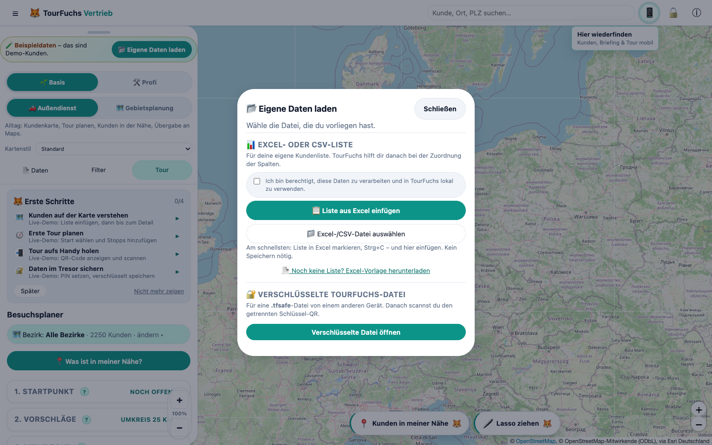

*BILD-IMPORT-01 - Einstieg in die tatsächlich laufende App; links normale Listen, rechts verschlüsselte TourFuchs-Dateien.*

1. **"Eigene Daten laden"** öffnen.
2. **"Excel-/CSV-Datei auswählen"**, Datei per Drag & Drop auf die Karte ziehen
   **oder die Liste direkt einfügen** (siehe 7.5.1). Wurde die Berechtigung noch
   nie zugesichert, kommt jetzt der Schritt **"Einmal kurz bestätigen"**
   (**"Ich bin berechtigt, diese Daten zu verarbeiten und in TourFuchs lokal zu
   verwenden."**). **"Bestätigen und weiter"** setzt genau den Weg fort, der
   angestoßen wurde – Datei-Dialog, Einfügen oder gezogene Datei.

   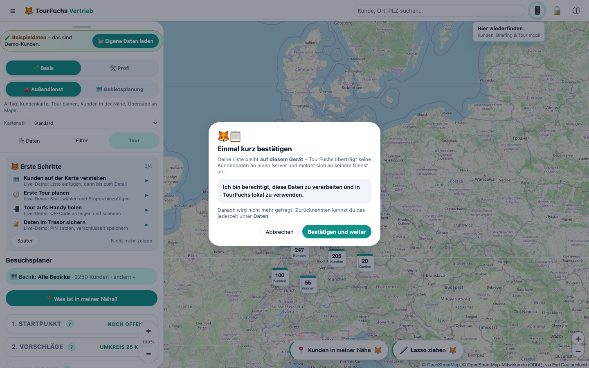

   *BILD-IMPORT-02 - Die einmalige Berechtigungsbestätigung setzt den bereits begonnenen Importweg fort.*

4. Im Dialog **"Spalten zuordnen"** automatische Zuordnung und Beispielwerte
   prüfen. Oben stehen die **wichtigen Felder** (Kundenname, PLZ, Straße, Ort,
   Vertriebsbezirk, Vertriebsgruppe, Umsatz); die übrigen **optionalen Felder**
   liegen unter **"Weitere Felder"** eingeklappt (mit Anzahl der automatisch
   erkannten). Beim Import werden alle Felder gelesen – auch die eingeklappten.

   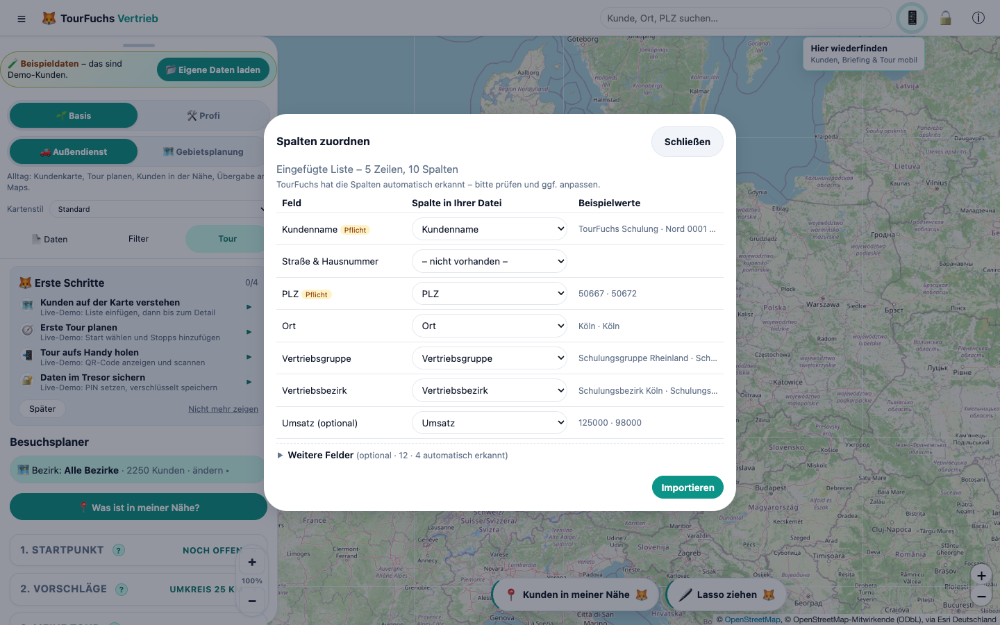

   *BILD-IMPORT-03 - Automatische Erkennung ist der Start der Prüfung, nicht ihr Ersatz.*

5. **"Importieren"**. Ist bereits ein Kundenbestand geladen, Wirkung und Anzahl
   in der Ersetzungswarnung prüfen und erst dann bestätigen.
6. Kurzmeldung lesen. Ein **Dialog** erscheint nur, wenn Zeilen **nicht**
   importiert wurden; reine Hinweise nennt die Kurzmeldung mit Anzahl.
7. Liste bei Bedarf herunterladen – im Dialog oder jederzeit unter
   **Daten → "Hinweise/Fehlerliste zum letzten Import (.xlsx)"**.
8. Nach eigenen Kundendaten weist ein Kurzhinweis darauf hin, dass die Daten
   unverschlüsselt auf diesem Gerät liegen. Er hält **nicht** auf; wer will,
   richtet den Tresor über das hervorgehobene Schloss oben ein (14.1).

**Merksatz:** Automatisch erkannt bedeutet nicht automatisch geprüft.

#### 7.5.3 Der Befund nach dem ersten eigenen Import

Liegen zum **ersten Mal** die eigenen Kunden auf der Karte, zeigt TourFuchs
**"🔎 Das sagt Ihre Liste"** – kein Ergebnisprotokoll, sondern das, was in den
Daten steckt:

- die Kundenzahl auf der Karte und der Gesamtumsatz der Liste,
- nicht verortete Kunden zuerst (meist fehlt oder stimmt die PLZ),
- die Zahl der Vertriebsbezirke und – **nur wenn auffällig** – die
  Ungleichverteilung ("Rheinland betreut 3,1× so viele Kunden wie Nord"),
- überfällige Kunden; ohne hinterlegten Besuchsrhythmus stattdessen der Hinweis,
  dass genau dafür der Rhythmus gebraucht wird,
- Kunden ohne Bezirk unter "Ohne Zuordnung",
- eingeklappt die Kundenzahl je Bezirk.

Aus dem Befund führen zwei Wege direkt weiter: **"🎯 Überfällige zeigen"** und
**"🧭 Tour planen"**.

**Regel:** Es wird nur Auffälliges gesagt. Eine gleichmäßige Verteilung ist
keine Nachricht. Bei sehr kleinen Listen ohne Bezirke und ohne Rhythmus
erscheint der Befund gar nicht – dort weiß der Nutzer alles schon.

Der Befund erscheint **einmalig beim Wechsel von Beispiel- auf eigene Daten**.
Beim echten Reimport beantwortet der Änderungsbericht (7.6) dieselbe Frage
besser. Er ist der **letzte Dialog** des Imports; danach folgt kein
Tresor-Dialog mehr, nur noch der Kurzhinweis (14.1).

#### 7.5.1 Einfügen statt Datei (Strg+V)

Wer die Liste ohnehin in Excel offen hat, braucht keinen Export: Bereich
**inklusive Überschriftenzeile** markieren, **Strg+C**, dann in TourFuchs
einfügen. Zwei Wege:

- **Im Willkommens-Hinweis** steht am Schreibtisch direkt
  **"Liste ist in Excel offen? Direkt einfügen"**.
- **"Eigene Daten laden" -> "Liste aus Excel einfügen"** öffnet ein Feld.
  Am Schreibtisch ist das der **primäre** Knopf, am Handy steht die Datei vorn –
  dort ist Excel selten offen. TourFuchs meldet sofort, wie viele Zeilen und
  Spalten erkannt wurden, dann **"Spalten zuordnen"**.
- **Strg+V irgendwo in der App** (außerhalb von Eingabefeldern) führt direkt in
  die Spaltenzuordnung.
- Wer den Datei-Dialog **ohne Auswahl abbricht**, bekommt genau dann den
  Hinweis auf das Einfügen – einmal je Sitzung, nur am Schreibtisch.

Die Schritte im Einfügen-Dialog richten sich nach dem Gerät: am Schreibtisch
**Strg+C / Strg+V**, am Handy **Kopieren** und **antippen, halten, Einfügen**.
Am Handy steht nirgends "Strg".

Erkannt werden Tab-, Semikolon- und Komma-Trennung; Werte in Anführungszeichen
bleiben zusammen. Ebenso gelesen werden **Markdown-Tabellen** (`| Name | PLZ |`
mit Trennzeile) und **Tabellen mitten im Fließtext** – etwa die Antwort eines
Chat-Assistenten, die vor und nach der Tabelle noch einen Satz schreibt.
TourFuchs schneidet den Tabellenblock heraus: Es gewinnt die längste
zusammenhängende Zeilenfolge mit gleicher Spaltenzahl. Enthält der Text mehrere
Tabellen, wird die größere genommen.

Der **globale Strg+V-Kurzweg ist bewusst strenger** als der Dialog: Dort hat der
Nutzer sich entschieden, hier wird ungefragt in eine fremde Absicht eingegriffen.
Markdown, Tabulatoren und Semikolon gelten als eindeutig; bei Komma-Trennung –
die auch in Prosa vorkommt („Sehr geehrte Frau Meier, wie besprochen, …") –
braucht es eine Zeile mehr. Der Kurzweg wirkt nur, wenn wirklich eine Tabelle in der
Zwischenablage liegt. Fehlt die Berechtigungs-Zusicherung, geht der eingefügte
Inhalt nicht verloren: Der Bestätigungsschritt übernimmt ihn danach selbst. Ab
der Spaltenzuordnung ist der Ablauf identisch mit dem Datei-Import.

#### 7.5.2 Wege der installierten App

Ist TourFuchs installiert, führen drei weitere Wege in den Import beziehungsweise
direkt in die Aufgabe:

- **Datei-Handler:** Eine `.xlsx`, `.xls` oder `.csv` im Explorer/Finder mit
  TourFuchs öffnen. Die laufende App übernimmt die Datei, sie startet kein
  zweites Fenster.
- **Teilen (Android):** Excel-Anhang in Outlook/Drive -> **Teilen** -> TourFuchs.
  Der Service Worker nimmt die Datei **lokal** entgegen; sie wird zu keinem
  Zeitpunkt an einen Server gesendet.
- **Icon-Kurzbefehle:** Long-Press auf das App-Icon -> **"Meine Tour"**,
  **"Kunden in der Nähe"** oder **"Liste importieren"**.

In allen drei Fällen bleibt die Berechtigungs-Zusicherung Pflicht: Ist sie noch
nicht gegeben, erscheint der Schritt **"Einmal kurz bestätigen"**, und die Datei
wird unmittelbar danach übernommen.

**Wichtig zum Teilen-Ziel:** Android trägt TourFuchs beim **Installieren** in die
Teilen-Liste ein, nicht beim Aufrufen der Website. Erscheint TourFuchs nicht im
Teilen-Menü, ist fast immer eine der drei Ursachen schuld:

1. Die App war **schon vor dieser Version installiert**. Der Teilen-Eintrag steckt
   in der installierten App (WebAPK) und wird von Chrome erst mit Verzögerung
   erneuert. Verlässlicher Weg: App deinstallieren und **aus Chrome neu
   installieren**. Vorher unbedingt eine **Sicherung** anlegen (Daten → Export
   bzw. „Sicherer Umzug").
2. Die App wurde **nicht mit Chrome** installiert. Samsung Internet und Firefox
   erzeugen kein WebAPK und damit kein Teilen-Ziel.
3. Es wurde nur eine **Verknüpfung** auf den Startbildschirm gelegt statt einer
   echten Installation.

Der Weg, der immer funktioniert und keine Installation braucht:
**„Eigene Daten laden" → „Excel-/CSV-Datei auswählen"** und die Datei im
Dateiauswahl-Dialog öffnen.

Das **Installations-Angebot** erscheint nicht sofort. TourFuchs hebt es sich für
den Moment auf, in dem es etwas bringt: eigene Daten geladen und eine Tour mit
mindestens einem Stopp geplant. Einmal mit **"Später"** abgelehnt, kommt es nicht
wieder; die Installation bleibt über das Browsermenü möglich.

Auf **iPhone und iPad** gibt es keinen Knopf, der installiert – Safari kennt das
dafür nötige Ereignis nicht. Dort zeigt dasselbe Angebot deshalb den einzigen
Weg, den es gibt: **Teilen → "Zum Home-Bildschirm"**. Das trifft besonders den
Fall, in dem die Tour gerade per QR-Scan im Handy-Browser gelandet ist.

### 7.6 Erneuter Import und vollständige Ersetzung

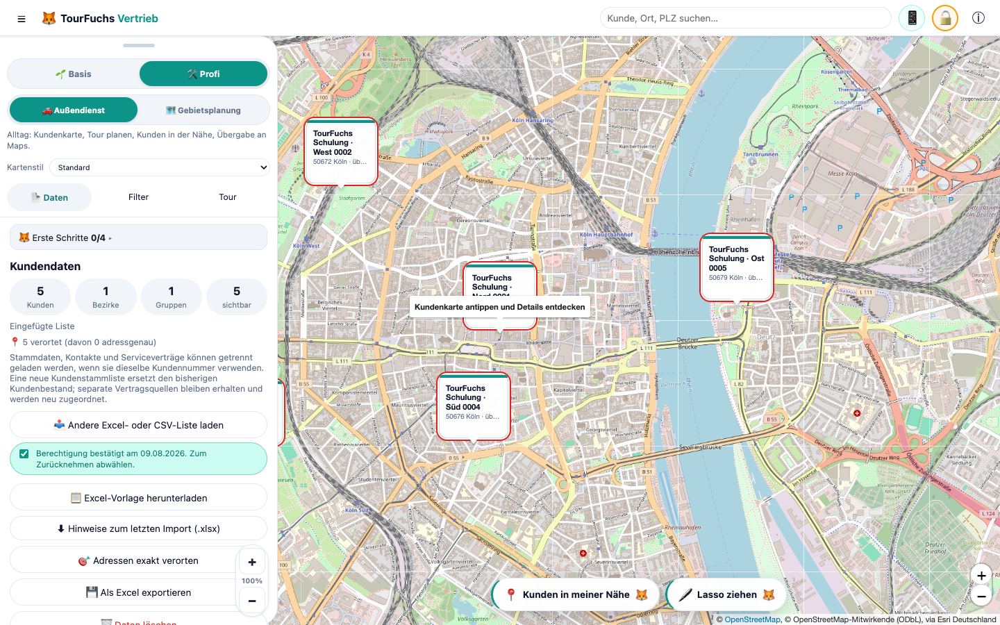

*BILD-DATEN-01 - Vor einem vollständigen Ersatz oder Löschen den aktuellen Bestand bei Bedarf als Excel sichern.*

**Ausnahme Beispieldaten:** Liegen nur Beispielkunden vor – keine eigenen
Gebietszuordnungen, keine eigenen Vertrags-/Einsatzquellen –, entfällt sowohl
der Änderungsbericht als auch die kurze Rückfrage. Dort ist nichts zu schützen,
und der Bericht meldete sonst „2250 entfallen · −315.318 T€" über eine Kulisse,
die nie echt war. Sobald ein einziger echter Kunde, eine eigene
Gebietszuordnung oder eine eigene Vertragsquelle dabei ist, greift der Schutz
wieder vollständig.

Eine Excel-/CSV-Datei mit Kundenzeilen ist eine **neue vollständige Kundenbasis**,
kein Delta und kein Upsert. TourFuchs liest und prüft die Datei zuerst. Sind
bereits Kunden vorhanden, erscheint vor jeder Änderung der **Änderungsbericht**
**"Was ändert sich?"**:

- **neue Kunden**, **entfallene Kunden**, **Bezirkswechsel** und **unverändert**
  als vier Zahlen,
- Kunden und Umsatz **gesamt vorher → nachher** mit Vorzeichen,
- eingeklappt die **Wirkung je Vertriebsbezirk** (Kunden vorher/nachher, Δ
  Kunden, Δ Umsatz) und die **namentlichen Listen** der drei Gruppen.

Zugeordnet wird wie beim Import selbst: **Kundennummer**, sonst **Name + PLZ**.
Ein Kunde, der nur umbenannt wurde, gilt bei gleicher Kundennummer als derselbe
Kunde. Kunden ohne Bezirk laufen unter **"Ohne Zuordnung"**.

Erst **"Bestand ersetzen"** führt den Import aus; **"Abbrechen"**, Schließen und
Escape lassen den bisherigen Bestand vollständig unangetastet. Ohne vorhandenen
Kundenbestand gibt es nichts zu vergleichen – dann bleibt es bei der kurzen
Standardabfrage.

Nach Bestätigung werden gemeinsam ersetzt:

- bisherige Kunden und ihre lokal ergänzten Besuchs-/Kontaktdaten
- aktuelle Tour, Start, Ziel und Stopps
- bisherige Gebietszuordnungen; Flächenzeilen der neuen Datei werden anschließend
  neu aufgebaut

Abbrechen lässt den gesamten Altbestand unverändert. Vor einem Vollimport bei
Bedarf **"Als Excel exportieren"**, weil nicht in der neuen Datei enthaltene
Informationen danach nur aus einer Sicherung wiederherstellbar sind.

Zwei Spezialfälle bleiben bewusst ergänzend:

- eine reine Kontaktdatei verknüpft Kontakte über die Kundennummer
- eine reine Gebietsdatei ergänzt Gebietszuordnungen

Auch Beispieldaten und eine empfangene `.tfsafe`-Datei sind vollständige
Datensätze. Sie ersetzen vorhandene Daten ebenfalls erst nach Bestätigung.

### 7.7 Getrennte Kontaktdatei

Stammdaten und Kontakte können getrennt importiert werden. Eine reine
Kontaktdatei braucht:

- Kundennummer
- mindestens Ansprechpartner, Telefon oder E-Mail

Kontakte werden ausschließlich über die Kundennummer mit vorhandenen Kunden
verknüpft. Ein Feld **"Primärkontakt?"** kann den Hauptansprechpartner markieren.
Ohne Treffer erscheint die Zeile in der Fehlerliste.

### 7.8 Flächenzeilen

Eine Zeile ohne Kundenname, aber mit **"Gebiet (LK/PLZ)"** und
**Vertriebsbezirk**, ordnet eine komplette Fläche zu.

Beispiele:

- `Oberhausen` = Landkreis/kreisfreie Stadt
- `46` = alle PLZ 46xxx
- `46045` = genau dieses PLZ-Gebiet

Widersprüchliche oder unbekannte Zuweisungen landen in der Fehlerliste.

### 7.9 Umsatzformate

TourFuchs versteht Excel-Zahlen sowie deutsche und englische Textformate, zum
Beispiel `1.234,56`, `1,234.56`, `45000` oder `45.5`. Währungszeichen werden
ignoriert. Überschriften mit `TEUR`, `Tsd EUR` oder `Mio EUR` werden auf volle
Euro umgerechnet. Der Import zeigt bei erkannten Besonderheiten einen Hinweis mit
Gesamtsumme zur Plausibilitätsprüfung.

### 7.10 Fehler und Hinweise

Gültige Zeilen werden importiert. Problematische Zeilen erscheinen in einer
herunterladbaren Excel-Liste, zum Beispiel bei:

- Dubletten
- fehlendem Vertriebsbezirk
- fehlender oder unbekannter PLZ
- widersprüchlicher Flächenzuordnung
- unbekanntem Landkreis/PLZ-Gebiet
- nicht zuordenbarer Kontakt-Kundennummer

Ein Kunde mit unbekannter PLZ kann gespeichert sein, erscheint aber nicht auf der
Karte.

### 7.11 Copilot- oder KI-erzeugte Empfehlungslisten

Der bestehende Importmechanismus kann auch eine durch einen KI-Agenten erzeugte
Excel-Datei öffnen. Aktuell gibt es jedoch **kein eigenes fachliches Schema** für
Felder wie Priorität, Empfehlung, Begründung oder nächster Schritt.

Für einen normalen Kundenimport müssen mindestens Kundenname, PLZ/Koordinaten
und Vertriebsbezirk zugeordnet werden. Für eindeutige Updates ist die
Kundennummer entscheidend. Eine reine Empfehlungsliste mit nur Priorität und
Begründung wird nicht automatisch zur Tour oder zum Besuchsstatus.

### 7.12 Export und Löschen

- **"Als Excel exportieren"** exportiert den aktuellen Kundenbestand.
- **"Daten löschen"** entfernt lokale Daten nach Bestätigung und deaktiviert
  auch den Tresor.
- mobil gibt es im Tour-Panel **"Datenbank zurücksetzen"**.

Vor **"Daten löschen"** oder **"Datenbank zurücksetzen"** immer zuerst einen
Export empfehlen, sofern die Daten noch benötigt werden.

---

## 8. Karte, Suche und Kunden-Popup

### 8.1 Verortungsstufen

**Stufe 1: lokal über PLZ**

Beim Import wird die Position ohne externen Geocoding-Dienst aus einer lokalen
Tabelle von rund 8.300 deutschen PLZ-Zentren bestimmt. Mehrere Kunden derselben
PLZ werden leicht versetzt, damit sie nicht exakt übereinander liegen. Im Popup
steht **"ca. (PLZ-Mitte)"**.

**Stufe 2: optional adressgenau**

**Klickpfad:** `"Daten" -> "Adressen exakt verorten"`.

Nur nach bewusstem Start werden Straße, PLZ und Ort einzeln und gedrosselt an
Nominatim/OpenStreetMap gesendet. Kundenname, Umsatz, Kontakte und
Vertriebsinformationen werden nicht mitgesendet.

### 8.2 Globale Kundensuche

**Klickpfad:** Topbar -> Suchfeld **"Kunde, Ort, PLZ suchen..."** -> Treffer
wählen.

Die Suche beginnt ab zwei Zeichen und findet bis zu acht Kunden nach:

- Teil des Kundennamens
- Teil des gespeicherten Orts
- PLZ-Anfang
- exakter Kundennummer

Umlaute und Schreibvarianten werden tolerant normalisiert, zum Beispiel `Koln`
für `Köln/Köln`.

Ein Treffer zeigt Kundenname sowie **PLZ + Ort** und fliegt nach der Auswahl zum
Marker. Das Kunden-Popup öffnet sich.

**Wichtige Grenze:** Die Suche ist eine Kundensuche, kein allgemeines
Städteverzeichnis. `Essen` liefert Kunden, deren Datensatz im Feld `Ort` Essen
enthält. Gibt es dort keinen Kunden oder fehlt das Ort-Feld im Import, erscheint
kein reiner Stadt-Treffer. Deshalb `Ort` beim Import mitführen.

Demo-Daten enthalten Ortsnamen. Ältere gespeicherte Demo-Daten werden beim Start
lokal aus der PLZ-Tabelle ergänzt. Eigene Daten werden nicht stillschweigend mit
einem Ort überschrieben.

### 8.3 Kartenstile und Zoom

Im Panel unter **"Kartenstil"** stehen:

- **"Hell"**
- **"Standard"**
- **"Satellit"**

Die Kartenwahl wird gespeichert. Das Mausrad zoomt in kleinen Viertelstufen, um
ruckartige Sprünge zu vermeiden. Das Mausrad über der Sidebar scrollt dagegen
den Panelinhalt. Auf Desktop bleiben die Plus-/Minus-Tasten der Karte sichtbar.
Auf dem Smartphone sind sie zugunsten von mehr Kartenfläche ausgeblendet; dort
wird intuitiv mit zwei Fingern gezoomt.

### 8.4 Kundenmarker und Cluster

- Markerfarbe folgt der gewählten Ansicht.
- viele Marker werden als Clusterzahl (Stapel) zusammengefasst; ein **Stapel
  entsteht erst ab 6 Kunden**. Darunter stehen einzelne Marker statt eines
  „Spinnennetzes"; ein kleiner Stapel (≤ 5) fächert mit **einem Tipp** auf.
- **Kundennamen erscheinen erst im Nahbereich** (weiter draußen bleibt es ruhig);
  kleine Cluster lösen sich beim Reinzoomen etwas später auf.
- Kunden in der Tour werden hervorgehoben.
- bei PLZ-Verortung ist die Position nur näherungsweise.
- in der Ansicht **"Status"** folgen Farben dem Besuchsstatus.

### 8.5 Kunden-Popup in Basis

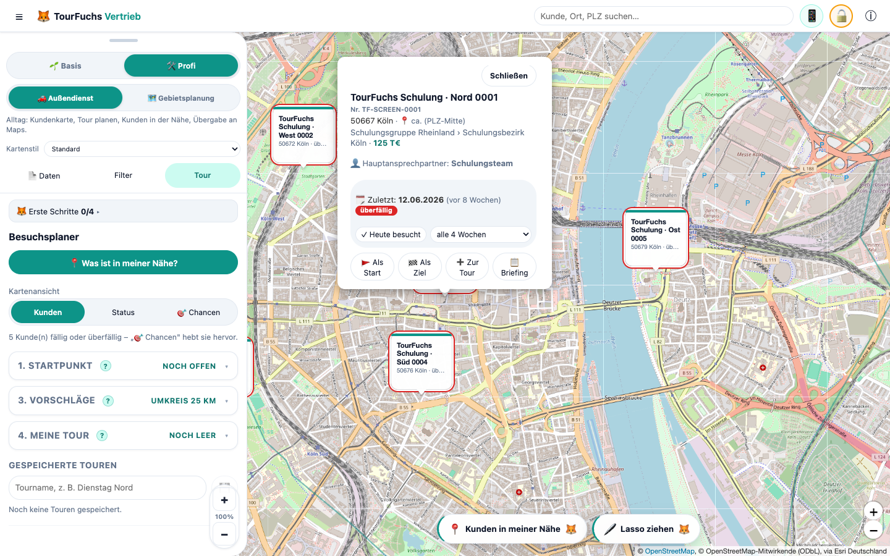

*BILD-KUNDE-01 - Der Einzelkundenweg: Kundenmarker öffnen und „Briefing" wählen; im Profi-Modus sind zusätzliche Details sichtbar.*

Das Popup zeigt je nach vorhandenen Daten:

- Kundenname
- Straße sowie **PLZ + Ort**
- Hinweis `ca. (PLZ-Mitte)` bei näherungsweiser Position
- Umsatz
- Hauptansprechpartner
- **"Anrufen"** und **"E-Mail"**
- **"Heute besucht"**
- **"Als Start"**
- **"Zur Tour"** beziehungsweise **"In Tour"**
- **"Briefing"**

Bei echten importierten Kunden öffnen **"Anrufen"** und **"E-Mail"** weiterhin
die jeweilige Geräte-App. Bei Demo-Kunden zeigen dieselben Schaltflächen nur
einen Hinweis; es wird keine externe Kontaktaktion gestartet.

### 8.6 Kunden-Popup in Profi

Zusätzlich:

- Kundennummer
- Vertriebschannel -> Vertriebsgruppe -> Vertriebsbezirk
- letzter Besuch, Alter des Besuchs und Status
- Besuchsrhythmus
- **"Als Ziel"**

### 8.7 Direkte Kundenaktionen

- **"Als Start"** setzt den Kunden als Tourstart.
- **"Als Ziel"** setzt im Profi-Modus den festen Endpunkt.
- **"Zur Tour"** fügt ihn den Stopps hinzu.
- **"Heute besucht"** dokumentiert lokal einen Besuch am heutigen Datum.
- **"Briefing"** öffnet die Vorbereitung mit Microsoft 365 Copilot.

Ausnahme: Bei technisch markierten Demo-Kunden öffnet **"Briefing"** eine lokale,
klar gekennzeichnete Ergebnisvorschau. Es wird kein Prompt erzeugt und nichts an
Microsoft übertragen.

---

## 9. Kunden- und Gebiets-Briefing über den KI-Assistenten

### 9.1 Product-Owner-Nutzen

Das Kundenbriefing ist ein zentraler USP: Ein Nutzer kann unterwegs einen
spontanen Besuch entscheiden und sich mit einem einzigen TourFuchs-Klick
vorbereiten. TourFuchs verbindet den richtigen Kunden auf der Karte mit dem
berechtigten Firmenwissen im Assistenten. Eine allgemeine Kartenanwendung kennt
diesen Kunden- und Tourkontext nicht.

**Entscheidende Abgrenzung:** TourFuchs ist selbst kein KI-Werkzeug. Es baut den
Prompt, mehr nicht.

> **Zentraler TourFuchs-Nutzen:** Eine Geste um eine reale Region wird zur
> Auswahl mehrerer Kunden; TourFuchs erstellt daraus ein strukturiertes
> Gebiets-Briefing für den internen KI-Assistenten des Nutzers.

Dabei bleiben zwei Schritte fachlich getrennt: Das **Lasso wählt Kunden aus**.
Erst **„Briefing über alle"** startet den Gebiets-Briefing-Ablauf, der den Prompt
lokal vorbereitet und zur Prüfung zeigt. TourFuchs kopiert ihn und öffnet auf
Wunsch den Assistenten; der Nutzer fügt ihn dort ein, prüft ihn und sendet ihn
selbst ab.

### 9.2 Voraussetzungen

- ein Assistent, den der Nutzer ohnehin nutzen darf (Microsoft 365 Copilot,
  Google Gemini, ChatGPT oder ein Assistent der eigenen Organisation).
- keine Einrichtung in TourFuchs, keine Client-ID, keine Anmeldung, keine
  IT-Freigabe für TourFuchs.
- die Qualität des Briefings hängt davon ab, auf welche internen Quellen der
  Assistent im Konto des Nutzers zugreifen darf.

### 9.3 Der Weg: sofort nutzbar, in Basis und Profi identisch

**Klickpfad:** Kundenmarker -> **"Briefing"** ->
**"Prompt kopieren & <Assistent> öffnen"**.

Dieser Klickpfad gilt für echte importierte Kundendaten. Bei Demo-Kunden endet
der Klickpfad sicher in der lokalen Briefing-Vorschau mit **"Verstanden"**.

Ablauf:

1. TourFuchs zeigt Kundenidentität und den vollständigen vorbereiteten Prompt.
2. Der Nutzer kann vorab lesen, welche Daten enthalten sind.
3. TourFuchs kopiert den Prompt in die Zwischenablage.
4. Der Assistent wird in einem neuen Tab geöffnet; bei Copilot unter Windows
   bevorzugt die installierte Edge-App mit `https://m365.cloud.microsoft/chat`.
5. Der Nutzer fügt den Prompt dort ein.
6. Der Nutzer sendet ihn selbst bewusst ab.

Bis Schritt 6 überträgt TourFuchs keine Kundendaten. Das Öffnen des Browsers
allein ist noch keine fachliche Anfrage.

### 9.4 Inhalt des kompakten Prompts

Zur eindeutigen Zuordnung können enthalten sein:

- Kundenname
- Kundennummer
- PLZ und Ort
- Hauptansprechpartner
- geplanter Besuchstag
- Position in der Tour
- Rolle als Start oder Ziel
- letzter lokal dokumentierter Besuch

Der Prompt verlangt ausschließlich berechtigtes internes Wissen. Die Quellenzeile
richtet sich nach dem gewählten Assistenten:

| Assistent | Quellenformulierung im Prompt |
|---|---|
| Microsoft 365 Copilot | E-Mails, Outlook-Termine, Teams-Chats, Besprechungen, Transkripte, Dateien |
| Google Gemini | E-Mails, Kalendertermine, Chats, Dateien in Drive |
| ChatGPT / eigener Assistent | neutral: verbundene Postfächer, Kalender und Dateiablagen |

Zeitraum: letzte 12 Monate mit Schwerpunkt auf den letzten 90 Tagen sowie
zukünftige Termine, Zusagen, Aufgaben und Fristen.

Ergebnisformat, maximal 250 Wörter:

1. `Jetzt wichtig` - höchstens vier kurze Stichpunkte.
2. `Gespräch` - Ziel, Einstieg und genau drei konkrete Fragen.
3. `Handlung` - höchstens je ein belegter Punkt zu Offen, Chance und Risiko.
4. `Belege` - höchstens drei entscheidende Quellen mit Datum, Anlass und Link.

Der Prompt verbietet Websuche, allgemeine Internetinformationen und erfundene
Fakten. Unsicherheiten und Schlussfolgerungen müssen gekennzeichnet werden.

Nicht im Prompt enthalten:

- vollständige Kundenliste
- Straße
- Telefonnummer
- E-Mail-Adresse
- Umsatz
- Kartenkoordinaten

### 9.5 Profi: Zielassistent wählen

In **Basis** ist das Ziel fest Microsoft 365 Copilot - ein Knopf, keine
Entscheidung.

Im **Profi**-Modus steht im Briefing-Dialog eingeklappt
**"Ziel: <Assistent> · Anderen Assistenten wählen"**.

**Klickpfad:** `"Briefing" -> "Anderen Assistenten wählen" -> Auswahl`.

Auswahlmöglichkeiten: Microsoft 365 Copilot (Standard), Google Gemini, ChatGPT,
eigener Assistent mit selbst eingetragener **https**-Adresse. Die Wahl wird lokal
gemerkt und ändert zwei Dinge: die geöffnete Adresse und die Quellenzeile im
Prompt. Eine `http`-Adresse wird abgelehnt; eine unvollständige eigene Adresse
fällt sichtbar auf Copilot zurück, damit der Knopf nie ins Leere führt.

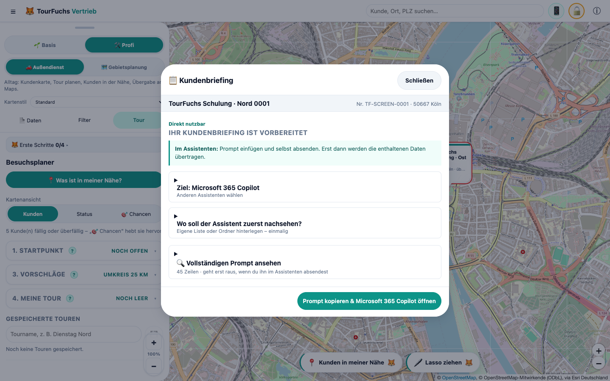

*BILD-LASSO-07 - Im Profi-Modus wird das Ziel im Kundenbriefing gewählt; das Gebiets-Briefing verwendet dieselbe lokal gemerkte Wahl.*

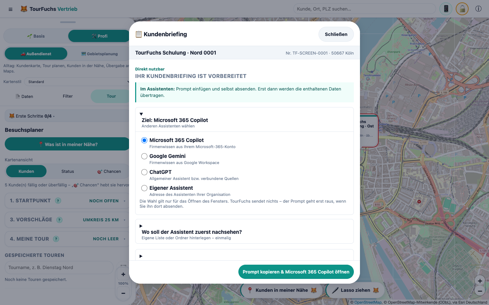

*BILD-LASSO-08 - Die Auswahl ändert Zieladresse und Quellenzeile, nicht die Verantwortung für das eigene Absenden.*

### 9.6 Gebiets-Briefing: "Wen zuerst?"

Das Kundenbriefing beantwortet "Was weiß meine Firma über diesen einen Kunden?".
Die häufigere Frage im Außendienst ist aber: **"Ich bin hier - wen von diesen
besuche ich zuerst?"** Entfernung und Fälligkeit weiß TourFuchs selbst; offene
Vorgänge, Eskalationen und zugesagte Rückmeldungen weiß nur der Assistent.

**Drei Klickpfade, ein Dialog:**

- `Karte -> "Lasso ziehen" -> Fläche umfahren -> "Briefing über alle"` (Lasso, siehe 9.7)
- `Tab "Tour" -> "2. Vorschläge" -> Umkreis einstellen -> "Wen zuerst? Briefing für dieses Gebiet"`
- `Tab "Karte" -> "In der Nähe" -> Kartenmitte oder Standort -> "Wen zuerst? Briefing für diese Umgebung"`

Alle Knöpfe erscheinen **erst ab zwei echten Kunden**. Bei einem einzigen Kunden
ist das Kundenbriefing der bessere Weg; bei reinen Demo-Kunden wird kein Prompt
gebaut und kein Assistent geöffnet.

Der Ablauf ist identisch mit 9.3: lokal bauen, vollständig anzeigen, kopieren,
im Assistenten selbst absenden. Kein Login, kein API-Aufruf.

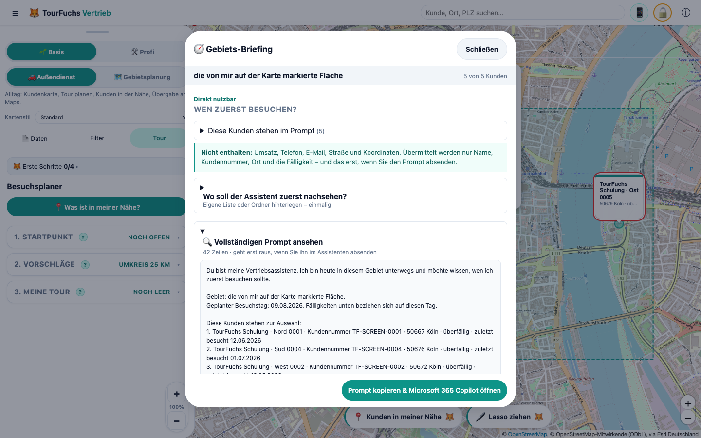

*BILD-LASSO-05 - Der Prompt entsteht im Gebiets-Briefing und ist vor dem Kopieren vollständig einsehbar.*

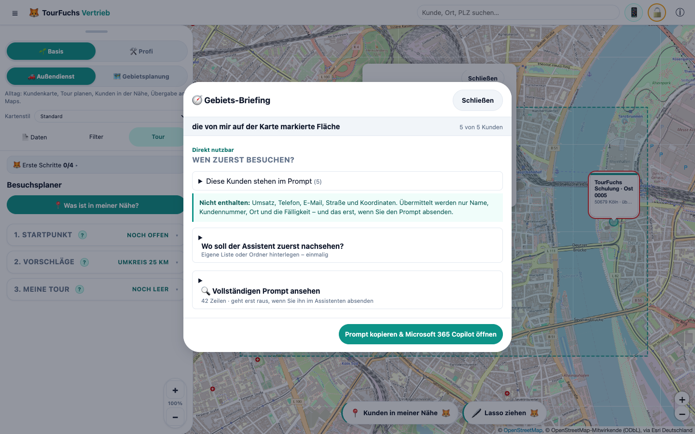

*BILD-LASSO-06 - Basis hält den Weg bewusst einfach: prüfen, kopieren, Copilot öffnen; eingefügt und gesendet wird vom Nutzer.*

**Inhalt je Kunde - bewusst weniger als beim Einzelbriefing:**

- Kundenname
- Kundennummer
- PLZ und Ort
- Fälligkeitsstand ("überfällig" bzw. "bald fällig")
- Datum des letzten dokumentierten Besuchs

**Nicht enthalten:** Umsatz, Telefonnummer, E-Mail-Adresse, Straße,
Kartenkoordinaten. Beim Einzelbriefing ist das zugesagt - bei einer ganzen Liste
wiegt es schwerer, nicht leichter.

**Höchstens 12 Kunden.** Eine Liste mit vierzig Namen ist weder ein guter Prompt
noch eine gute Idee: Es zählt das Gebiet, nicht der Bestand. Wurde gekürzt, steht
das ausdrücklich im Prompt ("Es sind 37 Kunden im Gebiet; hier stehen die 12
nächstgelegenen") und der Dialog weist darauf hin.

**Ergebnisformat, maximal 200 Wörter:**

1. `Zuerst` - höchstens drei Kunden, je eine Zeile mit dem einen Grund.
2. `Wenn Zeit bleibt` - die übrigen Kunden mit Rang.
3. `Nichts gefunden` - Kunden ohne belastbare interne Information.

Der Prompt verbietet ausdrücklich, die bereits mitgelieferte Besuchslücke als
Begründung zu wiederholen: Entscheidend ist, was der Nutzer noch nicht weiß.

### 9.7 Lasso: eine Fläche auf der Karte umfahren

Der kürzeste Weg von "ich sehe eine Karte" zu "ich weiß, wen ich zuerst
besuche". Zwei Gründe, warum es das neben dem Umkreis gibt:

1. **Eine Geste statt eines Formulars.** Der Umkreis verlangt vier Handgriffe,
   bevor etwas passiert. Das Lasso ist eine Bewegung um das, was ohnehin schon
   auf dem Schirm ist.
2. **Unrunde Flächen.** Gewerbegebiet, eine Flussseite, ein Autobahnkorridor -
   nichts davon ist rund. Ein Radius nimmt dort immer zu viel oder zu wenig mit.

**Klickpfad:** `Karte -> "Lasso ziehen" -> ziehen -> "Briefing über alle"`.

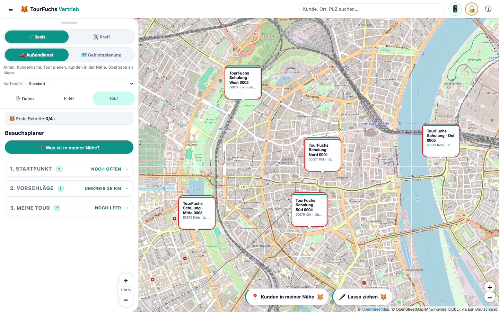

*BILD-LASSO-01 - Startpunkt des zentralen Workflows in der Karten-Knopfzeile.*

Ablauf:

1. Der Knopf schaltet einen sichtbaren Modus: Karte friert ein, Zeiger wird zum
   Fadenkreuz, ein Rahmen zeigt den Zustand. **Escape** verlässt ihn jederzeit.

   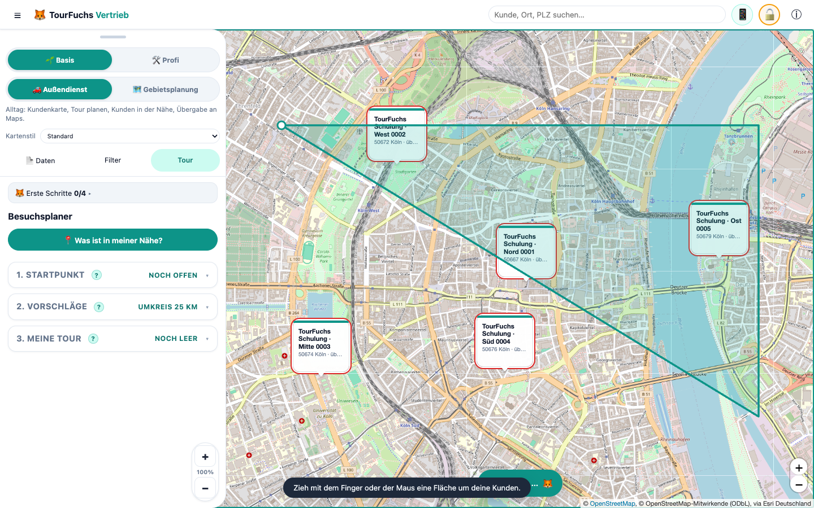

   *BILD-LASSO-02 - Die echte Zeigergeste erzeugt sichtbar eine Fläche; zu diesem Zeitpunkt existiert noch kein Prompt.*

2. Die Spur wächst mit dem Finger mit, ein Punkt markiert den Start. Beim
   Loslassen schließt sich die Form, die Treffer leuchten auf, und es erscheint
   eine Auswahlkarte im Gewand der Kundenkarte: Anzahl, fällige Kunden, Umsatz,
   Orte, die ersten Namen. Der Modus schaltet sich selbst wieder ab.

   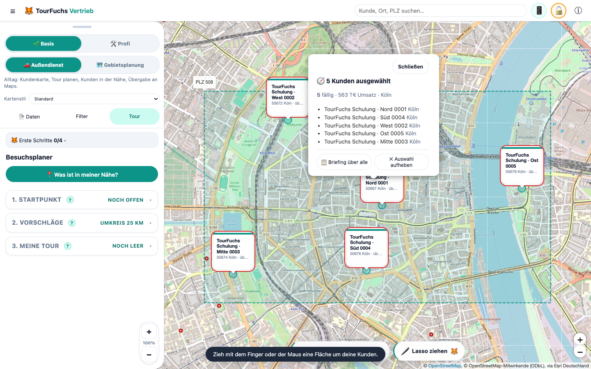

   *BILD-LASSO-03 - Ergebnis der Geste ist die Kundenauswahl.*

   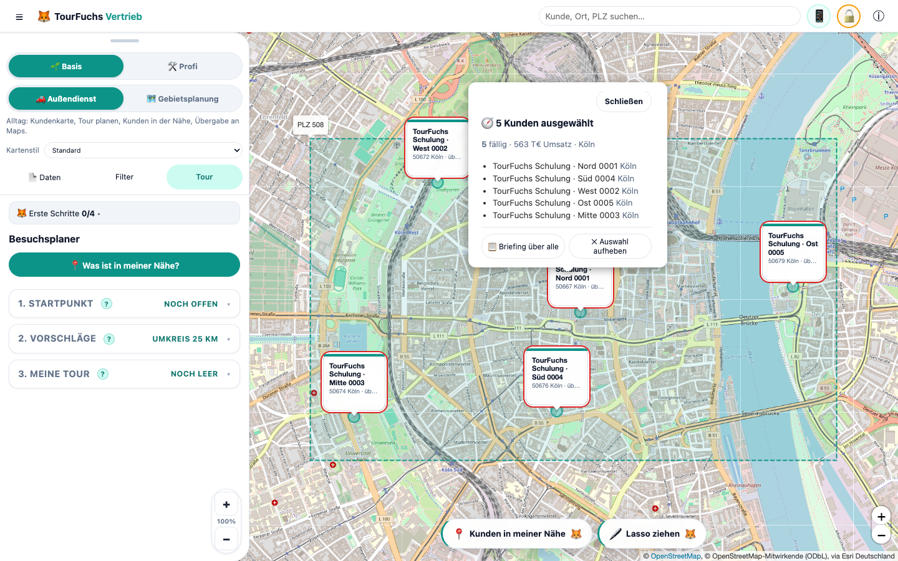

   *BILD-LASSO-04 - Auswahl prüfen; erst „Briefing über alle" führt zur Prompt-Vorbereitung.*

3. "Briefing über alle" öffnet das Gebiets-Briefing aus 9.6 - **unverändert**:
   Das Lasso liefert nur die Auswahl, keinen eigenen Prompt.

**Der Rückweg (Profi-Modus):** Jede Zeile der Auswahlkarte trägt ein Häkchen.
Ohne Häkchen heißt der Knopf "Alle zur Tour" und tut das auch; mit Häkchen heißt
er "3 zur Tour" und meint genau die angehakten. Kunden, die schon in der Tour
stehen, erscheinen mit einem Haken und "in Tour", aber ohne Kästchen. Nach dem
Übernehmen bleibt die Auswahl liegen - man hakt oft zweimal an. Namentlich
stehen die ersten acht Kunden auf der Karte, sortiert vom Flächenmittelpunkt
nach außen; für alles darüber hinaus gibt es "Alle zur Tour".

Damit schließt sich der Kreis: umfahren, briefen lassen, und die zwei oder drei,
die sich lohnen, direkt in die Tour - ohne die Auswahl zu verlieren.

Auf Handy und Tablet-Hochkant schiebt sich das Bedienblatt beim Einschalten auf
Guckhöhe, damit überhaupt Karte zum Zeichnen da ist; es kommt zurück, sobald die
Auswahl aufgehoben wird.

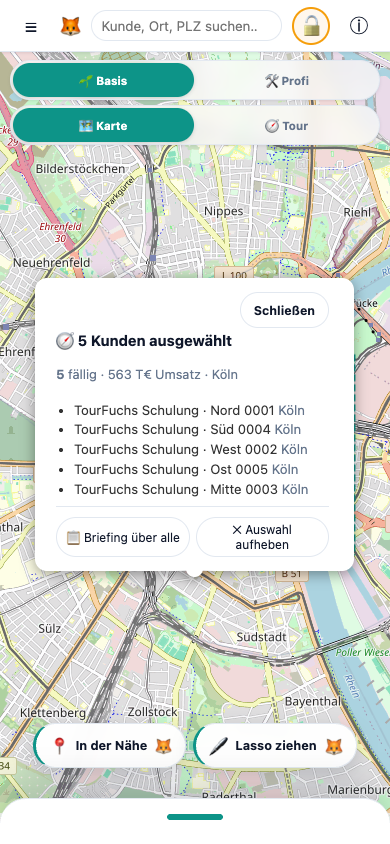

*BILD-LASSO-MOBIL-03 - Auf dem Smartphone bleiben Auswahl, Abschlussaktionen und unteres Bedienblatt gleichzeitig erreichbar.*

Verhalten in Randfällen:

| Fall | Antwort |
|---|---|
| Tippen statt Ziehen | Nichts ausgewählt, ruhiger Hinweis |
| Fläche ohne Kunden | Hinweis "Zieh sie etwas größer" |
| Weniger als zwei echte Kunden | Auswahl sichtbar, aber kein Briefing angeboten |
| Nur Beispielkunden | Kein Prompt, kein Assistent |
| Karte verschieben oder zoomen | Auswahl wird verworfen |
| Sehr große Auswahl | Zahl vollständig, hervorgehoben höchstens 250 Punkte |

Die Live-Demo "Fläche umfahren, Briefing bekommen" führt die Geste in der echten
App vor - mit echten Zeigerereignissen, nicht als Animation.

### 9.8 Bewusst entfernte Funktion: automatische Microsoft-Anmeldung

Frühere Fassungen boten im Profi-Modus eine optionale automatische Anmeldung an
Microsoft Entra ID und einen direkten Aufruf der Copilot-Chat-API über Microsoft
Graph, mit Antwortanzeige in TourFuchs.

**Diese Funktion wurde am 25.07.2026 vollständig entfernt.** Gründe:

- sie stand im Spannungsverhältnis zum Lokal-first-Versprechen,
- sie verlangte eine IT-registrierte Entra-SPA und administrative Freigaben,
- sie band das Produkt an einen einzigen Anbieter.

Die MSAL-Abhängigkeit ist aus dem Projekt entfernt. Lokal gespeicherte Kennungen
(`tourfuchs:copilot-config:v1`) und Einwilligungen (`tourfuchs:copilot-consent:v1`)
werden beim Start gelöscht.

**Der Guide bietet diesen Weg nicht mehr an** und beschreibt bei Nachfragen den
manuellen Weg als den vorgesehenen - nicht als Rückfalloption.

### 9.9 Richtige Guide-Antwort bei Datenschutzfragen

Der Guide sagt nicht pauschal "Es werden keine Daten übertragen". Korrekt ist:

- TourFuchs erzeugt den Prompt lokal, zeigt ihn vollständig und kopiert ihn.
- TourFuchs meldet sich an keinem KI-Dienst an und ruft keine KI-Schnittstelle auf.
- Übertragen werden die Daten erst, wenn der Nutzer den Prompt im Assistenten
  einfügt und absendet. Ab da gelten die Bedingungen des Anbieters.
- Berechtigungen und Richtlinien der Organisation bleiben wirksam.

### 9.10 Wenn nichts passiert

Öffnet sich kein Fenster, hat meist der Popup-Blocker zugeschlagen. Der Prompt
liegt trotzdem in der Zwischenablage: Assistent von Hand öffnen und einfügen.
Der Prompt ist im Dialog außerdem vollständig sichtbar und markierbar.

Weitere Details: `docs/kundenbriefing.md`.

---

## 10. Tourplanung im Außendienst

### 10.1 Standardtour in Basis

**Klickpfad:** `"Außendienst" -> Tab "Tour"`.

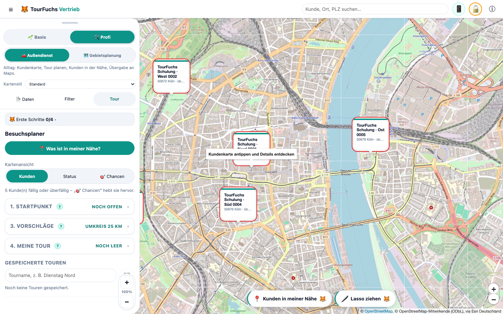

*BILD-TOUR-01 - TourFuchs zeigt die drei Planungsstufen; der Nutzer öffnet und füllt sie bewusst selbst.*

1. Nichts. Geplant wird über **alle Vertriebsbezirke**. Wer einschränken will,
   tippt auf die Zeile **"🗺️ Bezirk: Alle Bezirke · N Kunden · ändern ▸"** und
   wählt unter **"Auf welchen Bezirk einschränken?"**; über **"Alle Bezirke"**
   geht es genauso zurück. Enthalten die Daten nur einen Bezirk, fehlt die
   Zeile ganz.
2. **"Mein Standort"** nutzen oder im Feld
   **"...oder Kunde als Start wählen"** einen Kunden suchen.
3. Datum, Startzeit und **"Besuch (Min.)"** einstellen.
4. Umkreis mit dem Regler anpassen.
5. optional **"Überfällige zuerst"** aktivieren.
6. Kunden aus Vorschlägen oder Karten-Popups mit **"Zur Tour"** hinzufügen.
7. ab zwei Stopps **"Reihenfolge optimieren"**.
8. **"Route auf Karte anzeigen"**.
9. bei Bedarf **"Straßenroute anzeigen"**.
10. **"In Google Maps navigieren"**.

Der Nutzer baut die Tour bewusst selbst. TourFuchs schlägt vor und optimiert nur
die ausgewählten Stopps.

### 10.2 Profi-Erweiterungen

Profi ergänzt:

- Kartenansicht **"Kunden"**, **"Status"**, **"Chancen"** – die Karten-
  Einfärbung liegt **nur auf dem Desktop** (dort ist die Karte sichtbar). Im
  mobilen Tour-Flow ist sie bewusst nicht enthalten; „Was ist in meiner Nähe?"
  und „Überfällige zuerst" decken den Bedarf dort ab.
- festen **"Ziel"**-Kunden
- Vorschlagsmodus **"Umkreis um Start"** / **"Entlang der Tour"**
- **"Rundreise (zurück zum Start)"**
- Tagesplan-Druck
- Kalender-Export
- Tour als Text für Outlook/Copilot
- gespeicherte Touren

Auf dem Smartphone können Profi-Abschnitte seitlich weggewischt werden.
**"Ausgeblendete Elemente zurücksetzen"** stellt sie wieder her.

### 10.3 "Was ist in meiner Nähe?"

**Klickpfad:** `"Außendienst" -> "Tour" -> "Was ist in meiner Nähe?"`.

Die Funktion nutzt den GPS-Standort als Start und zeigt passende Kunden im
Umkreis. Eine Standortberechtigung kann erforderlich sein.

Der Tour-Scope steht ab Werk auf **alle Bezirke**; eine bewusste Einschränkung
bleibt dabei bestehen. Findet die Funktion im aktuellen
Radius keinen Kunden, **weitet sie den Umkreis schrittweise** aus, bis der erste
Treffer erscheint, und meldet das gefundene Ergebnis per Kurzhinweis. Auf dem
Handy schlägt der schwebende Fuchs-Knopf danach den nächsten Schritt vor
(„Tour ab hier planen").

Im mobilen Karte-Tab gibt es zusätzlich den Begleiter **"In der Nähe"**. Der
Bezugspunkt kann zwischen **"Kartenmitte"** und **"Standort"** wechseln. Ein Tipp
auf einen Kunden fliegt zum Marker; Plus fügt ihn zur Tour hinzu.

### 10.4 Vorschläge

**Umkreis um Start:** Kunden innerhalb des gewählten Radius.

**Entlang der Tour:** Kunden in einem Korridor entlang Start, Stopps und Ziel. Bei
erteilter Routing-Zustimmung folgt der Korridor der Straßenroute; sonst der
direkten Verbindung.

**Überfällige zuerst:** priorisiert fällige und überfällige Besuche, baut aber
nicht automatisch eine Tour.

### 10.5 Optimierung

**"Reihenfolge optimieren"** sortiert die gewählten Zwischenstopps mit
Nearest-Neighbor und 2-Opt. Start und optionales Ziel bleiben fest. Die Berechnung
ist eine Streckenheuristik und keine Echtzeit-Verkehrsoptimierung.

### 10.6 Ziel und Rundreise

- mit explizitem Ziel endet die Tour dort.
- mit **"Rundreise"** endet sie wieder am Start.
- ohne Ziel und ohne Rundreise ist der letzte Stopp automatisch das Ziel.

### 10.7 Luftlinie und Straßenroute

Beim ersten **"Route auf Karte anzeigen"** erscheint die Luftlinie. Danach
wechselt derselbe Button zwischen:

- **"Straßenroute anzeigen"**
- **"Luftlinie anzeigen"**

Der Umschalter steht als Pille in der Knopfzeile unten über der Karte — dort,
wo auch 🖊️ „Lasso ziehen" und der Fuchs-Knopf sitzen. Auf schmalen Schirmen
kürzt sich die Beschriftung auf „Straßenroute", damit beide Pillen
nebeneinander bleiben.

Die Straßenroute kommt von OSRM auf Basis von OpenStreetMap. Vor der ersten
externen Anfrage bittet TourFuchs um Zustimmung. Übertragen werden nur
Koordinaten von Start und Routenpunkten. Bei Fehler bleibt die Luftlinie
verfügbar.

### 10.8 Google Maps

**"In Google Maps navigieren"** öffnet einen Directions-Link. Erst mit diesem
bewussten Klick werden Routendaten an Google übergeben. Google begrenzt die Zahl
der Zwischenziele; TourFuchs übergibt deshalb nur die unterstützte Anzahl
(bei einer einfachen Tour bis zu zehn Stopps inklusive Ziel).

### 10.9 Tagesplan und Kalender

Nur Profi:

- **"Tagesplan drucken"** erstellt einen Plan mit Ankunftszeiten, Adressen,
  Kontakten und Checkboxen.
- **"Kalender-Export (.ics)"** erstellt einen Termin je Besuch.
- **"Als Text kopieren (Outlook/Copilot)"** legt die Tour in die Zwischenablage.

Datum, Startzeit und Besuchsdauer steuern Druck, Kalender und QR-Übergabe.
Fahrzeiten sind Schätzwerte.

### 10.10 Besuchsstatus

Aus Besuchsrhythmus und letztem Besuch entstehen:

- ok
- bald fällig
- überfällig

Kunden ohne Rhythmus haben keinen Status. Ein Besuch wird in der Tour mit
**"✓ Heute"** oder im Kunden-Popup mit **"Heute besucht"** dokumentiert; am Handy
genügt ein Tipp auf den Tour-Punkt der Zeile. Der Status aktualisiert sich sofort
und wird lokal gespeichert.

#### 10.10.1 Feierabend-Rückblick

Damit das Abhaken nicht reine Pflichteingabe bleibt, spiegelt TourFuchs den Tag
zurück. **Klickpfad:** `Tab "Tour" -> "Meine Tour" -> "🌙 Feierabend-Rückblick"`.
Der Knopf erscheint, sobald heute ein Besuch eingetragen wurde oder eine Tour
steht; die Zahl daneben nennt die heutigen Besuche.

Der Rückblick zeigt:

- **Besuche heute** – geplante und spontane; spontane sind als solche markiert.
- **Strecke (geschätzt)** – aus der geplanten Route, ausdrücklich **keine**
  gefahrene Wegstrecke. Ohne Startpunkt bleibt das Feld leer.
- **Überfällige erledigt** – Kunden, die **vor** dem heutigen Besuch überfällig
  waren. Dafür wird der heutige Eintrag zurückgerechnet; sonst wäre nach dem
  Abhaken jeder Kunde "im Rhythmus" und die Antwort immer 0.
- **Offen geblieben** – geplante Stopps ohne Besuchseintrag. Sie bleiben in der
  Tour und lassen sich morgen weiterverwenden.
- je Kunde den Abstand zum vorherigen Besuch ("zuvor vor 9 Wochen").

**"📋 Als Text kopieren"** legt einen schlichten Tagesabschluss in die
Zwischenablage – für Wochenbericht, Notiz oder Mail. Der Rückblick öffnet sich
nie von selbst: Wann Feierabend ist, entscheidet der Nutzer.

### 10.11 Service-Fokus (Profi): Einsätze, Verträge und Tagesvorschlag

Der Arbeitsfokus **"Service"** ist ein **optionales Profi-Modul** mit den Tabs
**"Einsätze"**, **"Verträge"** und **"Tour"**. Er ist standardmäßig ausgeblendet
und wird erst sichtbar, wenn im Profi-Modus **unten in der Gebietsplanung** das
Häkchen „🛡️ Service-Modul anzeigen" gesetzt wird (die Wahl wird lokal
gemerkt). Er hält zwei getrennte Zusatzbestände neben den Kundendaten:

**Serviceverträge (Vertragsradar):** eigener Excel-/CSV-Import. Eindeutiger
Schlüssel ist `Quellsystem + Vertragsnummer`; die Verknüpfung zum Kunden erfolgt
ausschließlich über die exakte **Kundennummer** (führende Nullen bleiben
erhalten, Namen oder PLZ sind bewusst keine Fallbacks). Ein erneuter Import
ersetzt nur die in der Datei enthaltenen Vertragsquellen; andere Quellen,
Kunden, Gebiete und Touren bleiben erhalten. Das Radar zeigt Handlungsfristen
("Handeln bis") in exklusiven Zeitfenstern, Vertragswerte und Verantwortliche.

**Operative Serviceeinsätze (Work Orders):** ebenfalls eigener Import mit
strenger Validierung (Fällig am, Zeitfenster, Dauer 10-720 Minuten, Priorität
KRITISCH/HOCH/MITTEL/NIEDRIG, Status). Fehlerhafte Zeilen werden nie
übernommen; die Fehlerliste steht als Excel bereit.

**Kundenauswahl im Service-Fokus:** Über dem Panel steuert eine Auswahl, welche
Kunden Karte und Tour zeigen: **"Jetzt"** (fällige/kritische Einsätze),
**"Diese Woche"**, **"Vertragskunden"** (Standard: Kunden mit aktivem oder in
Verlängerung befindlichem Vertrag) oder bewusst **"Alle Kunden"**. Zähler an
den Schaltflächen machen die Wirkung sichtbar. Bereits gewählte Tourstopps
außerhalb des Filters bleiben mit einem Hinweis in der Tour.

**Tagesvorschlag:** Der Service-Tagesplaner erstellt lokal und deterministisch
einen erklärbaren Tagesplan (Arbeitstag, Schichtfenster, Techniker-Skills).
Entfernungen werden als Luftlinie mal Straßenfaktor 1,3 bei 60 km/h geschätzt;
SLA-Fristen beeinflussen die Reihenfolge, sind aber keine harte Schranke. Jeder
Stopp trägt nachvollziehbare Gründe, nicht einplanbare Einsätze werden mit
Ursache gelistet. **"Übernehmen"** ersetzt die Tourstopps und fixiert die
Zeiten; jede manuelle Touränderung verwirft den fixierten Plan bewusst.
Tagesplan-Druck und Kalender-Export übernehmen die fixierten Zeiten.

Demo-Daten enthalten passende Demo-Verträge und 20 Demo-Einsatzaufträge, damit
der Service-Fokus ohne eigene Dateien erlebbar ist.

**Zanobo-Brücke (akustischer Maschinen-Check):** Einsätze mit **Anlagen-ID**
verlinken direkt zur Schwester-App **Zanobo** (Standard:
`zanobo.vercel.app`, eigene Instanz im Einsätze-Tab einstellbar). Zanobo
vergleicht das Betriebsgeräusch einer Maschine lokal im Browser mit einer
Referenzaufnahme - ein **Vergleichs- und Orientierungsinstrument, kein
Diagnosewerkzeug**. Der Guide übernimmt dieses Wording immer.

- Der Link erscheint überall dort, wo ein Einsatz mit Anlagen-ID sichtbar
  ist: Einsatzkarte im Service-Cockpit, Tour-Stopp mit Service-Zeitplan,
  Tagesplan-Druck und Kalender-Termin (.ics).
- Konvention: **Anlagen-ID in TourFuchs = Maschinen-ID in Zanobo** (dieselbe
  ID wie am Zanobo-NFC-Tag an der Maschine).
- Datenschutz: Der Deep-Link nutzt Zanobos Route `#/m/<Anlagen-ID>` - die ID
  steckt im URL-Fragment und wird beim Öffnen **nicht an den Server
  übertragen** (gleiche Mechanik wie beim Tour-QR).
- Beide Apps teilen dieselbe Architektur: lokal im Browser, ohne Cloud und
  ohne Konto. Es findet keine Datenübertragung zwischen TourFuchs und Zanobo
  statt; die Brücke ist ein reiner Link.

---

## 11. Tour vom Desktop aufs Smartphone übergeben

### 11.1 Senden am Desktop

**Klickpfad:** Tour planen -> **"An Handy übergeben (QR)"**.

Der QR-Code enthält nur die geplante Tour, maximal 12 Stopps:

- Start
- Stopps mit Name, Koordinaten, Adresse, Telefon und Kundennummer
- Datum, Startzeit und Besuchsdauer
- Rundreise-Einstellung
- optionaler Tourname

Die vollständige Kundendatenbank wird nicht übertragen. Der Tourinhalt steckt im
URL-Fragment `#t=...`; dieses Fragment wird beim Laden der Webadresse nicht an den
Server gesendet.

### 11.2 Empfangen mit der normalen Smartphone-Kamera

1. QR-Code am Desktop mit der Kamera-App scannen.
2. TourFuchs-Link öffnen.
3. Empfangsdialog prüfen.
4. eine der angebotenen Aktionen wählen.

Die installierte PWA öffnet sich, andernfalls der Browser. Das Laden der App kann
eine Netzwerkverbindung benötigen, der Tourinhalt selbst wird jedoch aus dem
QR-Fragment gelesen.

### 11.3 Empfangen innerhalb von TourFuchs

**Klickpfad:** `"Tour" -> "Tour vom Desktop scannen"`.

Alternativ zum Live-Kamerascan kann ein Foto des QR-Codes ausgewählt werden.

Nach erfolgreichem Scan:

- **"Als Tour übernehmen"** gleicht Stopps über Kundennummer, sonst Name + PLZ,
  mit lokalen Kunden ab. **Im Code enthaltene, lokal unbekannte Kunden werden
  dabei angelegt**, damit die Tour vollständig übernommen wird.
- **"In Google Maps navigieren"** funktioniert direkt aus dem QR-Code – auf
  Wunsch **ab dem aktuellen Standort**.
- **Kalender (.ics)** funktioniert ebenfalls direkt aus dem QR-Code.

### 11.4 Warum "An Handy übergeben" mobil fehlt

Auf einem Smartphone wäre das Senden einer Tour an dasselbe Smartphone
verwirrend. Deshalb ist **"An Handy übergeben (QR)"** im Mobile View ausgeblendet.
**"Tour vom Desktop scannen"** bleibt sichtbar.

---

## 12. Mobile Bedienung

### 12.1 Produktfokus

Mobil stehen zwei Hauptreiter fest unter der Topbar:

- **"Karte"**
- **"Tour"**

Darüber beziehungsweise in derselben festen Navigation bleibt
**"Basis" / "Profi"** erreichbar. Gebietsplanung, Cockpit und Simulation sind
bewusst Desktop-Aufgaben.

### 12.2 Bottom Sheet

Das Bedienpanel ist unten an den Bildschirm angedockt.

- **"Tour"** öffnet das Sheet – beim Planen **ganz aufgezogen** (bis knapp unter
  die Basis/Profi- und Karte/Tour-Navigation, die bedienbar bleibt).
- **"Karte"** schließt es zugunsten der Karte.
- der obere Griff wird senkrecht gezogen, um die Höhe kontinuierlich zu ändern;
  bis zum Boden gezogen klappt das Blatt ganz auf die Guckhöhe ein.
- aus geschlossenem Zustand folgt das Blatt direkt dem Finger, ohne von unten
  falsch zu schrumpfen.
- ein reiner Tipp auf den Griff ändert mobil nichts.
- die gewählte Höhe wird gespeichert.
- der eingeklappte Peek und die schwebenden Overlays liegen bewusst **über der
  System-Navigationsleiste** (Android/iOS): Ist im Edge-to-Edge-Modus unten eine
  Zurück/Home/Übersicht-Leiste sichtbar, verdeckt sie den Beispieldaten-Streifen
  und die Bedienelemente nicht mehr. Ohne sichtbare Leiste sitzt das Blatt wie
  bisher ganz unten.

**Tour-Akkordeon (mobil):** Im Tour-Blatt sind **1. Startpunkt · 2. Vorschläge ·
3. Meine Tour** drei ein-/ausklappbare Karten. Es ist immer **genau eine offen**;
öffnet man eine, klappen die anderen zu. Eingeklappt bleibt eine sprechende
Zeile stehen (gewählter Start, Umkreis, Anzahl Stopps bzw. „auf Karte"). Die
offene Gruppe scrollt **intern**, damit alle drei Köpfe sichtbar bleiben. Ohne
manuelle Wahl folgt das Akkordeon dem Arbeitsfluss (Start → Vorschläge); das
Aussuchen weiterer Kunden lässt „Vorschläge" bewusst offen (kein Sprung zu
„Meine Tour").

**Schwebender Fuchs-Knopf (nächster Schritt):** Bei eingeklapptem Blatt schwebt
im Außendienst eine kleine helle Pille über der Griff-Leiste und schlägt den
nächsten sinnvollen Schritt vor: 📍 „Kunden in meiner Nähe" → 🚩 „Tour ab hier
planen" (öffnet das Tour-Blatt mit gesetztem Start) → 🗺️ „Route auf die Karte".
Liegt die Route, tritt der Fuchs zurück und der Umschalter 🗺️ „Straßenroute" /
📏 „Luftlinie" nimmt seinen Platz in derselben Knopfzeile ein — gleiche Pille,
gleiche Höhe, neben 🖊️ „Lasso ziehen".

**„Meine Tour" (mobil):** Die Stopps sind kompakte **Ein-Zeilen-Karten** mit
durchgehender grüner Tourlinie. Umsortiert wird per **Halten & Ziehen**; ein
**Fokus-Modus** gibt dem gerade aktiven Element mehr Platz.

Im Sheet funktionieren Scrollbar, Finger-Scrollen und Ziehen auf Freiflächen.
Die Karte wird mobil mit zwei Fingern gezoomt. Sowohl die zusätzlichen
Karten-Zoomtasten als auch die Desktop-Panel-Skalierung sind dort bewusst
ausgeblendet.

### 12.3 In der Nähe

Wird im Karte-Tab das Sheet geöffnet, zeigt **"In der Nähe"** Kunden relativ zur
Kartenmitte oder zum GPS-Standort.

Basis zeigt Name, Ort, Entfernung und Umsatz. Profi ergänzt Besuchsstatus und
Fälligkeitszähler.

### 12.4 Mobile Popups

Kunden-Popups sind scrollbar. Adresse zeigt Straße, PLZ und Ort. Aktionen wie
**"Zur Tour"**, **"Heute besucht"** und **"Briefing"** funktionieren direkt aus
dem Popup.

### 12.5 Hochformat und Mobile-Vorschau

Die App ist für Smartphone-Hochformat optimiert. Im Querformat kann ein
Drehhinweis erscheinen.

Am Desktop öffnet das Topbar-Symbol **"Mobile Außendienst & Tour"** eine
gerahmte Smartphone-Ansicht. Sie ist kein reiner Tourenplaner: Kundenkarte,
Kundensuche, Kunden-Popup, Briefing, Tour und Navigation bleiben erreichbar.
Für den schnellen Nutzennachweis startet die Vorschau im geöffneten Tour-Bereich.

Sobald erstmals Kundendaten vorhanden sind und kein Dialog oder anderer
Onboarding-Schritt die Aufmerksamkeit beansprucht, inszeniert TourFuchs diesen
Einstieg genau einmal ruhig: Das Smartphone-Symbol wird kurz hervorgehoben, die
fertig geladene Vorschau öffnet sich für etwa 2,6 Sekunden und schließt wieder.
Danach zeigt ein kurzer Hinweis, wo sie erneut geöffnet werden kann. Auf einem
leeren Erststart bleibt zunächst die Begrüßung im Vordergrund. Eine manuelle
Nutzung unterdrückt den späteren Auto-Hinweis; bei reduzierter Bewegung wird nur
der statische Fundorthinweis gezeigt.

Die Vorschau läuft im selben TourFuchs-Ursprung und nutzt deshalb denselben lokal
gespeicherten Datenbestand. Innerhalb des eingebetteten Smartphones wird das
automatische Live-Demo-Angebot unterdrückt, damit kein Modal im Modal erscheint.

### 12.6 Mobile Live-Demos

Die Demo-Auswahl nutzt fast die gesamte verfügbare Höhe, skaliert Inhalte für
normale Smartphone-Größen und hält Kopf, Liste und Abschlussaktionen sichtbar.
Desktop-only Geschichten und der QR-Sendeschritt werden ausgeblendet.

---

## 13. Gebietsplanung, Cockpit und Simulation

### 13.1 Gebietsansicht

**Klickpfad:** `"Gebietsplanung" -> Tab "Gebiete"`.

Gebietsebenen:

- Landkreise
- PLZ 1-stellig
- PLZ 2-stellig
- PLZ 3-stellig
- PLZ 5-stellig

Anzeigearten:

- **"Automatisch (nach Zoom)"**
- **"Vertriebsbezirk (Flächen)"**
- **"Vertriebsgruppe (Flächen)"**
- **"Besuchsstatus"**
- **"Weiße Flecken (Abdeckung)"**

Bei automatischer Anzeige gilt: weit herausgezoomt Vertriebsgruppen, mittlerer
Zoom Vertriebsbezirke, nah Kundenmarker.

### 13.2 Umsatzlabels

Flächenlabels zeigen die fachliche Gesamtsumme einer Einheit, unabhängig von
aktiven Kundenfiltern. `T EUR` bedeutet Tausend Euro. Der exakte Betrag steht im
Tooltip.

### 13.3 Gebietspopup

Ein Klick auf eine Fläche zeigt:

- Kundenzahl
- Umsatz gesamt
- Verteilung **Vertriebsbezirk · Kunden · Umsatz**
- in Profi zusätzlich die namentliche Kundenliste

Am Desktop kann der Nutzer:

- **"Kunden dieses Gebiets umordnen"**
- eine ganze Fläche einem Vertriebsbezirk zuweisen
- einzelne Kunden filtern, markieren und neu zuweisen
- die letzte Editor-Aktion rückgängig machen

Der Editor **liegt seit dem 01.08.2026 neben der Karte, nicht darüber**: Er
öffnet ohne abdunkelnden Vorhang am rechten Rand, die Karte bleibt sichtbar und
schiebbar. Das ist keine Kosmetik – die Frage „welchem Bezirk gebe ich diese
Kunden?" beantwortet man an der Nachbarschaft auf der Karte, und die lag vorher
unter dem Dialog. **Ein Klick auf ein anderes Gebiet füllt den offenen Editor
neu**, statt an ihm abzuprallen; **Escape** schließt ihn wie jeden anderen
Dialog.

Mobil ist die Gebietsplanung nur lesend beziehungsweise ausgeblendet; Änderungen
werden am Desktop durchgeführt.

### 13.4 Gebiets-Cockpit

**Klickpfad:** `"Gebietsplanung" -> "Gebiete" -> "Gebiets-Cockpit öffnen"`.

Das Cockpit beantwortet:

- Wie viele Kunden und wie viel Umsatz besitzt jeder Vertriebsbezirk?
- Welche Bezirke sind stark oder schwach?
- Wie ausgewogen ist die Verteilung?
- Welche Wirkung hätte eine Gebietsverschiebung?

Wichtige Elemente:

- Vertriebsgruppe als Vergleichsrahmen
- Status-, Top- und Flop-KPI
- Tabelle mit Vertriebsbezirk, Kunden, Umsatz und Auslastung
- Sortierung nach Umsatz, Kunden oder Name
- Top-3/Flop-3 oder **"Alle anzeigen"**
- Suche innerhalb der Einheiten

Das Cockpit öffnet als reine **Analyse** (KPIs). Die Simulation darunter ist
standardmäßig **eingeklappt** und wird bei Bedarf aufgezogen (Überblick →
aufzoomen).

**Fairness:** bis zu einem Kunden-Faktor von 1,5 gilt die Verteilung als
ausgewogen; darüber als ungleich verteilt.

Die Status-Karte weist diese Grenze seit Version 3.1 ausdrücklich als
**Setzung** aus: *„Ausgewogen bis Faktor 1,5 – gesetzte Konvention, keine
Messung."* Der Tooltip nennt die Herkunft (Zielwert des
Ausgewogenheits-Assistenten, Roadmap 3.2) und den Ort, an dem sie steht.

Das ist kein Schmuck. Ohne diesen Satz liest sich „Ungleich verteilt" wie ein
Messergebnis, dem man nur zustimmen kann. Wer weiß, dass jemand die Grenze
gewählt hat, kann ihr widersprechen. **Antwortregel:** Wird nach der Herkunft
der 1,5 gefragt, ist die richtige Antwort „eine gewählte Konvention", nicht
„ein Branchenwert".

Die Schwelle steht an **einer** Stelle (`CONFIG.territory.balancedMaxRatio` in
`src/core/config.js`) und gilt zugleich für den Ausgewogenheits-Hinweis nach
dem Import (Kapitel 11). Bis Version 3.0 war sie an beiden Stellen unabhängig
hartcodiert – zwei Quellen für dieselbe Norm.

### 13.5 Was-wäre-wenn-Simulation

**Klickpfad:** Cockpit -> Abschnitt **"Was-wäre-wenn: Gebiete zuweisen"**
aufklappen. Der Abschnitt ist standardmäßig eingeklappt; läuft bereits eine
Simulation mit offenen Zuweisungen, öffnet das Cockpit ihn aufgeklappt.

1. Ebene wählen.
2. Kreisname oder PLZ-Präfix suchen.
3. optional **"Auch Gebiete ohne Kunden einbeziehen"**.
4. Gebiete markieren oder **"Alle sichtbaren auswählen"**.
5. Zielart und Ziel wählen.
6. **"Auswahl zuweisen"**.
7. Kennzahlen und Umsatzdeltas prüfen.
8. optional **"Ein Schritt zurück"** oder
   **"Simulation zurücksetzen"**.
9. **"Simulation auf Karte prüfen"**.
10. erst nach Prüfung **"Zuweisung übernehmen"**.

**Merksatz:** **"Auswahl zuweisen"** ist nur Simulation.
**"Zuweisung übernehmen"** schreibt dauerhaft.

Bis zu 30 Simulationsschritte können einzeln zurückgenommen werden.

### 13.6 Simulationskarte

Ansichten:

- **"Alt"** = Zustand vor der Simulation
- **"Neu"** = simulierter Zielzustand
- **"Änderungen"** = nur geänderte Gebiete deutlich hervorgehoben

Aktionen:

- **"Simulation bearbeiten"**
- **"Verwerfen"**
- **"Zuweisung übernehmen"**

In **"Änderungen"** zeigt die Füllung die neue Farbe und die Umrandung die alte
Farbe.

---

## 14. Datentresor und sicherer Geräteumzug

### 14.1 Datentresor einrichten

Klickpfade:

- Topbar -> offenes Schloss/Tresor-Symbol (der stets erreichbare Einstieg)
- oder im **"Daten"**-Tab den eingeklappten Block
  **"🔐 Datentresor & sicherer Umzug"** aufklappen -> **"Tresor aktivieren
  (PIN)"**. Der Block zeigt eingeklappt den Status (Tresor aus/aktiv/gesperrt)
  und macht so der eigentlichen Datenarbeit Platz.

Nach dem Import eigener Kundendaten **unterbricht TourFuchs nicht mehr**. Die
Daten sind gespeichert; ein einmaliger Kurzhinweis sagt, dass sie
unverschlüsselt auf diesem Gerät liegen, und nennt den Weg. Solange eigene
Daten ohne Tresor hier liegen, bleibt das **offene Schloss in der Kopfzeile
hervorgehoben** – der Zustand ist dauerhaft sichtbar, ohne aufzuhalten.
Verschlüsselt wird, wenn der Nutzer sich dafür entscheidet.

Ausnahme: Beim **sicheren Umzug** (14.4) bleibt das Tresor-Setup erzwungen –
wer Daten verschlüsselt von einem anderen Gerät empfängt, hat sich für Schutz
bereits entschieden. Demo-Daten verlangen nie eine PIN.

Der Nutzer vergibt eine PIN mit mindestens vier Zeichen. Danach zeigt TourFuchs
einen **Wiederherstellungscode**, der nur einmal sichtbar ist. Er muss getrennt und
sicher aufbewahrt werden.

### 14.2 Schutzmodell

- Kundendaten werden lokal mit AES-256 verschlüsselt.
- ein zufälliger Datenschlüssel wird mit einem aus der PIN abgeleiteten
  Schlüssel geschützt.
- die PIN und der ungeschützte Datenschlüssel werden nicht dauerhaft
  gespeichert.
- nach App-Start oder Auto-Lock erscheint der Sperrbildschirm.
- Standard-Auto-Lock ist 5 Minuten; wählbar sind 1, 5, 15 Minuten, 1 Stunde oder
  nur manuell.
- nach 10 falschen PIN-Versuchen werden Tresor und lokale Kundendaten gelöscht.

Der Tresor schützt gespeicherte Daten auf einem verlorenen oder gestohlenen
Gerät. Er schützt nicht gegen Schadsoftware in einer bereits entsperrten Sitzung.

### 14.3 PIN vergessen

**Klickpfad:** Sperrbildschirm ->
**"PIN vergessen? Wiederherstellungscode nutzen"** -> Code eingeben -> neue PIN
setzen.

Ohne PIN und Wiederherstellungscode gibt es keine Betreiber-Hintertür. Die Daten
sind nicht wiederherstellbar.

### 14.4 Face/Touch ID

Bei aktivem, entsperrtem Tresor kann **"Face/Touch ID einrichten"** erscheinen.
Voraussetzung ist ein Plattform-Authenticator mit WebAuthn-PRF-Unterstützung.
Biometrische Daten verlassen das Gerät nicht. Die PIN bleibt der Rückfallweg.

### 14.5 Manuell sperren, PIN ändern, deaktivieren

- Topbar-Tresorsymbol sperrt sofort.
- **"PIN ändern"** verlangt die aktuelle PIN.
- **"Tresor deaktivieren"** verlangt Bestätigung und PIN; danach werden Daten
  wieder unverschlüsselt lokal gespeichert.

### 14.6 Sicherer Umzug senden

**Klickpfad:** `"Daten" -> "Sicherer Umzug" ->
"Verschlüsselt exportieren (Datei + QR)"`.

TourFuchs erzeugt:

1. eine AES-256-GCM-verschlüsselte `.tfsafe`-Datei.
2. einen getrennten Zufallsschlüssel als QR-Code und Text.

TourFuchs lädt die Datei nicht auf einen eigenen Server. Der Nutzer entscheidet,
wie die Datei auf das Zielgerät gelangt. Datei und Schlüssel müssen getrennt
transportiert werden.

### 14.7 Sicherer Umzug empfangen

**Klickpfad:** `"Eigene Daten laden" -> "Verschlüsselte TourFuchs-Datei" ->
"Verschlüsselte Datei öffnen"`.

Alternativ bei geladenen Daten:

`"Daten" -> "Daten empfangen (Datei + Schlüssel)"`.

1. `.tfsafe`-Datei wählen.
2. Schlüssel-QR scannen oder Schlüsseltext eingeben.
3. Daten entschlüsseln.
4. direkt einen neuen lokalen Datentresor einrichten.

Falscher Schlüssel und beschädigte Datei werden erkannt.

---

## 15. PWA-Installation und Updates

### 15.1 Installation

**Desktop Edge/Chrome:** Browser-Menü -> **"App installieren"**.

**Android Chrome:** Menü -> **"App installieren"** oder
**"Zum Startbildschirm hinzufügen"**.

**iPhone Safari:** Teilen -> **"Zum Home-Bildschirm"**. Einen automatischen
Installations-Knopf gibt es dort nicht; TourFuchs blendet nach der ersten
geplanten Tour stattdessen genau diese Anleitung ein.

### 15.2 Offline-Verhalten

App-Shell, grundlegende Gebietsdaten, PLZ-Koordinaten und PLZ-Ortsnamen werden
vorgehalten. Große Detailgebiete und zuletzt verwendete Kartenkacheln werden nach
Nutzung gecacht. Eine vollständige Offline-Karte für ganz Deutschland ist nicht
garantiert.

Microsoft 365 Copilot, Nominatim, OSRM, Google Maps und neue Kartenkacheln
benötigen Netzwerkzugriff.

### 15.3 Updates

TourFuchs prüft beim Start, etwa stündlich und bei erneutem Fokus auf Updates.
Bei einer neuen Version erscheint:

- **"Später"**
- **"Jetzt aktualisieren"**

Das Update erneuert App-Dateien und Service Worker. IndexedDB und localStorage
werden dabei nicht gelöscht. Das allgemeine Löschen von Browserdaten kann lokale
Kundendaten dagegen entfernen.

### 15.4 Alter Name oder alte Version

1. App schließen und neu öffnen.
2. Update-Hinweis bestätigen.
3. Browserseite neu laden.
4. bei altem PWA-Namen alte Installation entfernen und neu installieren.

---

## 16. Datenschutz und Datenflüsse

### 16.1 Grundmodell

TourFuchs ist **lokal-first**, nicht pauschal "vollständig offline". Eigene
Kundendaten liegen im Browserprofil in IndexedDB; Einstellungen und
Sicherheitsmetadaten liegen lokal. Der Betreiber erhält den Kundendatensatz
nicht. Bewusst gestartete Funktionen können klar begrenzte Daten an externe
Dienste übergeben.

### 16.2 Verbindliche Datenflussmatrix

| Funktion | Auslöser | Übertragene Daten | Ziel |
|---|---|---|---|
| PLZ-Verortung | automatisch beim Import | keine externe Übertragung | lokale PLZ-Tabelle |
| Kartenanzeige | Karte betrachten | technische Zugriffsdaten, Kachelkoordinaten | OSM/CARTO/Esri-Kacheldienste |
| Adressen exakt verorten | bewusster Klick bei Echtdaten | Straße, PLZ, Ort | Nominatim/OpenStreetMap |
| Straßenroute/Korridor | nach Zustimmung | Koordinaten der Routenpunkte | OSRM |
| Google Maps Navigation | bewusster Klick | Start, Ziel, Zwischenziele als Adresse/Koordinate | Google Maps |
| Basis-Briefing | Nutzer fügt Prompt ein und sendet | im Prompt sichtbare Identität und Tourkontext | Microsoft 365 Copilot |
| Kundenbriefing | Prompt wird nur kopiert; Übertragung erst durch das Absenden im Assistenten | Name, Nummer, PLZ/Ort, Hauptkontakt, Tourkontext | vom Nutzer gewählter Assistent |
| Gebiets-Briefing | Prompt wird nur kopiert; Übertragung erst durch das Absenden im Assistenten | je Kunde Name, Nummer, PLZ/Ort, Fälligkeit, letzter Besuch; höchstens 12 Kunden | vom Nutzer gewählter Assistent |
| Demo-Kontakt und Demo-Briefing | Klick auf sichtbare Demo-Aktion | keine externe Übertragung; lokale Simulation/Vorschau | nur TourFuchs im Browser |
| Tour-QR | QR anzeigen/scannen | keine TourFuchs-Serverübertragung; Tour im QR/URL-Fragment | Bildschirm/Kamera |
| Sicherer Umzug | Export/Import | TourFuchs lädt nichts hoch; Dateiweg vom Nutzer gewählt | lokales Dateisystem/gewählter Kanal |

### 16.3 Was Nominatim nicht erhält

- Kundenname
- Kundennummer
- Umsatz
- Ansprechpartner
- Telefon/E-Mail
- Vertriebsbezirk oder Gruppe

### 16.4 Was OSRM nicht erhält

- Kundenname
- Kundennummer
- Umsatz
- Ansprechpartner
- Telefonnummer/E-Mail

### 16.5 Briefing und internes Wissen

Copilot darf nur Inhalte einbeziehen, auf die das angemeldete Arbeitskonto Zugriff
hat. TourFuchs umgeht keine Microsoft-Berechtigungen. Der Guide darf nicht
behaupten, das Briefing könne beliebige fremde oder gesperrte Unternehmensdaten
lesen.

### 16.6 Vor destruktiven Aktionen

Vor diesen Aktionen immer Wirkung nennen und bei Bedarf Export empfehlen:

- **"Daten löschen"**
- **"Datenbank zurücksetzen"**
- zehnter falscher PIN-Versuch
- **"Zuweisung übernehmen"**
- vollständiger Kundenimport

---

## 17. Klickpfad-Bibliothek

| Ziel | Klickpfad |
|---|---|
| Demo-Daten laden | `Daten -> "App in 60 Sekunden erleben"` |
| Live-Demos manuell | `Willkommens-Panel -> "Lieber zuschauen?"` oder `Info & Impressum -> "Funktionen entdecken (Live-Demos)"` |
| Erste Schritte einklappen | `Erste-Schritte-Karte -> "Später"` (Zeile bleibt; Klick klappt wieder auf). Klappt auch von selbst ein, sobald man in den Panel-Inhalt scrollt |
| Angebote zurückholen | im Panel wieder ganz nach oben scrollen – oder Bereich/Modus wechseln |
| Vollständigen Briefing-Prompt lesen | `Briefing-Dialog -> "🔍 Vollständigen Prompt ansehen"` |
| Erste Schritte abwählen | `Erste-Schritte-Karte -> "Nicht mehr zeigen"` |
| Erste Schritte zurückholen | `Info & Impressum -> "Erste Schritte anzeigen"` |
| Service-Fokus öffnen | `Profi -> Fokus "Service"` |
| Verträge importieren | `Service -> Verträge -> Vertragsdatei laden` |
| Einsätze importieren | `Service -> Einsätze -> Einsatzdatei laden` |
| Service-Tagesvorschlag | `Service -> Tour -> Bezirk + Start -> Tagesvorschlag prüfen -> "Übernehmen"` |
| Maschine anhören (Zanobo) | `Service -> Einsätze -> Einsatzkarte -> "Maschine anhören (Zanobo)"` (bei Anlagen-ID) |
| Zanobo-Instanz ändern | `Service -> Einsätze -> Datenquelle -> Feld "Zanobo-Instanz"` |
| Eigene Liste laden | `Daten -> "Eigene Daten laden" -> "Excel-/CSV-Datei auswählen"` (beim ersten Mal einmalig "Bestätigen und weiter") |
| Berechtigung zurücknehmen | `Daten -> Häkchen "Berechtigung bestätigt am ..." abwählen` |
| Spalten prüfen | `"Spalten zuordnen" -> Zuordnungen und Beispiele prüfen -> "Importieren"` |
| Eigene Nachschlagequelle | `Briefing-Dialog -> "Wo soll der Assistent zuerst nachsehen?"` |
| Fehlerliste | `Daten -> "Fehlerliste zum letzten Import (.xlsx)"` (bei nicht importierten Zeilen auch direkt im Dialog) |
| Excel-Vorlage | `Daten -> "Excel-Vorlage herunterladen"` |
| Kundenbestand ersetzen | `Daten -> "Andere Excel- oder CSV-Liste laden" -> Datei prüfen -> "Importieren" -> Ersetzungswarnung bestätigen` |
| Exakte Adressen | `Daten -> "Adressen exakt verorten"` |
| Export | `Daten -> "Als Excel exportieren"` |
| Kunde suchen | `Topbar -> "Kunde, Ort, PLZ suchen..." -> Kundentreffer` |
| Mobile Ansicht prüfen | `Topbar -> Smartphone-Symbol "Mobile Außendienst & Tour"` |
| Kundenbriefing Basis | `Kundenmarker -> "Briefing" -> "Prompt kopieren & Microsoft 365 Copilot öffnen"` |
| Kundenbriefing Profi | `Profi -> Kundenmarker -> "Briefing" -> "Ziel: ... Anderen Assistenten wählen" -> Assistent wählen -> "Prompt kopieren & ... öffnen"` |
| Gebiets-Briefing Tour | `Tab "Tour" -> "2. Vorschläge" -> Umkreis einstellen -> "Wen zuerst? Briefing für dieses Gebiet"` |
| Gebiets-Briefing Karte | `Tab "Karte" -> "In der Nähe" -> Kartenmitte/Standort -> "Wen zuerst? Briefing für diese Umgebung"` |
| Demo-Briefing | `Demo-Kundenmarker -> "Briefing" -> lokale Ergebnisvorschau -> "Verstanden"` |
| Kunden anrufen | `Kundenmarker -> "Anrufen"` |
| Besuch abhaken | `Kundenmarker -> "Heute besucht"` oder `Tourstopp -> "✓ Heute"` (Handy: Tipp auf den Tour-Punkt) |
| Feierabend-Rückblick | `Tab "Tour" -> "Meine Tour" -> "🌙 Feierabend-Rückblick"` |
| Tour starten | `Außendienst -> Tour -> Vertriebsbezirk -> Startpunkt` |
| GPS-Start | `Außendienst -> Tour -> "Mein Standort"` |
| Kunde zur Tour | `Vorschlag oder Kunden-Popup -> "Zur Tour"` |
| Reihenfolge | `Tour -> "Reihenfolge optimieren"` |
| Route zeigen | `Tour -> "Route auf Karte anzeigen"` |
| Straßenroute | `Tour -> "Straßenroute anzeigen" -> Zustimmung` |
| Google Maps | `Tour -> "In Google Maps navigieren"` |
| Desktop-QR | `Tour -> "An Handy übergeben (QR)"` |
| Tour scannen | `Tour -> "Tour vom Desktop scannen"` |
| Cockpit | `Gebietsplanung -> Gebiete -> "Gebiets-Cockpit öffnen"` |
| Simulation | `Cockpit -> Ebene -> Gebiete markieren -> Ziel -> "Auswahl zuweisen"` |
| Simulationskarte | `Cockpit -> "Simulation auf Karte prüfen" -> Alt/Neu/Änderungen` |
| dauerhaft übernehmen | `Simulation -> "Zuweisung übernehmen" -> bestätigen` |
| Tresor | `Daten -> "Tresor aktivieren (PIN)"` |
| sicher senden | `Daten -> "Verschlüsselt exportieren (Datei + QR)"` |
| sicher empfangen | `Daten -> "Daten empfangen (Datei + Schlüssel)"` |
| PWA-Update | `Update-Hinweis -> "Jetzt aktualisieren"` |

---

## 18. Diagnosebäume und Fehlerbilder

### 18.1 Keine Kunden sichtbar

In dieser Reihenfolge prüfen:

1. Sind unter **"Daten"** Kunden geladen?
2. Wie viele sind als verortet sichtbar?
3. Ist im Tab **"Filter"** etwas ausgeblendet?
4. Ist der Tour-Scope auf einen Bezirk eingeschränkt (Zeile über dem Planer)?
5. Ist ein Tour-Kartenfokus aktiv?
6. Ist die Karte weit verschoben oder zu stark gezoomt?
7. Hat der Kunde PLZ oder Koordinaten?
8. War die Spaltenzuordnung korrekt?

Kurze Musterantwort:

> Prüfe zuerst Filter und Tour-Bezirk. Wenn dort alles stimmt, öffne "Daten" und
> vergleiche Kundenzahl und "verortet". Eine fehlende oder unbekannte PLZ
> verhindert den Marker.

### 18.2 Stadt im Suchfeld liefert nichts

Prüfen:

1. Sind Daten geladen?
2. Gibt es einen Kunden in dieser Stadt?
3. Ist bei diesem Kunden das Feld `Ort` gefüllt?
4. Wird mindestens mit zwei Zeichen gesucht?
5. Ist es ein eigener Import ohne Ortsspalte?

Erklärung: Die Suche findet Kunden nach ihrem Ort, nicht die Stadt als
eigenständiges Kartenziel.

### 18.3 Popup zeigt PLZ, aber keinen Ort

Ursache: Das Feld `Ort` fehlt im eigenen Kundendatensatz. Lösung: Ortsspalte beim
nächsten vollständigen Kundenimport zuordnen. Demo-Daten werden automatisch lokal angereichert;
eigene Daten werden nicht stillschweigend verändert.

### 18.4 Gebiet bleibt grau oder leer

Prüfen:

- Gebietsebene aktiv?
- Vertriebsbezirk importiert?
- passende Anzeige gewählt?
- Filter aktiv?
- Gebiet ohne Kunden explizit zugeordnet?

### 18.5 Keine Tourvorschläge

1. Tour-Scope zu eng eingeschränkt (Zeile über dem Planer)?
2. Startpunkt gesetzt?
3. Radius/Korridor groß genug?
4. bei **"Entlang der Tour"** mindestens zwei Routenpunkte vorhanden?
5. passende Kunden bereits in Tour?
6. Filter zu eng?

### 18.6 Straßenroute erscheint nicht

- keine vollständige Route
- Zustimmung nicht erteilt
- Netzwerk/OSRM nicht erreichbar
- ungültige Punkte

Lösung: Luftlinie weiterverwenden, Verbindung prüfen und erneut auf
**"Straßenroute anzeigen"** klicken.

### 18.7 Briefing öffnet Copilot, Prompt steht aber nicht im Eingabefeld

Das ist der erwartete Basisweg. Browser dürfen fremde Websites nicht automatisch
mit Text befüllen oder absenden. Der Prompt liegt in der Zwischenablage. In
Assistenten einfügen, prüfen und selbst absenden.

### 18.7a TourFuchs fehlt im Teilen-Menü von Android

Siehe 7.5.2: Der Teilen-Eintrag entsteht beim Installieren. Reihenfolge der
Prüfung: mit Chrome installiert? echte Installation statt Verknüpfung? vor
dieser Version installiert (dann neu installieren, vorher sichern)? Als
sofortiger Weg genügt immer **"Eigene Daten laden" → "Excel-/CSV-Datei
auswählen"**.

### 18.8 Beim Briefing öffnet sich kein Assistent

Prüfen:

- Popup-Blocker aktiv? Der Prompt liegt trotzdem in der Zwischenablage.
- eigener Assistent eingetragen: gültige **https**-Adresse?
- Assistent im Browser abgemeldet? Dann dort anmelden und Prompt einfügen.
- Notfalls den im Dialog sichtbaren Prompt markieren und von Hand kopieren.

### 18.9 Live-Demo erscheint nicht automatisch

Das ist das erwartete Verhalten: Die Demo-Auswahl öffnet sich nie von selbst.
Wege zum Öffnen:

1. `Willkommens-Panel -> "Lieber zuschauen? Geführte Vorführung starten"`
   (nur sichtbar, solange keine Daten geladen sind).
2. `Info & Impressum -> "Funktionen entdecken (Live-Demos)"` (jederzeit).

### 18.10 Live-Demo wurde unterbrochen

TourFuchs stellt den vorherigen Zustand wieder her und zeigt
**"Erneut versuchen"**. Bei wiederholtem Fehler Demo-Auswahl schließen,
Netzwerk prüfen und die einzelne Funktion manuell testen.

### 18.11 Panel scrollt nicht wie erwartet

- Mausrad über der Karte zoomt die Karte; über dem Panel scrollt es.
- auf einer funktionslosen Panelfläche mit linker Maustaste ziehen.
- auf Buttons/Eingaben startet absichtlich kein Flächenziehen.
- sichtbare Scrollbar kann weiterhin direkt genutzt werden.
- Plus/Minus ändert nur die Panelgröße.

### 18.12 Mobile Sheet schrumpft scheinbar falsch

Am oberen Griff anfassen und kontinuierlich senkrecht ziehen. Ein reiner Tipp
ändert mobil nichts. **"Tour"** öffnet, **"Karte"** schließt das Sheet.

### 18.13 QR-Senden fehlt auf dem Smartphone

Kein Fehler. **"An Handy übergeben (QR)"** ist nur am Desktop sichtbar. Mobil
steht **"Tour vom Desktop scannen"** zur Verfügung.

### 18.14 QR-Scan funktioniert nicht

- Kamera-Berechtigung prüfen.
- Foto-Fallback verwenden.
- QR größer und Bildschirm heller anzeigen.
- bei **"Als Tour übernehmen"** müssen lokale Kunden erkannt werden.
- Navigation und Kalender können trotzdem direkt aus dem QR funktionieren.

### 18.15 Kalenderzeiten wirken falsch

Im Tour-Panel **"Datum"**, **"Start"** und **"Besuch (Min.)"** prüfen. Diese
Werte steuern Druck, ICS und QR. Fahrzeit bleibt eine Schätzung.

### 18.16 Kontaktname ist falsch

- Ansprechpartner statt Vertriebsbeauftragter zugeordnet?
- separate Kontaktdatei mit Kundennummer?
- Primärkontakt korrekt markiert?
- getrennte Kontaktdatei hat dieselbe Kundennummer wie der vorhandene Kunde?

### 18.17 Simulation lässt sich nicht übernehmen

- Gebiet ausgewählt?
- Ziel gewählt?
- **"Auswahl zuweisen"** bereits ausgeführt?
- gibt es einen Simulationsentwurf?

### 18.18 Daten fehlen auf einem anderen Gerät

Das ist erwartetes Verhalten. TourFuchs synchronisiert nicht automatisch.
Möglichkeiten:

- kompletter sicherer Umzug mit `.tfsafe` + getrenntem Schlüssel.
- nur geplante Tour per QR.
- Excel-Export und bewusster Neuimport.

### 18.19 PWA aktualisiert sich nicht

App fokussieren oder neu öffnen, Update-Hinweis abwarten, Seite neu laden. Bei
altem Namen alte PWA entfernen und neu installieren.

---

## 19. Häufige Fragen mit Musterantworten

### Ist TourFuchs eine Cloud-Anwendung?

> TourFuchs ist eine lokal-first PWA. Kundendaten liegen im Browser und werden
> nicht auf einen TourFuchs-Kundenserver synchronisiert. Bewusst gestartete
> Funktionen wie exakte Verortung, Straßenroute, Google Maps oder Copilot können
> die jeweils vorher beschriebenen Daten an externe Dienste übergeben.

### Werden meine Daten durch ein App-Update gelöscht?

> Nein. Das Update erneuert App-Dateien und Service Worker. IndexedDB und
> localStorage bleiben erhalten. Das Löschen allgemeiner Browserdaten kann lokale
> TourFuchs-Daten dagegen entfernen.

### Warum sehe ich mobil kein Cockpit?

> Das ist eine bewusste Produktentscheidung. Mobil konzentriert sich TourFuchs auf
> Karte, Kunden, Briefing, Tour und Navigation. Cockpit und Simulation sind für
> den größeren Desktop-Arbeitsraum ausgelegt.

### Kann ich CSV statt Excel verwenden?

> Ja. TourFuchs unterstützt Excel, CSV und ODS. Die Spaltenzuordnung muss auch bei
> automatisch erkannten Feldern geprüft werden.

### Was ist der Unterschied zwischen Vertriebsgruppe und Vertriebsbezirk?

> Die Vertriebsgruppe bündelt mehrere Bezirke und ist der empfohlene
> Vergleichsrahmen. Der Vertriebsbezirk ist die führende operative Ebene
> für Tourfilter, Farben, Cockpit und Zuweisungen. Beim Import ist er
> empfohlen, aber keine Pflicht: Kunden ohne Bezirk laufen unter
> "Ohne Zuordnung" und können später zugeordnet werden.

### Wann wird eine Simulation dauerhaft?

> Erst nach "Zuweisung übernehmen" und Bestätigung. "Auswahl zuweisen" verändert
> nur den temporären Simulationsstand.

### Kann ich nur den letzten Simulationsschritt zurücknehmen?

> Ja. "Ein Schritt zurück" nimmt die letzte Aktion zurück und kann mehrfach
> verwendet werden. "Simulation zurücksetzen" verwirft den gesamten Entwurf.

### Ist die Straßenroute eine Google-Maps-Route?

> Nein. Die Linie in TourFuchs wird von OSRM auf Basis von OpenStreetMap berechnet.
> Google Maps wird erst mit "In Google Maps navigieren" geöffnet.

### Warum weicht die geschätzte Strecke ab?

> Optimierung und Fahrzeit sind Schätzungen. Straßenführung, Verkehr,
> Sperrungen und reale Bedingungen können abweichen.

### Kann ich mehrere Kontakte pro Kunde importieren?

> Ja. Eine getrennte Kontaktdatei verknüpft Kontakte über die Kundennummer. Ein
> Kontakt kann als Primärkontakt markiert werden.

### Kann ich nach einer Stadt suchen?

> Ja, sofern mindestens ein Kundendatensatz diesen Ort enthält. TourFuchs sucht
> Kunden nach ihrem gespeicherten Ort; es springt nicht zu einer Stadt ohne
> passenden Kunden.

### Brauche ich für das Briefing eine Einrichtung?

> Nein. TourFuchs kopiert den Prompt und öffnet den Assistenten - keine
> Client-ID, keine Anmeldung, keine IT-Freigabe für TourFuchs. Die frühere
> automatische Entra-Verbindung wurde entfernt.

### Sendet TourFuchs den Briefing-Prompt automatisch?

> Nein. TourFuchs kopiert den Prompt und öffnet den Assistenten; eingefügt und
> abgesendet wird er vom Nutzer. Es gibt keinen automatischen Versand.

### Kann ich Demo-Kunden wirklich anrufen oder per E-Mail kontaktieren?

> Nein. Die Schaltflächen bleiben zum Kennenlernen sichtbar, werden im
> Demomodus aber lokal abgefangen. Telefon-App und E-Mail-Programm öffnen sich
> nicht. Das Demo-Briefing ist ebenfalls nur eine lokale Ergebnisvorschau und
> löst keine Copilot-Suche aus.

### Warum fehlt der QR-Senden-Button mobil?

> Weil das Senden an das Smartphone nur am Desktop sinnvoll ist. Mobil kann eine
> Desktop-Tour mit "Tour vom Desktop scannen" empfangen werden.

---

## 20. Mini-Schulungen

### 20.1 TourFuchs in 5 Minuten

**Ziel:** Orientierung und erste Tour.

1. Demo-Daten laden.
2. **"Außendienst"** wählen.
3. **"Tour"** öffnen. (Geplant wird über alle Vertriebsbezirke – vorab ist
   nichts zu wählen.)
4. Startpunkt setzen.
5. zwei Kunden hinzufügen.
6. Reihenfolge optimieren.
7. Route anzeigen.

**Abschlussfrage:** Wo wechselst du zwischen Luftlinie und Straßenroute?

### 20.2 Spontanes Kundenbriefing in 5 Minuten

**Ziel:** Unterwegs in weniger als einer Minute gesprächsbereit sein.

1. einen Kunden über Karte, Suche oder Chancen öffnen.
2. **"Briefing"** wählen.
3. Kundenidentität und Prompt kurz prüfen.
4. **"Prompt kopieren & Copilot öffnen"**.
5. im Corporate Copilot einfügen und bewusst senden.
6. `Jetzt wichtig`, `Gespräch`, `Handlung` und `Belege` lesen.

**Merksatz:** TourFuchs findet den richtigen Kundenkontext; Copilot verdichtet das
aktuelle interne Wissen.

### 20.3 Datenimport in 10 Minuten

**Ziel:** eigene Datei sicher importieren.

1. Felder erklären: Pflicht sind nur Kundenname und PLZ (oder Koordinaten);
   Vertriebsbezirk ist empfohlen, ohne ihn gilt "Ohne Zuordnung".
2. **"Eigene Daten laden"**.
3. Berechtigung bestätigen.
4. Datei öffnen.
5. Spaltenzuordnung prüfen.
6. importieren.
7. Kurzmeldung lesen; Dialog kommt nur bei nicht importierten Zeilen.
8. Tresor-Hinweis und hervorgehobenes Schloss erklären (keine Pflicht-PIN).

**Merksatz:** Automatisch erkannt bedeutet nicht automatisch geprüft.

#### 7.5.3 Der Befund nach dem ersten eigenen Import

Liegen zum **ersten Mal** die eigenen Kunden auf der Karte, zeigt TourFuchs
**"🔎 Das sagt Ihre Liste"** – kein Ergebnisprotokoll, sondern das, was in den
Daten steckt:

- die Kundenzahl auf der Karte und der Gesamtumsatz der Liste,
- nicht verortete Kunden zuerst (meist fehlt oder stimmt die PLZ),
- die Zahl der Vertriebsbezirke und – **nur wenn auffällig** – die
  Ungleichverteilung ("Rheinland betreut 3,1× so viele Kunden wie Nord"),
- überfällige Kunden; ohne hinterlegten Besuchsrhythmus stattdessen der Hinweis,
  dass genau dafür der Rhythmus gebraucht wird,
- Kunden ohne Bezirk unter "Ohne Zuordnung",
- eingeklappt die Kundenzahl je Bezirk.

Aus dem Befund führen zwei Wege direkt weiter: **"🎯 Überfällige zeigen"** und
**"🧭 Tour planen"**.

**Regel:** Es wird nur Auffälliges gesagt. Eine gleichmäßige Verteilung ist
keine Nachricht. Bei sehr kleinen Listen ohne Bezirke und ohne Rhythmus
erscheint der Befund gar nicht – dort weiß der Nutzer alles schon.

Der Befund erscheint **einmalig beim Wechsel von Beispiel- auf eigene Daten**.
Beim echten Reimport beantwortet der Änderungsbericht (7.6) dieselbe Frage
besser. Er ist der **letzte Dialog** des Imports; danach folgt kein
Tresor-Dialog mehr, nur noch der Kurzhinweis (14.1).

#### 7.5.1 Einfügen statt Datei (Strg+V)

Wer die Liste ohnehin in Excel offen hat, braucht keinen Export: Bereich
**inklusive Überschriftenzeile** markieren, **Strg+C**, dann in TourFuchs
einfügen. Zwei Wege:

- **Im Willkommens-Hinweis** steht am Schreibtisch direkt
  **"Liste ist in Excel offen? Direkt einfügen"**.
- **"Eigene Daten laden" -> "Liste aus Excel einfügen"** öffnet ein Feld.
  Am Schreibtisch ist das der **primäre** Knopf, am Handy steht die Datei vorn –
  dort ist Excel selten offen. TourFuchs meldet sofort, wie viele Zeilen und
  Spalten erkannt wurden, dann **"Spalten zuordnen"**.
- **Strg+V irgendwo in der App** (außerhalb von Eingabefeldern) führt direkt in
  die Spaltenzuordnung.
- Wer den Datei-Dialog **ohne Auswahl abbricht**, bekommt genau dann den
  Hinweis auf das Einfügen – einmal je Sitzung, nur am Schreibtisch.

Die Schritte im Einfügen-Dialog richten sich nach dem Gerät: am Schreibtisch
**Strg+C / Strg+V**, am Handy **Kopieren** und **antippen, halten, Einfügen**.
Am Handy steht nirgends "Strg".

Erkannt werden Tab-, Semikolon- und Komma-Trennung; Werte in Anführungszeichen
bleiben zusammen. Ebenso gelesen werden **Markdown-Tabellen** (`| Name | PLZ |`
mit Trennzeile) und **Tabellen mitten im Fließtext** – etwa die Antwort eines
Chat-Assistenten, die vor und nach der Tabelle noch einen Satz schreibt.
TourFuchs schneidet den Tabellenblock heraus: Es gewinnt die längste
zusammenhängende Zeilenfolge mit gleicher Spaltenzahl. Enthält der Text mehrere
Tabellen, wird die größere genommen.

Der **globale Strg+V-Kurzweg ist bewusst strenger** als der Dialog: Dort hat der
Nutzer sich entschieden, hier wird ungefragt in eine fremde Absicht eingegriffen.
Markdown, Tabulatoren und Semikolon gelten als eindeutig; bei Komma-Trennung –
die auch in Prosa vorkommt („Sehr geehrte Frau Meier, wie besprochen, …") –
braucht es eine Zeile mehr. Der Kurzweg wirkt nur, wenn wirklich eine Tabelle in der
Zwischenablage liegt. Fehlt die Berechtigungs-Zusicherung, geht der eingefügte
Inhalt nicht verloren: Der Bestätigungsschritt übernimmt ihn danach selbst. Ab
der Spaltenzuordnung ist der Ablauf identisch mit dem Datei-Import.

#### 7.5.2 Wege der installierten App

Ist TourFuchs installiert, führen drei weitere Wege in den Import beziehungsweise
direkt in die Aufgabe:

- **Datei-Handler:** Eine `.xlsx`, `.xls` oder `.csv` im Explorer/Finder mit
  TourFuchs öffnen. Die laufende App übernimmt die Datei, sie startet kein
  zweites Fenster.
- **Teilen (Android):** Excel-Anhang in Outlook/Drive -> **Teilen** -> TourFuchs.
  Der Service Worker nimmt die Datei **lokal** entgegen; sie wird zu keinem
  Zeitpunkt an einen Server gesendet.
- **Icon-Kurzbefehle:** Long-Press auf das App-Icon -> **"Meine Tour"**,
  **"Kunden in der Nähe"** oder **"Liste importieren"**.

In allen drei Fällen bleibt die Berechtigungs-Zusicherung Pflicht: Ist sie noch
nicht gegeben, erscheint der Schritt **"Einmal kurz bestätigen"**, und die Datei
wird unmittelbar danach übernommen.

Das **Installations-Angebot** erscheint nicht sofort. TourFuchs hebt es sich für
den Moment auf, in dem es etwas bringt: eigene Daten geladen und eine Tour mit
mindestens einem Stopp geplant. Einmal mit **"Später"** abgelehnt, kommt es nicht
wieder; die Installation bleibt über das Browsermenü möglich.

### 20.4 Gebiets-Cockpit in 10 Minuten

**Ziel:** einen Vertriebsbezirk bewerten.

1. **"Gebietsplanung"**.
2. **"Gebiete"**.
3. **"Gebiets-Cockpit öffnen"**.
4. Vertriebsgruppe wählen.
5. KPI-Karten lesen.
6. nach Umsatz und Kunden sortieren.
7. Top und Flop vergleichen.

### 20.5 Simulation in 15 Minuten

**Ziel:** eine Gebietsverschiebung sicher testen.

1. Landkreis-Ebene wählen.
2. Gebiet markieren.
3. Ziel wählen.
4. **"Auswahl zuweisen"**.
5. Umsatzwirkung lesen.
6. auf der Karte Alt/Neu/Änderungen vergleichen.
7. zurück ins Cockpit.
8. **"Ein Schritt zurück"** testen.
9. **"Simulation zurücksetzen"**.

**Merksatz:** Erst prüfen, dann übernehmen.

### 20.6 Mobile Tour in 10 Minuten

**Ziel:** unterwegs arbeitsfähig sein.

1. PWA im Hochformat öffnen.
2. **"Tour"** wählen und Sheet hochziehen.
3. GPS-Start setzen.
4. Kunden im Umkreis anzeigen.
5. Kunden öffnen und Briefing zeigen.
6. Stopps hinzufügen.
7. Google Maps öffnen.

### 20.7 Datenschutz in 5 Minuten

Vier Ebenen erklären:

1. lokal: Kundendaten im Browser.
2. OSM-Dienste: nur neutrale Adresse oder Koordinaten nach Aktion.
3. Google Maps: bewusste Routenübergabe.
4. Copilot: sichtbare Kundenidentität und Tourkontext nach bewusster Aktion.

**Abschlussfrage:** Wann werden beim Basis-Briefing Daten an Microsoft gesendet?

---

## 21. Geführte Dialoge für den Guide

### 21.1 "Ich sehe meinen Kunden nicht"

> Ich grenze das kurz mit dir ein. Siehst du im Tab "Daten" eine Kundenzahl und
> eine Zahl bei "verortet"?

Danach:

- keine Daten -> Import erklären.
- Daten, aber nicht verortet -> PLZ/Koordinaten und Fehlerliste prüfen.
- verortet -> Filter und Tour-Bezirk prüfen.
- Filter korrekt -> globale Suche nutzen.

### 21.2 "Ich bin unterwegs und habe spontan Zeit"

> Öffne zuerst "Was ist in meiner Nähe?" oder die Kartenansicht "Chancen". Tippe
> einen passenden Kunden an und wähle "Briefing". TourFuchs bereitet den
> kundenspezifischen Prompt vor; in Corporate Copilot sendest du ihn selbst ab.

### 21.3 "Ich möchte mein internes Wissen nutzen"

> Das geht ohne jede Einrichtung: Kunden-Popup -> "Briefing" ->
> "Prompt kopieren & Assistent öffnen". Die Antwort entsteht im Assistenten,
> nicht in TourFuchs. Im Profi-Modus ist wählbar, welcher Assistent geöffnet wird.

### 21.4 "Ich möchte Gebiete fairer verteilen"

> Nutze zuerst den Gruppenfokus im Cockpit. Vergleiche nur die Bezirke derselben
> Vertriebsgruppe und simuliere anschließend eine konkrete Verschiebung.

**Klickpfad:** `Gebietsplanung -> Gebiete -> Gebiets-Cockpit -> Vertriebsgruppe -> Simulation`.

### 21.5 "Ich möchte nichts kaputtmachen"

> Nutze die Simulation. "Auswahl zuweisen" ist nur ein Entwurf. Mit "Ein Schritt
> zurück" kannst du einzelne Aktionen rückgängig machen. Dauerhaft wird es erst
> nach "Zuweisung übernehmen".

### 21.6 "Ich habe eine Copilot-Excel mit Besuchsempfehlungen"

> Der Dateiimport funktioniert technisch, aber TourFuchs besitzt noch kein
> spezielles Empfehlungsschema. Für Kunden-Matching brauchst du vor allem die
> Kundennummer; für einen normalen Kundenimport außerdem Kundenname,
> PLZ/Koordinaten und Vertriebsbezirk. Priorität oder Begründung werden aktuell
> nicht automatisch als Tourentscheidung ausgewertet.

### 21.7 Screenshot-Fragen

Der Guide:

1. benennt zuerst den sichtbaren Bereich.
2. erklärt dessen Zweck.
3. nennt den nächsten sichtbaren Button statt ungenauer Koordinaten.
4. weist auf Modal, Scrollbereich, Basis/Profi oder Gerät hin.
5. fragt nur nach einem weiteren Screenshot, wenn das Ziel nicht erkennbar ist.

---

## 22. Agentenregeln und Wissensgrenzen

### 22.1 Regeln für gute Klickpfade

- mit Modus oder sichtbarem Einstieg beginnen.
- exakte Beschriftungen verwenden.
- höchstens sechs Ebenen pro Pfad.
- Tab, Bereich und Aktion unterscheiden.
- erwartetes Ergebnis nennen.
- bei Desktop/Mobil-Unterschieden Gerät explizit nennen.

Gut:

`Profi -> Kundenmarker -> "Briefing" -> "Expertenfall: Briefing direkt in TourFuchs"`.

Schlecht:

`Geh links irgendwo in die KI-Einstellungen.`

### 22.2 Kritische Aktionen

Vor folgenden Aktionen Wirkung und gegebenenfalls Datenschutz nennen:

- Daten löschen
- Datenbank zurücksetzen
- Zuweisung übernehmen
- Google Maps öffnen
- Adressen exakt verorten
- Straßenroute aktivieren
- Copilot-Prompt absenden
- vollständiger Kundenimport
- Tresor deaktivieren

### 22.3 Sensible Diagnose

Nicht den kompletten Kundendatensatz anfordern. Bevorzugen:

- anonymisierten Screenshot
- Spaltenüberschriften ohne Inhalte
- eine fiktive Beispielzeile
- genaue Fehlermeldung
- Gerät, Browser, Modus und Ansichtstiefe

### 22.4 Offen kommunizieren und eskalieren

Der Guide sagt offen, wenn:

- eine Funktion in diesem Stand nicht existiert.
- ein externer Dienst nicht erreichbar scheint.
- nur Entwicklungszugriff die Ursache klären kann.
- IT-/Administratorfreigabe erforderlich ist.
- Kundendaten für die Diagnose fehlen.
- eine Preview-API sich geändert haben könnte.

### 22.5 Verbindliche Nicht-Behauptungen

Nicht sagen:

- "TourFuchs sieht alle Ihre Microsoft-365-Daten."
- "Das Briefing wird immer automatisch erstellt."
- "Die App ist komplett offline."
- "Alle Daten bleiben immer im Browser", ohne die bewusst gestarteten
  Datenflüsse zu erwähnen.
- "Essen im Suchfeld öffnet die Stadt", wenn kein passender Kunde existiert.
- "Der QR-Sendeknopf muss auf dem Smartphone sichtbar sein."
- "Auswahl zuweisen ist bereits gespeichert."

---

## 23. Empfohlener Systemprompt

Die kanonische, direkt in den Custom-GPT-Builder zu übernehmende Fassung liegt in
[`docs/custom-gpt-systemprompt.txt`](./custom-gpt-systemprompt.txt). Sie enthält
zusätzlich die Regeln für Lasso und Gebiets-Briefing, das einmalige Angebot der
Bildanleitung, ausschließlich vorhandene Bild-IDs und die direkte Einbettung
der veröffentlichten Bild-URLs.

**Geprüfte Länge am 09.08.2026:** 6.730 Unicode-Codepunkte und 6.731
UTF-16-Codeeinheiten. Damit bleibt der vollständige Prompt unter dem Grenzwert
von 7.900 Zeichen. Diese Zahl muss nach jeder Änderung erneut geprüft werden.

---

## 24. Prüfungsfragen mit Soll-Antworten

1. **Welche Ebene ist operativ führend?**
   Vertriebsbezirk.
2. **Wann wird eine Simulation dauerhaft?**
   Nach **"Zuweisung übernehmen"** und Bestätigung.
3. **Was unterscheidet "Ein Schritt zurück" und "Simulation zurücksetzen"?**
   Ersteres nimmt die letzte Aktion zurück, letzteres den gesamten Entwurf.
4. **Welche Daten sendet die exakte Verortung?**
   Straße, PLZ und Ort.
5. **Welche Daten sendet sie nicht?**
   Name, Nummer, Umsatz, Kontakte und Vertriebsinformationen.
6. **Warum ist das Cockpit mobil nicht verfügbar?**
   Bewusster Fokus auf Karte, Kunden, Briefing und Tour.
7. **Wie wird die Straßenroute berechnet?**
   Über OSRM mit Koordinaten und ausdrücklicher Zustimmung.
8. **Was passiert bei OSRM-Ausfall?**
   Luftlinie bleibt als Fallback.
9. **Wozu dient die Kundennummer?**
   Eindeutige Zuordnung für getrennte Kontaktdateien und QR-Touren.
10. **Was vor Datenlöschung tun?**
    Bei Bedarf Excel-Export.
11. **Was bedeutet Alt/Neu/Änderungen?**
    Ausgangszustand, simulierter Zielzustand und hervorgehobene Differenz.
12. **Wann ist der letzte Kunde automatisch Ziel?**
    Wenn weder explizites Ziel noch Rundreise gesetzt ist.
13. **Bleiben lokale Daten beim PWA-Update erhalten?**
    Ja, solange nicht allgemeine Browserdaten gelöscht werden.
14. **Ist "Briefing" nur Profi?**
    Nein, der manuelle Weg ist in Basis und Profi sichtbar.
15. **Wann sendet der Basisweg Daten an Microsoft?**
    Erst wenn der Nutzer den Prompt in Copilot einfügt und absendet.
16. **Welche Daten sendet der direkte Profiweg nicht?**
    Vollständige Liste, Telefon, E-Mail, Umsatz und Koordinaten.
17. **Findet die Suche eine Stadt ohne Kunden?**
    Nein, sie findet Kunden anhand ihres gespeicherten Orts.
18. **Warum fehlt "An Handy übergeben" mobil?**
    Weil das Senden an das Smartphone nur am Desktop sinnvoll ist.
19. **Wann erscheint die Demo-Auswahl automatisch?**
    Gar nicht mehr. Sie öffnet nur auf Klick: im Willkommens-Panel über
    "Lieber zuschauen?" oder über Info -> "Funktionen entdecken".
20. **Welche Scrollwege hat das Desktop-Panel?**
    Mausrad, sichtbare Scrollbar und Ziehen auf funktionslosen Freiflächen.

---

## 25. Glossar

- **TourFuchs Vertrieb:** lokal-first PWA für Kundenkarte, Gebiete, Tour und
  Kundenbriefing.
- **Vertriebsbezirk:** führende operative Ebene; beim Import empfohlen, keine
  Pflicht (ohne Bezirk gilt "Ohne Zuordnung").
- **Betriebsbezirk:** akzeptiertes Import-Synonym für Vertriebsbezirk.
- **Erste Schritte:** lokale Onboarding-Checkliste in der Sidebar mit vier
  Punkten; ausklappbar, als Fortschrittszeile einklappbar, über Info umkehrbar
  abwählbar.
- **Service-Fokus:** Profi-Arbeitsfokus mit Vertragsradar, operativen
  Serviceeinsätzen und erklärbarem Tagesvorschlag.
- **Vertriebsgruppe:** übergeordneter Vergleichsrahmen.
- **Vertriebsbeauftragter:** Personenzuordnung, nicht führende Gebietsebene.
- **Flächenzeile:** Importzeile ohne Kundenname zur Gebietszuordnung.
- **Simulation:** temporäre Gebietsänderung bis zur Übernahme.
- **Bottom Sheet:** am Smartphone unten angedocktes Bedienpanel.
- **PWA:** installierbare Web-App mit Cache- und Offline-Anteilen.
- **PLZ-Mitte:** lokale näherungsweise Kartenposition.
- **Nominatim:** optionaler Dienst für exakte Adressverortung.
- **OSRM:** externer Dienst für Straßenroute auf OSM-Basis.
- **Corporate Copilot:** Microsoft 365 Copilot im Arbeitskonto.
- **Zielassistent:** das im Profi-Modus wählbare KI-Werkzeug, das beim Briefing geöffnet wird.
- **Briefing:** kompakte, kundenspezifische Vorbereitung aus lokalem Kontext und
  dem berechtigten Firmenwissen im Assistenten des Nutzers.
- **Datentresor:** optionale lokale AES-256-Verschlüsselung.
- **`.tfsafe`:** verschlüsselte TourFuchs-Umzugsdatei.
- **T EUR:** Tausend Euro.
- **Korridor:** Abstand zur geplanten Route für Vorschläge.
- **Weißer Fleck:** Gebiet ohne Kunden und ohne Zuordnung.

---

## 26. Pflege und Änderungsprotokoll

### 26.1 Bei jeder Produktveränderung prüfen

- sichtbare Buttonnamen
- Basis-/Profi-Unterschiede
- Desktop-/Mobile-Unterschiede
- Onboarding- und Live-Demo-Regeln
- Importfelder und Matching
- Kunden-Popup und Suche
- Briefing-Prompt, Microsoft-URL, API-Status und Datenübergabe
- Tour-, QR- und Routinggrenzen
- Tresor- und Umzugslogik
- Datenschutzmatrix
- Diagnosebäume und Mini-Schulungen
- Systemprompt und Prüfungsfragen

### 26.2 Versionsregel

- Patch: Textkorrektur ohne geänderten Klickpfad.
- Minor: neuer Klickpfad oder neue Funktion.
- Major: neue Produktstruktur oder geänderte Datenschutzarchitektur.

### 26.3 Änderungen in Version 3.2

- Aktuelle App-Screenshots für Import, Lasso, Gebiets-Briefing,
  Assistentenauswahl, Kunden-Popup, Tour und Sicherung ergänzt.
- Lasso fachlich klar vom Gebiets-Briefing getrennt: Die Geste erzeugt die
  Auswahl; erst „Briefing über alle" erzeugt den vorbereiteten Prompt.
- Durchsuchbaren Bildkatalog `docs/bildanleitung-tourfuchs.md` mit Bild-IDs,
  Klickpfaden, Alternativtexten, Datenschutzstatus und Veröffentlichungsstatus
  ergänzt.
- Kanonischen Systemprompt nach `docs/custom-gpt-systemprompt.txt` ausgelagert
  und um das einmalige, kontextabhängige Angebot der Bildanleitung erweitert.
- Visuellen PDF- und reproduzierbaren Playwright-Screenshot-Ablauf ergänzt.

### 26.4 Änderungen in Version 3.1

- **„Route auf Karte anzeigen" verlässt den Tour-Reiter nicht mehr.** Bis
  Version 3.0 wechselte `"Außendienst" -> Tab "Tour" -> "Route auf Karte
  anzeigen"` auf dem Handy in den Reiter „Karte". Wer seine Tour ansehen wollte,
  fand danach „In der Nähe" im Blatt statt der eigenen Stopps – eine
  Ortsveränderung, wo eine Sicht gemeint war. Jetzt schließt sich nur das Blatt;
  der Reiter bleibt „Tour".
  - Nötig war der Wechsel nie: Die Karte wird frei, weil das Blatt schließt,
    nicht weil der Reiter wechselt. Das hochkante Tablet machte es immer schon
    so; das Handy war der Sonderfall.
  - **Der Rückweg steht dreifach im selben Bild:** der Griff am Blattrand, „☰"
    in der Kopfzeile und der Reiter „Tour" im Kopf-Streifen, der aktiv bleibt.
  - **Antwortregel:** Auf „wie sehe ich meine Route?" bleibt die Antwort
    „Route auf Karte anzeigen". Der Guide darf **nicht** mehr sagen, man lande
    dabei im Karten-Reiter.
- **Gestrichen: der unsichtbare Linienart-Umschalter.** Ein zweiter Tipp auf den
  Karten-Reiter wechselte zwischen Luftlinie und Straßenroute. Dafür gibt es den
  beschrifteten Knopf über der Karte (`#btn-route-mode`). Steht in „Was wir
  weggelassen haben". Ein Tipp auf „Karte" **legt** die geplante Route weiterhin
  auf die Karte – nur umgeschaltet wird dort nichts mehr.

#### Verworfene Vorschläge dieser Runde

Beide stehen auch in „Was wir weggelassen haben" im Info-Dialog. Hier stehen die
Zahlen, die zur Entscheidung geführt haben – damit die Vorschläge nicht in sechs
Monaten unbelastet wiederkommen.

- **Basis/Profi umbenennen in „Unterwegs/Planen" – verworfen am 02.08.2026.**
  Der Einwand war berechtigt: Die Wörter stufen den Menschen ein, statt die
  Aufgabe zu benennen. Dagegen stand die Messung (`npm run attention-check`,
  02.08.2026): Auf dem Handy unterscheiden sich Basis und Profi im Erst-Zustand
  um **ein** Bedienelement (Tour-Reiter 7 gegen 8, Karten-Reiter 0 gegen 0). Die
  Umbenennung hätte 16 Testdateien, eine Migration des gespeicherten Werts
  (`gf_app_depth` mit `basis`/`profi`), Schulungsunterlagen und diese
  Wissensbasis berührt. **Offen geblieben** ist die Frage dahinter – ob es den
  Schalter auf dem Handy überhaupt braucht; sie ist nicht entschieden, nur
  vertagt.
- **„TourFuchs Light" als eigenständige App – verworfen am 02.08.2026.** Die
  Handy-Ansicht ist dieses Produkt bereits: Gebietsplanung, Cockpit,
  Gebiets-Editor und Vertrags-Radar hängen am Viewport, nicht an der Tiefe, und
  sind dort unerreichbar. Eine zweite Codebasis hätte nur die Pflege verdoppelt.

#### Basiswert für die Tiefen-Verzweigung (Stand 02.08.2026)

Festgehalten, damit sich später überhaupt sagen lässt, ob eine Maßnahme gewirkt
hat:

| Maß | Wert |
|---|---|
| Lesestellen von `state.ui.depth` und abgeleiteten Helfern in `src/**/*.js` | 35 |
| `on('depth:changed')`-Abonnenten | 7 |
| `.expert-only`/`.profi-only`-Marker im Markup | 18, gesteuert von **einer** CSS-Regel |
| Testdateien, die Tiefe/Basis/Profi berühren | 16 von 78 |

**Annahme, keine Messung:** Der Entwurf ging davon aus, dass die häufigste
Sitzung auf dem Handy stattfindet und ein Außendienstmitarbeiter selten mehr als
zwei Kunden am Tag besucht. Das ist Marktkenntnis, kein erhobener Wert –
TourFuchs misst es nicht. `dayLog.js` hält zwar die Form gefahrener Tage fest,
aber `km` stammt aus der **geplanten** Route; Tage ohne Plan liefern dort
nichts. Wer künftig auf dieser Annahme aufbaut, muss wissen, dass sie eine ist.

### 26.5 Änderungen in Version 3.0

- **Benannte Simulations-Szenarien** (Roadmap 3.3). Im Was-wäre-wenn-Bereich
  lässt sich eine laufende Simulation unter einem Namen sichern, wieder laden
  und gegen den aktuellen Stand vergleichen („Variante Nord" gegen „Variante
  Süd"). **Gespeichert werden ausschließlich Zuordnungen** – Kunden-ID und
  Zielwert –, keine Namen, Adressen oder Umsätze; das Szenario ist damit kein
  zweites Register der Kundendaten und braucht den Tresor nicht.
  - Ein Szenario mit gleichem Namen **ersetzt** das vorhandene. Höchstens zwölf
    Stück; darüber weicht das älteste, nie das gerade gespeicherte.
  - Das **Laden ist umkehrbar**: Der bisherige Stand wandert vorher in den
    Rückgängig-Stapel.
  - Wurde ein Szenario gegen einen **anderen Datenbestand** gespeichert (etwa
    vor dem Monatsimport), nennt eine Rückfrage vor dem Laden, wie viele Kunden
    fehlen und wie viele übernommen werden können. Nicht mehr vorhandene Kunden
    werden verworfen statt stillschweigend mitgeschleppt.
  - **Antwortregel:** Szenarien ändern nichts an den echten Daten. Erst
    „Zuweisung übernehmen" schreibt – wie bisher.
- **„Was wir weggelassen haben"** im Info-Dialog. Eine eingeklappte Liste der
  bewussten Streichungen mit Datum und je einem Satz Begründung: der
  gestrichene automatische Tourvorschlag, die entfernte Anmeldung mit dem
  Arbeitskonto, der Grundsatz gegen KI im Produkt, die herabgestufte
  PIN-Pflicht, die abgeschaffte Fünf-Sekunden-Automatik, der Verzicht auf
  eigene Navigation, die zurückgenommene Tablet-Ansicht und die abgelehnte
  Oberfläche, die sich selbst umbaut.
  - **Die Bedingung, unter der diese Liste gebaut wurde:** Der gestrichene
    Tourvorschlag (10.07.2026) **muss** darin stehen. Eine Liste, die nur die
    Tode zeigt, auf die man stolz ist, ist Marketing. `tests/docsConsistency`
    prüft das.
  - **Antwortregel:** Auf Fragen nach fehlenden Funktionen ist diese Liste die
    erste Quelle. Sie ist keine Roadmap – was hier steht, kommt nicht wieder,
    solange kein neuer Grund vorliegt.
- **`npm run face-check`** als dritte Prüfstrecke neben `demo-check` und
  `touch-check`. Sie fährt sechs echte Gerätemaße im Browser ab, prüft je das
  erwartete Gesicht und vergleicht jedes Touransicht-Format Punkt für Punkt
  gegen das Smartphone. Anlass: Der Tablet-Zwitter aus Version 2.9 war tagelang
  im Produkt, weil keine der beiden vorhandenen Strecken **liest**, welches
  Gesicht die App zeigt.

### 26.6 Änderungen in Version 2.9

- **Zwei Gesichter statt vier Schwellen.** „Mobil" hatte keine Definition,
  sondern vier unabhängig gewachsene Grenzen (560, 768/769, 900/901 und eine
  eigene Blatt-Abfrage). Auf einem **Galaxy Tab S6 Lite hochkant (~800 px)**
  entstand daraus ein Zwitter: Blatt-Geometrie und Handy-Checkliste, aber
  Desktop-Kartenpopups, Desktop-Tourpanel und offenes Cockpit. Und *hochkant
  war nicht gleich hochkant* – 744 px ergab ein sauberes Handy, 800 px den
  Zwitter, 1024 px noch mehr davon. Es gibt jetzt genau zwei Gesichter, die
  Grenze steht an einer Stelle (`PHONE_FACE_MEDIA`, `src/core/viewport.js`) und
  gilt wortgleich für CSS und JavaScript. Siehe 3.0.
- **Hochkant = Touransicht, quer = Schreibtisch.** Damit ist die Entscheidung
  vom 31.07.2026 („hochkant voller Funktionsumfang, gesperrt wird nichts")
  **zurückgenommen**. Grund: Sie war am Schreibtisch getroffen; am Gerät war
  der Zwitter spürbar. Die damalige Begründung lautete „Platz ist da" – das
  Kriterium ist aber nicht Platz, sondern **Wiedererkennbarkeit**. Nachgemessen
  im Browser: Tablet hochkant (800×1333) und Handy (390×844) liefern in allen
  geprüften Punkten dieselben Antworten.
- **Kein eigener Tablet-Einstieg mehr.** Hochkant startete bisher im Reiter
  „Tour" statt „Karte" – ein drittes Verhalten neben Handy und Schreibtisch.
  Jetzt startet die Touransicht überall gleich.
- **Drehen setzt die Darstellung zurück, nicht die Arbeit.** Modus, Reiter,
  Tiefe und Geometrie werden neu gesetzt; Datensatz, laufende Tour und Bezirk
  bleiben. Ein harter Sitzungs-Neustart wurde ausdrücklich **verworfen**: Eine
  Drehung passiert oft unabsichtlich, und die halbfertige Tour liegt nur im
  Speicher.
- **Geerbte Orientierungssperre wird beim Start gelöst.** Bis zum 26.07.2026
  stand `orientation: 'portrait'` im Manifest; installierte PWAs behalten das
  Manifest ihres Installationszeitpunkts und hingen deshalb weiter im
  Hochformat fest – nachgewiesen an einem Gerät, auf dem das System sauber
  drehte und nur TourFuchs nicht. `screen.orientation.unlock()` beim Start
  behebt das; eine Neuinstallation ebenfalls und endgültig.
- **Tor gegen eine fünfte Definition.** `tests/viewport.test.js` prüft zehn
  Quelldateien darauf, dass keine eigene Breitenschwelle zurückkehrt, und
  bindet das CSS wortgleich an die exportierte Zeichenkette.

### 26.7 Änderungen in Version 2.8

- **"Erste Schritte", Punkt 1 richtiggestellt (Dokumentationsfehler).** Der Punkt
  heißt im Code seit Längerem **"Kunden auf der Karte verstehen"** und hakt sich
  erst ab, wenn ein Kunde **geöffnet** wurde. Punkt 4 ist **"Daten im Tresor
  sichern"**, nicht "Eigene Excel-Liste laden". Kapitel 5.5 beschrieb bis
  Version 2.7 beides falsch – der Guide erteilte also nachweislich falsche
  Auskunft. Am Produkt wurde dafür nichts geändert.
- **Die Fairness-Schwelle hat eine Quelle und einen sichtbaren Ursprung.** 1,5
  stand an zwei Stellen unabhängig im Code; sie steht jetzt in
  `CONFIG.territory.balancedMaxRatio`. Die Status-Karte im Cockpit weist sie als
  **Konvention, keine Messung** aus (siehe 13.4).
- **"Wieder vor" (Redo)** in der Was-wäre-wenn-Simulation und im Gebiets-Editor.
  Es gab 30 Schritte zurück und keinen nach vorn. Ein Werkzeug, das zum
  Ausprobieren einlädt, machte das Zurücknehmen teuer – und damit auch das
  Ausprobieren. Eine neue Zuweisung verwirft die zurückgenommene Zukunft.
- **Verzichtszeile im Service-Tagesvorschlag.** Der Vorschlag nennt jetzt in
  einem Satz, was er maximiert und was er dafür liegen lässt
  (*„Dringlichkeit zuerst, dann kurzer Weg: 8 Stopps – dafür bleiben 3 Einsätze
  liegen (2× dringendere Einsätze haben Vorrang, 1× Qualifikation fehlt)."*).
  Kein neuer Rechenweg: Die Gründe liefert der Planer ohnehin je Einsatz. Neu
  ist nur, dass der Preis **neben** dem Gewinn steht statt eingeklappt darunter.
- **Tageslog (`tf_tageslog`).** Der Feierabend-Rückblick rechnet den Tag bereits
  aus und vergaß ihn um Mitternacht. Er wird jetzt festgehalten: sechs Zahlen je
  Tag (Datum, Besuche, geplant, spontan, Überfällige, km), **keine Kunden-IDs**.
  Er wird bei jeder Tour- oder Besuchsänderung geschrieben, nicht erst beim
  Öffnen des Rückblicks – wer den Rückblick nur an guten Tagen aufmacht, hätte
  sonst genau die Stichprobe hinterlassen, die hinterher jede Behauptung
  bestätigt. **"Daten löschen"** leert ihn mit.

#### Das Tor für den Vorschlag "drei Tage zur Wahl" (B3)

Ein Vorschlag aus der Produktdiskussion: Statt einer Tour, die man baut, morgens
drei vollständige Tagesvarianten mit unterschiedlicher Zielfunktion, unter denen
man wählt. Er ist **nicht gebaut** und steht **nicht im Backlog** – er steht an
einem Tor mit zwei Abbruchbedingungen, beide vor der Auswertung festgeschrieben:

1. **Zu wenig Signal.** Liegen am **15.09.2026** weniger als **15 Tage** mit
   mindestens einem Besuch im Tageslog vor, ist B3 tot – ohne Auswertung.
   Begründung für diesen Abschnitt: *„Kein Nutzungssignal, an dem der Vorschlag
   hätte scheitern können."*
2. **Die Tage gleichen einander.** Streuen `ueberfaelligAnteil` und
   `kmProStopp` über die aufgezeichneten Tage kaum, dann hat jeder Tag denselben
   Zuschnitt, drei Varianten wären Rauschen, und B3 ist tot.

B3 lebt nur, wenn die Tage zwischen Archetypen springen – dann existiert die
Wahl bereits im Kopf des Nutzers und wird nur nirgends angeboten. Die Zahlen
liefert `dayLogStats()` in `src/features/dayLog.js`.

**Warum das hier steht und nicht in einem Ticket:** B3 will genau die Funktion
wiederbeleben, die als Roadmap-Item 2.1 am 10.07.2026 nach Nutzerfeedback
**gestrichen** wurde ("die Tour plant der Nutzer manuell"). Ein zurückkehrender
Vorschlag braucht ein Kriterium, an dem er ein zweites Mal scheitern kann –
sonst ist "zurückgestellt" nur ein längeres Wort für "unsterblich".
Zusatzsignal, nicht entscheidend: `planStabilitaet` und `spontanAnteil`.

**Wenn das Tor B3 tötet, gehört B3 auf die Liste "Was wir weggelassen haben".**

### 26.8 Änderungen in Version 2.7

- **Briefing-Prompt startet zugeklappt.** In beiden Briefing-Dialogen (Kunde und
  Gebiet) steht der vollständige Prompt hinter „🔍 Vollständigen Prompt ansehen"
  samt Zeilenzahl und dem Hinweis, dass nichts rausgeht, bevor man ihn im
  Assistenten absendet. Der Text liegt weiterhin **vollständig im Dialog** – nur
  eben einen Klick entfernt. Gemessen: Dialoghöhe 774 → 582 Pixel.
- **Zurücktreten bei Aktivität greift weiter und verlässlicher** (siehe 4.5):
  - Die **"Erste Schritte"-Checkliste** klappt jetzt auch beim Scrollen in den
    Panel-Inhalt zur schmalen Zeile ein. Bisher wichen nur Kartenstil-Wähler und
    Beispieldaten-Streifen, obwohl die Checkliste das größte Angebot war.
  - **Zurückgetreten wird nur, wenn etwas zu gewinnen ist.** Vorher konnte der
    Fall eintreten, dass die Angebote mehr Platz freigaben, als der Inhalt an
    Überhang hatte – dann passte alles ins Fenster, es gab nichts mehr zu
    scrollen, und die Angebote kamen bis zum Bereichswechsel nicht zurück. Auf
    Reitern mit wenig Überhang (Tour, Filter) bleibt jetzt bewusst alles stehen.
  - Gemessen am Daten-Reiter (Desktop 1440 × 900): Arbeitsfläche 307 → 588 Pixel.
- **Der Vertragsradar verschweigt nichts mehr, wenn er zuklappt.** Die
  Zusammenfassungszeile der Datenquelle nennt jetzt auch einen fehlenden oder
  veralteten Datenstand („Datenstand prüfen"), nicht nur Umfang und
  Zuordnungslücken.

### 26.9 Änderungen in Version 2.5

- **Durchgängiges Muster „Überblick → aufzoomen":** Grobe, mehrstufige Bereiche
  zeigen zuerst den Prozess/Überblick, Details kommen auf Abruf – wie das Zoomen
  auf der Karte.
  - **Tourplaner (Handy UND Desktop):** öffnet in der Übersicht mit allen drei
    Schritten eingeklappt (1. Startpunkt · 2. Vorschläge · 3. Meine Tour, je mit
    Zusammenfassung). Antippen eines Schritts zoomt in den Fokus-Modus (obere
    Chrome-Elemente weichen, volle Fläche); „☰ Übersicht" klappt wieder alle ein.
    Der Fuchs-Nudge „Tour ab hier planen" führt weiter direkt in den Fokus.
  - **Gebiets-Cockpit:** öffnet als reine KPI-Analyse; die „Was-wäre-wenn"-
    Simulation ist standardmäßig eingeklappt und wird bei Bedarf aufgezogen
    (läuft bereits eine Simulation mit offenen Zuweisungen, öffnet sie
    aufgeklappt).
  - **Service/Verträge:** der Datenquellen-/Import-Block klappt bei geladenen
    Verträgen ein (Kurzstatus „N Verträge · M Quellen") – konsistent mit dem
    Einsätze-Tab.
  - **Import-Assistent:** „Spalten zuordnen" zeigt die wichtigen Felder
    (Kundenname*, PLZ*, Straße, Ort, Vertriebsbezirk, Vertriebsgruppe, Umsatz)
    sofort; die übrigen optionalen Felder liegen unter „Weitere Felder"
    eingeklappt (mit „N automatisch erkannt"). Beim Import werden weiterhin alle
    Felder gelesen.
  - **Datentresor & sicherer Umzug:** als eingeklappter Block mit Statuszeile
    („Tresor aus/aktiv/gesperrt"); das Topbar-Schloss bleibt der schnelle
    Einstieg.
- **Vorübergehende Angebote treten beim Scrollen zurück (ohne Timer):** Beim
  Scrollen in den Inhalt (= man wendet sich dem Prozess zu) klappen angepinnte
  Angebote wie der Kartenstil-Wähler und der Beispieldaten-Streifen sanft ein und
  geben der Prozessfläche Raum. Hochscrollen oder das (Wieder-)Betreten eines
  Bereichs holt sie zurück – nichts wird dauerhaft ausgeblendet.
- **Kartenansicht (Kunden/Status/Chancen) nur noch am Desktop:** Die Karten-
  Einfärbung ist eine Analyse-/Karten-Sache und wurde aus dem mobilen Tour-Flow
  entfernt (dort liegt die Karte beim Planen hinter dem Blatt; „Was ist in meiner
  Nähe?" und „Überfällige zuerst" decken den Bedarf ab). Auf dem Desktop bleibt
  sie neben der sichtbaren Karte. Die „Chancen"-Live-Demo überspringt die
  Einfärb-Schritte auf dem Handy.

### 26.10 Änderungen in Version 2.4

- **System-Navigationsleiste verdeckt das Blatt nicht mehr (Handy):** Im
  Edge-to-Edge-Modus rechnet die App jetzt die untere „sichere Zone"
  (`env(safe-area-inset-bottom)`) ein. Der eingeklappte Blatt-Peek und alle
  schwebenden Overlays (Fuchs-Pille, Straßenrouten-Umschalter, Willkommens-
  Hinweis) liegen dadurch vollständig **über** der Android/iOS-Navigationsleiste
  statt an deren Rand. Ist keine Leiste sichtbar (oder eingeklappt), bleibt alles
  wie bisher. Solange Beispieldaten laufen, zeigt der eingeklappte Peek jetzt den
  **kompletten** „Beispieldaten – eigene Daten laden"-Streifen statt nur einen
  Ansatz.
- **Mobile „Meine Tour" aufgeräumt:** Stopps sind kompakte Ein-Zeilen-Karten mit
  durchgehender grüner Tourlinie; Umsortieren erfolgt per **Halten & Ziehen**
  (Touch). Ein **Fokus-Modus** gibt dem aktiven Element mehr Platz.
- **Tour-Aktionen (Handy) neu geordnet:** „Tour vom Desktop scannen" steht als
  Einstieg oben, die QR-Übergabe ist am Desktop prominent, die Timeline ist
  grün. Ein gesetzter **Startpunkt lässt sich wieder entfernen** (nicht nur
  ersetzen); sobald ein Start steht, verschwindet der Scan-Einstieg.
- **QR-Empfang erweitert:** Beim „Als Tour übernehmen" werden **unbekannte
  Kunden aus dem Code angelegt**, und die Navigation kann **ab dem aktuellen
  Standort** starten.
- **Karte ruhiger:** Kundenstapel entstehen erst **ab 6 Kunden** – darunter
  stehen Einzelmarker (kleine Stapel ≤ 5 fächern mit einem Tipp auf). Kundennamen
  erscheinen erst **im Nahbereich**, kleine Cluster halten länger.
- **Desktop-Tourplaner** startet direkt in der kompakten, horizontalen
  Schrittleiste (gleicher Fokus wie im Mobile View); Stopps kompakter,
  Umsortieren per Maus-Ziehen.
- **Zentraler Willkommens-Hinweis auf dem Desktop:** Solange Beispieldaten
  laufen, liegt mittig über der Karte eine ruhige, nicht-blockierende
  Hinweiskarte („Das sind Beispieldaten" · eigene Daten laden · Live-Demos) mit
  einer Quittung „Verstanden – erst umsehen"; die Karte dahinter bleibt bedienbar.
  Ein dauerhafter Streifen im Panel bietet „Eigene Daten laden" jederzeit an.
- **Live-Demos geschärft:** Der Geister-Zeiger klickt jetzt **exakt** auf sein
  Ziel (auch in Dialogen); Titel angepasst („Vom Stapel zur Kundenkarte", „Deine
  Tour, Schritt für Schritt", „Dein Service-Tag, verständlich geplant"). Auf dem
  Handy blendet die Vorführung die Fuchs-Pille aus, klappt das Blatt für den
  Route-Reveal wirklich auf Guckhöhe ein und stellt Kopfleiste und Blattposition
  danach sauber wieder her.

### 26.11 Änderungen in Version 2.3

- **Service-Modus ist jetzt ein optionales Modul.** Standardmäßig ausgeblendet;
  im Profi-Modus per Häkchen **unten in der Gebietsplanung** ("🛡️ Service-Modul
  anzeigen") einblendbar, in localStorage gemerkt. Ohne Häkchen zeigt der
  Modus-Schalter nur Außendienst · Gebietsplanung. Deaktivierung während
  laufendem Service fällt still auf Außendienst zurück.
- **Mobiles Tour-Blatt als Akkordeon:** Startpunkt · Vorschläge · Meine Tour
  sind drei ein-/ausklappbare Karten, immer genau eine offen; eingeklappt bleibt
  eine sprechende Zeile (Start, Umkreis, Stopps/„auf Karte"). Beim Planen zieht
  das Blatt ganz auf; die offene Gruppe scrollt intern, sodass alle drei Köpfe
  sichtbar bleiben. Das Aussuchen in „Vorschläge" springt nicht mehr automatisch
  zu „Meine Tour".
- **Schwebender Fuchs-Knopf (nächster Schritt, nur Handy):** kleine, helle Pille
  über der Griff-Leiste, führt als Kette 📍 „Kunden in meiner Nähe" → 🚩 „Tour ab
  hier planen" (öffnet das Tour-Blatt mit gesetztem Start) → 🗺️ „Route auf die
  Karte". Liegt die Route, tritt der Fuchs zurück und die Straßenroute-Leiste
  übernimmt.
- **„Alle Bezirke" ist der Standard:** Der Tour-Scope startet über allen
  Vertriebsbezirken – planen beginnt ohne Vorabfrage. Eine schmale Zeile zeigt
  den Stand und schränkt auf Wunsch ein; bei nur einem Bezirk entfällt sie.
  „Was ist in meiner Nähe?" findet damit immer Kunden; liegt nichts im
  Umkreis, wird er bis zum nächsten Kunden geweitet (Regler zieht mit).
- **Tresor: Angebot statt Pflicht:** Nach eigenem Import öffnet sich kein
  PIN-Dialog mehr. Stattdessen ein einmaliger Kurzhinweis und ein dauerhaft
  hervorgehobenes Schloss in der Kopfzeile (14.1).
- **Onboarding-Feinschliff:** „Erste Schritte" klappt zusätzlich bei erkennbarer
  Aktivität ein (Bezirk wählen, Kunde öffnen, Karte antippen). Nach „Daten
  zurücksetzen" erscheint auf dem Handy ein kompakter Neustart (kurze Begrüßung
  + großer Live-Demo-Knopf, Deutschlandkarte mit Entdeck-Animation sichtbar);
  die Beispielkunden laden automatisch wieder. Bloßes Öffnen des „Eigene Daten
  laden"-Dialogs beendet die Willkommens-Automatik nicht mehr dauerhaft.
- **Live-Demos überarbeitet:** ehrliche Dauer-Angaben (gemessen), Stummstrecken
  mit Brückensätzen gefüllt, QR-Dopplung aus der Tour-Demo entfernt (Cliffhanger
  auf die Handy-Demo), Opener und Empfangs-Demo auf ~30 s mit Payoff gebracht,
  Tresor endet am sichtbaren Schloss.
- **Gebietsplanung (Desktop):** Bezirks-Kacheln bleiben beim Reinzoomen sichtbar
  (auch als Mini-Code-Chip mit Bezirksnamen); Chips weichen sich aus statt zu
  überlappen; sobald die Kunden-Klemmbretter erscheinen, räumen die Kacheln das
  Feld (Flächen bleiben zur Orientierung).
- **Marke:** Repository und Domain heißen jetzt **tourfuchs** (tourfuchs.vercel.app),
  Kontakt **tourfuchs@online.de**; teilbare Link-Vorschau (OG-Bild) und
  Feedback-Kanal (GitHub Issues) ergänzt.

### 26.12 Änderungen in Version 2.2

- Vertriebsbezirk beim Import von Pflicht auf "empfohlen" umgestellt; Verhalten
  "Ohne Zuordnung" und Hinweis im Importergebnis dokumentiert.
- automatisches 5-Sekunden-Angebot der Live-Demos entfernt; neue Klick-Einstiege
  (Willkommens-Panel "Lieber zuschauen?", Info) dokumentiert.
- neue "Erste Schritte"-Checkliste mit drei Zuständen (ausgeklappt, Zeile,
  umkehrbar abgewählt) inklusive Auto-Einklappen dokumentiert; "Daten löschen"
  setzt Fortschritt und Abwahl der Checkliste zurück.
- Service-Fokus als dritter Profi-Arbeitsfokus ergänzt: Vertragsradar,
  operative Serviceeinsätze, Kundenauswahl (Jetzt/Woche/Vertragskunden/Alle)
  und erklärbarer Tagesvorschlag.
- Klickpfad-Bibliothek, Schnellreferenz, FAQ, Glossar und Prüfungsfragen an das
  neue Onboarding- und Importverhalten angepasst.
- neue Live-Demo "Dein Service-Tag in 20 Sekunden" (Desktop) ergänzt; nach
  jeder Live-Demo kehren Ansichtstiefe und Arbeitsfokus zum vorherigen Stand
  zurück.
- **Kein Änderungsbericht gegen Beispieldaten:** Der erste eigene Import zeigte
  bisher „3 neu · 2250 entfallen · −315.318 T€" – eine Verlustmeldung über eine
  Kulisse. Gegen reine Beispieldaten entfällt die Rückfrage; bei echtem Bestand
  bleibt sie unverändert.
- **Installations-Angebot auch auf iOS:** Auf iPhone/iPad feuert
  `beforeinstallprompt` nie, das Angebot erschien dort bisher also nie. Jetzt
  zeigt dasselbe Banner die Anleitung "Teilen -> Zum Home-Bildschirm" – wichtig,
  wenn die Tour gerade per QR-Scan im Handy-Browser gelandet ist.
- **Eigene Nachschlagequellen im Briefing:** Bis zu drei selbst gepflegte
  Ablagen (Link/Pfad plus "was steckt drin") lassen sich hinterlegen; beide
  Briefings stellen sie dem Prompt als Vorrang-Hinweis voran. Reiner
  Prompt-Text – TourFuchs öffnet nichts und sendet nichts. Eingeklappt im
  Briefing-Dialog, in beiden Ansichtstiefen.
- **Berechtigungs-Zusicherung einmalig statt je Sitzung:** Sie wird gespeichert
  (mit Datum, im Daten-Tab abwählbar) und kommt als Schritt **im Fluss** der
  gewollten Aktion – wer bestätigt, landet ohne zweiten Anlauf am Ziel. Vorher
  galt sie nur für die Sitzung und meldete sich erst nach einem Klick ins Leere.
- **Import-Ergebnis nur noch bei echten Fehlern als Dialog:** Reine Hinweise
  (alle Zeilen importiert, z. B. "12 Kunden ohne Vertriebsbezirk") melden sich
  als Kurzmeldung mit Anzahl. Die Liste bleibt dauerhaft unter
  **Daten → "Hinweise/Fehlerliste zum letzten Import"** herunterladbar. Damit
  bekommt die einfachste Liste (Name + PLZ) keinen Dialog vor den Befund gesetzt.
- Tablet hochkant bekommt den mobilen Einstieg (Außendienst, Tour, Basis) –
  auch breite Tablets (12,9" hochkant = 1024 px), die bisher durch die
  900-px-Schwelle fielen. Gesperrt wird nichts; Drehen ändert nur die Geometrie.
- Tablet-Verhalten als bewusste Entscheidung dokumentiert: keine eigene
  Tablet-Ansicht, ab ca. 800 px volles Desktop-Layout, darunter
  Smartphone-Verhalten.
- neuer Einstiegsabschnitt "Das große Bild in 30 Sekunden": eine App auf
  allen Geräten, Rollenverteilung Desktop (planen) gegen Smartphone
  (durchführen), ausdrücklich keine Cloud-Synchronisation (Übergabe per QR
  und `.tfsafe`).
- Zanobo-Brücke ergänzt: Link-out je Anlagen-ID aus Einsatzkarte, Tour-Stopp,
  Tagesplan-Druck und Kalender; Instanz im Einsätze-Tab einstellbar; ID bleibt
  im URL-Fragment; verbindliches Wording "Vergleich/Orientierung, keine
  Diagnose"; die Service-Live-Demo erwähnt den Maschinen-Check als Abschluss.
- interne Korrektur der Umsatz-Einheitenerkennung (t€/k€ nur noch als
  eigenständige Einheit) - Nutzerhinweis: Gesamtsumme im Importergebnis prüfen.

### 26.13 Änderungen in Version 2.1

- Desktop-Einstieg **"Mobile Außendienst & Tour"** als Produktnutzen benannt.
- einmaligen, ruhigen Vorschau-Teaser nach vorhandenem Kundenbestand dokumentiert.
- Tour-Fokus beim Öffnen der Vorschau ergänzt, ohne Kundenkarte, Suche, Briefing
  oder Navigation als mobile Funktionen einzuschränken.
- Rückführung zum Smartphone-Symbol und Verhalten bei reduzierter Bewegung
  dokumentiert.
- automatische Live-Demo im eingebetteten Smartphone unterdrückt, damit kein
  Modal im Modal entsteht.
- gemeinsamen lokalen Datenbestand von Desktop und eingebetteter Vorschau
  klargestellt.

### 26.14 Änderungen in Version 2.0

- vollständige Zusammenführung der früheren PDF- und Markdown-Wissensbasis.
- neues Product-Owner-Kapitel mit priorisierten Wow-Effekten.
- Kundenbriefing in Basis und Profi komplett dokumentiert.
- kompakter 250-Wörter-Briefing-Prompt dokumentiert.
- automatische Entra-/Graph-Anbindung entfernt; Zielassistent im Profi wählbar.
- neue Live-Demo **"Spontaner Termin? Sofort gebrieft"** ergänzt.
- verzögertes Onboarding und Reset-Verhalten nach Datenlöschung ergänzt.
- gerätespezifische Live-Demos und Abschlussdialoge ergänzt.
- Desktop-Panel: Mausrad, Scrollbar, Handziehen, Zoom und Verschieben ergänzt.
- mobile Bottom-Sheet-Bedienung korrigiert.
- Stadtsuche, PLZ-Ortsnamen und Anzeige **PLZ + Ort** dokumentiert.
- QR-Senden als Desktop-only und Mobile-Empfang dokumentiert.
- Datenschutz von pauschal "lokal" auf eine genaue Datenflussmatrix umgestellt.
- Diagnosebäume, Musterantworten, Mini-Schulungen und Systemprompt aktualisiert.

---

## 27. Schnellreferenz

| Thema | Verbindliche Kurzantwort |
|---|---|
| Architektur | eine PWA auf allen Geräten; keine Synchronisation - Übergabe per Tour-QR oder `.tfsafe` |
| Führende Ebene | Vertriebsbezirk (Import: empfohlen, keine Pflicht; sonst "Ohne Zuordnung") |
| Vergleichsrahmen | Vertriebsgruppe |
| Desktop | Daten, Karte, Tour, Gebiete, Cockpit, Simulation, QR-Senden |
| Smartphone | Karte, Kunden, Briefing, Tour, Navigation, QR-Empfang |
| Tablet | zwei Gesichter, die Haltung entscheidet: **quer = Schreibtisch, hochkant = Touransicht wie Smartphone**. Keine eigene Tablet-Ansicht. Drehen setzt die Darstellung zurück, nie die Arbeit |
| Desktop-Handyvorschau | "Mobile Außendienst & Tour"; startet tourfokussiert, zeigt aber den vollständigen mobilen Außendienstweg |
| Basis | ruhiger Kernweg, Briefing inklusive |
| Profi | Ziel, Chancen, Exporte, Simulation und Wahl des Zielassistenten |
| Suche | Kunde nach Name, Ort, PLZ, exakter Nummer; keine allgemeine Ortssuche |
| Briefing Basis | Prompt anzeigen/kopieren, Copilot öffnen, Nutzer sendet selbst |
| Briefing Profi | derselbe Weg, zusätzlich Zielassistent wählbar |
| Import-Matching | Kundennummer, sonst Name + PLZ |
| Ort | für Anzeige und Stadtsuche empfohlen |
| Lokale Daten | IndexedDB; Einstellungen/Sicherheitsmeta lokal |
| Geocoding | PLZ lokal, optional Nominatim mit neutraler Adresse |
| Straßenroute | OSRM mit Koordinaten nach Zustimmung |
| Navigation | bewusste Übergabe an Google Maps |
| Tour-QR | max. 12 Stopps, keine Kundendatenbank |
| Simulation | dauerhaft erst nach "Zuweisung übernehmen" |
| Undo | "Ein Schritt zurück", bis zu 30 Schritte |
| Tresor | AES-256, PIN, Recovery, optional Face/Touch ID |
| Sicherer Umzug | `.tfsafe` + getrennter Schlüssel-QR |
| Live-Demos | nur auf Klick: Willkommens-Panel "Lieber zuschauen?" oder Info |
| Erste Schritte | 4-Punkte-Checkliste; klappt beim Arbeiten – auch beim Scrollen – zur Zeile ein; Abwahl über Info umkehrbar |
| Ruhige Oberfläche | zwei Muster: Langes startet zugeklappt und nennt in der Kopfzeile, was drin ist; beim Scrollen in den Inhalt treten Kartenstil, Beispieldaten-Streifen und Checkliste zurück. Nur wenn dabei etwas zu gewinnen ist – sonst bleibt alles stehen |
| Service-Fokus | Profi; Verträge + Einsätze getrennt, Join nur über Kundennummer; erklärbarer Tagesvorschlag |
| Zanobo | Link-out je Anlagen-ID (`#/m/<id>`, Fragment bleibt lokal); Vergleich statt Diagnose; Standard zanobo.vercel.app |
| Update | App-Dateien neu, lokale Daten bleiben erhalten |
| Vor Löschen | Export empfehlen |
