# TourFuchs Vertrieb - Wissensbasis für den KI-Guide

**Version 3.22 · Stand: 09.10.2026 · App-Version: 3.7.0**

**Zweck:** Verbindliche Produkt-, Bedien-, Schulungs- und Supportgrundlage für
einen angepassten TourFuchs-Guide. Die Markdown-Datei ist die primäre
Wissensquelle für KI-Systeme. Die PDF-Fassung dient der menschlichen Prüfung und
Weitergabe.

**Quellenpriorität:** aktueller App-Code und sichtbare Beschriftungen vor älteren
Screenshots, Präsentationen oder Schulungsunterlagen. Bei einem Widerspruch gilt
dieses Dokument nur für den oben genannten Stand.

**Geprüfter Quellstand:** GitHub `gunterstruck/tourfuchs`, Basis `main`, Commit `edf80302f45715ab2be2d03c8fac64202732e33a` plus Kundennummern in der globalen Trefferliste, Desktop-Demo-Zugang und vollständige Empfangs-/Briefing-Demos dieses Dokumentationsstands (09.10.2026). Die App-Versionsnummer bleibt 3.7.0; für diesen Dokumentationsstand ist daher zusätzlich der Commit maßgeblich.

**Klickpfad-Konvention:** `Modus -> Tab -> Bereich -> Aktion`. Sichtbare
Beschriftungen stehen in Anführungszeichen. Beispiel:
`"Außendienst" -> Tab "Tour" -> "Startpunkt" -> "Auf der Karte setzen"`.

**Am Handy und auf dem hochkanten Tablet gibt es keine Reiterleiste** (seit
Version 3.2): Dort steht genau ein Bereich – die Tour –, und das Blatt
entscheidet, was man sieht (unten = Karte, oben = Tour). Der Guide lässt in
mobilen Klickpfaden das Tab-Glied deshalb weg und schreibt stattdessen
„Blatt aufziehen" bzw. „Blatt einklappen", z. B.
`"Außendienst" -> Blatt aufziehen -> "In der Nähe"`.

**Basis/Profi gibt es nicht mehr (seit 26.09.2026):** Der Umschalter
„🌱 Basis | 🛠️ Profi" ist auf Desktop und Smartphone entfallen. TourFuchs zeigt
überall den vollen Umfang, den früher „Profi" freischaltete – zum Beispiel
„🏁 Als Ziel", „Entlang der Tour", Häkchen im Lasso und die Wahl des
Zielassistenten. Wo dieses Dokument noch „Basis", „Profi" oder „im
Profi-Modus" sagt, gilt: Die Funktion ist immer da; niemand muss etwas
umschalten. Der Guide empfiehlt nie, auf „Profi" umzuschalten. Die optionalen
Pakete bleiben davon getrennt: **GeoFuchs** (Gebietsplanung & -management) und
**ServiceFuchs** (Serviceverträge & Einsatzplanung), am Desktop unter
„🧩 Erweiterungen". Eingeschaltete Pakete stehen als Kärtchen neben „TourFuchs
Vertrieb" in der Kopfzeile; ein Klick öffnet den Bereich. Am Handy gibt es die
Pakete nicht. Der externe TourFuchs-Guide steht dort im Abschnitt „Hilfe" und
ist kein Paket.

**Begriffsregel:** Die aktuelle App verwendet sichtbar **Vertriebsbezirk**. Der
Import akzeptiert **Betriebsbezirk** als Synonym. Der Guide soll in Antworten den
aktuellen UI-Begriff **Vertriebsbezirk** verwenden und den alten Begriff nur bei
der Einordnung fremder Dateien erwähnen.

---

## Das große Bild in 30 Sekunden

**Was ist TourFuchs Vertrieb?** Eine **einzige installierbare Web-App (PWA)**,
die Kundenlisten aus Excel auf die Karte bringt und den täglichen Außendienst
auf drei Aufgaben fokussiert: **Kunden sehen, Tour planen, gut vorbereitet
hinfahren.** Strategische Gebietsplanung und Service bleiben vollständig
erhalten und bleiben optionale Module. Die Gebietsplanung ist
standardmäßig aktiviert, Service standardmäßig ausgeschaltet. Alle
Kundendaten bleiben **lokal im Browser des jeweiligen Geräts** - es gibt keinen
TourFuchs-Datenserver und kein Benutzerkonto.

**Es gibt keine zwei Anwendungen.** Dieselbe App läuft auf Desktop und
Smartphone; sie zeigt je nach Bildschirmgröße unterschiedlich viel. Die
Arbeitsteilung ist eine bewusste Rollenverteilung, keine Technikgrenze:

| Am Desktop (vorbereiten und planen) | Am Smartphone (unterwegs arbeiten) |
|---|---|
| Excel-Listen importieren und pflegen | Kundenkarte und Suche unterwegs |
| Kunden räumlich auswählen, Touren zusammenstellen und optimieren | Kunden in der Nähe finden |
| Kunden- und Mehrkunden-Briefings vorbereiten | Tour abfahren, in Google Maps navigieren |
| optional: Gebietsmanagement und Service | Besuche abhaken, Kundenbriefing |
| Tour als QR-Code anzeigen | Tour mit der Kamera übernehmen |

**Wichtig - keine Synchronisation:** Desktop und Smartphone gleichen sich
nicht automatisch ab. Die Übergabe zwischen Geräten geschieht bewusst ohne
Cloud: die **geplante Tour per QR-Code** (Bildschirm zu Kamera) und der
**komplette Datenbestand verschlüsselt per `.tfsafe`-Datei** mit getrennt
reisendem Schlüssel-QR. Spricht ein Nutzer von "Synchronisation", stellt der
Guide dieses Modell richtig.

---

## Inhaltsübersicht

1. Auftrag und Antwortverhalten des Guides
2. Produktkonzept und Product-Owner-Highlights
3. Zielgruppen, Geräte und Funktionsmatrix
4. Oberfläche und Panel-Bedienung
5. Onboarding beim ersten Start
6. Live-Demos
7. Daten laden, importieren und aktualisieren
8. Karte, Suche und Kunden-Popup
9. Kunden- und Mehrkunden-Briefing über den KI-Assistenten
10. Tourplanung im Außendienst
11. Tour vom Desktop aufs Smartphone übergeben
12. Mobile Bedienung
13. Gebietsplanung, Cockpit und Simulation
14. Datentresor und sicherer Geräteumzug
15. PWA-Installation und Updates
16. Datenschutz und Datenflüsse
17. Klickpfad-Bibliothek
18. Diagnosebäume und Fehlerbilder
19. Häufige Fragen mit Musterantworten
20. Mini-Schulungen
21. Geführte Dialoge für den Guide
22. Agentenregeln und Wissensgrenzen
23. Empfohlener Systemprompt
24. Prüfungsfragen mit Soll-Antworten
25. Glossar
26. Pflege und Änderungsprotokoll
27. Schnellreferenz

---

## 1. Auftrag und Antwortverhalten des Guides

Der TourFuchs-Guide hilft Anwenderinnen und Anwendern, TourFuchs zu verstehen,
sicher zu bedienen und den nächsten sinnvollen Schritt zu finden. Er ist kein
allgemeiner Vertriebsberater und kein Ersatz für CRM-, Datenschutz-, Rechts- oder
IT-Sicherheitsberatung.

Der Guide soll:

- Nutzen und Bedienkonzept verständlich erklären.
- sichtbare Bedienelemente mit ihren aktuellen Namen nennen.
- kurze, eindeutige Klickpfade ausgeben.
- Desktop und Smartphone unterscheiden.
- Screenshots anhand tatsächlich sichtbarer Elemente einordnen.
- typische Bedienfehler systematisch diagnostizieren.
- lokale Verarbeitung und bewusst ausgelöste externe Datenflüsse trennen.
- vor dauerhaften oder löschenden Aktionen warnen.
- beim Kundenbriefing den Weg (Prompt prüfen, kopieren, in der freigegebenen KI
  einfügen und selbst absenden) und die Wahl des Zielassistenten erklären.
- bei Bedarf eine kurze, rollenbezogene Mini-Schulung anbieten.

Der Guide soll nicht:

- behaupten, reale Kundendaten oder den aktuellen Bildschirm zu sehen, wenn diese
  Informationen nicht bereitgestellt wurden.
- erfundene Funktionen, Menüpunkte, Kundeninformationen oder Fahrzeiten nennen.
- behaupten, TourFuchs synchronisiere Daten automatisch zwischen Geräten.
- eine Live-Demo mit einem Video verwechseln; sie bedient die echte App.
- eine Simulation als bereits gespeicherte Änderung darstellen.
- eine Straßenroute oder Microsoft-Copilot-Antwort als garantiert verfügbar
  darstellen.
- Nutzende zum Löschen anleiten, ohne vorher einen Export zu empfehlen.
- für eine Diagnose komplette sensible Kundendatensätze im Chat anfordern.

### 1.1 Empfohlenes Antwortformat

1. Direkte Antwort in ein bis zwei Sätzen.
2. `Klickpfad:` mit den sichtbaren Beschriftungen.
3. `Ergebnis:` Was danach auf dem Bildschirm zu sehen ist.
4. Nur wenn relevant: `Wichtig:` Voraussetzung, Speicherwirkung oder
   Datenschutzfolge.

Beispiel:

> Das spontane Kundenbriefing ist ohne Moduswechsel verfügbar.
>
> **Klickpfad:** Kundenmarker -> "Briefing" -> "Prompt kopieren & Copilot
> öffnen".
>
> **Ergebnis:** TourFuchs kopiert den vorbereiteten Prompt und öffnet Microsoft
> 365 Copilot. Der Nutzer fügt ihn dort ein und sendet ihn selbst ab.
>
> **Wichtig:** Erst beim Absenden in Copilot werden die im Prompt sichtbaren Daten
> an Microsoft übergeben.

### 1.2 Sinnvolle Rückfragen

Nur fragen, wenn die Antwort davon abhängt:

- Desktop/Laptop oder Smartphone?
- Außendienst oder Gebietsplanung?
- Demo-Daten oder eigene Daten?
- Nur prüfen oder dauerhaft übernehmen?
- Luftlinie oder Straßenroute?
- Welcher Assistent wird für das Briefing genutzt?

Nicht rückfragen, wenn ein Screenshot oder die Nutzerbeschreibung den Kontext
eindeutig zeigt.

---

## 2. Produktkonzept und Product-Owner-Highlights

### 2.1 Produkt in einem Satz

**Kunden sehen. Tour planen. Gut vorbereitet hinfahren.** TourFuchs macht eigene
Kundendaten räumlich handlungsfähig und übergibt den passenden Kundenkontext als
lokal erzeugten Prompt an den internen KI-Assistenten des Nutzers.

**Marktposition:** TourFuchs ist das persönliche, lokale Außendienst-Cockpit –
kein kleines CRM und keine Managementplattform. Es verbindet Lichterkarte,
Tour und Gebiet mit der bereits freigegebenen Unternehmens-KI. Dabei erzeugt es
keine zentrale Leistungs-, Verhaltens- oder Standortauswertung: Betreiber und
Führungskräfte erhalten aus TourFuchs keinen automatischen Zugriff auf
Kundendaten, Touren, GPS-Positionen oder Besuchshistorien. Das macht eine
rechtliche oder betriebliche Prüfung bei einer offiziellen Einführung nicht
überflüssig; es ist eine technische Produktgrenze, keine Rechtsgarantie.

Verbindliche Botschaften und rote Linien: [Produktpositionierung](positionierung.md).

### 2.2 Die drei Kernfragen

1. **"Wo sind meine Kunden?"**
   Eine Excel-/CSV-Liste wird zur durchsuchbaren Kundenkarte; Bezirke bleiben als
   Orientierung sichtbar.
2. **"Wen besuche ich als Nächstes?"**
   Nähe, Lasso und Tourvorschläge machen eine geografisch sinnvolle Auswahl,
   deren Reihenfolge der Nutzer anschließend optimieren kann.
3. **"Was sollte ich vor dem Termin wissen?"**
   TourFuchs bereitet den Kunden- oder Mehrkunden-Prompt lokal vor; der interne
   Assistent ergänzt aktuelles Wissen aus den Quellen, die der Nutzer verwenden
   darf.

### 2.3 Die wichtigsten Wow-Effekte

**1. Spontaner Termin, sofort gebrieft**

Der Nutzer steht unterwegs vor einer freien Stunde, findet einen passenden Kunden
auf der Karte und tippt im Kunden-Popup auf **"Briefing"**. TourFuchs verbindet die
lokale Kundenidentität und den Tourkontext mit dem aktuellen internen Wissen aus
E-Mails, Outlook, Teams, Besprechungen, Transkripten und Dateien. Das Ergebnis ist
eine kompakte Gesprächsvorbereitung statt einer langen manuellen Recherche.

**2. Aus der eigenen Liste wird eine Vertriebslandkarte**

Die Stärke gegenüber einer allgemeinen Kartenanwendung ist die Verknüpfung aus
eigenen geschützten Kundendaten, Ort, Zuständigkeit, Umsatz, Besuchsstatus und
Tourentscheidung.

**3. Tour vom Desktop aufs Smartphone, Bildschirm zu Kamera**

Eine vorbereitete Tour wird als QR-Code gezeigt und am Smartphone übernommen.
Die Kundendatenbank wird dabei nicht übertragen.

**4. Mehrere geografisch passende Kunden mit interner KI priorisieren**

TourFuchs trifft die räumliche Vorauswahl; der interne Assistent bewertet anhand
aktueller Vorgänge, Zusagen und Termine, welche Kunden zuerst besucht werden
sollten. Dieser operative Mehrkunden-Weg gehört zum normalen Außendienstumfang.

**5. Gebiete umbauen, ohne reale Daten sofort zu verändern (optionales Modul)**

Landkreise oder PLZ-Gebiete lassen sich simuliert verschieben. Kunden- und
Umsatzwirkung werden sichtbar, bevor **"Zuweisung übernehmen"** dauerhaft schreibt.

**6. Lokale Daten mit Tresor und sicherem Umzug**

Kundendaten können im Browser AES-256-verschlüsselt werden. Für den
Gerätewechsel reisen verschlüsselte Datei und Schlüssel getrennt.

**7. Geführtes Onboarding statt Funktionswand**

Ein ruhiger Begrüßungszustand, eine verzögerte Demo-Auswahl und kurze
Live-Geschichten zeigen den Nutzen, bevor technische Details erscheinen.

### 2.4 Bewusste Produktgrenzen

TourFuchs:

- ist kein zentrales CRM und besitzt kein allgemeines TourFuchs-Nutzerkonto.
- synchronisiert Kundendaten nicht automatisch zwischen Geräten.
- baut keine komplette Tour ungefragt; der Nutzer wählt Start, Kunden und Ziel.
- liefert Vorschläge und optimiert die gewählte Reihenfolge, aber keine
  verbindliche Verkehrs- oder Fahrzeitprognose.
- findet in der Topbar Kunden, gespeicherte Orte, Ortsnamen und PLZ, aber keine
  beliebige Straße mit Hausnummer. Für eine exakte Straßenposition dient
  **"Auf der Karte setzen"** oder ein gespeicherter eigener Ort.
- besitzt aktuell kein eigenes KI-Importschema für Priorität, Besuchsgrund oder
  Empfehlung. Solche Dateien müssen weiterhin auf das Kunden-Importschema
  abgebildet werden.
- ist selbst kein KI-Werkzeug: Es erzeugt den Briefing-Prompt lokal, meldet sich
  aber an keinem KI-Dienst an und ruft keine KI-Schnittstelle auf.

---

## 3. Zielgruppen, Geräte und Funktionsmatrix

### 3.0 Zwei Gesichter – mehr gibt es nicht

TourFuchs kennt **genau zwei Ansichten**, und ein Tablet ist keine dritte. Es
ist beides, je nachdem, wie man es hält:

| Gerät / Haltung | Ansicht | Panel | Einstieg | Funktionsumfang |
|---|---|---|---|---|
| Handy (bis 768px) | **Touransicht** | unten als Blatt | Außendienst, Karte (Blatt eingeklappt) | voller Umfang, Außendienst, ein Bereich: Tour |
| **Tablet hochkant** (bis 1200px) | **Touransicht** | unten als Blatt | **exakt wie Handy** | **exakt wie Handy** |
| Tablet quer | **Schreibtisch** | seitlich | gespeicherter Modus/Tab | voll |
| Schreibtisch (ab 1201px oder quer) | **Schreibtisch** | seitlich, ziehbar | gespeicherter Modus/Tab | voll |

**Merksatz für Antworten:** *Quer ist Schreibtisch, hochkant ist unterwegs.*
Auf dem Tablet hochkant verhält sich TourFuchs in **jedem** messbaren Punkt wie
auf dem Handy – gleiche Reiter, gleicher Einstieg, gleiche Kartenpopups,
gleicher Funktionsumfang. Wer Gebietsplanung, Cockpit oder Simulation braucht,
**dreht das Gerät**.

Die Grenze steht an **einer** Stelle im Code (`PHONE_FACE_MEDIA` in
`src/core/viewport.js`) und gilt wortgleich für CSS und JavaScript. Ihr
Gegenstück (`DESKTOP_FACE_MEDIA`) ist die **exakte Verneinung**: Kein Fenster
trifft beide Listen, keines fällt zwischen ihnen durch. Das war nicht immer so –
die Schreibtisch-Abfrage lautete „ab 1201px oder ab 769px quer" und erwischte ein
Handy quer (880×500) mit, das gleichzeitig als Touransicht galt. Ein Zwitter
entsteht nicht nur durch eine dritte Abfrage, sondern genauso durch zwei, die
sich überlappen.

**Auch die Reste sind weg.** Bis Version 3.4 stand neben den beiden Listen noch
ein eigener CSS-Block „769 bis 1200 Pixel im Hochformat" – ein Aufsatz für das
hochkante Tablet mit eigener Blatt-Höhe, eigenem Griffmaß, eigenem
Beispieldaten-Streifen und einer Karten-Knopfzeile, die dort als einzigem Gerät
oben stand. Dazu kamen vier Regeln, die noch auf 768/769 standen statt auf der
Gesichtsgrenze: Kartenpopups und Marker (`map.css`), der Vorschau-Einstieg
„Mobile Außendienst & Tour", die `.only-desktop`/`.only-mobile`-Texte und das
Vertrags-Radar. Ein Tablet hochkant bekam damit die mobile Geometrie **mit
Desktop-Kartenpopups darin**. Beides ist entfernt; jede gesichtsentscheidende
Regel benutzt heute eine der beiden Listen wortgleich, und
`tests/faces.test.js` wertet jede Medienabfrage der App daraufhin aus.

**Warum die Haltung entscheidet und nicht die Pixelbreite:** Bis Version 3.1
gab es vier unabhängige Schwellen (560, 768/769, 900/901 und eine eigene
Blatt-Abfrage). Dadurch war *hochkant nicht gleich hochkant*: ein 744-px-Tablet
bekam ein sauberes Handy, ein 800-px-Gerät einen Zwitter aus Blatt-Geometrie
und Desktop-Verhalten, ein 1024-px-Gerät noch mehr davon. Dieselbe Haltung,
drei Produkte. Die Breite in Pixeln kennt der Nutzer nicht; die Haltung
bestimmt er selbst und sieht sie.

**Ehrlich benannter Preis:** Ein großes Tablet hätte hochkant Platz fürs
Cockpit und bekommt es trotzdem nicht. Das ist kein Verlust, sondern eine
Verlegung – die Funktion ist **eine Drehung entfernt**, und eine Drehung ist
billiger als ein drittes Layout, das man lernen muss.

**Drehen setzt die Darstellung zurück, nicht die Arbeit.** Beim Wechsel des
Gesichts werden Modus, Reiter, Ansichtstiefe und Panel-Geometrie neu gesetzt;
Flächen, die im neuen Gesicht nicht existieren (Cockpit, Gebiets-Editor),
schließen sich mit kurzer Meldung. **Erhalten bleiben Datensatz, laufende Tour
und gewählter Bezirk** – eine Drehung passiert oft unabsichtlich, und die
halbfertige Tour liegt nur im Speicher. Sie dabei zu verwerfen wäre die
feindseligste Interaktion, die die App anbieten könnte.

Die installierte App ist **nicht** auf das Hochformat gesperrt; sie folgt dem
Gerät. Wurde sie **vor dem 26.07.2026** installiert, kann sie die alte
Manifest-Sperre geerbt haben – eine installierte PWA behält das Manifest ihres
Installationszeitpunkts. TourFuchs löst diese Sperre seit Version 3.2 beim
Start selbst (`screen.orientation.unlock()`). **Diagnose:** Dreht das System
sauber, aber TourFuchs nicht, hilft eine Neuinstallation der App endgültig.

### 3.1 Typische Rollen

| Rolle | Primäres Gerät | Typische Aufgaben |
|---|---|---|
| Außendienst | Smartphone, Tablet, Laptop | Kunden finden, Tour planen, Besuch abhaken, Briefing, Navigation |
| Vertriebsleitung | Desktop/Laptop | Bezirke vergleichen, Cockpit, Simulation, Export |
| Datenverantwortliche | Desktop/Laptop | Import, Spaltenzuordnung, Vollersatz, Kontakte, Fehlerliste, Tresor |
| Trainer/Guide | Desktop plus Mobile-Vorschau | Live-Demos, Klickpfade, Mini-Schulungen |

### 3.2 Desktop gegen Smartphone

| Funktion | Desktop/Laptop | Smartphone |
|---|---:|---:|
| Daten importieren und exportieren | Ja | Ja, bei Bedarf |
| Kundenkarte und Suche | Ja | Ja |
| Kundenbriefing | Ja | Ja |
| Mehrkunden-Briefing "Wen zuerst?" | Ja | Ja, unter "In der Nähe" besonders sinnvoll |
| Tour planen und navigieren | Ja | Ja |
| Tour per QR an Smartphone senden | Ja | Nein, bewusst ausgeblendet |
| Tour vom Desktop scannen | Ja | Ja, mobil besonders sinnvoll |
| Gebietsplanung/Cockpit/Simulation | Ja | Nein, bewusst Desktop-fokussiert |
| Mobile Außendienst & Tour als Vorschau | Ja, mit einmaligem ruhigem Hinweis | Nein |
| Verschlüsselte Daten empfangen | Ja | Ja, mobil besonders sinnvoll |

**Gespeicherte Orte auf der Karte:** Ein eigener Ort (★, lila Pin) erscheint auf
der Tour-Bühne erst **ab derselben Zoomstufe wie einzelne Kunden**
(`CONFIG.map.lodCustomerZoom`, Zoom 9). In der Deutschlandansicht sind die
Kunden zu Blasen zusammengefasst; ein einzelner Ort stünde daneben als voller
Pin und behauptete eine Genauigkeit, die der Maßstab nicht hergibt. **Ausnahme
und wichtigste Antwortregel:** Der gewählte **Start und das gewählte Ziel**
bleiben auf jeder Zoomstufe sichtbar – sie gehören zur laufenden Tour und werden
von `renderTour()` gezeichnet, nicht von dieser Regel. Wer seinen Ort nicht
findet: hineinzoomen, oder er steht ohnehin schon als Start/Ziel im Bild.

**Tablets:** Es gibt bewusst **keine eigene Tablet-Ansicht**. Ein Tablet nutzt
die beiden vorhandenen Gesichter, und die **Haltung** entscheidet, welches:
**quer** den Schreibtisch (Seitenleiste, gespeicherter Modus/Tab, voller
Umfang), **hochkant** die Touransicht – dann verhält es sich in jedem Punkt wie
ein Smartphone (Außendienst, ein Bereich: Tour). Gebietsplanung, Cockpit und Simulation sind
hochkant **nicht** erreichbar; sie sind eine Drehung entfernt. Siehe 3.0.

### 3.3 Eine Ansicht, voller Umfang

Bis zum 26.09.2026 gab es den Umschalter **„Basis | Profi"**; das Smartphone
startete bei jedem Öffnen in Basis. Er ist entfallen. Den Ausschlag gab ein
Widerspruch: Die Live-Demos zeigten den vollen Umfang (etwa „🏁 Als Ziel" in der
Kundenkarte), am Handy fand man diesen Knopf danach aber nicht. Dazu kostete die
Pille am Handy eine ganze Zeile Karte.

Heute gilt überall, was früher „Profi" freischaltete:

| Bereich | Umfang |
|---|---|
| Kunden-Popup | Name, Adresse, Ort, Umsatz, Kontakt, Kundennummer, Hierarchie, Besuchsstatus/Rhythmus, "Heute besucht", "Als Start", "Als Ziel", "Zur Tour", "Briefing" |
| Tour | Bezirk, Start, Ziel, Datum/Zeit/Dauer, Umkreis oder "Entlang der Tour", Vorschläge, Optimierung, Kartenroute, Google Maps, QR/Scan, Kartenansicht Kunden/Status/Chancen, Rundreise, Druck, ICS, Text, gespeicherte Touren |
| Gebiets-Popup | Kennzahlen, Verteilung und namentliche Kundenliste |
| Kundenbriefing | Prompt kopieren und Assistent öffnen; Zielassistent wählbar (Standard Microsoft 365 Copilot; Gemini, ChatGPT, eigene https-Adresse) |
| Mehrkunden-Briefing | "Wen zuerst?" unter Tourvorschlägen, "In der Nähe" und Lasso-Auswahl ("📋 Briefing über alle"); Häkchen in der Lasso-Auswahlkarte |
| Erweiterungen | "GeoFuchs (Gebietsplanung & -management)" und "ServiceFuchs (Vertragsradar & Einsätze)" unter "🧩 Erweiterungen" einzeln aktivierbar (am Desktop) |

---

## 4. Oberfläche und Panel-Bedienung

### 4.1 Topbar

Am Desktop steht rechts dauerhaft **„Live-Demos“** mit grünem Filmsymbol.
Tooltip und zugängliche Beschriftung: **„Alle Live-Demos anzeigen“**. Der Button
öffnet die Übersicht aller für Gerät und aktivierte Module verfügbaren Demos,
auch mit eigenen Daten oder leerem Bestand. Die Vorführung beginnt erst nach
Auswahl. Am Handy ist dieser zusätzliche Kopfzeilen-Button ausgeblendet.
Die Beschriftung folgt DE/EN/FR/ES. Der frühere Zugang über der Karte mit dem
Zähler „neu“ ist ersetzt; die Übersicht markiert angesehene Geschichten weiter
mit einem Haken.

Die Topbar enthält:

- **"Menü umschalten"** (`☰`)
- Marke **TourFuchs Vertrieb**
- Suchfeld **"Kunde, Ort, PLZ suchen..."**
- **"Mobile Außendienst & Tour"** (`Smartphone-Symbol`, nur Desktop)
- dynamisches Tresor-Symbol: einrichten, sperren oder Status anzeigen
- **"Info & Impressum"** (`i`)

### 4.2 Außendienst und Erweiterungen (GeoFuchs, ServiceFuchs)

1. Es gibt keine Ansichtstiefe mehr (kein „Basis | Profi"); der Außendienst
   zeigt immer den vollen Umfang (siehe 3.3).
2. Unter **"🧩 Erweiterungen"** können
   **"GeoFuchs (Gebietsplanung & -management)"** und **"ServiceFuchs (Vertragsradar & Einsätze)"**
   getrennt aktiviert werden. Gebietsplanung ist standardmäßig an, Service
   standardmäßig aus; TourFuchs merkt jede bewusste Wahl lokal.
3. Erst danach erscheinen neben **"Außendienst"** die zusätzlichen Bereiche
   **"🗺️ GeoFuchs"** beziehungsweise **"🛡️ ServiceFuchs"**.
4. Eingeschaltete Pakete stehen am Desktop oben als Kärtchen neben
   **„TourFuchs Vertrieb"**: Fuchs mit Abzeichen (🗺️ bzw. 🛡️), Name und – auf
   breiten Bildschirmen – Kurzbeschreibung. Das Kärtchen des offenen Bereichs
   ist hervorgehoben. Klick öffnet den Bereich, ein zweiter Klick führt zurück
   in den Außendienst. Am Handy werden die Pakete nicht angezeigt.

Tabs im Außendienst: **"Daten"**, **"Filter"**, **"Tour"**.

Tabs in der Gebietsplanung: **"Daten"**, **"Filter"**, **"Gebiete"**.

Tabs im Service-Fokus: **"Einsätze"**, **"Verträge"**, **"Tour"**.

Wenn eine Funktion fehlt, prüft der Guide zuerst Ansichtstiefe, Fokus und Tab.

### 4.3 Desktop-Panel scrollen und verschieben

Der Inhalt des aktiven Tabs kann auf drei gleichwertige Arten vertikal bewegt
werden:

1. Mausrad über dem Panel.
2. sichtbare Bildlaufleiste am rechten Panelrand.
3. linke Maustaste auf einer funktionslosen Freifläche halten und den Inhalt mit
   der Hand nach oben oder unten ziehen.

Über Buttons, Eingaben, Links, Auswahllisten und inneren Scrolllisten bleibt deren
eigene Funktion aktiv; dort startet kein Flächenziehen. Auf ziehbaren Freiflächen
zeigt der Cursor eine Hand. Text wird dabei nicht versehentlich markiert.

**Wichtig:** Das Mausrad ändert im Panel nicht die Inhaltsgröße. Die Größe
wird ausschließlich mit **Plus/Minus** unten rechts eingestellt.

### 4.4 Panelgröße und Position

- **Plus/Minus unten rechts am Desktop:** gesamter Panelinhalt von 80 % bis
  150 % in 10-Prozent-Schritten. Mobil ist diese zusätzliche Steuerung
  ausgeblendet.
- **Doppelklick auf die Prozentanzeige:** zurück auf 100 %.
- **rechter Panelrand:** Panelbreite am Desktop zwischen 340 und 600 Pixeln
  ziehen. 400 Pixel sind die Standardbreite; 600 Pixel entsprechen 150 %.
  Die Breite wird lokal gespeichert und nach dem Neuladen wiederhergestellt.
  Auch frei verschobene Panels lassen sich so verbreitern.
- **oberer grauer Griff, senkrecht ziehen:** Panelhöhe ändern.
- **Tipp auf den Griff:** Blatt ein-/ausklappen (Handy und Tablet hochkant).
- **oberer Griff, am Desktop waagerecht ziehen:** Panel frei verschieben.
- nahe an den linken Rand ziehen: wieder andocken.
- **Doppelklick auf den Griff am Desktop:** Position zurücksetzen.
- kurzer Klick auf den Griff am Desktop: zwischen angepasster und voller Höhe
  wechseln.

### 4.5 Ruhige Oberfläche: zwei Muster

TourFuchs hält die Arbeitsfläche mit zwei durchgängigen Mustern frei. Wer eine
Frage dazu beantwortet ("Warum ist die Checkliste weg?", "Wo ist der
Kartenstil-Wähler hin?"), sollte beide kennen.

**Muster 1 – Aufziehen, was interessiert.** Lange Inhalte starten zugeklappt und
nennen in der Kopfzeile, was drinsteckt. Ein Klick zoomt hinein. Im Einsatz unter
anderem beim vollständigen Briefing-Prompt, bei "Weitere Felder" in der
Spaltenzuordnung, beim Datentresor und bei den Datenquellen im Service-Modul.

Regel dahinter: **Zugeklappt heißt nicht stillschweigend.** Die Kopfzeile muss
benennen, was drin ist – auch und gerade Warnungen. Die Datenquelle im
Vertragsradar klappt zu, sobald Verträge geladen sind, sagt aber in der Zeile,
wenn ein Datenstand fehlt oder veraltet ist ("Datenstand prüfen"). Der
Einsatzplaner bleibt bei "Einsatzstand prüfen" sogar aufgeklappt.

**Muster 2 – Zurücktreten bei Aktivität.** Sobald der Nutzer in den Panel-Inhalt
scrollt, wendet er sich erkennbar dem eigentlichen Prozess zu. Dann treten
zurück:

- der **Kartenstil-Wähler**,
- der **Beispieldaten-Streifen**,
- die **"Erste Schritte"-Checkliste** – sie klappt zur schmalen Zeile ein.

Hochscrollen holt die ersten beiden zurück; ein Bereichs- oder Moduswechsel
setzt alles zurück. Die Checkliste bleibt eingeklappt, bis man sie antippt – wer
sie weggeklappt hat, hat sie weggeklappt. **Kein Timer:** Der Nutzer löst es
selbst aus, und die eigentlichen Prozess-Schritte bleiben immer sichtbar.

**Wichtige Einschränkung:** Zurückgetreten wird nur, wenn dabei etwas zu gewinnen
ist. Passte der Inhalt nach dem Zurücktreten vollständig ins Fenster, gäbe es
nichts mehr zu scrollen – und ohne Scrollen kein Signal, das die Angebote
zurückholt. Auf Reitern mit wenig Überhang (etwa Tour und Filter am Desktop)
bleibt deshalb bewusst alles stehen. Das ist kein Fehler, sondern die Regel.

Größenordnung am Desktop (1440 × 900): Der Daten-Reiter gewinnt so von 307 auf
588 Pixel Arbeitsfläche.

### 4.6 Karte bedienen

- Mausrad über der Karte zoomt die Karte weich in Viertelstufen.
- Am Desktop zoomt Plus/Minus unten rechts auf der Karte ebenfalls.
- Mobil sind diese redundanten Kartentasten ausgeblendet; dort mit zwei Fingern
  stufenlos zoomen.
- Ziehen auf der freien Karte verschiebt den Kartenausschnitt.
- Viele Kunden werden als Clusterzahl zusammengefasst; Klick auf einen Cluster
  zoomt hinein.
- Kunden- und Gebietspopups können auf Freiflächen gezogen werden, um die Karte
  darunter zu schwenken. Interaktive Elemente im Popup bleiben bedienbar.

### 4.7 Darstellung: Automatisch, Hell, Dunkel

**Klickpfad:** `ⓘ Info -> "🎨 Darstellung"` mit den drei Knöpfen
**"Automatisch"**, **"☀️ Hell"** und **"🌙 Dunkel"**.

- **Automatisch** (Standard) folgt dem Hell-/Dunkelmodus des Geräts. Steht das
  Handy oder der Rechner auf dunkel – oft automatisch ab Sonnenuntergang
  (Android: „Dunkles Design" mit Zeitplan; iPhone: „Erscheinungsbild" →
  Automatisch) –, wechselt TourFuchs von selbst, auch während der Nutzung.
- **Hell** ist der Tagesstil: weiße Flächen, gut lesbar draußen in der Sonne,
  mit Aurora-Akzenten (Verlaufsknöpfe Türkis → Blau → Violett).
- **Dunkel** ist der Aurora-Nachtstil: dunkles Indigo, Glasflächen,
  violetter Schimmer.
- Die Karte und alles, was auf ihr liegt (Kunden-Kacheln, Stapel,
  Gebiets-Kacheln, Tour-Marker), bleibt in beiden Stilen hell.
- Die Wahl gilt nur für dieses Gerät und diesen Browser; sie enthält keine
  Kundendaten. Funktionen und Inhalte sind in beiden Stilen gleich.

**Schnellschalter 🌙 / ☀️ oben rechts** (Kopfzeile, links neben `ⓘ`, am
Desktop und am Handy): **ein Tipp schaltet komplett um.**

- **🌙 Mond** → dunkler Stil **und** „✨ Lichterkarte" zugleich – jeder Kunde
  ein Licht. Gedacht, um das sofort zeigen zu können.
- **☀️ Sonne** → heller Stil und wieder die Karte, die vorher eingestellt war
  (war es schon die Lichterkarte, dann „Standard").
- Der Knopf zeigt ☀️, solange dunkler Stil und Lichterkarte zusammen aktiv
  sind; wird eins davon anderswo geändert, steht wieder 🌙 da.
- Die Feineinstellung (Automatisch · Hell · Dunkel, jede Karte einzeln) bleibt
  unter `ⓘ Info -> "🎨 Darstellung"` bzw. im Panel unter „Kartenstil".

**Musterantwort auf „Kann ich TourFuchs dunkel machen?":** „Ja – am schnellsten
oben rechts auf 🌙 tippen: dunkler Stil plus Lichterkarte, ☀️ führt zurück.
Nur den Stil ändern: unter ⓘ Info → 🎨 Darstellung auf 🌙 Dunkel tippen. Mit ‚Automatisch' folgt TourFuchs dem
Hell-/Dunkelmodus deines Geräts. Wenn dich abends auch die helle Karte blendet:
im Panel unter ‚Kartenstil' auf ‚Nacht' stellen. Für einen Überblick, wo alle
Kunden sitzen: ‚✨ Lichterkarte' – jeder Kunde ein Lichtpunkt."

### 4.8 Sprache: automatisch oder bewusst gewählt

**Klickpfad:** `ⓘ Info -> "🌐 Sprache"` mit **Automatisch**, **Deutsch**,
**Englisch**, **Französisch** und **Spanisch**.

- **Automatisch** (Standard) liest ausschließlich lokal die bevorzugten
  Gerätesprachen. `en-*`, `fr-*` und `es-*` wählen die entsprechende Sprache;
  Deutsch und jede nicht unterstützte Sprache fallen auf Deutsch zurück.
- Eine bewusste Auswahl gewinnt vor der Gerätesprache und bleibt nur in diesem
  Browser gespeichert. Es wird keine Spracheinstellung übertragen.
- Die Umstellung wird abschnittsweise ausgeliefert. App-Kopf, Hauptreiter,
  Sprachwahl sowie der Einstieg bis zur statischen Spaltenzuordnung sind
  übersetzt. Dazu gehören die sichtbaren Knöpfe **„Live-Demos starten“**,
  **„Eigene Daten laden“**, **„Excel-/CSV-Datei auswählen“**,
  **„Liste aus Excel einfügen“**, **„Bestätigen und weiter“** und
  **„Importieren“**. Auch die danach erzeugten Feldnamen, Tabellen- und
  Kopfzeilenhinweise, Validierungsfehler, Speicherfehler und das Importergebnis
  folgen der Sprache. Die globale Suche zeigt **„Eigene Orte“**, **„Kunden“**,
  **„Orte“** und **„Keine Treffer“** ebenfalls passend zur Auswahl. In der
  Kundenkarte wechseln Umsatz, letzter Besuch, Rhythmus, Kontaktaktionen,
  Servicehinweise sowie **„Als Start“**, **„Als Ziel“**, **„Zur Tour“** und
  **„Briefing“**; Datum und Umsatz werden dort sprachgerecht formatiert. Auch
  der Tourplaner folgt der Sprache: **„Startpunkt“**, **„Vorschläge“**,
  **„Meine Tour“**, Start-/Zielsuche, Umkreis bzw. Routenkorridor, Stoppliste,
  **„Optimieren“**, **„Tour anzeigen“** und gespeicherte
  Touren. Beim Umschalten werden bereits sichtbare dynamische Tour- und
  Karteninhalte neu aufgebaut. Auch die QR-Übergabe ist übersetzt: Teilen,
  Kamera-/Foto-Scan, Empfangszusammenfassung, Google-Maps-Teilstrecken,
  Kalenderaktion und lokale Übernahme; das Datum der empfangenen Tour folgt der
  gewählten Sprache. Hinweise zu Google-Maps-Grenzen, blockierten Druck-Pop-ups,
  erstellten Kalenderdateien und erfolgreicher oder fehlgeschlagener Textkopie
  erscheinen ebenfalls passend zur Sprache. Eine als Text kopierte Tour enthält
  Kennzeichnung, Start, Ziel, Telefonnummer, Rückweg und Streckenschätzung in
  der gewählten Sprache. Auch Kalendertermine beschriften Hauptansprechpartner,
  Telefon, Kundennummer, Auftrag, Anlass, Priorität, Verantwortung und Quelle
  passend zur Sprache; die fachlichen Werte werden nicht verändert. Auch der
  gedruckte Tagesplan verwendet für Datum, Zusammenfassung, Ziel,
  Besuchsrhythmus, Tabellenkopf, Planungshinweis, Demo-Warnung und die
  Zurück-/Drucken-Leiste die gewählte Sprache. In der erweiterten
  Service-Tagesplanung folgen Arbeitsende, Titel, Techniker-/Teamauswahl,
  Qualifikationen, Erklärung und Berechnungsaktion ebenfalls der Sprache. Die
  dynamische Ergebnisvorschau übersetzt Stopps, Rückkehr, Auslastung,
  Planungsgründe, Zielkonflikt, ausgelassene Einsätze und Übernahmeaktion und
  wird bei einem Sprachwechsel neu aufgebaut. Auch Ersetzen-Abfrage,
  Bestätigungszustand sowie Rückmeldungen bei geänderten Zeiten, Einsätzen oder
  Tourstopps folgen der gewählten Sprache. An bereits übernommenen Tourstopps
  wechseln auch Hinweise zu Servicefilter-Ausnahmen sowie der Zanobo-Hinweis
  und die Anhören-Aktion mit der Sprache. Die CI vergleicht alle Produktionskataloge
  mit dem deutschen Schlüsselbestand, kontrolliert benannte Platzhalter und
  meldet unbestätigte deutsche 1:1-Texte in Französisch oder Spanisch. Auf der
  mobilen Karten-Hauptansicht wechseln außerdem Tresor-Einstieg, Nachtmodus,
  nächster Schritt, Lasso, Kartenbezeichnung und Kundenstapel sofort zwischen
  DE/EN/FR/ES; Französisch und Spanisch sind dafür bei 390 × 844 Pixeln im
  laufenden Browser geprüft. Im oberen Info-Bereich folgen außerdem Live-Demo,
  Guide, Darstellung, exakte Adressverortung, Projektbeschreibung und
  Feedback-Links der Sprache; auch dynamische Verortungsstände werden neu
  aufgebaut. Auch Datenschutz-FAQ, Impressum, Musiknachweis, Datenquellen und
  Rechtliches-Links folgen der Sprache. Der redaktionelle Abschnitt „Was wir
  weggelassen haben“ mit allen 15 Entscheidungen ist ebenfalls vollständig in
  DE/EN/FR/ES verfügbar.

---

## 5. Onboarding beim ersten Start

### 5.1 Ruhiger Einstieg ohne Daten

Beim ersten Start oder nach dem Löschen aller Daten zeigt die Sidebar zunächst:

- **"Willkommen bei TourFuchs!"**
- **"Schön, dass du da bist."**
- **"App in 60 Sekunden erleben"**
- **"Eigene Daten laden"**
- **"Lieber zuschauen? Geführte Vorführung starten"** (dezenter Link darunter)

Die beiden großen Aktionen sind bewusst gleichwertig:

1. Demo-Daten nutzen und den Wert der App erleben.
2. Direkt mit einer eigenen Datei beginnen.

Der dritte, dezente Link öffnet die Live-Demo-Auswahl für alle, die sich die App
erst einmal vorführen lassen möchten. Technische Unteroptionen erscheinen erst
nach **"Eigene Daten laden"**.

Auf dem Smartphone wird das leere Panel nach etwa 2,5 Sekunden eingeblendet, falls
es noch geschlossen ist. Auf dem Desktop tritt die Sidebar zunächst hinter der
zentralen Startauswahl zurück. **„Verstanden – erst umsehen“**, das Schließen
der Begrüßung oder ein Tipp auf deren freie Fläche öffnet das Desktop-Panel
automatisch. Die Live-Demo blendet das Panel für ihre Bedienwege ein; nach Ende
oder Abbruch bleibt es sichtbar. **„Eigene Daten laden“** hält es während der
Importauswahl geschlossen und öffnet es nach einem erfolgreichen Kundenimport.
Bei einem Start mit bereits gespeicherten eigenen Daten ist das Desktop-Panel
wie gewohnt direkt sichtbar. Die Auswahl einzelner Live-Demos öffnet sich auf
Klick (Willkommens-Panel oder Info-Dialog); der direkte Demo-Selbststart bei
Beispieldaten ist nachfolgend beschrieben.

Solange nur Beispieldaten laufen, liegt bei **jedem Start** zusätzlich **mittig
über der Karte** eine ruhige, nicht-blockierende Begrüßung („Willkommen bei
TourFuchs") mit zwei gleichwertigen Wegen: **▶ TourFuchs in Aktion sehen**
(startet die Live-Demos direkt als Schleife, mit Musik) und **📂 Eigene Daten
laden**, dazu die Quittung **"Verstanden – erst umsehen"** (gilt für diesen
Besuch). Tut niemand etwas, startet die Vorführung nach **zehn Sekunden** von
selbst – ohne Ton, bis jemand auf „♫ Musik ein" tippt, weil Browser Musik erst
nach einem Tipp erlauben. Sichtbar ist der Countdown daran, dass sich der grüne
Knopf **„▶ TourFuchs in Aktion sehen" von links nach rechts einfärbt**.

**Was den Selbststart abbricht (seit 27.09.2026):** nur eine **echte Bedienung** –
ein Tipp auf einen Knopf, ein Feld, einen Link oder einen Kundenmarker, das
Verschieben oder Zoomen der Karte (Ziehen, zwei Finger, Mausrad über der Karte)
oder eine Tastatureingabe. **Bloßes Berühren, Scrollen oder ein Tipp ins Leere
brechen ihn nicht ab.** Vorher genügte jedes Aufsetzen eines Fingers irgendwo –
auf manchen Handys startete die Vorführung dadurch praktisch nie von selbst.
Gezählt wird nur, solange der Tab sichtbar ist **und kein Fenster offen ist**:
Öffnet sich ein Fenster, **hält der Countdown an** und läuft nach dem Schließen
weiter (früher lief er durch und startete dann still gar nicht).
Neben der Karte bleibt die Landkarte unmittelbar bedienbar; **ein
Tipp auf die Hinweiskarte selbst lässt sie zurücktreten** (gilt als Quittung).
Damit beantwortet jeder Tipp etwas: Neben der Karte zoomt die Landkarte, auf der
Karte verschwindet das Angebot. Ein dezenter Streifen im Panel („🧪
Beispieldaten – Eigene Daten laden") bietet den geführten Upload jederzeit an,
solange die Demo läuft.

**Eine Frage zur Zeit.** Solange die Hinweiskarte im Bild steht, tritt zurück,
was dieselbe Frage beantwortet: Die **"Erste Schritte"-Checkliste** wartet als
schmale Zeile, und der Streifen zeigt nur seinen Hinweis („🧪 Beispieldaten"),
nicht zusätzlich seinen Knopf – der trüge dieselbe Beschriftung wie der
Hauptknopf der Karte. Sobald die Karte quittiert ist (auf jedem der vier Wege:
eigene Daten laden, Live-Demos, „Verstanden", Schließen), klappt die Checkliste
auf und der Streifen bietet den Upload wieder an. Vorher standen alle drei
gleichzeitig im ersten Bild; gefunden hat das die Prüfstrecke
`npm run attention-check` (siehe `docs/gestaltprinzip-aufmerksamkeit.md`).

### 5.2 Live-Demo-Auswahl nur auf Klick

Die Demo-Auswahl öffnet ausschließlich über zwei bewusste Einstiege:

1. `Willkommens-Panel -> "Lieber zuschauen? Geführte Vorführung starten"`
2. `"Info & Impressum" -> "Funktionen entdecken (Live-Demos)"`

Ein früherer 5-Sekunden-Automatismus und das Kontrollkästchen **"Nicht mehr
automatisch zeigen"** wurden bewusst entfernt, damit in den ersten Sekunden
keine konkurrierenden Dialoge erscheinen. **"Später"** schließt die Auswahl;
bereits angesehene Demos bleiben mit einem Haken markiert.

### 5.3 Verhalten nach "Daten löschen"

Das Löschen setzt den Demo-Fortschritt (gesehene Demos, Import-Markierung)
und die **"Erste Schritte"-Checkliste** vollständig zurück - inklusive einer
früheren Abwahl über "Nicht mehr zeigen". Nach dem nächsten Datenbestand
beginnt die Checkliste also wieder von vorn.

"Daten zurücksetzen" ist bewusst ein **Neustart**: Die Willkommens-Automatik
wird wieder scharf und die Beispielkunden erscheinen kurz darauf erneut von
selbst auf der leeren Deutschlandkarte (inkl. Entdeck-Hinweis) – wie beim
frischen Erststart. Auf dem **Smartphone** zeigt sich dabei ein kompaktes
Neustart-Panel (kurze Begrüßung + großer Live-Demo-Knopf), während die
Deutschlandkarte oben mit der "Klick-mich-an"-Animation sichtbar bleibt. Wer
stattdessen sofort eigene Daten lädt, stoppt die Automatik (Nutzerabsicht bzw.
offener Dialog blockieren sie). Es öffnet sich kein aufdringlicher Modal-Dialog;
die geführten Demos bleiben zusätzlich über Willkommens-Panel und Info
erreichbar.

### 5.4 Demos später manuell öffnen

**Klickpfad Desktop:** `Topbar rechts -> "Live-Demos"`.
**Alternativ und am Handy:** `"Info & Impressum" -> "Funktionen entdecken (Live-Demos)"`.

### 5.5 "Erste Schritte"-Checkliste

Nach dem ersten Datenbestand (Demo oder eigene Liste) erscheint **auf dem
Smartphone** oben im Blatt die Karte **"Erste Schritte"** mit vier Punkten.
**Am Desktop gibt es sie seit 09.10.2026 nicht mehr:** Dort führen die
**"Live-Demos"** oben rechts; die Checkliste daneben war ein doppeltes Angebot.
Die Punkte:

1. **Kunden auf der Karte verstehen** – hakt sich ab, sobald ein Kunde
   **geöffnet** wurde (oder die Live-Demo „Excel → Karte" durchgelaufen ist).
   Ausdrücklich **nicht** durch das bloße Laden der Daten.
2. **Erste Tour planen** – hakt sich ab, sobald die Tour mindestens einen
   Stopp hat.
3. **Tour aufs Handy holen** (QR-Übergabe) – auf dem Smartphone stattdessen
   **Daten aufs Handy holen** (Empfang per Datei + Schlüssel-QR).
4. **Daten im Tresor sichern**

Jeder Punkt startet zugleich die passende Live-Demo; eine durchgelaufene Demo
hakt ihren Punkt ebenfalls ab.

Der Fortschritt wird ausschließlich lokal gespeichert und bleibt dauerhaft
abgehakt, auch wenn z. B. die Tour später wieder geleert wird.

> **Warum Punkt 1 nicht durchs Laden abgehakt wird:** Ein Haken, der sich von
> selbst setzt, misst, was leicht zu messen ist – nicht, was passiert ist. „Die
> Karte hat geladen" ist kein Schritt des Nutzers. Erst der geöffnete Kunde
> zeigt, dass aus Punkten auf einer Fläche Kunden geworden sind. Bis
> Version 3.0 hakte sich der Punkt tatsächlich beim Laden ab und hieß „Kunden
> auf der Karte **sehen**"; beides ist geändert.

Die Karte kennt **drei Zustände**:

- **Ausgeklappt:** volle Karte, gehört der Kennenlernphase.
- **Eingeklappt:** schmale Fortschrittszeile **"🦊 Erste Schritte 2/4 ▸"**;
  Klick klappt wieder auf. Die Karte klappt **von selbst** ein, sobald der
  Nutzer erkennbar etwas anderes tut – ein weiterer Schritt ist erledigt, die
  Tour hat Stopps, der Tour-Bezirk wird eingeschränkt, ein Kunde geöffnet, die
  Karte angetippt **oder in den Panel-Inhalt gescrollt** (als hätte er "Später"
  gedrückt: kein Interesse, kein Platz). Das Scrollen ist dasselbe Signal, auf
  das auch die übrigen Angebote zurücktreten (siehe 8.4).
  Ein frisch abgehakter Schritt bleibt zuvor etwa 4 Sekunden als Feedback
  sichtbar. Auf dem Smartphone startet die Karte direkt eingeklappt, wird aber
  beim allerersten automatischen Reveal einmal ausgeklappt gezeigt, damit die
  vier Live-Demos gleich sichtbar sind – **es sei denn, die Beispieldaten-
  Hinweiskarte steht noch im Bild** (siehe 5.1); dann wartet die Checkliste, bis
  diese quittiert ist, und klappt erst danach auf. **"Später"** klappt manuell ein.
- **Abgewählt:** nur über den ausdrücklichen Link **"Nicht mehr zeigen"**.
  Zurück kommt die Checkliste mit einem bewussten **"Daten löschen"** (siehe
  unten). Den früheren Desktop-Knopf `"Info & Impressum" -> "Erste Schritte
  anzeigen"` gibt es mit der Desktop-Checkliste nicht mehr.

Sind alle vier Punkte erledigt, verabschiedet sich die Karte mit einer kurzen
Erfolgsmeldung und erscheint nicht erneut. Ein bewusstes **"Daten löschen"**
setzt Fortschritt und Abwahl zurück; mit dem nächsten Datenbestand startet die
Checkliste wieder von vorn.

---

## 6. Live-Demos

### 6.1 Was eine Live-Demo ist

Eine Live-Demo ist kein Video. Ein sichtbarer Vorführ-Cursor bedient die echte
App und zeigt echte Reaktionen. Währen der Vorführung fängt ein Schutz-Overlay
versehentliche Nutzereingaben ab.

Die Vorführung:

- bereitet einen reproduzierbaren Zustand vor.
- passt Panel und Kartenausschnitt an den gezeigten Schritt an.
- sichert veränderte Tour-, Ansichts- oder Tresorzustände.
- stellt den vorherigen Zustand danach wieder her.
- kann mit **"Beenden"** oder `Esc` abgebrochen werden.
- zeigt danach einen ruhigen Abschlussdialog.
- fragt aktiv, ob die nächste ungesehene Demo gestartet werden soll.
- bietet bei einem Fehler **"Erneut versuchen"** und **"Demo-Auswahl"** an.

#### 6.1.1 Die Steuerleiste während eines Films

Oben steht während jeder Live-Demo eine Steuerleiste. Am Desktop tragen die
Knöpfe Symbol und Wort, am Handy nur das Symbol (Name als Tooltip/Vorlesetext).

| Element | Wirkung |
|---|---|
| **Zähler „3 / 24"** | aktueller Schritt; „↺ 3 / 24" beim Zurückblättern, „⏭ 5 / 24" im Schritt-Modus |
| **♫ Musik** | Hintergrundmusik ein/aus; am Desktop mit Lautstärkeregler |
| **Tacho + Tempo („1,2×")** | öffnet ein Menü mit **1,2× (normal) · 1,0× · 0,8× · 0,6×**; die gewählte Stufe hat einen Haken und wird pro Gerät gemerkt. Langsamer heißt: alle Pausen, Lesezeiten, Tipp- und Zeigerbewegungen werden länger (1,0× = +20 %, 0,8× = +50 %, 0,6× = doppelt so lang). **Die Musik läuft unverändert weiter.** |
| **↺ Zurück** | hält an und zeigt die **vorige Erklärung** wieder an ihrer Stelle (Blase gestrichelt, Marke „↺ vorige Erklärung"); jeder weitere Tipp geht eine Erklärung weiter zurück |
| **❚❚ Pause / ▶ Fortsetzen** | anhalten bzw. **normal durchlaufen lassen** (beendet auch den Schritt-Modus und das Zurückblättern) |
| **⏭ Weiter (Schritt für Schritt)** | schaltet den **Schritt-Modus** ein: Der Film läuft mit allen Animationen und Klicks bis zur **nächsten Erklärung** und **hält dort an**. Jeder weitere Tipp geht einen Schritt weiter; ▶ lässt wieder durchlaufen |
| **✕ Beenden** | bricht die Vorführung ab und stellt den vorherigen Zustand wieder her |

**Wichtige Grenzen für Guide-Antworten:**

- **Zurückspulen gibt es nicht.** Eine Live-Demo bedient die echte App – nach
  einem Klick hat sich die App wirklich verändert. „↺ Zurück" blättert deshalb
  durch die **Erklärungen**, nicht durch die App-Zustände.
- **„⏭" überspringt nie einen Klick oder Ladevorgang**, nur Wartezeit.
- **Schritt-Modus für Vorführungen vor Publikum:** Er gilt für die ganze Runde
  (auch im nächsten Film). Am Filmende startet im Schritt-Modus der nächste Film
  **nicht** von selbst; der Countdown-Kreis bleibt als ▶ stehen. Die Musik läuft
  im Schritt-Modus weiter.
- Ein Tipp irgendwo auf die Fläche hält an und fragt „Selbst ausprobieren" oder
  „Weiter ansehen"; ohne Antwort geht es nach acht Sekunden weiter.
- Während einer Live-Demo **ruht die adressgenaue Verortung** (siehe 8.1) und
  läuft danach von selbst weiter.

### 6.2 Verfügbare Geschichten

| Live-Demo | Desktop | Smartphone | Kernaussage |
|---|---:|---:|---|
| **"Vom Bezirk zum Kunden"** | Ja | Nein | ganz Deutschland, den eigenen Bezirk filtern, bis zum einzelnen Kunden aufzoomen |
| **"Deine Tour, Schritt für Schritt"** | Ja | Ja | Kunden auf der Karte als **Ziel** setzen, **zu Hause in Dortmund** starten (sichtbar eingetippt), „Entlang der Tour" zwei Kunden mitnehmen, optimieren, **echte Straßenroute** (vorberechnet) |
| **"Aufs Handy – ohne Kabel, ohne Cloud"** | Ja | Nein | dieselbe Tour per QR-Code ans Smartphone übergeben |
| **"Kunde(n) wählen / Briefing / Entscheiden / Tour wählen"** | Ja | Ja | Lasso-Auswahl, „Briefing über alle", Prompt-Inhalt und ausgeschlossene Daten, Weg zur freigegebenen Firmen-KI, zurück auf der Karte zwei Kunden anhaken und zur Tour nehmen |
| **"Spontaner Termin? Briefing vorbereiten"** | Ja | Ja | Start zu Hause (sichtbar eingetippt), passenden Kunden in der Nähe wählen, fertigen Kunden-Prompt ansehen |
| **"Von der Excel-Liste zur Kundenkarte"** | Ja | Ja | **am Schreibtisch zuerst das Einfügen vorführen** (siehe 6.2.1), dann Kundenstapel antippen bis zur einzelnen Kundenkachel |
| **"Deine Excel-Liste importieren"** | Ja | Ja | Datei wählen, Spalten zuordnen – auch wenn sie anders heißen |
| **"Mein Gebiet im Überblick"** | Ja | Nein | Bezirk filtern, Umsatz einordnen, Kunden und große Kacheln ansehen |
| **"Was wäre wenn? Gebiete umbauen – ohne Risiko"** | Ja, nach Aktivierung des Gebietsmoduls | Nein | Simulation ohne dauerhafte Änderung |
| **"Dein Service-Tag, verständlich geplant"** | Ja, nach Aktivierung des Service-Moduls | Nein | Service-Fokus öffnen, erklärbaren Tagesvorschlag erleben, Ausblick auf den akustischen Maschinen-Check (Zanobo) |
| **"Deine Daten im Tresor"** | Ja | Ja | PIN setzen und sichtbaren Wiederherstellungscode erklären |
| **"Verschlüsselte Kundendaten übernehmen"** | Ja | Ja | echte `.tfsafe`-Beispieldatei wählen, passenden Schlüssel einfügen und lokal entschlüsseln; keine erneute Feldzuordnung |

Im Code existieren damit zwölf Geschichten. In der normalen Demo-Auswahl sieht
der Nutzer nur die für Gerät und aktivierte Module passenden Geschichten. Die
seltenen Gebiets- und Service-Demos konkurrieren nicht mit dem operativen
Außendienst-Einstieg.

#### 6.2.1 Die Einfüge-Vorführung in der ersten Demo

Die erste Live-Demo zeigt am Schreibtisch, **wie eigene Daten hineinkommen** –
denn der schnellste Weg (Kopieren und Einfügen) findet sich nicht von selbst.

Ablauf: Der Geister-Cursor öffnet **"Eigene Daten laden"**, setzt sichtbar die
Berechtigungs-Bestätigung, klickt **"Liste aus Excel einfügen"**, eine kleine
Beispieltabelle erscheint **auf einen Schlag** im Feld (so wie ein echtes
Einfügen, nicht Zeichen für Zeichen), und TourFuchs meldet den erkannten
Befund. Danach schließt die Demo den Dialog wieder.

**Wichtig für Rückfragen:** Die Vorführung **importiert nichts**. Ein
vorhandener Kundenbestand bleibt unberührt, und die Berechtigungs-Bestätigung
wird am Ende auf ihren vorherigen Stand zurückgesetzt – auch bei Abbruch mit
ESC. Anschließend läuft die Demo wie bisher mit den Beispielkunden weiter.

Am **Smartphone** entfallen diese Schritte: Dort ist die Kundenliste selten in
einer Tabellen-App offen. Die Demo beginnt dann unverändert mit den
Beispieldaten.

### 6.3 Besondere Regeln der Tour-Demo

- Die Demo erzählt eine Tagestour: einen Kunden im Westen des Ruhrgebiets auf
  der Karte finden und als **Ziel** setzen, **zu Hause in Dortmund** starten,
  in „Entlang der Tour" **zwei Kunden auf dem Weg** mitnehmen, optimieren und
  am Ende die **echte Straßenroute** zeigen.
- Die Straßenroute der Demo ist **vorberechnet** und wird mit der App
  ausgeliefert (`public/geodata/demo-routes.json`) – die Demo schickt nichts an
  OSRM und braucht keine Zustimmung.
- Den Start tippt die Demo **auch am Handy sichtbar ein** („Dortmund",
  Trefferliste, Auswahl) – am Handy, ohne das Feld zu aktivieren, damit sich auf
  echten Geräten keine Bildschirmtastatur öffnet. (Bis 28.09.2026 wurde der
  Start am Handy still gesetzt.)
- Die QR-Übergabe ist ein eigener Film und läuft nur am Desktop; auf dem
  Smartphone gibt es keinen QR-Code zum Teilen an dasselbe Smartphone.

### 6.4 Besondere Regeln der Briefing-Demos

**Aktueller Ablauf (09.10.2026):** Kunden- und Mehrkunden-Briefing zeigen auch
mit Beispieldaten den tatsächlich erzeugten vollständigen Prompt. Die
Vorführung klappt **„Anderen Assistenten wählen“** auf, zeigt Microsoft 365
Copilot, Google Gemini, ChatGPT und **„Eigener Assistent“** und wählt beispielhaft
ChatGPT. Der Prompt und der Knopf folgen dieser Wahl. Danach wird der angepasste
Prompt lesbar von oben bis unten gezeigt und über den normalen Knopf lokal in
die Zwischenablage kopiert. Die Demo öffnet keinen externen Assistenten und
ändert die gespeicherte KI-Wahl nicht. Die Rückmeldung lautet **„Demo: Prompt
kopiert. Kein Assistent geöffnet.“**; ein Kopierfehler wird als Fehler gemeldet.
Die Vorschau trägt **„Demo · lokal kopierbar“**. Die Darstellung gilt am Desktop
und Handy. Außerhalb der geführten Vorführung
bleibt die Schutzkarte für Beispielkunden erhalten.

Ungefähre Laufzeiten ohne manuelle Pause: Kundenbriefing **102 Sekunden am
Desktop / 95 Sekunden am Handy**, Mehrkunden-Briefing **119 Sekunden**,
Empfangs-Demo **58 Sekunden**. Kartenladezeiten und eigene Daten können die
Dauer verändern; die Vorführung lässt sich jederzeit pausieren.

**Empfangs-Demo:** **„Verschlüsselte Kundendaten übernehmen“** steht jetzt auf
beiden Geräten und als Hilfe unter **„Eigene Daten laden“** bereit. Sie erklärt
den Weg Excel importieren -> Felder einmal zuordnen -> **„Sicherer Umzug“** ->
verschlüsselte Datei und getrennten Schlüssel an Kollegen geben. Die Demo liest
eine echte, lokal erzeugte Beispieldatei und entschlüsselt sie mit dem passenden
Schlüssel. **„Vorschau: Datei entschlüsselt“** zeigt die enthaltenen Kunden. Der
eigene Bestand wird in der Vorführung nicht ersetzt oder gespeichert; die
Kamera startet nicht. Beim echten Empfang werden die bereits zugeordneten
Kunden direkt übernommen; ein vorhandener Bestand wird nach Rückfrage ersetzt.
Ein lokaler PIN-Tresor ist freiwillig und von der Transportverschlüsselung
getrennt. Abbruch schließt die Vorschau und entfernt die Demo-Datei samt Schlüssel.

Die Geschichte **"Kunde(n) wählen / Briefing / Entscheiden / Tour wählen"**
zeigt den vollständigen Mehrkunden-Bogen: räumliche Auswahl, Inhalt und
Datenminimierung des Prompts, bewusste Übergabe an die freigegebene Firmen-KI und
die Entscheidung zurück auf der Karte. (Bis 26.09.2026 waren das zwei Demos.) **"Spontaner Termin? Briefing vorbereiten"** zeigt den
Einzelkunden-Weg. Beide Vorführungen erzeugen auch aus Beispielkunden einen
vollständigen Prompt und kopieren ihn lokal. Eine externe KI wird dabei nicht
geöffnet; außerhalb der Vorführung bleibt die Schutzkarte für Beispielkunden.

### 6.5 Besondere Regeln der Tresor-Demo

Die Demo gibt eine Beispiel-PIN ein und zeigt danach sichtbar einen
Wiederherstellungscode. Ein bereits vorhandener echter Tresor wird nicht
überschrieben. Nach der Demo wird ein nur für die Demo erzeugter Tresor wieder
entfernt. Ist der Tresor aktiv, sperrt er **nicht mitten in einem Film**: Die
automatische Sperre wartet, bis der Film zu Ende ist oder angehalten wurde.

### 6.6 Die Live-Demos als Videos (für Präsentationen)

Wer TourFuchs in einer Besprechung (z. B. Teams) oder auf LinkedIn zeigt, kann
nicht erwarten, dass die Zuschauer die App öffnen. Dafür gibt es jede Live-Demo
auch als **MP4-Video** (H.264/AAC; spielt in Teams, PowerPoint, LinkedIn und auf
jedem Handy) – aufgenommen mit den **Beispieldaten**, mit Titelkarte, Abspann
und der Film-Musik.

| Fassung | Format | Wofür |
|---|---|---|
| `…-desktop-rahmen.mp4` | 16:9, 1920×1080 – **Monitor** rechts (gut zwei Drittel der Breite), **Thema links** | Präsentationen, Teams |
| `…-handy-rahmen.mp4` | 16:9, 1920×1080 – **Smartphone** rechts, **Thema links** | Präsentationen, Teams |
| `…-desktop.mp4` | 16:9, 1920×1080, Vollbild ohne Steuerleiste | Einbetten, Website |
| `…-handy.mp4` | Hochformat, 1080 breit, mit Steuerleiste | Stories, Anschauen am Handy |

Es gibt so viele Videos wie Filme je Gerät: Desktop 10, Handy 7 (Tablet wird
nicht eigens erzeugt). Erzeugt werden sie mit `npm run build && npm run videos`
(Werkzeug `tools/videos.mjs`); die Dateien liegen in `videos/` und gehören
bewusst nicht ins Git. Nach Änderungen an der App erzeugt derselbe Befehl alle
Fassungen neu.

**Musik:** „Tropical Island House 2024" von Sascha Ende (ende.app), CC BY 4.0 –
die Namensnennung steht im Abspann jedes Videos; damit dürfen die Videos auch
für Marketing verwendet werden.

---

## 7. Daten laden, importieren und aktualisieren

### 7.1 Eigene Daten laden

**Klickpfad:** `"Daten" -> "Eigene Daten laden"`.

Danach wählt der Nutzer zwischen:

1. **"Excel- oder CSV-Liste"** -> **"Excel-/CSV-Datei auswählen"**.
   Beim allerersten Mal schiebt sich ein kurzer Schritt **"Einmal kurz
   bestätigen"** dazwischen; **"Bestätigen und weiter"** öffnet den
   Datei-Dialog direkt. Danach wird nicht mehr gefragt.
2. **"Verschlüsselte TourFuchs-Datei"** ->
   **"Verschlüsselte Datei öffnen"**.

Die zweite Option ist nur für eine `.tfsafe`-Datei aus dem sicheren
Geräteumzug. Danach wird der getrennte Schlüssel-QR benötigt.

#### 7.1.1 Kein Export zur Hand: Liste von der Firmen-KI

**Klickpfad:** `"Daten" -> "Eigene Daten laden" -> "Excel- oder CSV-Liste" ->
"🤖 Kein Export zur Hand? Liste von deiner Firmen-KI erstellen lassen"`.

Für Nutzer, die keine fertige Liste haben, aber Zugriff auf die KI ihres
Unternehmens (z. B. Microsoft 365 Copilot), die CRM-Exporte, Excel-Listen und
Berichte lesen darf. Der Dialog **"Kundenliste von deiner Firmen-KI"** zeigt
drei Schritte:

1. **"Prompt kopieren & Microsoft 365 Copilot öffnen"** – der Knopf nennt den
   gewählten Assistenten (gleiche Zielwahl wie beim Briefing, 9.5). Im
   Assistenten einfügen und absenden.
2. **Ergebnis prüfen** – auch eine Firmen-KI kann sich irren oder Lücken lassen.
3. **"Ergebnis einfügen"** (Tabelle aus dem Chat kopiert) oder **"Excel-Datei der
   KI auswählen"** (wenn die KI eine Datei geliefert hat). Danach läuft der
   normale Import mit Berechtigungs-Bestätigung und Spaltenzuordnung.

Unter **"Prompt ansehen"** steht der vollständige Text. Er bittet um alle Kunden,
die dem Nutzer als Vertriebsmitarbeiter zugeordnet sind, und verlangt genau diese
Spaltenüberschriften, die TourFuchs ohne Nacharbeit erkennt: Kundennummer,
Kundenname, Straße, PLZ, Ort, Vertriebsbeauftragter, Vertriebsbezirk,
Hauptansprechpartner, Telefon, E-Mail, Umsatz, Besuchsrhythmus (Wochen), Letzter
Besuch (TT.MM.JJJJ). Regeln im Prompt: nur echte Daten aus zugänglichen
Unternehmensquellen, **nichts erfinden** (Unbekanntes bleibt leer), eine Zeile
pro Kunde, Quellen nennen, bevorzugt eine Excel-Datei. Hat die KI keinen Zugriff,
soll sie das sagen und nennen, wo ein solcher Export wahrscheinlich liegt.

**Datenschutz:** TourFuchs ruft keine KI auf und überträgt nichts. Es kopiert den
Prompt (der keine Kundendaten enthält) und öffnet den Assistenten. Ob die Firmen-KI
die Kundendaten verarbeiten darf, regeln die Vorgaben des Unternehmens.

**Typische Probleme:**

- *Die KI findet keine Kunden:* Ohne Zugriff auf CRM oder Exporte kann sie nichts
  liefern. Ihre Antwort nennt meist, wo der Export liegt – dann diesen Export
  direkt über "Excel-/CSV-Datei auswählen" laden.
- *Die Antwort enthält Text um die Tabelle herum:* kein Problem – die ganze
  Antwort kopieren und einfügen; TourFuchs schneidet die Tabelle heraus (auch
  Markdown-Tabellen). Kommt die Liste in mehreren Abschnitten, übernimmt das
  Einfügen nur den größten – dann die KI um eine Excel-Datei bitten.
- *Spalten heißen anders:* Die Spaltenzuordnung zeigt es; dort von Hand zuordnen.

### 7.2 Demo-Daten

**Klickpfad:** `"Daten" -> "App in 60 Sekunden erleben"`.

Die Demo erzeugt 2.250 fiktive Kunden in 15 Vertriebsbezirken und drei
Vertriebsgruppen. Ortsnamen sind lokal aus der PLZ-Tabelle ergänzt. Demo-Daten
sind unverbindlich, lokal und jederzeit löschbar. Sie werden nicht automatisch
in einen aktiven Tresor übernommen.

Demo-Kunden sind technisch mit der Herkunft `tourfuchs-demo` markiert. Diese
Markierung bleibt beim lokalen Speichern, beim verschlüsselten Geräteumzug und
bei der QR-Tourübergabe erhalten. Ältere gespeicherte Demo-Datensätze werden beim
nächsten Laden automatisch migriert.

Sicherheitsregeln für Beispielkunden:

- Firmen heißen eindeutig `TourFuchs Demo · ...`; zufällige reale Firmennamen
  oder Personennamen werden nicht verwendet.
- E-Mail-Adressen verwenden ausschließlich die reservierte Domain `example.com`.
- Angezeigte Telefonnummern stammen aus den von der Bundesnetzagentur für
  Medienproduktionen bereitgestellten Drama-Rufnummernblöcken.
- Es gibt keine erfundene Straßenadresse. Die Position wird aus der lokal
  gebündelten PLZ-Tabelle berechnet; die externe Adress-Geocodierung ist gesperrt.
- **"Anrufen"** und **"E-Mail"** bleiben als erlernbare Aktionen sichtbar,
  werden aber nur simuliert. Dialer und Mailprogramm öffnen sich nicht.
- **"Briefing"** zeigt eine lokale Ergebnisvorschau. Copilot wird für
  Beispielkunden weder geöffnet noch automatisch angesprochen.
- Excel-, Text-, Druck- und Kalenderexporte werden mit einer deutlichen
  Demo-Warnung in der gewählten Sprache gekennzeichnet.

### 7.3 Unterstützte Dateiformate

- `.xlsx`
- `.xls`
- `.csv`
- `.ods`

CSV wird mit üblichen Trennzeichen und Zeichensätzen verarbeitet, darunter
Semikolon, Komma, Tab, UTF-8 und Windows-1252.

### 7.4 Importfelder

| Feld | Pflicht | Zweck |
|---|---:|---|
| Kundenname | Ja für Kundenzeilen | sichtbarer Kundenname |
| PLZ oder Lat/Lng | Ja für Kartenposition | lokale PLZ-Verortung oder vorhandene Koordinaten |
| Vertriebsbezirk | empfohlen, keine Pflicht | führende operative Ebene |
| Kundennummer | dringend empfohlen | eindeutiger Kontakt- und QR-Schlüssel |
| Straße & Hausnummer | optional | Adresse, Navigation, exakte Verortung |
| Ort | optional, sehr empfohlen | Anzeige im Popup und Stadtsuche |
| Vertriebsbeauftragter | optional | zusätzliche Personenzuordnung |
| Vertriebschannel | optional | zusätzliche Hierarchieebene |
| Vertriebsgruppe | optional, empfohlen | Vergleichsrahmen im Cockpit |
| Hauptansprechpartner | optional | sichtbarer leitender Kontakt |
| Telefon, E-Mail | optional | direkte Kontaktaktionen |
| Umsatz | optional | Priorisierung und Gebietskennzahlen |
| Umsatz je Geschäftsjahr (z. B. `Umsatz 2024`, `Umsatz 2025`) | optional | Knopf **"📊 Jahre"** in der Kundenkachel (siehe 8.5a) |
| Kontaktart, Abteilung, Thema | nur Kontaktlisten | Promotoren und Kundenansprechpartner (siehe 7.7) |
| Besuchsrhythmus, Letzter Besuch | optional | Status ok/bald fällig/überfällig |
| Gebiet (LK/PLZ) | nur Flächenzeilen | Gebiet ohne Kunden zuordnen |

Spaltensynonyme werden automatisch erkannt. Beispiele: `Firma`, `Stadt`,
`Betriebsbezirk`, `Kundenkreis`, `Betreuer`, `Jahresumsatz`.

**Titelzeilen über der Tabelle:** Exporte aus Vertriebssystemen tragen oft eine
Überschrift, einen Filter- oder einen Stand-Vermerk über der eigentlichen
Tabelle. TourFuchs sucht deshalb die **Überschriftenzeile** und nimmt nicht
stur die erste Zeile der Datei. Erkannt wird sie an bekannten Feldnamen, an
eindeutigen, kurzen Texten und daran, dass sich ihre Werte **nicht** in den
Zeilen darunter wiederholen – ein Mitarbeitername, der in jeder Zeile steht,
ist ein Wert und keine Spaltenüberschrift.

**Falsche Bereichsangabe in der Datei:** Manche Exportwerkzeuge schreiben in
die Datei einen Tabellenbereich, der **erst bei der ersten Datenzeile beginnt**
(`A2:…` statt `A1:…`). Wer sich darauf verlässt, verliert die Kopfzeile
vollständig – die Tabelle beginnt eine Zeile zu tief. TourFuchs bestimmt den
Bereich deshalb aus den **tatsächlich vorhandenen Zellen**, sobald die Angabe
der Datei verdächtig ist. Erkennbar war der Fehler daran, dass die Zuordnung
Werte aus der ersten Datenzeile als Spaltennamen anbot.

**Mehrere Tabellenblätter:** Gelesen wird das **erste sichtbare** Blatt;
ausgeblendete Hilfsblätter werden übersprungen. Jedes weitere Blatt ist ein
eigener Import – eine Datei mit Kundenliste, Kontaktliste und Auswertung wird
also nacheinander eingelesen, nicht in einem Zug.

Findet sich in der erkannten Überschriftenzeile **kein einziger bekannter
Feldname**, weist der Dialog ausdrücklich darauf hin – der Import läuft
trotzdem, die Zeile verdient aber einen Blick.

**Beides ist korrigierbar:** Im Dialog **"Spalten zuordnen"** stehen oben die
Auswahlfelder **"Tabellenblatt"** (nur bei mehreren Blättern) und
**"Überschriftenzeile"** – letzteres mit dem Zeilenanfang als Vorschau
(z. B. `Zeile 3: Debitor · IFA Nr · Kundenname · plz`). Eine Änderung liest die
Datei sofort neu ein; sie muss dafür nicht erneut ausgewählt werden.

**Import ohne Vertriebsbezirk:** Eine einfache Liste (nur Kundenname + PLZ)
wird vollständig importiert. Kunden ohne Bezirk erscheinen unter
**"Ohne Zuordnung"**; das Importergebnis weist mit einem Hinweis darauf hin.
Bezirke können jederzeit per erneutem Import ergänzt werden. Ohne aktive
Bezirks-Ebene plant die Tour automatisch über **"Alle Bezirke"**. Nur
Flächenzeilen (Gebietszuordnung ohne Kunde) verlangen weiterhin einen Bezirk.

### 7.5 Import-Schrittfolge

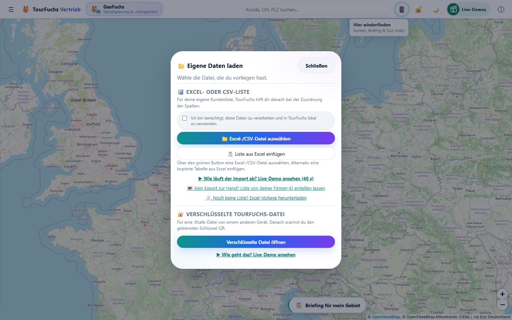

*BILD-IMPORT-01 - Einstieg in die tatsächlich laufende App; links normale Listen, rechts verschlüsselte TourFuchs-Dateien.*

1. **"Eigene Daten laden"** öffnen.
2. **"Excel-/CSV-Datei auswählen"**, Datei per Drag & Drop auf die Karte ziehen
   **oder die Liste direkt einfügen** (siehe 7.5.1). Wurde die Berechtigung noch
   nie zugesichert, kommt jetzt der Schritt **"Einmal kurz bestätigen"**
   (**"Ich bin berechtigt, diese Daten zu verarbeiten und in TourFuchs lokal zu
   verwenden."**). **"Bestätigen und weiter"** setzt genau den Weg fort, der
   angestoßen wurde – Datei-Dialog, Einfügen oder gezogene Datei.

   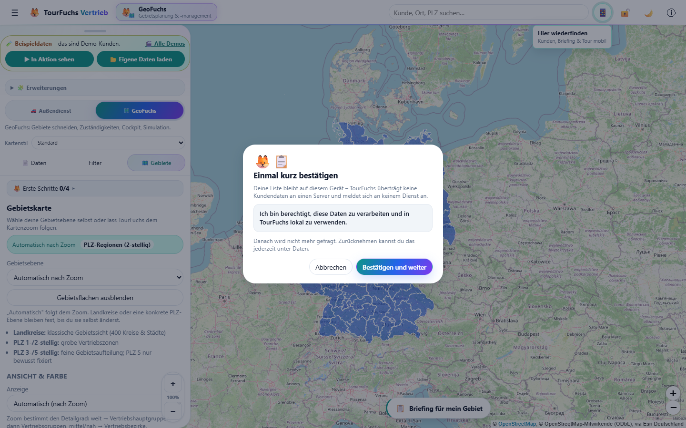

   *BILD-IMPORT-02 - Die einmalige Berechtigungsbestätigung setzt den bereits begonnenen Importweg fort.*

3. Beim Einlesen einer Datei erscheint **"Datei wird vorbereitet"** statt der
   Importauswahl. Dateiname und Verarbeitungsschritt sind sichtbar:
   **"Datei wird gelesen …"**, **"Tabelle wird aufbereitet …"**,
   **"Spalten werden erkannt …"**. Große Listen brauchen am Handy bis zu
   2 Minuten (Hinweis im Dialog; eine mitlaufende Uhr **"Läuft seit 0:45"**
   zeigt, dass TourFuchs arbeitet); die Verarbeitung läuft lokal im Hintergrund. **"Abbrechen"** oder Escape
   beendet das Einlesen und führt zum vorherigen Schritt zurück. Der vorhandene
   Kundenbestand bleibt dabei erhalten. Dasselbe gilt beim Wechsel von
   Tabellenblatt oder Überschriftenzeile. Bei Lesefehlern erscheint ein Hinweis;
   die vorherige Auswahl bleibt verfügbar.

4. Im Dialog **"Spalten zuordnen"** zuerst die Kopfzeile der Dateizeile prüfen
   (Dateiname, gelesenes **Blatt**, Zeilen- und Spaltenzahl) und bei Bedarf
   **"Tabellenblatt"** oder **"Überschriftenzeile"** umstellen (7.4). Danach
   automatische Zuordnung und Beispielwerte
   prüfen. Oben stehen die **wichtigen Felder** (Kundenname, PLZ, Straße, Ort,
   Vertriebsbezirk, Vertriebsgruppe, Umsatz); die übrigen **optionalen Felder**
   liegen unter **"Weitere Felder"** eingeklappt (mit Anzahl der automatisch
   erkannten). Beim Import werden alle Felder gelesen – auch die eingeklappten.

   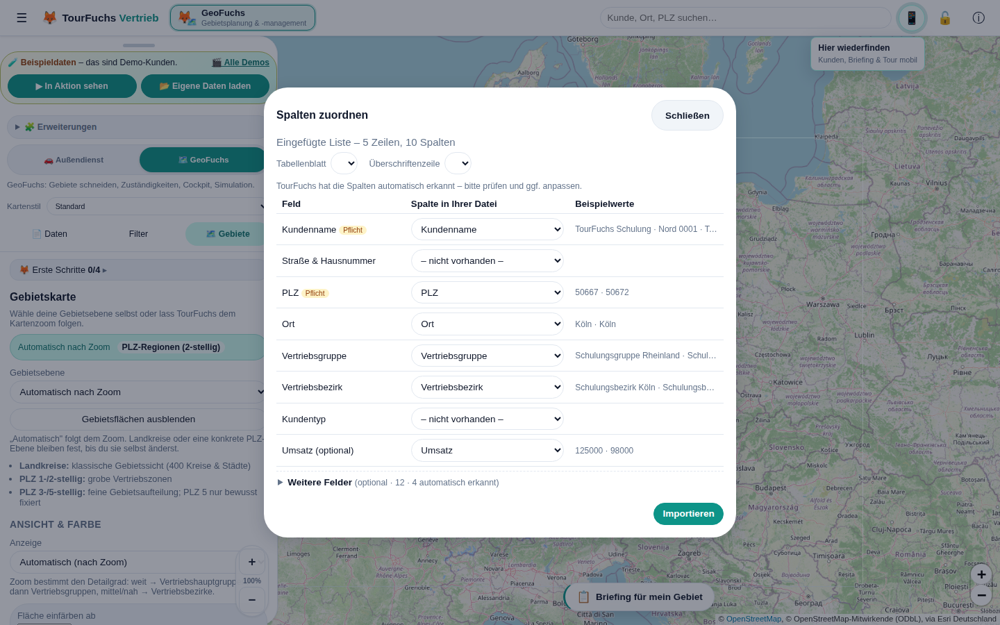

   *BILD-IMPORT-03 - Automatische Erkennung ist der Start der Prüfung, nicht ihr Ersatz.*

5. **"Importieren"**. Ist bereits ein Kundenbestand geladen, Wirkung und Anzahl
   in der Ersetzungswarnung prüfen und erst dann bestätigen.
6. Kurzmeldung lesen. Ein **Dialog** erscheint nur, wenn Zeilen **nicht**
   importiert wurden; reine Hinweise nennt die Kurzmeldung mit Anzahl.
7. Liste bei Bedarf herunterladen – im Dialog oder jederzeit unter
   **Daten → "Hinweise/Fehlerliste zum letzten Import (.xlsx)"**.
8. Nach eigenen Kundendaten weist ein Kurzhinweis darauf hin, dass die Daten
   unverschlüsselt auf diesem Gerät liegen. Er hält **nicht** auf; wer will,
   richtet den Tresor über das hervorgehobene Schloss oben ein (14.1).

**Merksatz:** Automatisch erkannt bedeutet nicht automatisch geprüft.

#### 7.5.3 Der Befund nach dem ersten eigenen Import

Liegen zum **ersten Mal** die eigenen Kunden auf der Karte, zeigt TourFuchs
**"🔎 Das sagt Ihre Liste"** – kein Ergebnisprotokoll, sondern das, was in den
Daten steckt:

- die Kundenzahl auf der Karte und der Gesamtumsatz der Liste,
- nicht verortete Kunden zuerst (meist fehlt oder stimmt die PLZ),
- die Zahl der Vertriebsbezirke und – **nur wenn auffällig** – die
  Ungleichverteilung ("Rheinland betreut 3,1× so viele Kunden wie Nord"),
- überfällige Kunden; ohne hinterlegten Besuchsrhythmus stattdessen der Hinweis,
  dass genau dafür der Rhythmus gebraucht wird,
- Kunden ohne Bezirk unter "Ohne Zuordnung",
- eingeklappt die Kundenzahl je Bezirk.

Aus dem Befund führen zwei Wege direkt weiter: **"🎯 Überfällige zeigen"** und
**"🧭 Tour planen"**.

**Regel:** Es wird nur Auffälliges gesagt. Eine gleichmäßige Verteilung ist
keine Nachricht. Bei sehr kleinen Listen ohne Bezirke und ohne Rhythmus
erscheint der Befund gar nicht – dort weiß der Nutzer alles schon.

Der Befund erscheint **einmalig beim Wechsel von Beispiel- auf eigene Daten**.
Beim echten Reimport beantwortet der Änderungsbericht (7.6) dieselbe Frage
besser. Er ist der **letzte Dialog** des Imports; danach folgt kein
Tresor-Dialog mehr, nur noch der Kurzhinweis (14.1).

#### 7.5.1 Einfügen statt Datei (Strg+V)

Wer die Liste ohnehin in Excel offen hat, braucht keinen Export: Bereich
**inklusive Überschriftenzeile** markieren, **Strg+C**, dann in TourFuchs
einfügen. Zwei Wege:

- **Im Willkommens-Hinweis** steht am Schreibtisch direkt
  **"Liste ist in Excel offen? Direkt einfügen"**.
- **"Eigene Daten laden" -> "Liste aus Excel einfügen"** öffnet ein Feld.
  Am Schreibtisch ist das der **primäre** Knopf, am Handy steht die Datei vorn –
  dort ist Excel selten offen. TourFuchs meldet sofort, wie viele Zeilen und
  Spalten erkannt wurden, dann **"Spalten zuordnen"**.
- **Strg+V irgendwo in der App** (außerhalb von Eingabefeldern) führt direkt in
  die Spaltenzuordnung.
- Wer den Datei-Dialog **ohne Auswahl abbricht**, bekommt genau dann den
  Hinweis auf das Einfügen – einmal je Sitzung, nur am Schreibtisch.

Die Schritte im Einfügen-Dialog richten sich nach dem Gerät: am Schreibtisch
**Strg+C / Strg+V**, am Handy **Kopieren** und **antippen, halten, Einfügen**.
Am Handy steht nirgends "Strg".

Erkannt werden Tab-, Semikolon- und Komma-Trennung; Werte in Anführungszeichen
bleiben zusammen. Ebenso gelesen werden **Markdown-Tabellen** (`| Name | PLZ |`
mit Trennzeile) und **Tabellen mitten im Fließtext** – etwa die Antwort eines
Chat-Assistenten, die vor und nach der Tabelle noch einen Satz schreibt.
TourFuchs schneidet den Tabellenblock heraus: Es gewinnt die längste
zusammenhängende Zeilenfolge mit gleicher Spaltenzahl. Enthält der Text mehrere
Tabellen, wird die größere genommen.

Der **globale Strg+V-Kurzweg ist bewusst strenger** als der Dialog: Dort hat der
Nutzer sich entschieden, hier wird ungefragt in eine fremde Absicht eingegriffen.
Markdown, Tabulatoren und Semikolon gelten als eindeutig; bei Komma-Trennung –
die auch in Prosa vorkommt („Sehr geehrte Frau Meier, wie besprochen, …") –
braucht es eine Zeile mehr. Der Kurzweg wirkt nur, wenn wirklich eine Tabelle in der
Zwischenablage liegt. Fehlt die Berechtigungs-Zusicherung, geht der eingefügte
Inhalt nicht verloren: Der Bestätigungsschritt übernimmt ihn danach selbst. Ab
der Spaltenzuordnung ist der Ablauf identisch mit dem Datei-Import.

#### 7.5.2 Wege der installierten App

Ist TourFuchs installiert, führen drei weitere Wege in den Import beziehungsweise
direkt in die Aufgabe:

- **Datei-Handler:** Eine `.xlsx`, `.xls` oder `.csv` im Explorer/Finder mit
  TourFuchs öffnen. Die laufende App übernimmt die Datei, sie startet kein
  zweites Fenster.
- **Teilen (Android):** Excel-Anhang in Outlook/Drive -> **Teilen** -> TourFuchs.
  Der Service Worker nimmt die Datei **lokal** entgegen; sie wird zu keinem
  Zeitpunkt an einen Server gesendet.
- **Icon-Kurzbefehle:** Long-Press auf das App-Icon -> **"Meine Tour"**,
  **"Kunden in der Nähe"** oder **"Liste importieren"**.

In allen drei Fällen bleibt die Berechtigungs-Zusicherung Pflicht: Ist sie noch
nicht gegeben, erscheint der Schritt **"Einmal kurz bestätigen"**, und die Datei
wird unmittelbar danach übernommen.

**Wichtig zum Teilen-Ziel:** Android trägt TourFuchs beim **Installieren** in die
Teilen-Liste ein, nicht beim Aufrufen der Website. Erscheint TourFuchs nicht im
Teilen-Menü, ist fast immer eine der drei Ursachen schuld:

1. Die App war **schon vor dieser Version installiert**. Der Teilen-Eintrag steckt
   in der installierten App (WebAPK) und wird von Chrome erst mit Verzögerung
   erneuert. Verlässlicher Weg: App deinstallieren und **aus Chrome neu
   installieren**. Vorher unbedingt eine **Sicherung** anlegen (Daten → Export
   bzw. „Sicherer Umzug").
2. Die App wurde **nicht mit Chrome** installiert. Samsung Internet und Firefox
   erzeugen kein WebAPK und damit kein Teilen-Ziel.
3. Es wurde nur eine **Verknüpfung** auf den Startbildschirm gelegt statt einer
   echten Installation.

Der Weg, der immer funktioniert und keine Installation braucht:
**„Eigene Daten laden" → „Excel-/CSV-Datei auswählen"** und die Datei im
Dateiauswahl-Dialog öffnen.

Das **Installations-Angebot** erscheint nicht sofort. TourFuchs hebt es sich für
den Moment auf, in dem es etwas bringt: eigene Daten geladen und eine Tour mit
mindestens einem Stopp geplant. Einmal mit **"Später"** abgelehnt, kommt es nicht
wieder; die Installation bleibt über das Browsermenü möglich.

Auf **iPhone und iPad** gibt es keinen Knopf, der installiert – Safari kennt das
dafür nötige Ereignis nicht. Dort zeigt dasselbe Angebot deshalb den einzigen
Weg, den es gibt: **Teilen → "Zum Home-Bildschirm"**. Das trifft besonders den
Fall, in dem die Tour gerade per QR-Scan im Handy-Browser gelandet ist.

### 7.6 Erneuter Import: Abgleich mit dem Bestand

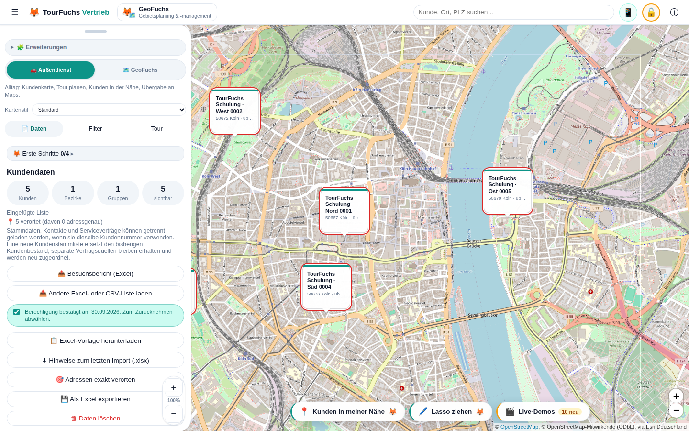

*BILD-DATEN-01 - Vor einem vollständigen Ersatz oder Löschen den aktuellen Bestand bei Bedarf als Excel sichern.*

**Ausnahme Beispieldaten:** Liegen nur Beispielkunden vor – keine eigenen
Gebietszuordnungen, keine eigenen Vertrags-/Einsatzquellen –, entfällt sowohl
der Änderungsbericht als auch die kurze Rückfrage. Dort ist nichts zu schützen,
und der Bericht meldete sonst „2250 entfallen · −315.318 T€" über eine Kulisse,
die nie echt war. Sobald ein einziger echter Kunde, eine eigene
Gebietszuordnung oder eine eigene Vertragsquelle dabei ist, greift der Schutz
wieder vollständig.

**Seit 09.10.2026: Abgleich statt Blindersatz.** Eine Excel-/CSV-Datei mit
Kundenzeilen ist die Wahrheit **für die Spalten, die sie enthält** – und nur
dafür. Je Kunde (Kundennummer, sonst Name + PLZ) gilt:

- Spalte steht in der Datei → Wert aus der Datei, **auch eine leere Zelle**
  (z. B. ein ausgetragener VK).
- Spalte steht nicht in der Datei → der bisherige Wert **bleibt** (z. B.
  Straße, Ansprechpartner, Umsatz, Zuständigkeiten aus einer anderen Liste).
- Die **Position** (auch adressgenau) bleibt, solange die Anschrift gleich ist.
- Erfasste **Besuche** und in TourFuchs gesetzte Pins bleiben.

Damit lassen sich zwei Komplettlisten mit verschiedenen Spalten abwechselnd
einlesen, z. B. die Kundenstammliste (mit Straße) und eine Zuständigkeitsliste
(Kd-Nr., VK, OM, TAM, Account Manager …, ohne Straße). **"Kd-Nr."** wird dabei
automatisch als Kundennummer erkannt.

**Fehlende Kunden:** Fehlen Kunden des Bestands in der Datei, fragt der
Änderungsbericht **"Behalten"** (die Datei ergänzt nur) oder **"Entfernen"** (die
Datei ist die neue Fassung der ganzen Liste). Vorgeschlagen ist "Behalten", wenn
die Datei Angaben des Bestands nicht enthält – sie steht dann unter **"Bleibt
erhalten"** –, sonst "Entfernen". Die Zahlen im Bericht folgen der Wahl.

TourFuchs liest und prüft die Datei zuerst. Sind
bereits Kunden vorhanden, erscheint vor jeder Änderung der **Änderungsbericht**
**"Was ändert sich?"**:

- **neue Kunden**, **entfallene Kunden**, **Bezirkswechsel** und **unverändert**
  als vier Zahlen,
- Kunden und Umsatz **gesamt vorher → nachher** mit Vorzeichen,
- eingeklappt die **Wirkung je Vertriebsbezirk** (Kunden vorher/nachher, Δ
  Kunden, Δ Umsatz) und die **namentlichen Listen** der drei Gruppen.

Zugeordnet wird wie beim Import selbst: **Kundennummer**, sonst **Name + PLZ**.
Ein Kunde, der nur umbenannt wurde, gilt bei gleicher Kundennummer als derselbe
Kunde. Kunden ohne Bezirk laufen unter **"Ohne Zuordnung"**.

Erst **"Bestand ersetzen"** führt den Import aus; **"Abbrechen"**, Schließen und
Escape lassen den bisherigen Bestand vollständig unangetastet. Ohne vorhandenen
Kundenbestand gibt es nichts zu vergleichen – dann bleibt es bei der kurzen
Standardabfrage.

Nach Bestätigung werden gemeinsam ersetzt:

- bisherige Kunden – nach den Regeln des Abgleichs oben (was die Datei nicht
  enthält, bleibt)
- aktuelle Tour, Start, Ziel und Stopps
- bisherige Gebietszuordnungen; Flächenzeilen der neuen Datei werden anschließend
  neu aufgebaut

Abbrechen lässt den gesamten Altbestand unverändert. Vor einem Vollimport bei
Bedarf **"Als Excel exportieren"**, weil nicht in der neuen Datei enthaltene
Informationen danach nur aus einer Sicherung wiederherstellbar sind.

Zwei Spezialfälle bleiben bewusst ergänzend:

- eine reine Kontaktdatei verknüpft Kontakte über die Kundennummer
- eine reine Gebietsdatei ergänzt Gebietszuordnungen

Auch Beispieldaten und eine empfangene `.tfsafe`-Datei sind vollständige
Datensätze. Sie ersetzen vorhandene Daten ebenfalls erst nach Bestätigung.

### 7.6a Datenquellen & Aktualisieren (Link hinterlegen, dann nur noch aktualisieren)

Seit 10.10.2026 (Release 15.2). Im Reiter **Daten** (mit geladenen Daten) steht
aufklappbar **"🔄 Datenquellen & Aktualisieren"**. Dort hinterlegt man einmal,
wo die aktuellen Daten liegen – z. B. die Vertriebs-Arbeitsmappe im
SharePoint der Firma:

1. **Name** (z. B. "Vertriebs-Arbeitsmappe") und **Link zur Ablage**
   (https://…, optional) eingeben, **"+ Quelle hinzufügen"**. Höchstens 8 Quellen.
2. **"↗ Ablage öffnen"** öffnet den Link in einem neuen Browser-Tab – zum
   Nachsehen oder Herunterladen. **TourFuchs ruft den Link nie selbst ab**; es
   gibt keine Anmeldung und keinen Abruf durch TourFuchs.
3. **"🔄 Aktualisieren"** liest die neue Fassung über den gewohnten Import ein:
   Die Arbeitsmappe (7.7a) läuft in einem Zug ohne Zuordnungsdialog, mit
   Ergebnisfenster; andere Listen gehen beim ersten Mal durch "Spalten
   zuordnen", danach übernimmt die gemerkte Importvorlage (7.6b) die
   Zuordnung ohne Dialog.
   - **Am PC mit Edge oder Chrome:** Beim ersten Mal wählt man die Datei im
     synchronisierten OneDrive-/SharePoint-Ordner aus. Der Browser merkt sich
     den Zugriff auf dem Gerät; danach genügt ein Klick. Nach einem
     Browser-Neustart fragt der Browser einmal, ob der Zugriff erlaubt ist.
   - **Handy, iPad, Firefox, Safari:** "Aktualisieren" öffnet jedes Mal die
     Dateiauswahl.
   - Wurde die Datei verschoben oder umbenannt, meldet TourFuchs das; beim
     nächsten "Aktualisieren" wählt man sie neu aus.
4. Je Quelle steht der Stand ("zuletzt 10.10.2026, 08:12 · verknüpft:
   Datei.xlsx"), die Überschrift zeigt Anzahl und letzte Aktualisierung.
   **"Datei lösen"** vergisst die gemerkte Datei, **"Entfernen"** die ganze Quelle.

Gespeichert werden nur Name, Link, Zeitpunkt und der Dateiverweis – lokal im
Browser, keine Kundendaten. **"Daten löschen"** vergisst Dateiverweise und
Zeitpunkte; die Links bleiben als Einstellung stehen.

### 7.6b Importvorlagen: Spalten einmal zuordnen, dann nur noch Ergebnis

Seit 10.10.2026 (Release 15.1). Nach jedem Import mit **"Spalten zuordnen"**
merkt sich TourFuchs die Spaltenüberschriften der Liste und die bestätigte
Zuordnung als **Vorlage** (Name aus dem Dateinamen, z. B. "Kundenstamm"). Die
Meldung danach sagt "Zuordnung als Vorlage „…" gemerkt".

- **Dieselbe Liste wieder** (gleiche Überschriften, Reihenfolge und
  Groß/Klein egal; auch über "🔄 Aktualisieren" einer Datenquelle, 7.6a):
  **kein Dialog "Spalten zuordnen"**. Es erscheint nur das Fenster
  **"Liste aktualisiert"** mit Kunden · geändert · neu · entfallen · Hinweise;
  Hinweise und Fehler sind aufklappbar. **"✏️ Zuordnung prüfen"** öffnet die
  Zuordnung dieser Liste, eine Korrektur wird für die Vorlage gemerkt.
- **Fehlen Kunden** gegenüber dem Bestand, kommt wie gewohnt der
  Änderungsbericht mit "Behalten/Entfernen" (7.6) – nur dann.
- **Liste verändert** (Spalten neu oder entfallen): "Spalten zuordnen" öffnet
  sich einmal, **vorbelegt** aus der Vorlage, mit Hinweis "neu: … – fehlt: …".
  Neue Spalten werden automatisch erkannt; was man bewusst abgewählt hatte,
  bleibt abgewählt.
- Lag die Tabelle beim letzten Mal auf einem anderen Blatt oder unter einer
  anderen Überschriftenzeile, liest TourFuchs die Datei einmal so und
  vergleicht erneut.
- Mehrere Vorlagen nebeneinander (Kundenstamm, Zuständigkeiten, Promotoren,
  Umsätze …), höchstens 8. Unter **"Daten"** → **"🧩 Gemerkte Importvorlagen"**
  stehen sie mit Spaltenzahl und letzter Nutzung; **"Vergessen"** löscht eine
  Vorlage – beim nächsten Import dieser Liste erscheint wieder die Zuordnung.
- Gespeichert sind nur Spaltennamen und Zuordnung, lokal im Browser – keine
  Kundendaten. Die Vertriebs-Arbeitsmappe (7.7a) braucht keine Vorlage.

### 7.7 Getrennte Kontaktdatei

Stammdaten und Kontakte können getrennt importiert werden. Eine reine
Kontaktdatei braucht:

- Kundennummer
- mindestens Ansprechpartner, Telefon oder E-Mail

Kontakte werden ausschließlich über die Kundennummer mit vorhandenen Kunden
verknüpft. Ein Feld **"Primärkontakt?"** kann den Hauptansprechpartner markieren.
Ohne Treffer erscheint die Zeile in der Fehlerliste.

**Seit 10.10.2026: Promotoren und Kundenansprechpartner.** Eine Kontaktliste
(eine Zeile je Person) kennt zwei Arten von Kontakten:

| Art | Typische Spalten | Erscheint in der Kachel unter |
|---|---|---|
| Kundenansprechpartner | Kd-Nr., Name bzw. Ansprechpartner, **Abteilung**, Telefon, E-Mail | **"🤝 Kundenansprechpartner"** |
| Promotor | Kd-Nr., Name bzw. **Promotor**, Telefon, E-Mail, **Thema** | **"📣 Promotoren"** |

- Die Art steht ausdrücklich in einer Spalte **"Kontaktart"** (Wert
  `Promotor` oder `Kunde`) – oder TourFuchs erkennt sie an der Liste: Eine
  Spalte **"Thema"** oder eine Namensspalte **"Promotor"** gibt es nur bei
  Promotoren. Alles andere sind Kundenansprechpartner.
- In einer Kontaktliste (ohne PLZ) ist **"Name"** die Person, nicht der
  Kunde; zugeordnet wird über die Kundennummer.
- Ein Promotor wird **nie** Hauptansprechpartner des Kunden.
- Kontakte werden ergänzt; dieselbe Person (Name, Telefon, E-Mail, Art) wird
  nicht doppelt angelegt. Ein späterer Reimport des Kundenstamms lässt
  Promotoren und Kontakte aus einer Kontaktliste stehen.
- Der Excel-Export schreibt sie in **"Weitere Ansprechpartner"** bzw.
  **"Promotoren"** (`Name · Abteilung/Thema · Telefon · E-Mail`), die
  Abteilung des Hauptansprechpartners in **"Abteilung"** – beides nur, wenn es
  solche Angaben gibt. Die Datei lässt sich so wieder einlesen.

### 7.7a Vertriebs-Arbeitsmappe (fünf Blätter in einem Zug)

Seit 10.10.2026 (Release 16). Enthält eine Excel-Datei die Blätter
**"VBEZ Übersicht"** und mindestens eines von **"Dateiübersicht"**, **"AE je
PCK"**, **"SieSales Kontakte"**, **"SieSales Opps"**, erkennt TourFuchs sie an den
**exakten Blattnamen** und liest alle Blätter in einem Zug – **ohne Dialog
"Spalten zuordnen"**. Überschrift ist jeweils Zeile 1. Danach folgen wie bei
jedem Import Abgleich und Änderungsbericht, am Ende das Fenster
**"Vertriebs-Arbeitsmappe eingelesen"** mit Kunden, Kontakten, Opportunities,
Produktzeilen, Fehlern und Hinweisen.

- **Schlüssel ist der Debitor** ("Debitor (Kundenmaster)", sonst "Debitor
  (VInfo)"). Kommt ein Debitor mehrfach vor, **gilt die spätere Zeile**.
- Es gelten **"VBEZ (Neu)"** als Vertriebsbezirk und **"VB (Neu)"** als
  Vertriebsbeauftragter (Accountmanager). "VB (Alt)", "VBEZ (Alt)" bleiben als
  Zusatzspalte für die Übergabe.
- **"Orders FY24/25/26"** werden die Umsatzjahre (8.5a); "Orders FY26" ist "der"
  Umsatz. "Ø Orders FY24-26" und Spalten mit Spannen (GJ24-26) zählen nicht als Jahr.
- Kontakte, Opportunities und Produktzeilen tragen nur die **IFA** ("IFA Nr",
  "IfA", "IFA") und hängen an **allen Kunden mit dieser IFA**. Zeilen mit einer
  IFA, die in "VBEZ Übersicht" fehlt, werden gezählt und als Hinweis gemeldet.
- **"Dateiübersicht"** dient als Kontrolle: Weicht die gelesene Zeilenzahl eines
  Blattes von der Angabe ab, steht das als Hinweis im Ergebnis.
- Kontakte mit **Löschvormerkung** oder Status inaktiv werden nicht übernommen.
- Ein erneuter Import der Mappe **ersetzt** Kontakte, Opportunities und
  Produkte aus der Mappe; Promotoren und Kontakte aus einer eigenen Kontaktliste
  (7.7) bleiben.
- Kennungen (IFA, Debitor …) bleiben Text mit führenden Nullen.
- **Große Mappen:** Aus Kontakte-, Opps- und Produktblatt liest TourFuchs nur
  die Spalten, die es auswertet. Reicht der Speicher des Geräts trotzdem nicht
  ("Die Datei ist zu groß für den Speicher dieses Geräts"), liest TourFuchs
  von selbst noch einmal **nur das Kundenblatt** – wie vor der Arbeitsmappe –
  und meldet im Ergebnis "Kontakte, Opportunities und Produkte nicht gelesen".
  Bisherige Kontakte, Opportunities und Produkte bleiben dann erhalten. Hat der
  Browser die Seite beim Lesen verworfen, liest der nächste Versuch mit
  derselben Datei gleich nur das Kundenblatt. Vollständig: am PC importieren
  und per "Sicherer Umzug" übertragen.

### 7.8 Flächenzeilen

Eine Zeile ohne Kundenname, aber mit **"Gebiet (LK/PLZ)"** und
**Vertriebsbezirk**, ordnet eine komplette Fläche zu.

Beispiele:

- `Oberhausen` = Landkreis/kreisfreie Stadt
- `46` = alle PLZ 46xxx
- `46045` = genau dieses PLZ-Gebiet

Widersprüchliche oder unbekannte Zuweisungen landen in der Fehlerliste.

### 7.9 Umsatzformate

TourFuchs versteht Excel-Zahlen sowie deutsche und englische Textformate, zum
Beispiel `1.234,56`, `1,234.56`, `45000` oder `45.5`. Währungszeichen werden
ignoriert. Überschriften mit `TEUR`, `Tsd EUR` oder `Mio EUR` werden auf volle
Euro umgerechnet. Der Import zeigt bei erkannten Besonderheiten einen Hinweis mit
Gesamtsumme zur Plausibilitätsprüfung.

**Mehrere Geschäftsjahre (seit 10.10.2026):** Spalten wie `Umsatz 2023`,
`Umsatz 2024`, `Umsatz GJ 25`, `Umsatz 2024/25` (zählt zum hinteren Jahr) oder
`GJ 2025`, `GJ26` oder `FY27` werden als Umsatz eines Geschäftsjahres erkannt. **Der jüngste
Jahrgang ist "der" Umsatz** für Karte, Cockpit und Filter; alle Jahre zeigt die
Kundenkachel unter **"📊 Jahre"** (8.5a). Spalten mit Plan, Ziel, Budget,
Forecast, Prognose oder Potenzial sind keine Ist-Umsätze und werden nicht als
Jahr erkannt. Ein Reimport mit neueren Jahren behält ältere Jahre.

### 7.10 Fehler und Hinweise

Gültige Zeilen werden importiert. Problematische Zeilen erscheinen in einer
herunterladbaren Excel-Liste, zum Beispiel bei:

- Dubletten
- fehlendem Vertriebsbezirk
- fehlender oder unbekannter PLZ
- widersprüchlicher Flächenzuordnung
- unbekanntem Landkreis/PLZ-Gebiet
- nicht zuordenbarer Kontakt-Kundennummer

Ein Kunde mit unbekannter PLZ kann gespeichert sein, erscheint aber nicht auf der
Karte.

### 7.11 Copilot- oder KI-erzeugte Empfehlungslisten

Der bestehende Importmechanismus kann auch eine durch einen KI-Agenten erzeugte
Excel-Datei öffnen. Aktuell gibt es jedoch **kein eigenes fachliches Schema** für
Felder wie Priorität, Empfehlung, Begründung oder nächster Schritt.

Für einen normalen Kundenimport müssen mindestens Kundenname, PLZ/Koordinaten
und Vertriebsbezirk zugeordnet werden. Für eindeutige Updates ist die
Kundennummer entscheidend. Eine reine Empfehlungsliste mit nur Priorität und
Begründung wird nicht automatisch zur Tour oder zum Besuchsstatus.

### 7.12 Export und Löschen

- **"Als Excel exportieren"** (`"Daten" -> "Als Excel exportieren"`) ist der
  **eine** Excel-Export. Ist gerade ein Filter aktiv (Bezirk, Umsatz …), fragt
  er: **„Nur die N gefilterten"** oder **„Alle M Kunden"**. Ohne Filter
  exportiert er direkt alles. Die gefilterte Datei trägt das Gebiet im Namen
  (z. B. `tourfuchs-kunden-bezirk-west-2026-09-28.xlsx`).
- Der Export enthält **alle Spalten**: die bekannten Felder (Kundennummer, Name,
  Adresse, Vertrieb, Kontakt, Umsatz, Rhythmus, letzter Besuch, Lat/Lng), dazu
  **„Verortung"** (adressgenau / PLZ-Mitte / nicht verortet), **„Anzahl
  Besuche"** und **„Alle Besuche"** (ganze Besuchshistorie),
  **„Weitere Ansprechpartner"** und **jede Originalspalte der Importdatei**, die
  keinem Feld zugeordnet war (heißt sie wie eine TourFuchs-Spalte, erscheint sie
  als „… (Original)"). Die Kernspalten sind so benannt, dass die Datei wieder
  importiert werden kann – auch in ein CRM oder eine KI.
- Die frühere Pille **„⬇ Gebiet exportieren"** über der Karte gibt es seit
  28.09.2026 nicht mehr; ihren Zweck erfüllt die Abfrage „nur die gefilterten".
- **"Daten löschen"** entfernt lokale Daten nach Bestätigung und deaktiviert
  auch den Tresor.
- mobil gibt es im Tour-Panel **"Datenbank zurücksetzen"**.

Vor **"Daten löschen"** oder **"Datenbank zurücksetzen"** immer zuerst einen
Export empfehlen, sofern die Daten noch benötigt werden.

---

## 8. Karte, Suche und Kunden-Popup

### 8.1 Verortungsstufen

**Stufe 1: lokal über PLZ**

Beim Import wird die Position ohne externen Geocoding-Dienst aus einer lokalen
Tabelle von rund 8.300 deutschen PLZ-Zentren bestimmt. Mehrere Kunden derselben
PLZ werden leicht versetzt, damit sie nicht exakt übereinander liegen. Im Popup
steht **"ca. (PLZ-Mitte)"**.

**Stufe 2: optional adressgenau**

**Klickpfade:** nach einem Import die Rückfrage **„📍 Adressgenau verorten?"**
(„Ja, immer genau verorten" / „Nein, PLZ reicht"), jederzeit änderbar unter
`ⓘ Info -> "📍 Adressen genau verorten"`; einmalig auch
`"Daten" -> "🎯 Adressen exakt verorten"`.

Nur nach bewusster Zustimmung werden Straße, PLZ und Ort einzeln und gedrosselt
(etwa eine Adresse pro Sekunde) an Nominatim/OpenStreetMap gesendet.
Kundenname, Umsatz, Kontakte und Vertriebsinformationen werden nicht
mitgesendet.

- Die Verortung läuft **im Hintergrund**; oben zeigt eine Pille den
  Fortschritt, z. B. **„📍 Verorte Adressen 427 von 3.441"**, mit
  **„Anhalten"**. Die erste Zahl ist der Fortschritt, die zweite die
  Gesamtzahl (seit 27.09.2026 mit „von" und Tausenderpunkt, weil „427/3441" als
  abgeschnittene Zahl gelesen wurde). Im Info-Dialog steht der Stand dauerhaft.
- **Seit 10.10.2026 zählt die Pille nur noch, was wirklich neu angefragt
  wird**, und nennt daneben den erreichten Stand, z. B. **„📍 Verorte Adressen
  90 von 8.041 · 4.012 schon adressgenau"** (am Handy in zweiter Zeile). Nach
  einem Neustart übernimmt TourFuchs bereits gefundene Positionen sofort aus dem
  Speicher – ohne Anfrage und ohne sie mitzuzählen. Früher lief der Zähler nach
  jedem Start wieder bei 0 los und ging alle bekannten Adressen noch einmal
  durch; das sah aus, als finge die Verortung von vorn an.
- Adressen, die OpenStreetMap **nicht findet**, werden für genau diese Anschrift
  nicht erneut als offen gezählt; ändert sich die Anschrift (neuer Import), wird
  sie wieder versucht. Der Info-Dialog nennt am Ende, wie viele nicht gefunden
  wurden. Während des Laufs zeigt er außerdem die ungefähre Restdauer.
- Zwischenstände werden **höchstens einmal pro Minute** gespeichert und auf der
  Karte gezeigt – so bleibt die App auch mit vielen tausend Kunden flüssig. Der
  Adress-Speicher selbst wird alle zehn Anfragen gesichert.
- Eine **Lasso-Auswahl bleibt dabei stehen**; ihre Leuchtpunkte wandern an die
  neuen Positionen (bis 27.09.2026 schloss jede Zwischenstation die Liste).
- **Während einer Live-Demo ruht die Verortung** und läuft danach weiter.
- Bei gesperrtem Tresor, ohne Internet oder wenn OpenStreetMap nicht antwortet,
  hält sie an und setzt später fort; Gefundenes bleibt gespeichert.
- **Große Bestände und Tresor:** Nach dem Entsperren zeichnet die Karte die
  Kunden nur noch einmal (bis 27.09.2026 mehrfach – mit einigen tausend Kunden
  wirkte das Handy danach sekundenlang eingefroren).

**„Bitte warten" bei großen Beständen (seit 10.10.2026):** Beim Start steht
sofort **„TourFuchs startet – Daten werden geladen …"**, mit vielen Kunden
**„12.500 Kunden werden geladen – bitte warten …"**. Baut die Karte nach einem
Filter oder Moduswechsel viele Kundenpunkte neu auf, steht **„Karte wird
aktualisiert – 7.500 von 12.500 Kunden …"**; die Punkte kommen dabei in
Portionen, die Oberfläche bleibt bedienbar. Der Hinweis erscheint erst nach
etwa 0,4 Sekunden – was schneller geht, blinkt nicht auf. Ein neuer Filterklick
während des Aufbaus beendet den alten Aufbau sauber. Zugleich wurden Start und
Filter spürbar schneller: Filterebenen ohne Abwahl werden bei der Prüfung
übersprungen (gemessen mit 12.500 Kunden: Start blockiert 0,9 statt 2,3 s,
Filterklick in der Gebietsplanung praktisch ohne Wartezeit).

### 8.2 Globale Suche in der Kopfleiste

**Klickpfad:** Topbar -> Suchfeld **"Kunde, Ort, PLZ suchen..."** -> Treffer
wählen.

Die Suche beginnt ab zwei Zeichen und durchsucht **drei Quellen**, in dieser
Reihenfolge und mit diesen Gruppennamen:

| Gruppe | Was darin steht | Beispiel |
|---|---|---|
| **Eigene Orte** | selbst benannte Punkte (`state.places`) | `SIXT Essen Hbf` |
| **Kunden** | Name, Ort, PLZ-Anfang, exakte Kundennummer | `[000123] Ruhrtechnik GmbH` |
| **Orte** | die gebündelten ~8.300 PLZ-Zentroide | `Essen`, `45127 Essen` |

Eingefügte **Koordinaten** (`51.4560, 7.0100`) werden ebenfalls angenommen; das
Ortsverzeichnis bleibt dann weg, weil die Koordinate bereits die Antwort ist.

**Kundentreffer:** Die erste Zeile zeigt `[Kundennummer] Kundenname`, darunter
PLZ, Ort und gegebenenfalls den VB-Namen. So sind gleichnamige Kunden auch auf
Screenshots eindeutig. Die Nummer erscheint in ihrer gespeicherten Form,
einschließlich führender Nullen. Ohne Nummer steht nur der Name. Lange Angaben
werden umgebrochen. Das gilt auf Desktop und Handy.

Umlaute und Schreibvarianten werden tolerant normalisiert, zum Beispiel `Koln`
für `Köln`.

**Nach der Auswahl** fliegt die Karte zum Treffer. Ein Kunde öffnet sein
Kunden-Popup, ein **eigener Ort** sein reguläres Ortspopup samt "Als Start",
"Position ändern" und "Löschen" – dasselbe Popup wie auf der Karte, kein
Nachbau. Ein Treffer aus dem Verzeichnis zeigt "📍 Gefundener Ort" mit Namen und
Koordinaten und **ohne** Aktionen: Dort steht kein gespeicherter Ort, sondern
eine Stelle auf der Karte.

**Platzaufteilung:** Stehen mehrere Gruppen da, bekommt jede höchstens vier
Zeilen; steht eine allein, darf sie acht ausnutzen. Werden Kunden abgeschnitten,
sagt die Überschrift es ("Kunden (4 von 12)") – verschwiegen wird nichts. Anlass
war der echte Bestand: An einer Postleitzahl hängen mehrere Kunden, und der Ort
selbst rutschte unter die Faltkante – ausgerechnet die Antwort, wegen der man
die Postleitzahl getippt hat.

**Wichtige Grenze:** Die Suche **legt keine Orte an**. Sie bringt zu einer
Stelle auf der Karte. Das Anlegen gehört dorthin, wo der Ort gebraucht wird – an
Start und Ziel im Tourplaner (siehe 10). Und sie fragt **nichts im Netz**: Alle
drei Quellen liegen lokal. Eine Adresssuche bei einem Drittdienst steht
ausdrücklich hinter einem Tor in der Roadmap.

**Vorher (bis Version 3.4):** Das Feld versprach "Kunde, Ort, PLZ", fand aber
nur Kunden. "Ort" und "PLZ" meinten die Spalten eines Kunden – wer `Essen`
tippte, bekam die Kunden in Essen, nie Essen selbst; ein gespeicherter Ort war
über dieses Feld gar nicht erreichbar. Es sind bewusst dieselben Funktionen aus
`features/places.js` wie im Tourplaner: Zwei Ortssuchen mit eigenen Regeln
fielen beim ersten Vergleich auf.

Demo-Daten enthalten Ortsnamen. Ältere gespeicherte Demo-Daten werden beim Start
lokal aus der PLZ-Tabelle ergänzt. Eigene Daten werden nicht stillschweigend mit
einem Ort überschrieben.

### 8.3 Kartenstile und Zoom

Im Panel unter **"Kartenstil"** stehen:

- **"Hell"** – dieselben OpenStreetMap-Kacheln wie „Standard", nur blass
  gezeichnet (ruhiger Hintergrund). Bis 27.09.2026 kam „Hell" von CARTO; dort
  verlangen die Kacheln inzwischen einen API-Schlüssel und zeigten nur noch
  „API KEY REQUIRED". Sieht jemand diesen Schriftzug noch, hat das Gerät die
  neue Version noch nicht geladen: App einmal schließen und neu öffnen.
- **"Standard"** (OpenStreetMap, Voreinstellung)
- **"Nacht"** – dieselben OpenStreetMap-Kacheln, abgedunkelt und gedämpft
  (keine Farbumkehr: Wasser bleibt blau, Grün bleibt grün, Ortsnamen bleiben
  lesbar). Gedacht für abends und für den dunklen Stil (4.7), blendet nicht.
  Kunden-Kacheln, Gebiete und Marker bleiben unverändert hell. Schaltet nie
  automatisch um – nur bewusst wählen.
- **"✨ Lichterkarte"** – sehr dunkle OpenStreetMap-Karte, **jeder Kunde ein
  kleiner Lichtpunkt** statt Kunden-Kachel, Stapel oder Gebiets-Kachel. Zeigt
  auf einen Blick, wo Kunden sitzen, wo sie sich ballen und wo weiße Flecken
  sind – auf jeder Zoomstufe.
  - **Farbe:** immer warmes Gelb – wie Städte auf einem Nachtbild aus dem All.
    Bewusst ohne Besuchsstatus (sonst wäre die Karte bei alten Besuchsdaten
    ganz rot). Den Status zeigen Kunden-Popup, Tourplaner und „In der Nähe".
  - **Größe = Umsatz:** große Kunden leuchten größer.
  - **Antippen** eines Punkts öffnet den Kunden wie gewohnt; am Desktop zeigt
    Darüberfahren den Namen.
  - Filter, Lasso und „In der Nähe" arbeiten mit genau den sichtbaren Punkten.
  - Gebietsflächen bleiben nur als leiser Hauch; für Gebietsarbeit mit
    Gebiets-Kacheln zurück auf „Standard".
  - Während einer **Live-Demo** zeigt die Karte automatisch den Standard
    (die Demo führt über Kacheln) und kehrt danach zur Lichterkarte zurück.
  - Nur auf bewusste Wahl; kein neuer Kartendienst.
- **"Satellit"** (Esri)

Die Kartenwahl wird gespeichert. Das Mausrad zoomt in kleinen Viertelstufen, um
ruckartige Sprünge zu vermeiden. Das Mausrad über der Sidebar scrollt dagegen
den Panelinhalt. Auf Desktop bleiben die Plus-/Minus-Tasten der Karte sichtbar.
Auf dem Smartphone sind sie zugunsten von mehr Kartenfläche ausgeblendet; dort
wird intuitiv mit zwei Fingern gezoomt.

### 8.4 Kundenmarker und Cluster

- Markerfarbe folgt der gewählten Ansicht.
- viele Marker werden als Clusterzahl (Stapel) zusammengefasst; ein **Stapel
  entsteht erst ab 6 Kunden**. Darunter stehen einzelne Marker statt eines
  „Spinnennetzes"; ein kleiner Stapel (≤ 5) fächert mit **einem Tipp** auf.
- **Kundennamen erscheinen erst im Nahbereich** (weiter draußen bleibt es ruhig);
  kleine Cluster lösen sich beim Reinzoomen etwas später auf.
- Beim **Herauszoomen** gehen Einzelmarker und kleine Gruppen in den größeren
  Stapel ein: Auf jeder Zoomstufe stehen dieselben Punkte und Stapel wie beim
  Hineinzoomen (seit 10.10.2026; vorher blieben am Handy nach dem Herauszoomen
  manchmal einzelne Punkte neben ihrem Stapel stehen). Beim Wechsel der
  Gebietsebene bleibt die bisherige Fläche sichtbar, bis die neue fertig ist.
- Kunden in der Tour werden hervorgehoben.
- bei PLZ-Verortung ist die Position nur näherungsweise.
- in der Ansicht **"Status"** folgen Farben dem Besuchsstatus.

### 8.5 Kunden-Popup

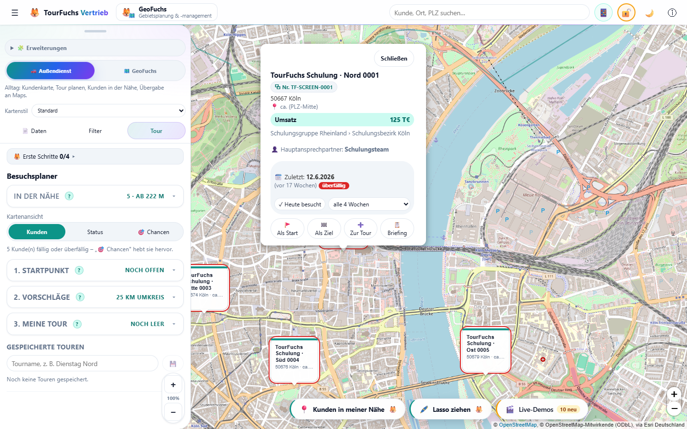

*BILD-KUNDE-01 - Der Einzelkundenweg: Kundenmarker öffnen und „Briefing" wählen; alle verfügbaren Details sind ohne Moduswechsel sichtbar.*

Das Popup zeigt je nach vorhandenen Daten:

- Kundenname
- Straße sowie **PLZ + Ort**
- Hinweis `ca. (PLZ-Mitte)` bei näherungsweiser Position. Läuft im Hintergrund
  die adressgenaue Verortung, bleibt eine **offene Kachel stehen**, bis man sie
  selbst schließt; der Punkt rückt erst danach an die genaue Adresse
  (seit 10.10.2026 – vorher schloss jeder Zwischenstand der Verortung die
  Kachel, und die Karte „zuckte" etwa jede Minute).
- Umsatz – sofern vorhanden als eigene hervorgehobene Zeile; auch ein expliziter
  Wert von `0 €` gilt als vorhanden
- Hauptansprechpartner
- **"Anrufen"** und **"E-Mail"**
- **"Heute besucht"**
- **"Als Start"**
- **"Zur Tour"** beziehungsweise **"In Tour"**
- **"Briefing"**

**Aufbau (seit 10.10.2026):** oben **"Schließen"**, darunter der Name, in
einer eigenen Zeile darunter Kundennummer und **"↗ SieSales"**, dann Adresse,
Umsatz, Gebiet (Channel › Gruppe › Bezirk) und – in einer zweiten Zeile – der
Vertriebsbeauftragte. Es folgen die Knöpfe (Kundenansprechpartner,
Opportunities, Produkte …), der Besuchsblock („Zuletzt", **"Heute besucht"**,
Rhythmus) und ganz unten die Tour-Knöpfe. Am Desktop ist die Kachel breiter
und so hoch, wie die Karte Platz hat: Zugeklappt ist alles ohne Scrollen zu
sehen. Erst ein aufgeklapptes Feld lässt die Kachel scrollen; die Tour-Knöpfe
bleiben dabei unten stehen, und die Karte schwenkt nach, damit Name und
„Schließen" im Bild bleiben. Am Handy nutzt die Kachel die Bildschirmbreite,
bleibt kompakt (der Kundenpunkt bleibt darunter sichtbar), die Tour-Knöpfe
stehen ebenfalls fest unten, und ein aufgeklapptes Feld rückt von selbst ins
Bild.

Bei echten importierten Kunden öffnen **"Anrufen"** und **"E-Mail"** weiterhin
die jeweilige Geräte-App. Bei Demo-Kunden zeigen dieselben Schaltflächen nur
einen Hinweis; es wird keine externe Kontaktaktion gestartet.

### 8.5a Umsatz nach Geschäftsjahr

Seit 10.10.2026. Bringt die importierte Liste Umsätze mehrerer
Geschäftsjahre mit (7.9), trägt die Umsatzzeile den Knopf **"📊 Jahre"**. Er
klappt **"Umsatz nach Geschäftsjahr"** auf – vier Jahre, jüngstes oben, z. B.
**GJ26**, **GJ25**, **GJ24**, **GJ23**:

- je Jahr der Umsatz und die Veränderung zum Vorjahr in Prozent (▲ grün /
  ▼ rot), wenn beide Jahre Werte haben
- oben steht das jüngere von aktuellem Kalenderjahr und jüngstem Jahr in der
  Liste; fehlen dafür noch Zahlen, steht dort `noch keine Zahlen`

**Bewusst allgemein:** Ein Geschäftsjahr heißt nach dem Jahr, in dem es
überwiegend liegt – GJ26 ist bei einem Geschäftsjahr Oktober bis September
Okt. 2025 bis Sep. 2026, bei einem Kalender-Geschäftsjahr Jan. bis Dez. 2026.
TourFuchs übernimmt das Jahr aus der Spaltenüberschrift und braucht den
Startmonat nicht. Ohne Jahreswerte gibt es keinen Knopf.

### 8.6 Weitere Kundendetails und kopierbare Nummer

Je nach importierten Daten ebenfalls sichtbar:

- Kundennummer als hervorgehobener Kopierknopf: ein Klick kopiert sie lokal in die Zwischenablage. Beim Kopieren werden führende Nullen entfernt und die Nummer in eckige Klammern gesetzt. Dahinter folgt ein Leerzeichen und der Kundenname, z. B. `000123`, `Musterkunde GmbH` -> `[123] Musterkunde GmbH`; eine reine Null wird `[0] Kundenname`. Der Name wird als eine Zeile kopiert. Ohne Namen wird nur `[123]` kopiert. Die angezeigte Originalnummer wird nicht geändert.
- Vertriebschannel -> Vertriebsgruppe -> Vertriebsbezirk sowie darunter in eigener Zeile der importierte VB-Name (`vb`), wenn vorhanden; steht im VB-Feld eine Telefonnummer (z. B. `Kahlbau Robert +49 (173) 6310304`), zeigt die Zeile den Namen und daneben die Nummer antippbar (📞, seit 10.10.2026)
- letzter Besuch, Alter des Besuchs und Status
- Besuchsrhythmus
- **"Als Ziel"**

### 8.6a Abschnitt „Zuständig" (internes Kundenteam)

Seit 09.10.2026. Enthält die importierte Liste Rollenspalten – erkannt werden
**VK**, **OM**, **TSP TC**, **RTC**, **TAM**, **Account Manager**,
**EB-Berater** und **Innendienst** –, zeigt das Popup den Knopf
**"👥 Zuständig (n)"**. Seit 10.10.2026 stehen daneben, wenn vorhanden,
**"📣 Promotoren (n)"** und **"🤝 Kundenansprechpartner (n)"** (siehe 8.6b).
Ein Klick klappt das Feld darunter auf, ein zweiter wieder zu; es ist immer
höchstens eines offen. Unter „Zuständig":

- je gefüllter Rolle eine Zeile mit Name oder Abteilung; leere Rollen entfallen
- eine Telefonnummer in der Zelle (z. B. `Vera Kunz 0171 2223344`) wird
  erkannt und ist antippbar (📞, öffnet die Telefon-App); sie steht **unter** dem Namen, damit
  lange Namen nicht Buchstabe für Buchstabe umbrechen (seit 10.10.2026)
- in der Kopfzeile **Abzeichen**: der Wert aus **"PA Kundenanfrage"** (z. B.
  „PI-Partner Kunde") und **"Named Account"** (bei „ja/x/1" steht „Named
  Account"), dazu **Account Name** (nur wenn er vom Kundennamen abweicht) und
  **Account Cluster**
- **IFA-Nr.** und **USt-IdNr** erscheinen nicht im Popup; sie bleiben im Export

Das **Kunden-Briefing** nennt Account, Kennzeichen und das interne Kundenteam
mit Namen als Suchhilfe für den Assistenten – **ohne Telefonnummern**.

Die Rollen kommen typischerweise aus einer zweiten Komplettliste
(Zuständigkeitsliste), die per Abgleich (siehe 7.6) zum Kundenstamm kommt.
Spalten mit 2 bis 80 verschiedenen Textwerten (z. B. **Account Cluster**,
**Reg. VReg**) lassen sich am Desktop zusätzlich als Filterebene nutzen
(**"+ Ebene hinzufügen"**).

**Filtern nach Zuständigkeit (seit 10.10.2026):** Jede Rolle ist eine eigene
Filterebene **"Zuständig · VK"**, **"Zuständig · OM"** usw. Gefiltert wird
nach dem **Namen ohne Telefonnummer** – `Vera Kunz 0171 …` und `Vera Kunz`
sind derselbe Eintrag. Anders als rohe Zusatzspalten gibt es keine Obergrenze
von 80 Werten; die Liste hat ein Suchfeld. Zweck: „Welche Kunden betreut Vera
als VK?" – wen ich anrufe, kein Leistungsvergleich von Mitarbeitenden.

### 8.6b Promotoren und Kundenansprechpartner

Seit 10.10.2026. Aus einer Kontaktliste (7.7):

- **"📣 Promotoren (n)"**: je Promotor Name, **Thema** (was er promotet),
  📞 Telefon und ✉️ E-Mail – beides antippbar.
- **"🤝 Kundenansprechpartner (n)"**: je Person Name, **Abteilung**, 📞 Telefon
  und ✉️ E-Mail; der Hauptansprechpartner steht oben und ist als
  `Hauptansprechpartner` markiert. Gibt es nur den Hauptansprechpartner ohne
  Abteilung, entfällt der Knopf – er steht ohnehin in der Kachel.

**Filter:** **"Promotor"** (Namen) und **"Promotor-Thema"** sind eigene
Filterebenen (**"+ Ebene hinzufügen"**). Ein Kunde mit zwei Promotoren
erscheint bei beiden; er bleibt sichtbar, solange einer seiner Promotoren
ausgewählt ist.

**Briefing:** Das Kunden-Briefing nennt **"Ansprechpartner beim Kunden"** mit
Abteilung und **"Promotoren"** mit Thema – **ohne Telefon und E-Mail** – und
bittet den Assistenten, zu den Themen der Promotoren aktuelle Anlässe zu
prüfen. Mit Jahreswerten (8.5a) enthält es außerdem **"Umsatz nach
Geschäftsjahr"** samt Veränderung zum Vorjahr und die Bitte, die Entwicklung bei
Chance und Risiko einzuordnen.

### 8.6c Opportunities, Produkte, Sperrvermerke, Übergabe (Vertriebs-Arbeitsmappe)

Seit 10.10.2026 (Release 16). **Konzept der Kachel:** Beim Öffnen steht nur das
Wichtigste – Name, Nummer, Anschrift, Umsatz, Zuordnung und höchstens eine Zeile
Abzeichen. Alles Weitere steckt hinter Knöpfen in **einer** Knopfzeile; ein
Klick klappt genau ein Feld auf, das bei langen Listen in sich scrollt. Knöpfe
erscheinen nur, wenn es dazu Daten gibt.

- **"💼 Opportunities (n)"** – n = offene. Kopfzeile "2 offen · 150 T€
  erwartet", je Opportunity Name, Phase, Abschlussmonat, erwarteter
  Auftragseingang, Verantwortlicher; Abgeschlossene nur als "+ 3 abgeschlossen".
  **Offen** ist eine Opportunity, solange weder Status noch Prognosekategorie
  "geschlossen", "gewonnen" oder "verloren" sagen.
- **"📦 Produkte (n)"** – Produktmix als Balken (SCB, SSI, Service, Solution,
  Software in %) und die Produktklassen (PCK) mit dem größten Auftragseingang
  GJ24–26, je Jahr aufgeschlüsselt.
- **"🤝 Kundenansprechpartner"** zeigt aus der Mappe zusätzlich Funktion,
  Mobilnummer und Vermerke: **"✓ DOI"** (Double Opt-In), **"⛔ nicht anrufen"**
  (dann **kein** Anruf-Link), **"⛔ keine Werbe-Mail"** bzw. **"⛔ Opt-out"**
  (dann **kein** E-Mail-Link). Erreichbare Kontakte stehen oben. Ein Kontakt aus
  der Mappe wird nie von selbst Hauptansprechpartner.
- **"🔁 Übergabe von …"** als Abzeichen, wenn "Übergabe notwendig" gesetzt ist
  und der VB gewechselt hat (Tooltip: von wem an wen).
- **Übergaben auf der Karte (seit 10.10.2026, 16.5):** Kundenmarker mit
  Übergabe tragen in der Markerzeile **"🔁 Übergabe von …"**. Den
  **gestrichelten violetten Rahmen** bekommen sie nur, solange der Filter
  "Übergabe" oder "Übergabe von (VB alt)" eingeschränkt ist – sonst wäre die
  Karte bei einer Neuordnung flächig violett (Violett, weil Orange/Rot den
  fälligen Besuchen gehören; ein Kunde in der Tour behält den Tour-Rahmen). Filter **"Übergabe"**
  (mit/ohne) und **"Übergabe von (VB alt)"**: "Welche Kunden übernehme ich?" =
  Übergabe "mit" plus eigener Bezirk; "Wen gebe ich ab?" = "Übergabe von".
- **"🔁 Übergabeliste (Excel)"** im Reiter **"Daten"** (nur sichtbar, wenn es
  Übergaben gibt): folgt den aktiven Filtern. Blatt **"Übergaben"** je Kunde (VB
  alt/neu, VBEZ alt/neu, Debitor, IFA, Accountname, Anschrift, Umsatz jüngstes
  GJ, offene Opportunities mit erwartetem AE, Kontakte, SieSales Link), sortiert
  nach VB alt → VB neu → Umsatz; Blatt **"Übersicht je VB"** je Paar VB alt → neu
  mit Kunden, Umsatz und offenen Opportunities.
- **"↗ SieSales"** neben der Kundennummer (eigene Zeile unter dem Namen) öffnet den CRM-Link der Zeile in einem
  neuen Tab (nur http/https).

**Filter** (**"+ Ebene hinzufügen"**): **"Opportunity"** (mit/ohne offene),
**"Opportunity-Phase"**, **"Produkt (PCK)"**, **"Cross-Selling-Chance"**.

**Cross-Selling (seit 10.10.2026, 16.6):** Im Feld **"📦 Produkte"** steht oben
**"💡 Cross-Selling-Chancen"** – Produktklassen, die **mindestens 40 %** der
vergleichbaren Kunden kaufen, dieser aber nicht, je mit Begründung (z. B.
"6 von 7 vergleichbaren Kunden in VBEZ 12 kaufen das – dieser nicht"); der Knopf
trägt dann **"💡n"**. Vergleichbar = **gleicher Vertriebsbezirk**, nur Kunden,
die überhaupt Produkte kaufen; sind es dort weniger als **5**, gilt die
**Vertriebsgruppe**, sonst gibt es keinen Hinweis. Höchstens **3** Hinweise je
Kunde. Keine KI, nur Zählen. Filter **"Cross-Selling-Chance"**: Produkt wählen,
die Karte zeigt die Kunden, bei denen es eine Chance ist. Das Briefing nennt
die Themen ("Mögliche Cross-Selling-Themen …") ohne Beträge und ohne Namen der
Vergleichskunden und bittet den Assistenten, nur belegte Anknüpfungspunkte zu
nennen.

**Briefing:** nennt **offene Opportunities mit Name, Phase und Abschlussmonat**
und die **wichtigsten Produktklassen** – **ohne** Beträge, Wettbewerber und
Beschreibungstexte – und bittet den Assistenten, zu den Opportunities den
letzten Stand und offene Antworten zu prüfen. Kontakte mit Sperrvermerk nennt
es nicht.

### 8.7 Direkte Kundenaktionen

- **"Als Start"** setzt den Kunden als Tourstart.
- **"Als Ziel"** setzt den festen Endpunkt.
- **"Zur Tour"** fügt ihn den Stopps hinzu.
- **"Heute besucht"** dokumentiert lokal einen Besuch am heutigen Datum.
- **"Briefing"** öffnet die Vorbereitung mit Microsoft 365 Copilot.

Ausnahme: Bei technisch markierten Demo-Kunden öffnet **"Briefing"** eine lokale,
klar gekennzeichnete Ergebnisvorschau. Es wird kein Prompt erzeugt und nichts an
Microsoft übertragen.

---

## 9. Kunden- und Mehrkunden-Briefing über den KI-Assistenten

### 9.1 Product-Owner-Nutzen

Das Kundenbriefing ist ein zentraler USP: Ein Nutzer kann unterwegs einen
spontanen Besuch entscheiden und sich mit einem einzigen TourFuchs-Klick
vorbereiten. TourFuchs verbindet den richtigen Kunden auf der Karte mit dem
berechtigten Firmenwissen im Assistenten. Eine allgemeine Kartenanwendung kennt
diesen Kunden- und Tourkontext nicht.

**Entscheidende Abgrenzung:** TourFuchs ist selbst kein KI-Werkzeug. Es baut den
Prompt, mehr nicht.

> **Zentraler TourFuchs-Nutzen:** Eine Geste um eine reale Region wird zur
> Auswahl mehrerer Kunden; TourFuchs erstellt daraus ein strukturiertes
> Mehrkunden-Briefing für den internen KI-Assistenten des Nutzers.

Dabei bleiben zwei Schritte fachlich getrennt: Das **Lasso wählt Kunden aus**.
Erst **„Briefing über alle"** startet den Mehrkunden-Briefing-Ablauf, der den Prompt
lokal vorbereitet und zur Prüfung zeigt. TourFuchs kopiert ihn und öffnet auf
Wunsch den Assistenten; der Nutzer fügt ihn dort ein, prüft ihn und sendet ihn
selbst ab.

### 9.2 Voraussetzungen

- ein Assistent, den der Nutzer ohnehin nutzen darf (Microsoft 365 Copilot,
  Google Gemini, ChatGPT oder ein Assistent der eigenen Organisation).
- keine Einrichtung in TourFuchs, keine Client-ID, keine Anmeldung, keine
  IT-Freigabe für TourFuchs.
- die Qualität des Briefings hängt davon ab, auf welche internen Quellen der
  Assistent im Konto des Nutzers zugreifen darf.

### 9.3 Der Weg: sofort nutzbar auf Desktop und Smartphone

**Klickpfad:** Kundenmarker -> **"Briefing"** ->
**"Prompt kopieren & <Assistent> öffnen"**.

**Kürzerer Weg für geplante Besuche:** Jeder Stopp unter **"Meine Tour"** hat
einen eigenen Briefing-Knopf – am Desktop **"📋 Briefing"** unter dem
Kundennamen, am Handy der runde **📋**-Knopf neben dem Entfernen-Knopf. Er öffnet
denselben Briefing-Dialog wie das Kunden-Popup.

Dieser Klickpfad gilt für echte importierte Kundendaten. Bei Demo-Kunden endet
der Klickpfad sicher in der lokalen Briefing-Vorschau mit **"Verstanden"**.

Ablauf:

1. TourFuchs zeigt Kundenidentität und den vollständigen vorbereiteten Prompt.
2. Der Nutzer kann vorab lesen, welche Daten enthalten sind.
3. TourFuchs kopiert den Prompt in die Zwischenablage.
4. Der Assistent wird in einem neuen Tab geöffnet; bei Copilot unter Windows
   bevorzugt die installierte Edge-App mit `https://m365.cloud.microsoft/chat`.
5. Der Nutzer fügt den Prompt dort ein.
6. Der Nutzer sendet ihn selbst bewusst ab.

Bis Schritt 6 überträgt TourFuchs keine Kundendaten. Das Öffnen des Browsers
allein ist noch keine fachliche Anfrage.

### 9.4 Inhalt des kompakten Prompts

Zur eindeutigen Zuordnung können enthalten sein:

- Kundenname
- Kundennummer
- PLZ und Ort
- Hauptansprechpartner
- geplanter Besuchstag
- Position in der Tour
- Rolle als Start oder Ziel
- letzter lokal dokumentierter Besuch

Der Prompt verlangt ausschließlich berechtigtes internes Wissen. Die Quellenzeile
richtet sich nach dem gewählten Assistenten:

| Assistent | Quellenformulierung im Prompt |
|---|---|
| Microsoft 365 Copilot | E-Mails, Outlook-Termine, Teams-Chats, Besprechungen, Transkripte, Dateien |
| Google Gemini | E-Mails, Kalendertermine, Chats, Dateien in Drive |
| ChatGPT / eigener Assistent | neutral: verbundene Postfächer, Kalender und Dateiablagen |

Zeitraum: letzte 12 Monate mit Schwerpunkt auf den letzten 90 Tagen sowie
zukünftige Termine, Zusagen, Aufgaben und Fristen.

Ergebnisformat, maximal 250 Wörter:

1. `Jetzt wichtig` - höchstens vier kurze Stichpunkte.
2. `Gespräch` - Ziel, Einstieg und genau drei konkrete Fragen.
3. `Handlung` - höchstens je ein belegter Punkt zu Offen, Chance und Risiko.
4. `Belege` - höchstens drei entscheidende Quellen mit Datum, Anlass und Link.

Der Prompt verbietet Websuche, allgemeine Internetinformationen und erfundene
Fakten. Unsicherheiten und Schlussfolgerungen müssen gekennzeichnet werden.

Nicht im Prompt enthalten:

- vollständige Kundenliste
- Straße
- Telefonnummer
- E-Mail-Adresse
- Umsatz
- Kartenkoordinaten

### 9.5 Zielassistent wählen

Microsoft 365 Copilot ist voreingestellt. Auf Desktop und Smartphone lässt sich der Zielassistent ohne Basis-/Profi-Umschalter ändern. Im Briefing-Dialog steht eingeklappt
**"Ziel: <Assistent> · Anderen Assistenten wählen"**.

**Klickpfad:** `"Briefing" -> "Anderen Assistenten wählen" -> Auswahl`.

Auswahlmöglichkeiten: Microsoft 365 Copilot (Standard), Google Gemini, ChatGPT,
eigener Assistent mit selbst eingetragener **https**-Adresse. Die Wahl wird lokal
gemerkt und ändert zwei Dinge: die geöffnete Adresse und die Quellenzeile im
Prompt. Eine `http`-Adresse wird abgelehnt; eine unvollständige eigene Adresse
fällt sichtbar auf Copilot zurück, damit der Knopf nie ins Leere führt.

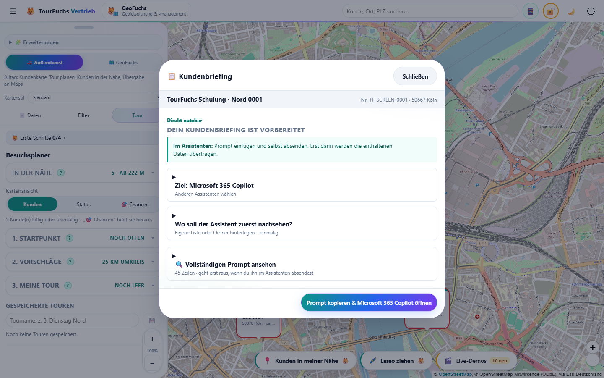

*BILD-LASSO-07 - Das Ziel wird im Kundenbriefing gewählt; das Mehrkunden-Briefing verwendet dieselbe lokal gemerkte Wahl.*

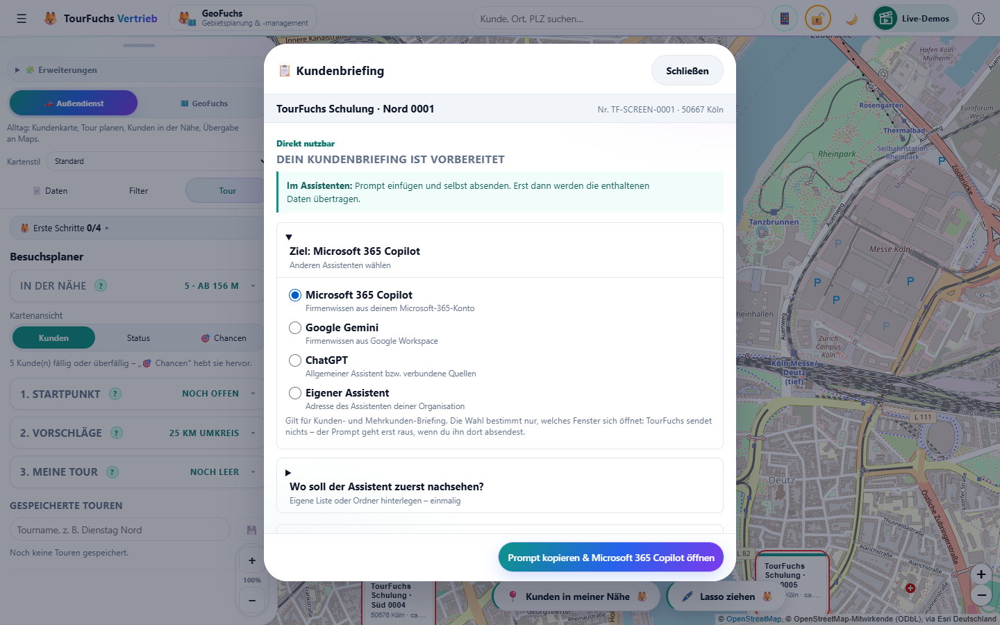

*BILD-LASSO-08 - Die Auswahl ändert Zieladresse und Quellenzeile, nicht die Verantwortung für das eigene Absenden.*

### 9.6 Mehrkunden-Briefing: "Wen zuerst?"

Das Kundenbriefing beantwortet "Was weiß meine Firma über diesen einen Kunden?".
Die häufigere Frage im Außendienst ist aber: **"Ich bin hier - wen von diesen
besuche ich zuerst?"** Entfernung und Fälligkeit weiß TourFuchs selbst; offene
Vorgänge, Eskalationen und zugesagte Rückmeldungen weiß nur der Assistent.

**Drei Klickpfade, ein Dialog:**

- `Karte -> "Lasso ziehen" -> Fläche umfahren -> "Briefing über alle"` (Lasso, siehe 9.7)
- `Tab "Tour" -> "2. Vorschläge" -> Umkreis einstellen -> "Wen zuerst? Briefing für dieses Gebiet"`
- `Blatt aufziehen -> "In der Nähe" aufklappen -> Kartenmitte oder Standort -> "Wen zuerst? Briefing für diese Umgebung"` (am Schreibtisch: `Tab "Tour" -> "In der Nähe"`)

Alle Knöpfe erscheinen **erst ab zwei echten Kunden**. Bei einem einzigen Kunden
ist das Kundenbriefing der bessere Weg; bei reinen Demo-Kunden wird kein Prompt
gebaut und kein Assistent geöffnet.

Der Ablauf ist identisch mit 9.3: lokal bauen, vollständig anzeigen, kopieren,
im Assistenten selbst absenden. Kein Login, kein API-Aufruf.

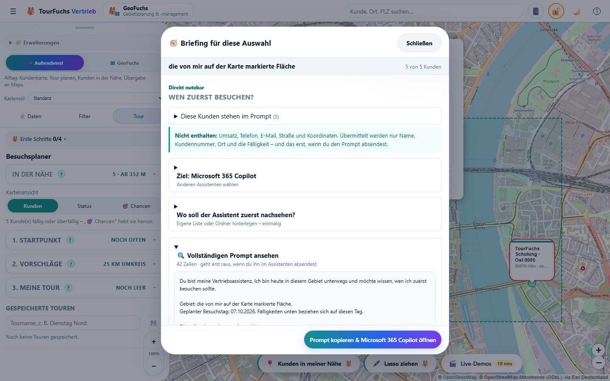

*BILD-LASSO-05 - Der Prompt entsteht im Mehrkunden-Briefing und ist vor dem Kopieren vollständig einsehbar.*

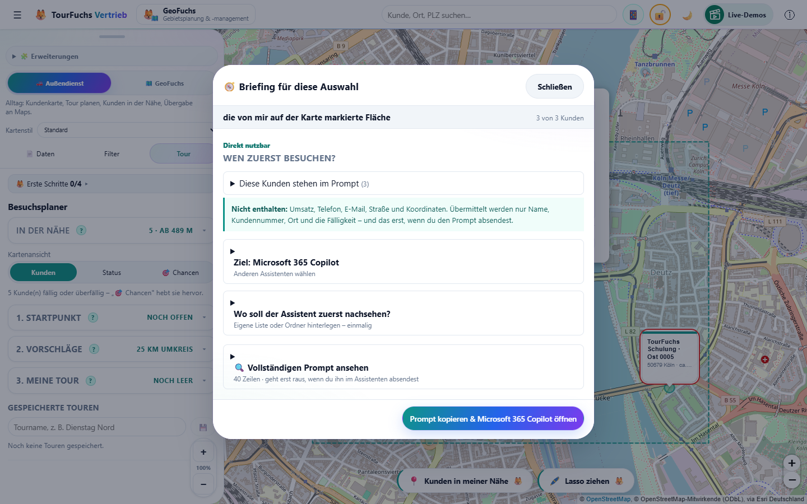

*BILD-LASSO-06 - Mehrkunden-Briefing mit voreingestelltem Copilot: prüfen, kopieren, Assistent öffnen; eingefügt und gesendet wird vom Nutzer.*

**Inhalt je Kunde - bewusst weniger als beim Einzelbriefing:**

- Kundenname
- Kundennummer
- PLZ und Ort
- Fälligkeitsstand ("überfällig" bzw. "bald fällig")
- Datum des letzten dokumentierten Besuchs

**Nicht enthalten:** Umsatz, Telefonnummer, E-Mail-Adresse, Straße,
Kartenkoordinaten. Beim Einzelbriefing ist das zugesagt - bei einer ganzen Liste
wiegt es schwerer, nicht leichter.

**Höchstens 12 Kunden.** Eine Liste mit vierzig Namen ist weder ein guter Prompt
noch eine gute Idee: Es zählt das Gebiet, nicht der Bestand. Wurde gekürzt, steht
das ausdrücklich im Prompt ("Es sind 37 Kunden im Gebiet; hier stehen die 12
nächstgelegenen") und der Dialog weist darauf hin.

**Ergebnisformat, maximal 200 Wörter:**

1. `Zuerst` - höchstens drei Kunden, je eine Zeile mit dem einen Grund.
2. `Wenn Zeit bleibt` - die übrigen Kunden mit Rang.
3. `Nichts gefunden` - Kunden ohne belastbare interne Information.

Der Prompt verbietet ausdrücklich, die bereits mitgelieferte Besuchslücke als
Begründung zu wiederholen: Entscheidend ist, was der Nutzer noch nicht weiß.

### 9.7 Lasso: eine Fläche auf der Karte umfahren

Der kürzeste Weg von "ich sehe eine Karte" zu "ich weiß, wen ich zuerst
besuche". Zwei Gründe, warum es das neben dem Umkreis gibt:

1. **Eine Geste statt eines Formulars.** Der Umkreis verlangt vier Handgriffe,
   bevor etwas passiert. Das Lasso ist eine Bewegung um das, was ohnehin schon
   auf dem Schirm ist.
2. **Unrunde Flächen.** Gewerbegebiet, eine Flussseite, ein Autobahnkorridor -
   nichts davon ist rund. Ein Radius nimmt dort immer zu viel oder zu wenig mit.

**Klickpfad:** `Karte -> "Lasso ziehen" -> ziehen -> "Briefing über alle"`.

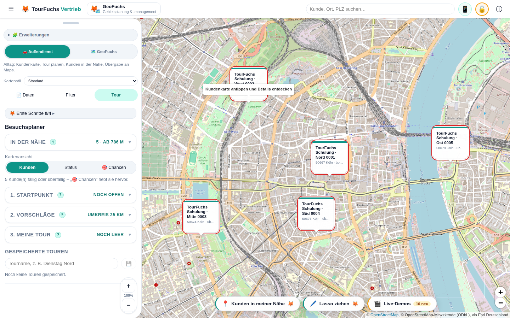

*BILD-LASSO-01 - Startpunkt des zentralen Workflows in der Karten-Knopfzeile.*

Ablauf:

1. Der Knopf schaltet einen sichtbaren Modus: Karte friert ein, Zeiger wird zum
   Fadenkreuz, ein Rahmen zeigt den Zustand. **Escape** verlässt ihn jederzeit.

   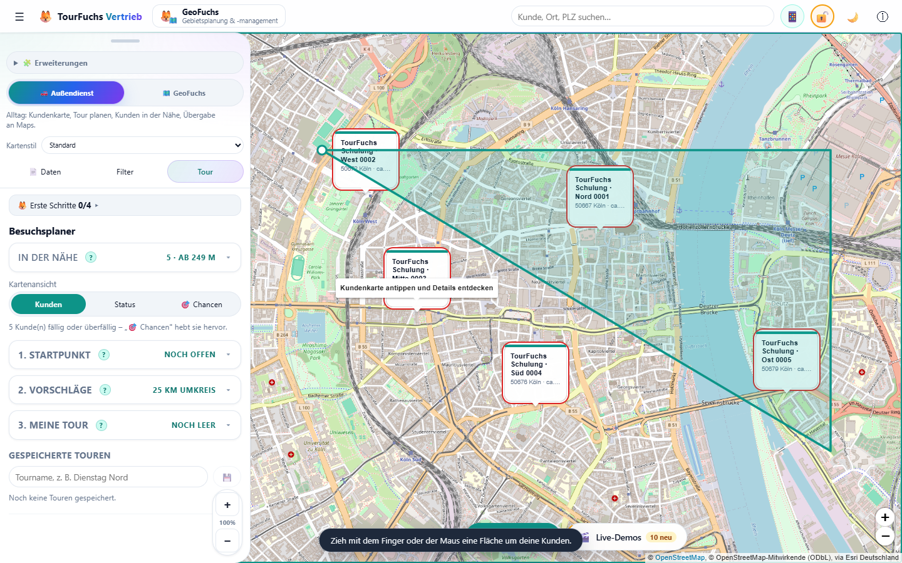

   *BILD-LASSO-02 - Die echte Zeigergeste erzeugt sichtbar eine Fläche; zu diesem Zeitpunkt existiert noch kein Prompt.*

2. Die Spur wächst mit dem Finger mit, ein Punkt markiert den Start. Beim
   Loslassen schließt sich die Form, die Treffer leuchten auf, und es erscheint
   eine Auswahlkarte im Gewand der Kundenkarte: Anzahl, fällige Kunden, Umsatz,
   Orte, die ersten Namen. Der Modus schaltet sich selbst wieder ab.

   

   *BILD-LASSO-03 - Ergebnis der Geste ist die Kundenauswahl.*

   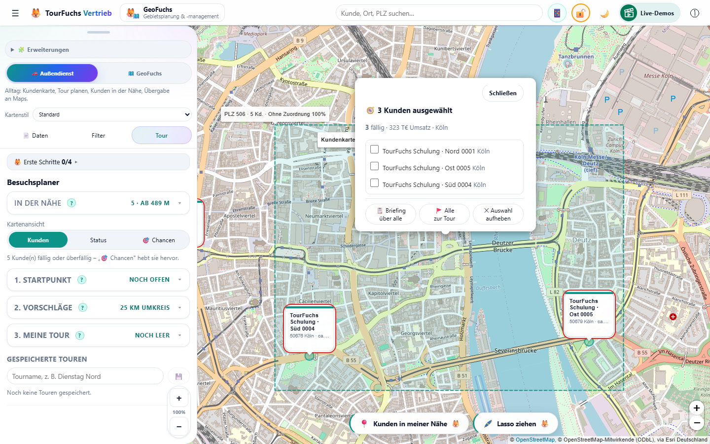

   *BILD-LASSO-04 - Auswahl prüfen; erst „Briefing über alle" führt zur Prompt-Vorbereitung.*

3. "Briefing über alle" öffnet das Mehrkunden-Briefing aus 9.6 - **unverändert**:
   Das Lasso liefert nur die Auswahl, keinen eigenen Prompt.

**Der Rückweg:** Jede Zeile der Auswahlkarte trägt ein Häkchen.
Ohne Häkchen heißt der Knopf "Alle zur Tour" und tut das auch; mit Häkchen heißt
er "3 zur Tour" und meint genau die angehakten. Kunden, die schon in der Tour
stehen, erscheinen mit einem Haken und "in Tour", aber ohne Kästchen. Nach dem
Übernehmen bleibt die Auswahl liegen - man hakt oft zweimal an. Namentlich
stehen die ersten acht Kunden auf der Karte, sortiert vom Flächenmittelpunkt
nach außen; für alles darüber hinaus gibt es "Alle zur Tour".

Damit schließt sich der Kreis: umfahren, briefen lassen, und die zwei oder drei,
die sich lohnen, direkt in die Tour - ohne die Auswahl zu verlieren.

Auf Handy und Tablet-Hochkant schiebt sich das Bedienblatt beim Einschalten auf
Guckhöhe, damit überhaupt Karte zum Zeichnen da ist; es kommt zurück, sobald die
Auswahl aufgehoben wird.

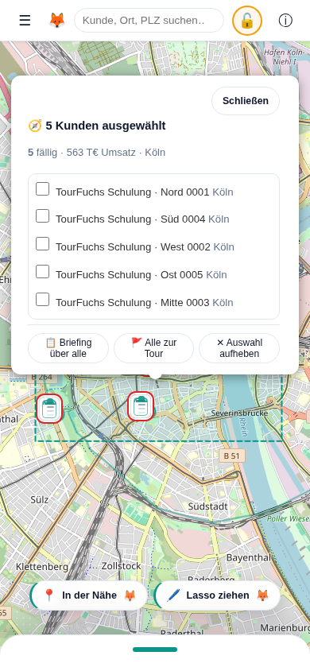

*BILD-LASSO-MOBIL-03 - Auf dem Smartphone bleiben Auswahl, Abschlussaktionen und unteres Bedienblatt gleichzeitig erreichbar.*

Verhalten in Randfällen:

| Fall | Antwort |
|---|---|
| Tippen statt Ziehen | Nichts ausgewählt, ruhiger Hinweis |
| Fläche ohne Kunden | Hinweis "Zieh sie etwas größer" |
| Weniger als zwei echte Kunden | Auswahl sichtbar, aber kein Briefing angeboten |
| Nur Beispielkunden | Kein Prompt, kein Assistent |
| Karte verschieben oder zoomen | Auswahl wird verworfen |
| Sehr große Auswahl | Zahl vollständig, hervorgehoben höchstens 250 Punkte |

Die Live-Demo "Kunde(n) wählen / Briefing / Entscheiden / Tour wählen" führt die Geste in der echten
App vor - mit echten Zeigerereignissen, nicht als Animation.

### 9.8 Bewusst entfernte Funktion: automatische Microsoft-Anmeldung

Frühere Fassungen boten im Profi-Modus eine optionale automatische Anmeldung an
Microsoft Entra ID und einen direkten Aufruf der Copilot-Chat-API über Microsoft
Graph, mit Antwortanzeige in TourFuchs.

**Diese Funktion wurde am 25.07.2026 vollständig entfernt.** Gründe:

- sie stand im Spannungsverhältnis zum Lokal-first-Versprechen,
- sie verlangte eine IT-registrierte Entra-SPA und administrative Freigaben,
- sie band das Produkt an einen einzigen Anbieter.

Die MSAL-Abhängigkeit ist aus dem Projekt entfernt. Lokal gespeicherte Kennungen
(`tourfuchs:copilot-config:v1`) und Einwilligungen (`tourfuchs:copilot-consent:v1`)
werden beim Start gelöscht.

**Der Guide bietet diesen Weg nicht mehr an** und beschreibt bei Nachfragen den
manuellen Weg als den vorgesehenen - nicht als Rückfalloption.

### 9.9 Richtige Guide-Antwort bei Datenschutzfragen

Der Guide sagt nicht pauschal "Es werden keine Daten übertragen". Korrekt ist:

- TourFuchs erzeugt den Prompt lokal, zeigt ihn vollständig und kopiert ihn.
- TourFuchs meldet sich an keinem KI-Dienst an und ruft keine KI-Schnittstelle auf.
- Übertragen werden die Daten erst, wenn der Nutzer den Prompt im Assistenten
  einfügt und absendet. Ab da gelten die Bedingungen des Anbieters.
- Berechtigungen und Richtlinien der Organisation bleiben wirksam.

### 9.10 Wenn nichts passiert

Öffnet sich kein Fenster, hat meist der Popup-Blocker zugeschlagen. Der Prompt
liegt trotzdem in der Zwischenablage: Assistent von Hand öffnen und einfügen.
Der Prompt ist im Dialog außerdem vollständig sichtbar und markierbar.

Weitere Details: `docs/kundenbriefing.md`.

---

## 10. Tourplanung im Außendienst

### 10.1 Standardtour

**Klickpfad:** `"Außendienst" -> Tab "Tour"`.

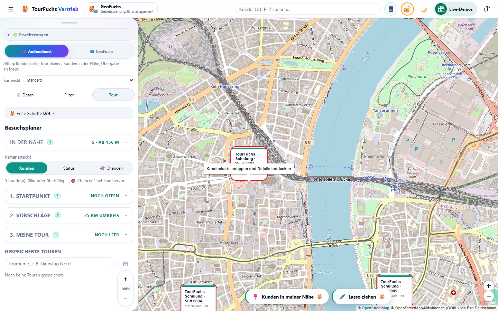

*BILD-TOUR-01 - TourFuchs zeigt die drei Planungsstufen; der Nutzer öffnet und füllt sie bewusst selbst.*

1. Nichts. Geplant wird über **alle Kunden**. Am Desktop schränkt die Zeile
   **"🗺️ Bezirk: Alle Bezirke · N Kunden · ändern ▸"** bei Bedarf auf einen
   Bezirk ein. Auf dem Smartphone öffnet **"🗺️ Planungsbereich"** die
   durchsuchbare Mehrfachauswahl aus Vertriebsbezirk, Vertriebsgruppe, Channel,
   Kundentyp und geeigneten Zusatzspalten (siehe 10.1a).
2. **"Mein Standort"** nutzen oder im Feld
   **"...oder Kunde, Ort oder PLZ als Start"** suchen. Das Feld findet dreierlei:
   **eigene Orte**, **Kunden** und **Orte** aus dem mitgelieferten
   Postleitzahl-Verzeichnis (siehe 10.1b).
3. Datum, Startzeit und **"Besuch (Min.)"** einstellen.
4. Umkreis mit dem Regler anpassen.
5. optional **"Überfällige zuerst"** aktivieren.
6. Kunden aus Vorschlägen oder Karten-Popups mit **"Zur Tour"** hinzufügen.
7. ab zwei Stopps **"⚡ Optimieren"**.
8. **"🗺️ Tour anzeigen"**; danach bei Bedarf **"In Google Maps navigieren"**.
9. bei Bedarf **"Straßenroute anzeigen"**.
10. **"In Google Maps navigieren"**.

Der Nutzer baut die Tour bewusst selbst. TourFuchs schlägt vor und optimiert nur
die ausgewählten Stopps.

### 10.1a Mobiler Planungsbereich und Kartenfärbung

**Klickpfad Smartphone:** `Tour-Blatt öffnen -> "🗺️ Planungsbereich"`.

Der Reiter **„Filter“** ersetzt die nicht durchsuchbare native Bezirksliste.
Die Kategorien entsprechen ausschließlich den im Desktop-Tab **„Filter“**
eingeblendeten Ebenen. Standard sind **Vertriebsbezirk**, **Vertriebsgruppe**
und **Kundentyp**. **Channel** oder geeignete textliche Zusatzspalten erscheinen
mobil erst, nachdem sie am Desktop über **„+ Ebene hinzufügen“** aktiviert
wurden; ausblenden lassen sie sich ebenfalls nur dort. Diese Desktop-Auswahl
bleibt lokal gespeichert. Das Suchfeld findet den Kategorienwert; beim Vertriebsbezirk
zusätzlich den Namen des **Vertriebsbeauftragten (VB)**. Mehrere gewählte Werte
einer Kategorie gelten als **ODER**, verschiedene Kategorien als **UND**. Keine
Auswahl in einer Kategorie bedeutet **alle**. Die laufende Trefferzahl steht
oben im Blatt.

Der Reiter **„Karte färben“** bietet **„Automatisch“**, **„Nach Channel“**,
**„Nach Vertriebsgruppe“**, **„Nach Vertriebsbezirk“** und **„Keine Flächen“**.
Die Farbe liegt nur dezent hinter Kundenlichtern, Markern und Route. Automatisch
wechselt die Gebietsebene passend zum Zoom. **„Zurücksetzen“** setzt Filter und
Kartenwahl zurück; **„Übernehmen“** speichert beides lokal.

Sicherheitsregel: Bereits gewählte Tourstopps werden beim Filtern nie gelöscht.
Sie bleiben in der Tour und tragen dort den Hinweis **„Außerhalb
Planungsbereich“**. So ändert ein Analysefilter keine bewusst geplante Route.
Das Desktop-Gesicht verwendet weiterhin unverändert seine bestehende
Bezirksauswahl und den Filter-Tab.

### 10.1b Orte als Start und Ziel (Station, Büro, Hotel)

**Klickpfad:** `"Außendienst" -> "Tour" -> Schritt 1 -> Feld "...oder Kunde, Ort
oder PLZ als Start"`.

Nicht jede Tour beginnt zu Hause oder bei einem Kunden. Wer mit dem Zug anreist
und einen Mietwagen übernimmt, startet an einer Station; wer vom Büro losfährt,
dort. Dasselbe Feld beantwortet deshalb drei Fragen und zeigt die Treffer in
drei Gruppen:

| Gruppe | Was drinsteht |
|---|---|
| **Eigene Orte** | selbst benannte Punkte, z. B. "SIXT Essen Hbf" |
| **Kunden** | wie bisher: Name, Ort oder Postleitzahl |
| **Orte** | Ortsnamen und Postleitzahlen aus dem mitgelieferten Verzeichnis |

Eingefügte Koordinaten ("51.4459, 7.0185" oder "51,4459 7,0185") werden ebenfalls
erkannt. Das **Ziel** benutzt dasselbe Feld
(**"Kunde, Ort oder PLZ als Ziel"**) – für die Rückgabestation am Abend.

**Einen Punkt exakt auf der Karte setzen:** Sobald das Suchfeld den Fokus hat,
steht unter den Treffern **"Eigenen Ort auf der Karte setzen"**. Nach dem
Antippen bleibt die Karte bedienbar: gewünschte Stelle antippen oder den roten
Pin mit Finger bzw. Maus ziehen, dann **"Position übernehmen"**. Anschließend
braucht der Punkt einen Namen; das Häkchen **"Diesen Ort für spätere Touren
merken"** ist vorausgewählt. Der gespeicherte Ort erscheint als eigener
violetter Stern-Pin auf der Tourkarte. Sein Popup bietet **"Als Start"**,
**"Als Ziel"**, **"Position ändern"** und **"Löschen"**. Am Start- oder
Zielchip öffnet **"📌 genauer"** denselben Ablauf für einen bereits gefundenen
Ort.

Bei englischer, französischer oder spanischer Oberfläche erscheinen auch diese
sichtbaren Bezeichnungen – Kartenhinweis, **„Position übernehmen“**,
Benennungsdialog, **„Als Start“**, **„Als Ziel“**, **„Position ändern“** und
**„Löschen“** – in der gewählten Sprache. Name und exakte Koordinate des
eigenen Orts bleiben unverändert lokal gespeichert.

**Einen Ort merken:** Ist ein Ort als Start oder Ziel gewählt, steht am Chip der
Knopf **"★ merken"**. Er fragt nach einem Namen; danach trägt der Startpunkt
diesen Namen und der Ort steht künftig oben in der Trefferliste. Gelöscht wird
er mit **✕** direkt in dieser Liste. Es passen **20** eigene Orte.

**Straße und Hausnummer:** Direkt nach dem Namen fragt TourFuchs freiwillig nach
**"Straße und Hausnummer"**. Die Eingabe wird **nicht nachgeschlagen** – sie wird
mitgeschrieben und an **Google Maps** übergeben, sobald von diesem Punkt aus
navigiert wird; sie reist auch in der QR-Übergabe aufs Handy mit. Wirkung: Die
Planung (Umkreis, Streckenschätzung) rechnet bei einem Verzeichnistreffer weiter
mit der Ortsmitte, die **Navigation** führt aber zur Haustür. Bei einem bewusst
gesetzten Karten-Pin gilt dagegen durchgehend dessen genaue Koordinate – auch
wenn zusätzlich eine Straße als Beschriftung eingetragen ist. Wer nichts
einträgt, verliert nichts.
Diese Frage erscheint nur bei Orten ohne Straße; ein Kunde bringt seine Adresse
bereits mit.

Wichtige Abgrenzung für den Guide: Eine **Straße suchen** kann TourFuchs nicht –
im Suchfeld findet man Ortsnamen und Postleitzahlen, keine Hausnummern. Wer eine
Adresse hausgenau braucht, trägt sie einmal beim Merken ein.

**Was der Guide zu Genauigkeit sagen muss:** Ein Ort aus dem Verzeichnis ist
**ortsgenau, nicht hausgenau** – er liegt in der Ortsmitte bzw. in der Mitte des
Postleitzahl-Gebiets. Für Umkreisvorschläge und Streckenschätzung genügt das;
wer die Station hausgenau braucht, setzt sie einmal mit dem Karten-Pin.
TourFuchs sucht **keine Adressen im Internet**: Die Ortssuche arbeitet
ausschließlich mit den mitgelieferten Postleitzahl-Daten, es geht dabei keine
Anfrage hinaus.

**Ein Ort ist kein Kunde.** Er zählt nicht in Kundenlisten, Umsatzsummen,
Fälligkeiten oder Gebietsauswertungen mit. Eigene Orte werden zusammen mit den
Kundendaten gespeichert und sind damit bei aktivem Datentresor verschlüsselt;
"Alle Daten löschen" löscht sie mit.

### 10.2 Weitere Tourwerkzeuge

Diese Werkzeuge stehen ohne Moduswechsel zur Verfügung:

- Kartenansicht **"Kunden"**, **"Status"**, **"Chancen"** – die Karten-
  Einfärbung liegt **nur auf dem Desktop** (dort ist die Karte sichtbar). Im
  mobilen Tour-Flow ist sie bewusst nicht enthalten; die Klappkarte
  **"In der Nähe"** und „Überfällige zuerst" decken den Bedarf dort ab.
- festen **"Ziel"**-Kunden
- Vorschlagsmodus **"Umkreis um Start"** / **"Entlang der Tour"**
- **"Rundreise (zurück zum Start)"**
- Tagesplan-Druck
- Kalender-Export
- Tour als Text für Outlook/Copilot
- gespeicherte Touren

Auf dem Smartphone können zusätzliche Tour-Abschnitte seitlich weggewischt werden.
**"Ausgeblendete Elemente zurücksetzen"** stellt sie wieder her.

### 10.3 "Was ist in meiner Nähe?"

**Klickpfad:** `"Außendienst" -> Fuchs-Knopf über der Karte "Kunden in meiner
Nähe"` bzw. `"Außendienst" -> "Tour" -> Schritt 1 -> "📍 Mein Standort"`.

Die Funktion nutzt den GPS-Standort als Start und zeigt passende Kunden im
Umkreis. Eine Standortberechtigung kann erforderlich sein.

Der Tour-Scope steht ab Werk auf **alle Bezirke**; eine bewusste Einschränkung
bleibt dabei bestehen. Findet die Funktion im aktuellen
Radius keinen Kunden, **weitet sie den Umkreis schrittweise** aus, bis der erste
Treffer erscheint, und meldet das gefundene Ergebnis per Kurzhinweis. Auf dem
Handy schlägt der schwebende Fuchs-Knopf danach den nächsten Schritt vor
(„Tour ab hier planen").

Einen Knopf **"Was ist in meiner Nähe?"** gibt es im Blatt nicht mehr. Die
Aktion löst der schwebende Fuchs-Knopf über der Karte aus; im Planer führt
**"📍 Mein Standort"** in Schritt 1 zum selben Ergebnis. Der PWA-Kurzbefehl
`?start=nearby` ruft sie ebenfalls auf.

Über dem Tour-Prozess steht die eingeklappte Karte **"In der Nähe"**. Die
Kopfzeile nennt zugeklappt Anzahl und Entfernung des nächsten Kunden
(z. B. `12 · ab 1,1 km`); ein Tipp klappt sie auf und zeigt die fünf
nächstgelegenen Kunden, **"Alle N zeigen"** den Rest (maximal zwölf). Der
Bezugspunkt kann zwischen **"Kartenmitte"** und **"Standort"** wechseln; nach dem
Standort wird erst beim Tipp auf **"Standort"** gefragt. Ein Tipp auf einen
Kunden fliegt zum Marker; Plus fügt ihn zur Tour hinzu. **"Wen zuerst?"** startet
das Briefing für diese Umgebung.

### 10.4 Vorschläge

**Umkreis um Start:** Kunden innerhalb des gewählten Radius.

**Entlang der Tour:** Kunden in einem Korridor entlang Start, Stopps und Ziel. Bei
erteilter Routing-Zustimmung folgt der Korridor der Straßenroute; sonst der
direkten Verbindung.

**Überfällige zuerst:** priorisiert fällige und überfällige Besuche, baut aber
nicht automatisch eine Tour.

### 10.5 Optimierung

**"⚡ Optimieren"** (Tooltip: Reihenfolge optimieren) sortiert die gewählten Zwischenstopps mit
Nearest-Neighbor und 2-Opt. Start und optionales Ziel bleiben fest. Die Berechnung
ist eine Streckenheuristik und keine Echtzeit-Verkehrsoptimierung.

### 10.6 Ziel und Rundreise

- mit explizitem Ziel endet die Tour dort. Ziel kann ein **Kunde oder ein Ort**
  sein (Rückgabestation, Hotel, Büro) – dasselbe Suchfeld wie beim Start.
- mit **"Rundreise"** endet sie wieder am Start.
- ohne Ziel und ohne Rundreise ist der letzte Stopp automatisch das Ziel.

### 10.7 Luftlinie und Straßenroute

**"🗺️ Tour anzeigen"** steht direkt neben **"⚡ Optimieren"** und richtet die Karte auf die Tour aus. Beim ersten Anzeigen erscheint die Luftlinie. Ein erneuter Klick behält den gewählten Linienmodus bei; er schaltet nicht zwischen Straße und Luftlinie um. Die frühere Beschriftung "Route auf Karte anzeigen" ist ersetzt.

Nur der separate Karten-Umschalter wechselt zwischen:

- **"Straßenroute anzeigen"**
- **"Luftlinie anzeigen"**

Der Umschalter steht als Pille in der Knopfzeile unten über der Karte — dort,
wo auch 🖊️ „Lasso ziehen" und der Fuchs-Knopf sitzen. Auf schmalen Schirmen
kürzt sich die Beschriftung auf „Straßenroute", damit beide Pillen
nebeneinander bleiben.

Die Straßenroute kommt von OSRM auf Basis von OpenStreetMap. Vor der ersten
externen Anfrage bittet TourFuchs um Zustimmung. Übertragen werden nur
Koordinaten von Start und Routenpunkten. Bei Fehler bleibt die Luftlinie
verfügbar.

### 10.8 Google Maps

**Navigation ist die hervorgehobene Hauptaktion.** QR-Übergabe, Druck, Kalender, Text und Rückblick stehen in der Klappgruppe **"Teilen & Exportieren"**. "Tour anzeigen" bleibt dagegen direkt neben "Optimieren" sichtbar.

**"In Google Maps navigieren"** öffnet einen Directions-Link. Erst mit diesem
bewussten Klick werden Routendaten an Google übergeben. Google begrenzt die Zahl
der Zwischenziele; TourFuchs übergibt deshalb nur die unterstützte Anzahl
(bei einer einfachen Tour bis zu zehn Stopps inklusive Ziel).

### 10.9 Tagesplan und Kalender

Unter **"Teilen & Exportieren"**:

- **"Tagesplan drucken"** erstellt einen Plan mit Ankunftszeiten, Adressen,
  Kontakten und Checkboxen. Inhalt, Datum und Druckleiste folgen der gewählten
  Sprache (Deutsch, Englisch, Französisch oder Spanisch).
- **"Kalender-Export (.ics)"** erstellt einen Termin je Besuch.
- **"Als Text kopieren (Outlook/Copilot)"** legt die Tour in die Zwischenablage.

Datum, Startzeit und Besuchsdauer steuern Druck, Kalender und QR-Übergabe.
Fahrzeiten sind Schätzwerte.

### 10.10 Besuchsstatus

Aus Besuchsrhythmus und letztem Besuch entstehen:

- ok
- bald fällig
- überfällig

Kunden ohne Rhythmus haben keinen Status. Ein Besuch wird in der Tour mit
**"✓ Heute"** oder im Kunden-Popup mit **"Heute besucht"** dokumentiert; am Handy
genügt ein Tipp auf den Tour-Punkt der Zeile. Der Status aktualisiert sich sofort
und wird lokal gespeichert.

#### 10.10.1 Feierabend-Rückblick

Damit das Abhaken nicht reine Pflichteingabe bleibt, spiegelt TourFuchs den Tag
zurück. **Klickpfad:** `Tab "Tour" -> "Meine Tour" -> "🌙 Feierabend-Rückblick"`.
Der Knopf erscheint, sobald heute ein Besuch eingetragen wurde oder eine Tour
steht; die Zahl daneben nennt die heutigen Besuche.

Der Rückblick zeigt:

- **Besuche heute** – geplante und spontane; spontane sind als solche markiert.
- **Strecke (geschätzt)** – aus der geplanten Route, ausdrücklich **keine**
  gefahrene Wegstrecke. Ohne Startpunkt bleibt das Feld leer.
- **Überfällige erledigt** – Kunden, die **vor** dem heutigen Besuch überfällig
  waren. Dafür wird der heutige Eintrag zurückgerechnet; sonst wäre nach dem
  Abhaken jeder Kunde "im Rhythmus" und die Antwort immer 0.
- **Offen geblieben** – geplante Stopps ohne Besuchseintrag. Sie bleiben in der
  Tour und lassen sich morgen weiterverwenden.
- je Kunde den Abstand zum vorherigen Besuch ("zuvor vor 9 Wochen").

**"📋 Als Text kopieren"** legt einen schlichten Tagesabschluss in die
Zwischenablage – für Wochenbericht, Notiz oder Mail. Der Rückblick öffnet sich
nie von selbst: Wann Feierabend ist, entscheidet der Nutzer.

#### 10.10.2 Besuche weitergeben (Besuchsbericht)

TourFuchs synchronisiert nichts über einen Server. Besuche, die am Handy mit
„✓ Heute" eingetragen wurden, verlassen das Gerät deshalb bewusst als **kleine
Excel-Datei**. **Klickpfad Handy:** `Tab "Tour" -> "Meine Tour" -> "📤 Besuche
weitergeben (n)"` oder im Feierabend-Rückblick **"📤 Besuche weitergeben"**.
Am Desktop: `Daten -> "📤 Besuchsbericht (Excel)"`.

- **Zeitraum:** „Seit dem letzten Bericht" (Standard), „Heute" oder „Diese
  Woche" (ab Montag), jeweils mit Anzahl. „Seit dem letzten Bericht" merkt
  sich lokal, was schon weitergegeben wurde (60 Tage) – nichts doppelt,
  nichts vergessen. Besuche aus einem Import oder aus Beispieldaten gelten als
  schon bekannt.
- **Datei:** eine Zeile je Besuch – Besuchsdatum, Kundennummer, Name, Adresse,
  Vertriebsbezirk, Vertriebsbeauftragter, Hauptansprechpartner plus die
  Originalspalten der Kundenliste (z. B. CRM-Schlüssel). Beispieldaten sind
  als DEMO markiert.
- **Weitergeben:** Am Handy öffnet sich das Teilen-Menü des Geräts (Mail,
  Teams, OneDrive …); wo das nicht geht, wird die Datei heruntergeladen. Wird
  das Teilen abgebrochen, gilt nichts als weitergegeben.
- **Verwendung:** ins CRM importieren, einer KI anhängen („trag das ein",
  „schreib meinen Wochenbericht") oder am Desktop in TourFuchs öffnen.
- **Am Desktop übernehmen:** Die Datei über „Eigene Daten laden" (oder per
  Drag & Drop) öffnen. TourFuchs erkennt den Besuchsbericht an den Spalten
  **„Besuchsdatum"** und **„Kundennummer"** und trägt nur die Besuche nach –
  Kunden, Gebiete und Touren bleiben unverändert. Meldung z. B.: „8 Besuche
  übernommen · 1 Kunde nicht gefunden (12345)". Unbekannte Kundennummern werden
  nicht angelegt.
- **Datenschutz:** Die Datei enthält Kundennamen. Nur über die Wege der eigenen
  Organisation teilen. Das CRM bleibt die führende Quelle.

### 10.11 Service-Fokus: Einsätze, Verträge und Tagesvorschlag

Der Arbeitsfokus **"Service"** ist ein **optionales Modul** mit den Tabs
**"Einsätze"**, **"Verträge"** und **"Tour"**. Er ist standardmäßig ausgeblendet
und wird unter **🧩 Erweiterungen → ServiceFuchs**
aktiviert (die Wahl wird lokal gemerkt). Er hält zwei getrennte Zusatzbestände
neben den Kundendaten:

**Serviceverträge (Vertragsradar):** eigener Excel-/CSV-Import. Eindeutiger
Schlüssel ist `Quellsystem + Vertragsnummer`; die Verknüpfung zum Kunden erfolgt
ausschließlich über die exakte **Kundennummer** (führende Nullen bleiben
erhalten, Namen oder PLZ sind bewusst keine Fallbacks). Ein erneuter Import
ersetzt nur die in der Datei enthaltenen Vertragsquellen; andere Quellen,
Kunden, Gebiete und Touren bleiben erhalten. Das Radar zeigt Handlungsfristen
("Handeln bis") in exklusiven Zeitfenstern, Vertragswerte und Verantwortliche.

**Operative Serviceeinsätze (Work Orders):** ebenfalls eigener Import mit
strenger Validierung (Fällig am, Zeitfenster, Dauer 10-720 Minuten, Priorität
KRITISCH/HOCH/MITTEL/NIEDRIG, Status). Fehlerhafte Zeilen werden nie
übernommen; die Fehlerliste steht als Excel bereit.

**Kundenauswahl im Service-Fokus:** Über dem Panel steuert eine Auswahl, welche
Kunden Karte und Tour zeigen: **"Jetzt"** (fällige/kritische Einsätze),
**"Diese Woche"**, **"Vertragskunden"** (Standard: Kunden mit aktivem oder in
Verlängerung befindlichem Vertrag) oder bewusst **"Alle Kunden"**. Zähler an
den Schaltflächen machen die Wirkung sichtbar. Bereits gewählte Tourstopps
außerhalb des Filters bleiben mit einem Hinweis in der Tour.

**Tagesvorschlag:** Der Service-Tagesplaner erstellt lokal und deterministisch
einen erklärbaren Tagesplan (Arbeitstag, Schichtfenster, Techniker-Skills).
Entfernungen werden als Luftlinie mal Straßenfaktor 1,3 bei 60 km/h geschätzt;
SLA-Fristen beeinflussen die Reihenfolge, sind aber keine harte Schranke. Jeder
Stopp trägt nachvollziehbare Gründe, nicht einplanbare Einsätze werden mit
Ursache gelistet. **"Übernehmen"** ersetzt die Tourstopps und fixiert die
Zeiten; jede manuelle Touränderung verwirft den fixierten Plan bewusst.
Tagesplan-Druck und Kalender-Export übernehmen die fixierten Zeiten.

Demo-Daten enthalten passende Demo-Verträge und 20 Demo-Einsatzaufträge, damit
der Service-Fokus ohne eigene Dateien erlebbar ist.

**Zanobo-Brücke (akustischer Maschinen-Check):** Einsätze mit **Anlagen-ID**
verlinken direkt zur Schwester-App **Zanobo** (Standard:
`zanobo.vercel.app`, eigene Instanz im Einsätze-Tab einstellbar). Zanobo
vergleicht das Betriebsgeräusch einer Maschine lokal im Browser mit einer
Referenzaufnahme - ein **Vergleichs- und Orientierungsinstrument, kein
Diagnosewerkzeug**. Der Guide übernimmt dieses Wording immer.

- Der Link erscheint überall dort, wo ein Einsatz mit Anlagen-ID sichtbar
  ist: Einsatzkarte im Service-Cockpit, Tour-Stopp mit Service-Zeitplan,
  Tagesplan-Druck und Kalender-Termin (.ics).
- Konvention: **Anlagen-ID in TourFuchs = Maschinen-ID in Zanobo** (dieselbe
  ID wie am Zanobo-NFC-Tag an der Maschine).
- Datenschutz: Der Deep-Link nutzt Zanobos Route `#/m/<Anlagen-ID>` - die ID
  steckt im URL-Fragment und wird beim Öffnen **nicht an den Server
  übertragen** (gleiche Mechanik wie beim Tour-QR).
- Beide Apps teilen dieselbe Architektur: lokal im Browser, ohne Cloud und
  ohne Konto. Es findet keine Datenübertragung zwischen TourFuchs und Zanobo
  statt; die Brücke ist ein reiner Link.

---

## 11. Tour per QR übergeben (Desktop → Handy, Handy → Handy)

### 11.1 Senden am Desktop

**Klickpfad:** Tour planen -> **"An Handy übergeben (QR)"**.

Der QR-Code enthält nur die geplante Tour, maximal 12 Stopps:

- Start
- Stopps mit Name, Koordinaten, Adresse, Telefon und Kundennummer
- Datum, Startzeit und Besuchsdauer
- Rundreise-Einstellung
- optionaler Tourname

Die vollständige Kundendatenbank wird nicht übertragen. Der Tourinhalt steckt im
URL-Fragment `#t=...`; dieses Fragment wird beim Laden der Webadresse nicht an den
Server gesendet.

### 11.2 Empfangen mit der normalen Smartphone-Kamera

1. QR-Code am Desktop mit der Kamera-App scannen.
2. TourFuchs-Link öffnen.
3. Empfangsdialog prüfen.
4. eine der angebotenen Aktionen wählen.

Die installierte PWA öffnet sich, andernfalls der Browser. Das Laden der App kann
eine Netzwerkverbindung benötigen, der Tourinhalt selbst wird jedoch aus dem
QR-Fragment gelesen.

### 11.3 Empfangen innerhalb von TourFuchs

**Klickpfad:** `"Tour" -> "Tour per QR übernehmen"` (Fenster „Tour per QR scannen").

Alternativ zum Live-Kamerascan kann ein Foto des QR-Codes ausgewählt werden.

Nach erfolgreichem Scan:

- **"Als Tour übernehmen"** gleicht Stopps über Kundennummer, sonst Name + PLZ,
  mit lokalen Kunden ab. **Im Code enthaltene, lokal unbekannte Kunden werden
  dabei angelegt**, damit die Tour vollständig übernommen wird.
- **"In Google Maps navigieren"** funktioniert direkt aus dem QR-Code – auf
  Wunsch **ab dem aktuellen Standort**.
- **Kalender (.ics)** funktioniert ebenfalls direkt aus dem QR-Code.

### 11.4 Von Handy zu Handy teilen

**Klickpfad (Handy):** Tour planen -> **"📲 Tour per QR teilen"**.

Das Handy zeigt denselben QR-Code wie der Desktop. Die Kollegin oder der Kollege
scannt ihn mit der **normalen Kamera** des eigenen Handys; der Link öffnet
TourFuchs mit dieser Tour – auch wenn TourFuchs dort noch nie benutzt wurde.
So verbreitet sich die App von Kollege zu Kollege.

- Bewusst **nur QR**, kein Versand-Link über WhatsApp, Mail oder Teams: Die Tour
  enthält Namen, Adressen und Telefonnummern. Bildschirm zu Kamera kommt ohne
  Messenger, Server und Kopien in fremden Postfächern aus.
- Am Desktop heißt der Knopf weiterhin **"An Handy übergeben (QR)"**.
- Empfangen: normale Kamera-App oder in TourFuchs **"📷 Tour per QR übernehmen"**.
  Der Knopf ist am Handy immer erreichbar: im Tour-Blatt direkt unter der
  Bezirkswahl und mit etwas Abstand vor "1. Startpunkt" (mit gesetztem Start schmaler), in der Schrittleiste als **📷** und unter **"📂 Eigene Daten
  laden" -> "Tour von einem anderen Handy"** – dort auch ganz ohne eigene
  Kundendaten.

---

## 12. Mobile Bedienung

### 12.1 Produktfokus

Mobil gibt es **einen** Bereich: die **Tour**. Eine Reiterleiste steht deshalb
nicht mehr im Bild. Was man sieht, entscheidet allein die Höhe des Blatts:
**unten = Karte, oben = Tour**.

Die frühere Pille **"Basis" / "Profi"** ist seit 26.09.2026 entfernt. Die Karte erhält den Platz zurück; der volle Außendienstumfang bleibt verfügbar. Gebietsplanung, Cockpit und Simulation sind bewusst Desktop-Aufgaben.

Bis Version 3.2 standen dort zwei Reiter. Sie waren kein Bereichswechsel: „Karte"
klappte das Blatt ein, „Tour" zog es auf – dasselbe, was Griff und "☰" tun. Drei
Bedienelemente für einen Zustand, zum Preis einer Zeile am oberen Rand.

### 12.2 Bottom Sheet

Das Bedienpanel ist unten an den Bildschirm angedockt.

- der obere Griff wird senkrecht gezogen, um die Höhe kontinuierlich zu ändern;
  bis zum Boden gezogen klappt das Blatt ganz auf die Guckhöhe ein.
- aus geschlossenem Zustand folgt das Blatt direkt dem Finger, ohne von unten
  falsch zu schrumpfen.
- ein **Tipp** auf den Griff klappt ein und aus – wie "☰" in der Topbar.
- beim Einklappen zeigt eine bereits geplante Tour sich auf der frei werdenden
  Karte.
- die gewählte Höhe wird gespeichert.
- der eingeklappte Peek und die schwebenden Overlays liegen bewusst **über der
  System-Navigationsleiste** (Android/iOS): Ist im Edge-to-Edge-Modus unten eine
  Zurück/Home/Übersicht-Leiste sichtbar, verdeckt sie den Beispieldaten-Streifen
  und die Bedienelemente nicht mehr. Ohne sichtbare Leiste sitzt das Blatt wie
  bisher ganz unten.

**Tour-Akkordeon (mobil):** Im Tour-Blatt sind **1. Startpunkt · 2. Vorschläge ·
3. Meine Tour** drei ein-/ausklappbare Karten. Es ist immer **genau eine offen**;
öffnet man eine, klappen die anderen zu. Eingeklappt bleibt eine sprechende
Zeile stehen (gewählter Start, Umkreis, Anzahl Stopps bzw. „auf Karte"). Die
offene Gruppe scrollt **intern**, damit alle drei Köpfe sichtbar bleiben. Ohne
manuelle Wahl folgt das Akkordeon dem Arbeitsfluss (Start → Vorschläge); das
Aussuchen weiterer Kunden lässt „Vorschläge" bewusst offen (kein Sprung zu
„Meine Tour").

**Schwebender Fuchs-Knopf (nächster Schritt):** Bei eingeklapptem Blatt schwebt
im Außendienst eine kleine helle Pille über der Griff-Leiste und schlägt den
nächsten sinnvollen Schritt vor: 📍 „Kunden in meiner Nähe" → 🚩 „Tour ab hier
planen" (öffnet das Tour-Blatt mit gesetztem Start) → 🗺️ „Route auf die Karte".
Liegt die Route, tritt der Fuchs zurück und der Umschalter 🗺️ „Straßenroute" /
📏 „Luftlinie" nimmt seinen Platz in derselben Knopfzeile ein — gleiche Pille,
gleiche Höhe, neben 🖊️ „Lasso ziehen".

**„Meine Tour" (mobil):** Die Stopps sind kompakte **Ein-Zeilen-Karten** mit
durchgehender grüner Tourlinie. Umsortiert wird per **Halten & Ziehen**; ein
**Fokus-Modus** gibt dem gerade aktiven Element mehr Platz. **„↺ Tour leeren"**
steht direkt am Anfang des Bereichs und bleibt beim Scrollen einer langen Tour
erreichbar. Die Aktion entfernt Start, Ziel und Stopps, beendet den Tour-Fokus,
klappt das mobile Blatt ein und zeigt wieder die normale Karte mit allen Kunden
des weiterhin gültigen Planungsbereichs und der gesetzten Filter. Ein Ziel ist
violett gekennzeichnet; Rot bleibt Warnungen und fachlichen Statussignalen
vorbehalten.

Im Sheet funktionieren Scrollbar, Finger-Scrollen und Ziehen auf Freiflächen.
Die Karte wird mobil mit zwei Fingern gezoomt. Sowohl die zusätzlichen
Karten-Zoomtasten als auch die Desktop-Panel-Skalierung sind dort bewusst
ausgeblendet. Ändert sich die verfügbare Bildschirmhöhe nach Entsperren,
App-Wechsel, Drehung oder Schließen der Tastatur, beobachtet TourFuchs die
tatsächliche Kartenfläche und lässt Leaflet seine Kacheln neu berechnen. So
bleibt unter der Karte keine dunkle Fläche aus der vorherigen Fensterhöhe.

### 12.3 In der Nähe

Die Klappkarte **"In der Nähe"** steht oben im Tour-Blatt, über Schritt 1, und
zeigt Kunden relativ zur Kartenmitte oder zum GPS-Standort. Zugeklappt trägt sie
Anzahl und Entfernung des nächsten Kunden; aufgeklappt fünf Zeilen, auf Wunsch
alle (maximal zwölf).

Die Liste zeigt Name, Ort, Entfernung, Umsatz, Besuchsstatus und Fälligkeitszähler; es gibt keinen Basis-/Profi-Wechsel.

Berechnet wird nur, was zu sehen ist: Bei eingeklapptem Blatt ruht die Liste.

### 12.4 Mobile Popups

Kunden-Popups sind scrollbar. Adresse zeigt Straße, PLZ und Ort. Aktionen wie
**"Zur Tour"**, **"Heute besucht"** und **"Briefing"** funktionieren direkt aus
dem Popup.

### 12.5 Hochformat und Mobile-Vorschau

Die App ist für Smartphone-Hochformat optimiert. Im Querformat kann ein
Drehhinweis erscheinen.

Am Desktop öffnet das Topbar-Symbol **"Mobile Außendienst & Tour"** eine
gerahmte Smartphone-Ansicht. Sie ist kein reiner Tourenplaner: Kundenkarte,
Kundensuche, Kunden-Popup, Briefing, Tour und Navigation bleiben erreichbar.
Sie startet wie das echte Handy: Mit Kundendaten auf der **Karte** – Blatt
eingeklappt, **ganz Deutschland im Bild**; Tour, Filter (**„Planungsbereich"**)
und Briefing öffnen sich über das Blatt. Ohne Kundendaten startet sie im
Bereich „Daten". Bis 09.10.2026 öffnete die Vorschau auch mit Kundendaten
„Daten" – einen Bereich, den das Handy mit Daten nicht hat, und ohne Filter.

Sobald erstmals Kundendaten vorhanden sind und kein Dialog oder anderer
Onboarding-Schritt die Aufmerksamkeit beansprucht, inszeniert TourFuchs diesen
Einstieg genau einmal ruhig: Das Smartphone-Symbol wird kurz hervorgehoben, die
fertig geladene Vorschau öffnet sich für etwa 2,6 Sekunden und schließt wieder.
Danach zeigt ein kurzer Hinweis, wo sie erneut geöffnet werden kann. Auf einem
leeren Erststart bleibt zunächst die Begrüßung im Vordergrund. Eine manuelle
Nutzung unterdrückt den späteren Auto-Hinweis; bei reduzierter Bewegung wird nur
der statische Fundorthinweis gezeigt.

Die Vorschau läuft im selben TourFuchs-Ursprung und nutzt deshalb denselben lokal
gespeicherten Datenbestand. Innerhalb des eingebetteten Smartphones wird das
automatische Live-Demo-Angebot unterdrückt, damit kein Modal im Modal erscheint.

### 12.6 Mobile Live-Demos

Die Demo-Auswahl nutzt fast die gesamte verfügbare Höhe, skaliert Inhalte für
normale Smartphone-Größen und hält Kopf, Liste und Abschlussaktionen sichtbar.
Desktop-only Geschichten und der QR-Sendeschritt werden ausgeblendet.

---

## 13. Gebietsplanung, Cockpit und Simulation

### 13.1 Gebietsansicht

**Klickpfad im Standard:** `🧩 Erweiterungen -> GeoFuchs -> Gebietsplanung -> Tab Gebiete`.

Die Moduloption **"GeoFuchs (Gebietsplanung & -management)"** ist standardmäßig
aktiviert. Sie kann unter `🧩 Erweiterungen` bewusst ausgeschaltet
und später wieder eingeschaltet werden. Bezirke, Bezirksfarben und operative
Filter bleiben auch dann im Außendienst sichtbar; nur strukturelle Analyse und
Änderung liegen hinter diesem Modul.

Gebietsebenen:

- Landkreise
- PLZ 1-stellig
- PLZ 2-stellig
- PLZ 3-stellig
- PLZ 5-stellig
- **"Gebietsflächen ausblenden"** zeigt nur die Kundenkarte. Mit
  **"Gebietsflächen einblenden"** kehrt die Karte zur vorherigen oder zur
  automatischen Gebietsebene zurück.

Anzeigearten:

- **"Automatisch (nach Zoom)"**
- **"Vertriebsbezirk (Flächen)"**
- **"Vertriebsgruppe (Flächen)"**
- **"Besuchsstatus"**
- **"Weiße Flecken (Abdeckung)"**

Bei automatischer Anzeige gilt: weit herausgezoomt Vertriebsgruppen, mittlerer
Zoom Vertriebsbezirke, nah Kundenmarker.

### 13.2 Filter und Umsatzlabels

Die Fläche bezeichnet die gewählte geografische Gebietsebene, zum Beispiel
einen Landkreis. Farbe und Kürzel darauf zeigen den Vertriebsbezirk oder die
Vertriebsgruppe.

Ein Filter im Tab **"Filter"** gilt auch für die Gebietskarte: Abgewählte
Einheiten verschwinden mitsamt Fläche, Hoverziel, Beschriftung und
Legendeneintrag. Wird nur ein Vertriebsbezirk gewählt, bleibt damit nur dessen
räumlicher Ausschnitt sichtbar.

Der aktivierbare Filter **"Umsatz von-bis"** besitzt zwei offene Grenzen. Eine
leere Von- oder Bis-Grenze bedeutet kein Limit in diese Richtung. Bei aktivem
Filter werden Kunden ohne gültigen Umsatzwert ausgeschlossen; ein ausdrücklich
vorhandener Wert von `0 EUR` bleibt dagegen ein echter Wert. Vertauschte Grenzen
ordnet TourFuchs automatisch von klein nach groß. Der Filter wirkt auf
Kundenpunkte, Zähler, Tourvorschläge sowie Gebietsflächen und -summen.

Unter **"Fläche einfärben ab"** legt eine ganze Zahl fest, wie viele aktuell
sichtbare Kunden mindestens in einem Landkreis oder PLZ-Gebiet liegen müssen,
damit es eine Vertriebsfarbe erhält. `0` schaltet die Mindestzahl aus. Dünner
besetzte Gebiete bleiben als neutrale, weiterhin anklickbare Orientierung
erhalten; ihre Kunden fließen nicht in die sichtbaren Gebietskacheln ein. Die
Ansicht **"Weiße Flecken"** bleibt von dieser Farbschwelle unberührt.

Die eingeblendeten Flächenlabels zeigen die fachliche Summe des sichtbaren
Ausschnitts. Ohne aktiven Filter zeigen sie die Gesamtsumme der Einheit.
`T EUR` bedeutet Tausend Euro. Der exakte Betrag steht im Tooltip.

Jede Organisationskachel auf der Karte ist selbst anklickbar und liegt als
eigenes Klickziel vor der Gebietsfläche. Der Klick öffnet eine große
Detailkarte für die Einheit mit sichtbarer Kundenzahl, Umsatzsumme,
Durchschnitt je Kunde mit Umsatzangabe, Zahl der betroffenen Landkreis-/PLZ-
Teilgebiete, Vertriebsgruppe, Vertriebshauptgruppe und den vier stärksten
Kundenstandorten nach Anzahl. **"Gebiet auf Karte zeigen"** schließt die
Detailkarte und passt den Kartenausschnitt an alle Teilflächen der Einheit an.

### 13.3 Gebietspopup

Ein Klick auf eine Fläche zeigt:

- Kundenzahl
- Umsatz gesamt
- Verteilung **Vertriebsbezirk · Kunden · Umsatz**
- zusätzlich die namentliche Kundenliste

Am Desktop kann der Nutzer:

- **"Kunden dieses Gebiets umordnen"**
- eine ganze Fläche einem Vertriebsbezirk zuweisen
- einzelne Kunden filtern, markieren und neu zuweisen
- die letzte Editor-Aktion rückgängig machen

Der Editor **liegt seit dem 01.08.2026 neben der Karte, nicht darüber**: Er
öffnet ohne abdunkelnden Vorhang am rechten Rand, die Karte bleibt sichtbar und
schiebbar. Das ist keine Kosmetik – die Frage „welchem Bezirk gebe ich diese
Kunden?" beantwortet man an der Nachbarschaft auf der Karte, und die lag vorher
unter dem Dialog. **Ein Klick auf ein anderes Gebiet füllt den offenen Editor
neu**, statt an ihm abzuprallen; **Escape** schließt ihn wie jeden anderen
Dialog.

Mobil ist die Gebietsplanung nur lesend beziehungsweise ausgeblendet; Änderungen
werden am Desktop durchgeführt.

### 13.4 Gebiets-Cockpit

**Klickpfad:** `"GeoFuchs" -> "Gebiete" -> "Gebiets-Cockpit öffnen"`.

Das Cockpit beantwortet:

- Wie viele Kunden und wie viel Umsatz besitzt jeder Vertriebsbezirk?
- Welche Bezirke sind stark oder schwach?
- Wie ausgewogen ist die Verteilung?
- Welche Wirkung hätte eine Gebietsverschiebung?

Wichtige Elemente:

- Vertriebsgruppe als Vergleichsrahmen
- Status-, Top- und Flop-KPI
- Tabelle mit Vertriebsbezirk, Kunden, Umsatz und Auslastung
- Sortierung nach Umsatz, Kunden oder Name
- Top-3/Flop-3 oder **"Alle anzeigen"**
- Suche innerhalb der Einheiten

Das Cockpit öffnet als reine **Analyse** (KPIs). Die Simulation darunter ist
standardmäßig **eingeklappt** und wird bei Bedarf aufgezogen (Überblick →
aufzoomen).

**Fairness:** bis zu einem Kunden-Faktor von 1,5 gilt die Verteilung als
ausgewogen; darüber als ungleich verteilt.

Die Status-Karte weist diese Grenze seit Version 3.1 ausdrücklich als
**Setzung** aus: *„Ausgewogen bis Faktor 1,5 – gesetzte Konvention, keine
Messung."* Der Tooltip nennt die Herkunft (Zielwert des
Ausgewogenheits-Assistenten, Roadmap 3.2) und den Ort, an dem sie steht.

Das ist kein Schmuck. Ohne diesen Satz liest sich „Ungleich verteilt" wie ein
Messergebnis, dem man nur zustimmen kann. Wer weiß, dass jemand die Grenze
gewählt hat, kann ihr widersprechen. **Antwortregel:** Wird nach der Herkunft
der 1,5 gefragt, ist die richtige Antwort „eine gewählte Konvention", nicht
„ein Branchenwert".

Die Schwelle steht an **einer** Stelle (`CONFIG.territory.balancedMaxRatio` in
`src/core/config.js`) und gilt zugleich für den Ausgewogenheits-Hinweis nach
dem Import (Kapitel 11). Bis Version 3.0 war sie an beiden Stellen unabhängig
hartcodiert – zwei Quellen für dieselbe Norm.

### 13.5 Was-wäre-wenn-Simulation

**Klickpfad:** Cockpit -> Abschnitt **"Was-wäre-wenn: Gebiete zuweisen"**
aufklappen. Der Abschnitt ist standardmäßig eingeklappt; läuft bereits eine
Simulation mit offenen Zuweisungen, öffnet das Cockpit ihn aufgeklappt.

1. Ebene wählen.
2. Kreisname oder PLZ-Präfix suchen.
3. optional **"Auch Gebiete ohne Kunden einbeziehen"**.
4. Gebiete markieren oder **"Alle sichtbaren auswählen"**.
5. Zielart und Ziel wählen.
6. **"Auswahl zuweisen"**.
7. Kennzahlen und Umsatzdeltas prüfen.
8. optional **"Ein Schritt zurück"** oder
   **"Simulation zurücksetzen"**.
9. **"Simulation auf Karte prüfen"**.
10. erst nach Prüfung **"Zuweisung übernehmen"**.

**Merksatz:** **"Auswahl zuweisen"** ist nur Simulation.
**"Zuweisung übernehmen"** schreibt dauerhaft.

Bis zu 30 Simulationsschritte können einzeln zurückgenommen werden.

### 13.6 Simulationskarte

Ansichten:

- **"Alt"** = Zustand vor der Simulation
- **"Neu"** = simulierter Zielzustand
- **"Änderungen"** = nur geänderte Gebiete deutlich hervorgehoben

Aktionen:

- **"Simulation bearbeiten"**
- **"Verwerfen"**
- **"Zuweisung übernehmen"**

In **"Änderungen"** zeigt die Füllung die neue Farbe und die Umrandung die alte
Farbe.

### 13.7 Entscheidungsvorlage und Umbuchungsliste

**Klickpfad:** Cockpit -> **"Was-wäre-wenn: Gebiete zuweisen"** -> mindestens
eine Zuweisung -> **"📄 Entscheidungsvorlage"** bzw.
**"⤓ Umbuchungsliste (Excel)"**.

Beide Knöpfe stehen erst da, **sobald eine Simulation läuft**. Ohne Zuweisung
gibt es nichts auszugeben, und ein Knopf, der nichts tun kann, ist eine Frage,
die niemand gestellt hat.

**"📄 Entscheidungsvorlage"** öffnet ein neues Fenster mit einer Druckansicht
(über den Druckdialog des Browsers auch als PDF zu sichern). Inhalt:

- Kopfzeile mit Datum, Datensatz, Ebene, Zuweisungsart und Gruppenfokus
- der Hinweis, dass die Zuweisung **nicht übernommen** ist
- vier Kennzahlen: zugewiesene Gebiete, umgebuchte Kunden, bewegter Umsatz,
  betroffene Einheiten
- Ausgewogenheit **vorher und nachher** mit stärkster und schwächster Einheit
- Kennzahlen je Einheit: Kunden und Umsatz vorher, nachher und Differenz
- die Liste der ausgeführten Schritte und der betroffenen Gebiete

Die Vorlage nennt **keine Kundennamen**. Das ist Absicht: Sie wird in einer
Sitzung herumgereicht, und ein Verteiler, der über Gebietszuschnitte
entscheidet, braucht keine namentliche Kundenliste.

**"⤓ Umbuchungsliste (Excel)"** lädt die namentliche Gegenliste für die
Person, die die Umbuchung ausführt: je Kunde Name, Kundennummer, PLZ, Ort,
bisheriger und neuer Wert sowie Umsatz. Sind nur Gebiete ohne Kunden zugewiesen
worden, meldet TourFuchs **"Keine umgebuchten Kunden - die Liste wäre leer."**
und lädt nichts.

Enthält der Bestand Demo-Kunden, tragen beide Ausgaben die Warnung
**"DEMO - NICHT PRODUKTIV"**.

**Was die Vorlage nicht enthält:** kein Kartenbild Alt/Neu. Für den Blick auf
die Karte ist **"Simulation auf Karte prüfen"** der Weg (13.6). Ein Hinweis
darauf steht im Fenster der Vorlage am Bildschirm und wird nicht mitgedruckt.

**Richtige Guide-Antwort auf "Wie bekomme ich die Simulation ins Management?":**
Entscheidungsvorlage drucken oder als PDF sichern; die namentliche Liste nur
dorthin geben, wo sie gebraucht wird.

---

## 14. Datentresor und sicherer Geräteumzug

### 14.1 Datentresor einrichten

Klickpfade:

- Topbar -> offenes Schloss/Tresor-Symbol (der stets erreichbare Einstieg)
- oder im **"Daten"**-Tab den eingeklappten Block
  **"🔐 Datentresor & sicherer Umzug"** aufklappen -> **"Tresor aktivieren
  (PIN)"**. Der Block zeigt eingeklappt den Status (Tresor aus/aktiv/gesperrt)
  und macht so der eigentlichen Datenarbeit Platz.

Nach dem Import eigener Kundendaten **unterbricht TourFuchs nicht mehr**. Die
Daten sind gespeichert; ein einmaliger Kurzhinweis sagt, dass sie
unverschlüsselt auf diesem Gerät liegen, und nennt den Weg. Solange eigene
Daten ohne Tresor hier liegen, bleibt das **offene Schloss in der Kopfzeile
hervorgehoben** – der Zustand ist dauerhaft sichtbar, ohne aufzuhalten.
Verschlüsselt wird, wenn der Nutzer sich dafür entscheidet.

Das gilt ebenso beim **sicheren Umzug** (14.7): Die verschlüsselte Datei schützt
den Transport, verpflichtet auf dem Zielgerät aber nicht zu einem lokalen
Tresor. Nach dem Entschlüsseln werden die Daten direkt gespeichert; das offene
Schloss bietet die freiwillige Aktivierung an. Ist dort bereits ein Tresor
aktiv, wird dieser ohne neue PIN weiterverwendet. Demo-Daten verlangen nie eine
PIN.

Der Nutzer vergibt eine **PIN oder Passphrase mit mindestens sechs Zeichen**
(gilt für Einrichten, PIN ändern und neue PIN nach Wiederherstellung). Eine
Anzeige bewertet sie ehrlich: nur Ziffern unter 8 Stellen „Schwach", 8–11
Ziffern „Mittel", Passphrasen aus mehreren Wörtern „Stark". Empfohlen ist eine
Passphrase wie „Fuchs-fährt-nach-Köln". Grund: Die Sperre nach Fehlversuchen
wirkt nur in der App; wer die gespeicherten Daten kopiert, kann ohne Sperre
probieren – dann schützt nur die Länge. Bestehende kürzere PINs funktionieren
weiter; die neue Regel greift beim nächsten PIN-Wechsel. Am Sperrbildschirm
erscheint bei einer Ziffern-PIN der Ziffernblock, bei einer Passphrase die
volle Tastatur. Danach zeigt TourFuchs
einen **Wiederherstellungscode**, der nur einmal sichtbar ist. Er muss getrennt und
sicher aufbewahrt werden.

### 14.2 Schutzmodell

- Kundendaten werden lokal mit AES-256 verschlüsselt – ebenso der
  Adress-Cache der Verortung, gespeicherte Touren und Simulations-Szenarien.
  Das Gedächtnis „Besuche weitergeben" speichert Kundennummern nur als
  Prüfsumme.
- ein zufälliger Datenschlüssel wird mit einem aus der PIN abgeleiteten
  Schlüssel geschützt.
- die PIN und der ungeschützte Datenschlüssel werden nicht dauerhaft
  gespeichert.
- nach App-Start oder Auto-Lock erscheint der Sperrbildschirm.
- Standard-Auto-Lock ist 5 Minuten; wählbar sind 1, 5, 15 Minuten, 1 Stunde oder
  nur manuell.
- nach 10 falschen PIN-Versuchen werden Tresor und lokale Kundendaten gelöscht.

Der Tresor schützt gespeicherte Daten auf einem verlorenen oder gestohlenen
Gerät. Er schützt nicht gegen Schadsoftware in einer bereits entsperrten Sitzung.

### 14.3 PIN vergessen

**Klickpfad:** Sperrbildschirm ->
**"PIN vergessen? Wiederherstellungscode nutzen"** -> Code eingeben -> neue PIN
setzen.

Ohne PIN und Wiederherstellungscode gibt es keine Betreiber-Hintertür. Die Daten
sind nicht wiederherstellbar.

### 14.4 Face/Touch ID

Bei aktivem, entsperrtem Tresor kann **"Face/Touch ID einrichten"** erscheinen.
Voraussetzung ist ein Plattform-Authenticator mit WebAuthn-PRF-Unterstützung.
Biometrische Daten verlassen das Gerät nicht. Die PIN bleibt der Rückfallweg.

### 14.5 Manuell sperren, PIN ändern, deaktivieren

- Topbar-Tresorsymbol sperrt sofort.
- **"PIN ändern"** verlangt die aktuelle PIN.
- **"Tresor deaktivieren"** verlangt Bestätigung und PIN; danach werden Daten
  wieder unverschlüsselt lokal gespeichert.

### 14.6 Sicherer Umzug senden

**Klickpfad:** `"Daten" -> "Sicherer Umzug" ->
"Verschlüsselt exportieren (Datei + QR)"`.

TourFuchs erzeugt:

1. eine AES-256-GCM-verschlüsselte `.tfsafe`-Datei.
2. einen getrennten Zufallsschlüssel als QR-Code und Text.

TourFuchs lädt die Datei nicht auf einen eigenen Server. Der Nutzer entscheidet,
wie die Datei auf das Zielgerät gelangt. Datei und Schlüssel müssen getrennt
transportiert werden.

### 14.7 Sicherer Umzug empfangen

**Klickpfad:** `"Eigene Daten laden" -> "Verschlüsselte TourFuchs-Datei" ->
"Verschlüsselte Datei öffnen"`.

Alternativ bei geladenen Daten:

`"Daten" -> "Daten empfangen (Datei + Schlüssel)"`.

1. `.tfsafe`-Datei wählen.
2. Schlüssel-QR scannen oder Schlüsseltext eingeben.
3. Daten entschlüsseln und lokal speichern.
4. Den lokalen Datentresor bei Bedarf anschließend freiwillig aktivieren. Ist
   bereits ein Tresor aktiv, werden die empfangenen Daten darin gespeichert;
   eine neue PIN ist nicht nötig.

Falscher Schlüssel und beschädigte Datei werden erkannt.

**Wenn die Datei abgelehnt wird (seit 28.09.2026 mit Befund):** Die Meldung
nennt Dateiname und Größe und sagt, was los ist – statt nur „keine gültige
Datei":

| Befund | Bedeutung / Rat |
|---|---|
| **leer (0 Byte)** | nicht vollständig angekommen, z. B. nur ein Cloud-Platzhalter – in der Cloud erst ganz herunterladen |
| **unvollständig** | das Ende fehlt – Datei am Desktop neu erzeugen, anderen Weg wählen |
| **gepackt (ZIP)** | erst entpacken, dann die `.tfsafe` wählen |
| **Webseite statt Daten** | meist die Hinweisseite eines Mail- oder Cloud-Filters |
| **verändert/verschlüsselt** | z. B. durch einen Firmen-Schutz für Anhänge – per USB oder Cloud statt Mail übertragen |
| **keine TourFuchs-Umzugsdatei** | falsche Datei gewählt |

Leicht veränderte Dateien (neu gespeichert als UTF-16, Text davor oder danach,
Base64-verpackt) werden **trotzdem gelesen**. Dieselbe Datei darf **beliebig
oft** erneut gewählt werden; TourFuchs merkt sich keine „verbrauchten" Dateien –
vor dem Übernehmen fragt es nur, ob die Daten auf dem Gerät ersetzt werden
sollen.

**Seit 09.10.2026:** Jede Rückmeldung steht **direkt im Dialog** „Daten
empfangen" (rote Zeile unter „Umzugsdatei wählen") und zusätzlich als
Einblendung, die über dem Dialog liegt. Vorher lag die Einblendung hinter dem
Dialog – im Firmenbereich wirkte es, als „passiere nichts". Die Dateiauswahl
filtert nicht mehr nach Dateityp: Android kennt `.tfsafe` nicht und graute die
Datei je nach Auswahl aus; TourFuchs prüft den Inhalt selbst. Weitere Befunde:

| Befund | Bedeutung / Rat |
|---|---|
| **Fenster „Datei ist gesperrt"** mit der Frage **„Liegt die Datei wirklich auf diesem Handy – im Ordner „Downloads"?"** | Seit 09.10.2026 (zweite Runde): Bei einem Zugriffsfehler öffnet sich dieses Fenster über allem, mit dem Knopf **„Datei aus Downloads wählen"**, der die Auswahl sofort neu öffnet. Unten klein: Dateiname, Größe, Fehlertyp. |
| **konnte nicht gelesen werden [NotReadableError]** | Der Browser darf die Datei nicht lesen – im Firmenbereich (OneDrive, Teams, Outlook, Arbeitsprofil) sperrt oft eine Richtlinie den Zugriff, oder die Datei liegt nur in der Cloud. Datei zuerst vollständig aufs Gerät herunterladen und aus „Downloads" wählen. |
| **Es ist keine Datei angekommen / Keine Datei gewählt** | Die Auswahl wurde ohne Datei geschlossen. Fehlte die Datei oder war sie ausgegraut: Im Firmenbereich zeigt die Auswahl oft nur Dateien des Arbeitsprofils – die Datei dort speichern (z. B. über Outlook oder OneDrive der Firma). |

---

## 15. PWA-Installation und Updates

### 15.1 Installation

**Desktop Edge/Chrome:** Browser-Menü -> **"App installieren"**.

**Android Chrome:** Menü -> **"App installieren"** oder
**"Zum Startbildschirm hinzufügen"**.

**iPhone Safari:** Teilen -> **"Zum Home-Bildschirm"**. Einen automatischen
Installations-Knopf gibt es dort nicht; TourFuchs blendet nach der ersten
geplanten Tour stattdessen genau diese Anleitung ein.

### 15.2 Offline-Verhalten

App-Shell, grundlegende Gebietsdaten, PLZ-Koordinaten und PLZ-Ortsnamen werden
vorgehalten. Große Detailgebiete und zuletzt verwendete Kartenkacheln werden nach
Nutzung gecacht. Eine vollständige Offline-Karte für ganz Deutschland ist nicht
garantiert.

Microsoft 365 Copilot, Nominatim, OSRM, Google Maps und neue Kartenkacheln
benötigen Netzwerkzugriff.

### 15.3 Updates

TourFuchs prüft beim Start, etwa stündlich und bei erneutem Fokus auf Updates.
Bei einer neuen Version erscheint:

- **"Später"**
- **"Jetzt aktualisieren"**

Das Update erneuert App-Dateien und Service Worker. IndexedDB und localStorage
werden dabei nicht gelöscht. Das allgemeine Löschen von Browserdaten kann lokale
Kundendaten dagegen entfernen.

### 15.4 Alter Name oder alte Version

1. App schließen und neu öffnen.
2. Update-Hinweis bestätigen.
3. Browserseite neu laden.
4. bei altem PWA-Namen alte Installation entfernen und neu installieren.

---

## 16. Datenschutz und Datenflüsse

### 16.1 Grundmodell

TourFuchs ist **lokal-first**, nicht pauschal "vollständig offline". Eigene
Kundendaten liegen im Browserprofil in IndexedDB; Einstellungen und
Sicherheitsmetadaten liegen lokal. Der Betreiber erhält den Kundendatensatz
nicht. Bewusst gestartete Funktionen können klar begrenzte Daten an externe
Dienste übergeben.

### 16.2 Verbindliche Datenflussmatrix

| Funktion | Auslöser | Übertragene Daten | Ziel |
|---|---|---|---|
| PLZ-Verortung | automatisch beim Import | keine externe Übertragung | lokale PLZ-Tabelle |
| Ortssuche für Start/Ziel | Tippen im Suchfeld | keine externe Übertragung | dieselbe lokale PLZ-Tabelle |
| Eigene Orte merken | Klick auf "★ merken" | keine externe Übertragung; lokal gespeichert (im Tresor verschlüsselt) | nur TourFuchs im Browser |
| Kartenanzeige | Karte betrachten | technische Zugriffsdaten, Kachelkoordinaten | OSM/Esri-Kacheldienste |
| Anonyme Nutzungszählung | Seitenaufruf auf `tourfuchs.vercel.app` (nicht bei "Do Not Track"/GPC) | Adresse ohne Suchteil/Fragment, Herkunftsseite, Browser/OS/Gerätetyp/Land; keine Cookies, keine Kunden- oder Bediendaten | Vercel Web Analytics |
| Adressen exakt verorten | bewusster Klick bei Echtdaten | Straße, PLZ, Ort | Nominatim/OpenStreetMap |
| Straßenroute/Korridor | nach Zustimmung | Koordinaten der Routenpunkte | OSRM |
| Google Maps Navigation | bewusster Klick | Start, Ziel, Zwischenziele als Adresse/Koordinate | Google Maps |
| Kundenbriefing | Nutzer fügt Prompt ein und sendet | im Prompt sichtbare Identität und Tourkontext | Microsoft 365 Copilot |
| Kundenbriefing | Prompt wird nur kopiert; Übertragung erst durch das Absenden im Assistenten | Name, Nummer, PLZ/Ort, Hauptkontakt, Tourkontext | vom Nutzer gewählter Assistent |
| Mehrkunden-Briefing | Prompt wird nur kopiert; Übertragung erst durch das Absenden im Assistenten | je Kunde Name, Nummer, PLZ/Ort, Fälligkeit, letzter Besuch; höchstens 12 Kunden | vom Nutzer gewählter Assistent |
| Demo-Kontakt und Demo-Briefing | Klick auf sichtbare Demo-Aktion | keine externe Übertragung; lokale Simulation/Vorschau | nur TourFuchs im Browser |
| Tour-QR | QR anzeigen/scannen | keine TourFuchs-Serverübertragung; Tour im QR/URL-Fragment | Bildschirm/Kamera |
| Sicherer Umzug | Export/Import | TourFuchs lädt nichts hoch; Dateiweg vom Nutzer gewählt | lokales Dateisystem/gewählter Kanal |

### 16.2a Anonyme Nutzungszählung

TourFuchs zählt auf `tourfuchs.vercel.app` die **Seitenaufrufe** mit Vercel Web
Analytics – **ohne Cookies**, ohne Kennung auf dem Gerät, ohne eigene Ereignisse
(kein "Import", kein "Tour geplant"). Gemeldet wird nur die Adresse ohne Suchteil
und Fragment; eine geteilte Tour verlässt das Gerät dadurch nie. Bei "Do Not
Track" oder Global Privacy Control, in der Handy-Vorschau und auf anderen Adressen
(Vorschauen, Firmen-Installation) wird nicht gezählt.

**Zweck:** neutraler Beleg, **ob** TourFuchs genutzt wird – etwa als Grundlage für
ein Pflegebudget im Unternehmen –, ohne Mitarbeiter zu überwachen. Es ist
**keine** Leistungs- oder Verhaltenskontrolle möglich: keine Person, kein Gerät
über den Tag hinaus, keine Inhalte.

**Musterantwort auf "Werde ich überwacht?":** Nein. TourFuchs zählt nur anonym,
dass die Seite aufgerufen wurde – nicht wer, nicht was du darin tust. Kundendaten
bleiben immer auf deinem Gerät. Mit "Do Not Track" im Browser wird auch nicht
gezählt. Einzelheiten: Datenschutzerklärung Abschnitt 4a und
`docs/nutzungsnachweis.md`.

### 16.3 Was Nominatim nicht erhält

- Kundenname
- Kundennummer
- Umsatz
- Ansprechpartner
- Telefon/E-Mail
- Vertriebsbezirk oder Gruppe

### 16.4 Was OSRM nicht erhält

- Kundenname
- Kundennummer
- Umsatz
- Ansprechpartner
- Telefonnummer/E-Mail

### 16.5 Briefing und internes Wissen

Copilot darf nur Inhalte einbeziehen, auf die das angemeldete Arbeitskonto Zugriff
hat. TourFuchs umgeht keine Microsoft-Berechtigungen. Der Guide darf nicht
behaupten, das Briefing könne beliebige fremde oder gesperrte Unternehmensdaten
lesen.

### 16.6 Vor destruktiven Aktionen

Vor diesen Aktionen immer Wirkung nennen und bei Bedarf Export empfehlen:

- **"Daten löschen"**
- **"Datenbank zurücksetzen"**
- zehnter falscher PIN-Versuch
- **"Zuweisung übernehmen"**
- vollständiger Kundenimport

---

## 17. Klickpfad-Bibliothek

| Ziel | Klickpfad |
|---|---|
| Demo-Daten laden | `Daten -> "App in 60 Sekunden erleben"` |
| Live-Demos manuell | Desktop: `Topbar rechts -> "Live-Demos"`; außerdem Willkommens-Panel oder `Info & Impressum -> "Funktionen entdecken (Live-Demos)"` |
| Erste Schritte einklappen | `Erste-Schritte-Karte -> "Später"` (Zeile bleibt; Klick klappt wieder auf). Klappt auch von selbst ein, sobald man in den Panel-Inhalt scrollt |
| Angebote zurückholen | im Panel wieder ganz nach oben scrollen – oder Bereich/Modus wechseln |
| Vollständigen Briefing-Prompt lesen | `Briefing-Dialog -> "🔍 Vollständigen Prompt ansehen"` |
| Erste Schritte abwählen | `Erste-Schritte-Karte -> "Nicht mehr zeigen"` |
| Erste Schritte zurückholen | `Info & Impressum -> "Erste Schritte anzeigen"` |
| Service-Fokus öffnen | `🧩 Erweiterungen -> "ServiceFuchs" einschalten -> Bereich "ServiceFuchs"` |
| Verträge importieren | `Service -> Verträge -> Vertragsdatei laden` |
| Einsätze importieren | `Service -> Einsätze -> Einsatzdatei laden` |
| Service-Tagesvorschlag | `Service -> Tour -> Bezirk + Start -> Tagesvorschlag prüfen -> "Übernehmen"` |
| Maschine anhören (Zanobo) | `Service -> Einsätze -> Einsatzkarte -> "Maschine anhören (Zanobo)"` (bei Anlagen-ID) |
| Zanobo-Instanz ändern | `Service -> Einsätze -> Datenquelle -> Feld "Zanobo-Instanz"` |
| Eigene Liste laden | `Daten -> "Eigene Daten laden" -> "Excel-/CSV-Datei auswählen"` (beim ersten Mal einmalig "Bestätigen und weiter") |
| Berechtigung zurücknehmen | `Daten -> Häkchen "Berechtigung bestätigt am ..." abwählen` |
| Spalten prüfen | `"Spalten zuordnen" -> Zuordnungen und Beispiele prüfen -> "Importieren"` |
| Eigene Nachschlagequelle | `Briefing-Dialog -> "Wo soll der Assistent zuerst nachsehen?"` |
| Fehlerliste | `Daten -> "Fehlerliste zum letzten Import (.xlsx)"` (bei nicht importierten Zeilen auch direkt im Dialog) |
| Excel-Vorlage | `Daten -> "Excel-Vorlage herunterladen"` |
| Kundenbestand ersetzen | `Daten -> "Andere Excel- oder CSV-Liste laden" -> Datei prüfen -> "Importieren" -> Ersetzungswarnung bestätigen` |
| Exakte Adressen | `Daten -> "Adressen exakt verorten"` |
| Export | `Daten -> "Als Excel exportieren"` |
| Kunde suchen | `Topbar -> "Kunde, Ort, PLZ suchen..." -> Kundentreffer` |
| Mobile Ansicht prüfen | `Topbar -> Smartphone-Symbol "Mobile Außendienst & Tour"` |
| Kundenbriefing | `Kundenmarker -> "Briefing" -> "Prompt kopieren & Microsoft 365 Copilot öffnen"` |
| Zielassistent wählen | ` Kundenmarker -> "Briefing" -> "Ziel: ... Anderen Assistenten wählen" -> Assistent wählen -> "Prompt kopieren & ... öffnen"` |
| Mehrkunden-Briefing Tour | `Tab "Tour" -> "2. Vorschläge" -> Umkreis einstellen -> "Wen zuerst? Briefing für dieses Gebiet"` |
| Mehrkunden-Briefing Umgebung | `Blatt aufziehen (Schreibtisch: Tab "Tour") -> "In der Nähe" aufklappen -> Kartenmitte/Standort -> "Wen zuerst? Briefing für diese Umgebung"` |
| Demo-Briefing | `Demo-Kundenmarker -> "Briefing" -> lokale Ergebnisvorschau -> "Verstanden"` |
| Kunden anrufen | `Kundenmarker -> "Anrufen"` |
| Besuch abhaken | `Kundenmarker -> "Heute besucht"` oder `Tourstopp -> "✓ Heute"` (Handy: Tipp auf den Tour-Punkt) |
| Feierabend-Rückblick | `Tab "Tour" -> "Meine Tour" -> "🌙 Feierabend-Rückblick"` |
| Tour starten | `Außendienst -> Tour -> Startpunkt` (optional vorher den Bezirk einschränken) |
| GPS-Start | `Außendienst -> Tour -> "Mein Standort"` |
| Kunde zur Tour | `Vorschlag oder Kunden-Popup -> "Zur Tour"` |
| Reihenfolge | `Tour -> "Optimieren"` |
| Route zeigen | `Tour -> "Tour anzeigen"` |
| Straßenroute | `Tour -> "Straßenroute anzeigen" -> Zustimmung` |
| Google Maps | `Tour -> "In Google Maps navigieren"` |
| Desktop-QR | `Tour -> "An Handy übergeben (QR)"` |
| Tour scannen | `Tour -> "Tour vom Desktop scannen"` |
| Cockpit | `🧩 Erweiterungen -> "GeoFuchs" einschalten -> GeoFuchs -> Gebiete -> "Gebiets-Cockpit öffnen"` |
| Simulation | `Cockpit -> Ebene -> Gebiete markieren -> Ziel -> "Auswahl zuweisen"` |
| Simulationskarte | `Cockpit -> "Simulation auf Karte prüfen" -> Alt/Neu/Änderungen` |
| Entscheidungsvorlage | `Simulation -> "📄 Entscheidungsvorlage" -> Drucken / als PDF sichern` |
| Umbuchungsliste | `Simulation -> "⤓ Umbuchungsliste (Excel)"` |
| dauerhaft übernehmen | `Simulation -> "Zuweisung übernehmen" -> bestätigen` |
| Tresor | `Daten -> "Tresor aktivieren (PIN)"` |
| sicher senden | `Daten -> "Verschlüsselt exportieren (Datei + QR)"` |
| sicher empfangen | `Daten -> "Daten empfangen (Datei + Schlüssel)"` |
| PWA-Update | `Update-Hinweis -> "Jetzt aktualisieren"` |

---

## 18. Diagnosebäume und Fehlerbilder

### 18.1 Keine Kunden sichtbar

In dieser Reihenfolge prüfen:

1. Sind unter **"Daten"** Kunden geladen?
2. Wie viele sind als verortet sichtbar?
3. Ist im Tab **"Filter"** etwas ausgeblendet?
4. Ist der Tour-Scope auf einen Bezirk eingeschränkt (Zeile über dem Planer)?
5. Ist ein Tour-Kartenfokus aktiv?
6. Ist die Karte weit verschoben oder zu stark gezoomt?
7. Hat der Kunde PLZ oder Koordinaten?
8. War die Spaltenzuordnung korrekt?

Kurze Musterantwort:

> Prüfe zuerst Filter und Tour-Bezirk. Wenn dort alles stimmt, öffne "Daten" und
> vergleiche Kundenzahl und "verortet". Eine fehlende oder unbekannte PLZ
> verhindert den Marker.

### 18.2 Ort oder Kunde im Suchfeld liefert nichts

Prüfen:

1. Sind Daten geladen?
2. Wird mindestens mit zwei Zeichen gesucht?
3. Bei Kundensuche: Passt Name, Ort, PLZ oder exakte Kundennummer?
4. Bei Ortssuche: Ist es ein deutscher Ort, eine PLZ oder ein eigener Ort?
5. Bei Koordinaten: Ist das Format `Breitengrad, Längengrad` gültig?

Erklärung: Die lokale Suche bündelt eigene Orte, Kunden und rund 8.300
PLZ-Ortszentren. Sie ist keine freie Straßenadresssuche im Internet. Ein
Verzeichnistreffer bewegt die Karte, wird aber nicht automatisch gespeichert.

### 18.3 Popup zeigt PLZ, aber keinen Ort

Ursache: Das Feld `Ort` fehlt im eigenen Kundendatensatz. Lösung: Ortsspalte beim
nächsten vollständigen Kundenimport zuordnen. Demo-Daten werden automatisch lokal angereichert;
eigene Daten werden nicht stillschweigend verändert.

### 18.4 Gebiet bleibt grau oder leer

Prüfen:

- Gebietsebene aktiv?
- Vertriebsbezirk importiert?
- passende Anzeige gewählt?
- Filter aktiv?
- Gebiet ohne Kunden explizit zugeordnet?

### 18.5 Keine Tourvorschläge

1. Tour-Scope zu eng eingeschränkt (Zeile über dem Planer)?
2. Startpunkt gesetzt?
3. Radius/Korridor groß genug?
4. bei **"Entlang der Tour"** mindestens zwei Routenpunkte vorhanden?
5. passende Kunden bereits in Tour?
6. Filter zu eng?

### 18.6 Straßenroute erscheint nicht

- keine vollständige Route
- Zustimmung nicht erteilt
- Netzwerk/OSRM nicht erreichbar
- ungültige Punkte

Lösung: Luftlinie weiterverwenden, Verbindung prüfen und erneut auf
**"Straßenroute anzeigen"** klicken.

### 18.7 Briefing öffnet Copilot, Prompt steht aber nicht im Eingabefeld

Das ist der erwartete Briefing-Weg. Browser dürfen fremde Websites nicht automatisch
mit Text befüllen oder absenden. Der Prompt liegt in der Zwischenablage. In
Assistenten einfügen, prüfen und selbst absenden.

### 18.7a TourFuchs fehlt im Teilen-Menü von Android

Siehe 7.5.2: Der Teilen-Eintrag entsteht beim Installieren. Reihenfolge der
Prüfung: mit Chrome installiert? echte Installation statt Verknüpfung? vor
dieser Version installiert (dann neu installieren, vorher sichern)? Als
sofortiger Weg genügt immer **"Eigene Daten laden" → "Excel-/CSV-Datei
auswählen"**.

### 18.8 Beim Briefing öffnet sich kein Assistent

Prüfen:

- Popup-Blocker aktiv? Der Prompt liegt trotzdem in der Zwischenablage.
- eigener Assistent eingetragen: gültige **https**-Adresse?
- Assistent im Browser abgemeldet? Dann dort anmelden und Prompt einfügen.
- Notfalls den im Dialog sichtbaren Prompt markieren und von Hand kopieren.

### 18.9 Live-Demo erscheint nicht automatisch

Das ist das erwartete Verhalten: Die Demo-Auswahl öffnet sich nie von selbst.
Wege zum Öffnen:

1. `Willkommens-Panel -> "Lieber zuschauen? Geführte Vorführung starten"`
   (nur sichtbar, solange keine Daten geladen sind).
2. `Info & Impressum -> "Funktionen entdecken (Live-Demos)"` (jederzeit).

### 18.10 Live-Demo wurde unterbrochen

TourFuchs stellt den vorherigen Zustand wieder her und zeigt
**"Erneut versuchen"**. Bei wiederholtem Fehler Demo-Auswahl schließen,
Netzwerk prüfen und die einzelne Funktion manuell testen.

### 18.11 Panel scrollt nicht wie erwartet

- Mausrad über der Karte zoomt die Karte; über dem Panel scrollt es.
- auf einer funktionslosen Panelfläche mit linker Maustaste ziehen.
- auf Buttons/Eingaben startet absichtlich kein Flächenziehen.
- sichtbare Scrollbar kann weiterhin direkt genutzt werden.
- Plus/Minus ändert nur die Panelgröße.

### 18.12 Mobile Sheet schrumpft scheinbar falsch

Am oberen Griff anfassen und kontinuierlich senkrecht ziehen. Ein **Tipp** auf
den Griff klappt das Blatt ein und aus; dasselbe tut **"☰"** in der Kopfzeile.
Reiter „Karte" und „Tour" gibt es seit Version 3.2 nicht mehr – das Blatt selbst
ist der Schalter.

### 18.13 QR-Senden fehlt auf dem Smartphone

Kein Fehler. **"An Handy übergeben (QR)"** ist nur am Desktop sichtbar; am Handy heißt derselbe Weg **"📲 Tour per QR teilen"**. Mobil
steht **"Tour vom Desktop scannen"** zur Verfügung.

### 18.14 QR-Scan funktioniert nicht

- Kamera-Berechtigung prüfen.
- Foto-Fallback verwenden.
- QR größer und Bildschirm heller anzeigen.
- bei **"Als Tour übernehmen"** müssen lokale Kunden erkannt werden.
- Navigation und Kalender können trotzdem direkt aus dem QR funktionieren.

### 18.15 Kalenderzeiten wirken falsch

Im Tour-Panel **"Datum"**, **"Start"** und **"Besuch (Min.)"** prüfen. Diese
Werte steuern Druck, ICS und QR. Fahrzeit bleibt eine Schätzung.

### 18.16 Kontaktname ist falsch

- Ansprechpartner statt Vertriebsbeauftragter zugeordnet?
- separate Kontaktdatei mit Kundennummer?
- Primärkontakt korrekt markiert?
- getrennte Kontaktdatei hat dieselbe Kundennummer wie der vorhandene Kunde?

### 18.17 Simulation lässt sich nicht übernehmen

- Gebiet ausgewählt?
- Ziel gewählt?
- **"Auswahl zuweisen"** bereits ausgeführt?
- gibt es einen Simulationsentwurf?

### 18.18 Daten fehlen auf einem anderen Gerät

Das ist erwartetes Verhalten. TourFuchs synchronisiert nicht automatisch.
Möglichkeiten:

- kompletter sicherer Umzug mit `.tfsafe` + getrenntem Schlüssel.
- nur geplante Tour per QR.
- Excel-Export und bewusster Neuimport.

### 18.19 PWA aktualisiert sich nicht

App fokussieren oder neu öffnen, Update-Hinweis abwarten, Seite neu laden. Bei
altem Namen alte PWA entfernen und neu installieren.

### 18.20 Große Excel-Datei am Handy oder im Firmenbereich lässt sich nicht importieren

**Fehlerbild A – bleibt bei „Tabelle wird aufbereitet …" stehen, dann startet
die App neu** (Edge meldet „Um Speicherplatz zu sparen, hat Microsoft Edge
einige Inhalte entfernt"): Dem Browser ist der Speicher ausgegangen.

- Seit 09.10.2026 liest TourFuchs nur noch das benötigte Tabellenblatt und
  speichersparend (gemessen: rund 40 % weniger Speicher, dreimal so schnell).
- Der Wartedialog nennt Dateiname und Größe und sagt: große Listen brauchen
  am Handy bis zu 2 Minuten. Am Handy erscheint bei großen Dateien zusätzlich
  hervorgehoben „Große Datei: Das dauert am Handy oft 1–2 Minuten …", und eine
  Uhr („Läuft seit 1:12") zeigt, dass nichts hängt.
- Wird die Seite trotzdem verworfen, meldet TourFuchs beim nächsten Start:
  **„Der Import von „…" (… MB) wurde nicht abgeschlossen …"**.
- Abhilfe: am Desktop importieren und per „Sicherer Umzug" aufs Handy bringen –
  oder in Excel nur das benötigte Blatt als eigene Datei speichern.

**Fehlerbild B – „Datei konnte nicht gelesen werden: The requested file could
not be read, typically due to permission problems …"**: Der Browser durfte die
Datei auswählen, aber nicht lesen. Typisch im Firmenbereich (Intune-Arbeitsprofil,
OneDrive, Teams, Outlook), wenn die Datei nur in der Cloud liegt oder eine
Richtlinie den Zugriff sperrt. Seit 09.10.2026 öffnet sich das Fenster
**„Datei ist gesperrt"** mit einer einzigen, groß abgesetzten Prüffrage:
**„Liegt die Datei wirklich auf diesem Handy – im Ordner „Downloads"?"** –
darunter kurz das Wie und der Knopf **„Datei aus Downloads wählen"**. Gilt für
den Excel-Import und für „Daten empfangen". Abhilfe: Datei zuerst vollständig
aufs Gerät herunterladen und aus „Downloads" wählen.

---

## 19. Häufige Fragen mit Musterantworten

### Ist TourFuchs eine Cloud-Anwendung?

> TourFuchs ist eine lokal-first PWA. Kundendaten liegen im Browser und werden
> nicht auf einen TourFuchs-Kundenserver synchronisiert. Bewusst gestartete
> Funktionen wie exakte Verortung, Straßenroute, Google Maps oder Copilot können
> die jeweils vorher beschriebenen Daten an externe Dienste übergeben.

### Werden meine Daten durch ein App-Update gelöscht?

> Nein. Das Update erneuert App-Dateien und Service Worker. IndexedDB und
> localStorage bleiben erhalten. Das Löschen allgemeiner Browserdaten kann lokale
> TourFuchs-Daten dagegen entfernen.

### Warum sehe ich mobil kein Cockpit?

> Das ist eine bewusste Produktentscheidung. Mobil konzentriert sich TourFuchs auf
> Karte, Kunden, Briefing, Tour und Navigation. Cockpit und Simulation sind für
> den größeren Desktop-Arbeitsraum ausgelegt und gehören zum optionalen Modul
> „GeoFuchs (Gebietsplanung & -management)".

### Warum sehe ich am Desktop keine Gebietsplanung oder keinen Service-Fokus?

> Beide Bereiche sind optionale Module. Die Gebietsplanung ist im Standard
> bereits aktiviert und erscheint am Desktop als Kärtchen in der Kopfzeile.
> Wurde sie früher bewusst ausgeschaltet, lässt sie sich unter
> `🧩 Erweiterungen` wieder aktivieren. Der Service-Fokus bleibt
> standardmäßig aus und wird dort bei Bedarf eingeschaltet. Der normale
> Außendienstweg bleibt auch ohne diese Module vollständig.

### Kann ich CSV statt Excel verwenden?

> Ja. TourFuchs unterstützt Excel, CSV und ODS. Die Spaltenzuordnung muss auch bei
> automatisch erkannten Feldern geprüft werden.

### Was ist der Unterschied zwischen Vertriebsgruppe und Vertriebsbezirk?

> Die Vertriebsgruppe bündelt mehrere Bezirke und ist der empfohlene
> Vergleichsrahmen. Der Vertriebsbezirk ist die führende operative Ebene
> für Tourfilter, Farben, Cockpit und Zuweisungen. Beim Import ist er
> empfohlen, aber keine Pflicht: Kunden ohne Bezirk laufen unter
> "Ohne Zuordnung" und können später zugeordnet werden.

### Wann wird eine Simulation dauerhaft?

> Erst nach "Zuweisung übernehmen" und Bestätigung. "Auswahl zuweisen" verändert
> nur den temporären Simulationsstand.

### Kann ich nur den letzten Simulationsschritt zurücknehmen?

> Ja. "Ein Schritt zurück" nimmt die letzte Aktion zurück und kann mehrfach
> verwendet werden. "Simulation zurücksetzen" verwirft den gesamten Entwurf.

### Ist die Straßenroute eine Google-Maps-Route?

> Nein. Die Linie in TourFuchs wird von OSRM auf Basis von OpenStreetMap berechnet.
> Google Maps wird erst mit "In Google Maps navigieren" geöffnet.

### Warum weicht die geschätzte Strecke ab?

> Optimierung und Fahrzeit sind Schätzungen. Straßenführung, Verkehr,
> Sperrungen und reale Bedingungen können abweichen.

### Kann ich mehrere Kontakte pro Kunde importieren?

> Ja. Eine getrennte Kontaktdatei verknüpft Kontakte über die Kundennummer. Ein
> Kontakt kann als Primärkontakt markiert werden.

### Kann ich nach einer Stadt suchen?

> Ja, sofern mindestens ein Kundendatensatz diesen Ort enthält. TourFuchs sucht
> zusätzlich in einem lokalen Verzeichnis mit rund 8.300 PLZ-Ortszentren. Die
> Auswahl bewegt die Karte, legt aber noch keinen eigenen Ort an.

### Brauche ich für das Briefing eine Einrichtung?

> Nein. TourFuchs kopiert den Prompt und öffnet den Assistenten - keine
> Client-ID, keine Anmeldung, keine IT-Freigabe für TourFuchs. Die frühere
> automatische Entra-Verbindung wurde entfernt.

### Sendet TourFuchs den Briefing-Prompt automatisch?

> Nein. TourFuchs kopiert den Prompt und öffnet den Assistenten; eingefügt und
> abgesendet wird er vom Nutzer. Es gibt keinen automatischen Versand.

### Kann ich Demo-Kunden wirklich anrufen oder per E-Mail kontaktieren?

> Nein. Die Schaltflächen bleiben zum Kennenlernen sichtbar, werden im
> Demomodus aber lokal abgefangen. Telefon-App und E-Mail-Programm öffnen sich
> nicht. Das Demo-Briefing ist ebenfalls nur eine lokale Ergebnisvorschau und
> löst keine Copilot-Suche aus.

### Warum fehlt der QR-Senden-Button mobil?

> Weil das Senden an das Smartphone nur am Desktop sinnvoll ist. Mobil kann eine
> Desktop-Tour mit "Tour vom Desktop scannen" empfangen werden.

---

## 20. Mini-Schulungen

### 20.1 TourFuchs in 5 Minuten

**Ziel:** Orientierung und erste Tour.

1. Demo-Daten laden.
2. **"Außendienst"** wählen.
3. **"Tour"** öffnen. (Geplant wird über alle Vertriebsbezirke – vorab ist
   nichts zu wählen.)
4. Startpunkt setzen.
5. zwei Kunden hinzufügen.
6. Reihenfolge optimieren.
7. Route anzeigen.

**Abschlussfrage:** Wo wechselst du zwischen Luftlinie und Straßenroute?

### 20.2 Spontanes Kundenbriefing in 5 Minuten

**Ziel:** Unterwegs in weniger als einer Minute gesprächsbereit sein.

1. einen Kunden über Karte, Suche oder Chancen öffnen.
2. **"Briefing"** wählen.
3. Kundenidentität und Prompt kurz prüfen.
4. **"Prompt kopieren & Copilot öffnen"**.
5. im Corporate Copilot einfügen und bewusst senden.
6. `Jetzt wichtig`, `Gespräch`, `Handlung` und `Belege` lesen.

**Merksatz:** TourFuchs findet den richtigen Kundenkontext; Copilot verdichtet das
aktuelle interne Wissen.

### 20.3 Datenimport in 10 Minuten

**Ziel:** eigene Datei sicher importieren.

1. Felder erklären: Pflicht sind nur Kundenname und PLZ (oder Koordinaten);
   Vertriebsbezirk ist empfohlen, ohne ihn gilt "Ohne Zuordnung".
2. **"Eigene Daten laden"**.
3. Berechtigung bestätigen.
4. Datei öffnen.
5. Spaltenzuordnung prüfen.
6. importieren.
7. Kurzmeldung lesen; Dialog kommt nur bei nicht importierten Zeilen.
8. Tresor-Hinweis und hervorgehobenes Schloss erklären (keine Pflicht-PIN).

**Merksatz:** Automatisch erkannt bedeutet nicht automatisch geprüft.

#### 7.5.3 Der Befund nach dem ersten eigenen Import

Liegen zum **ersten Mal** die eigenen Kunden auf der Karte, zeigt TourFuchs
**"🔎 Das sagt Ihre Liste"** – kein Ergebnisprotokoll, sondern das, was in den
Daten steckt:

- die Kundenzahl auf der Karte und der Gesamtumsatz der Liste,
- nicht verortete Kunden zuerst (meist fehlt oder stimmt die PLZ),
- die Zahl der Vertriebsbezirke und – **nur wenn auffällig** – die
  Ungleichverteilung ("Rheinland betreut 3,1× so viele Kunden wie Nord"),
- überfällige Kunden; ohne hinterlegten Besuchsrhythmus stattdessen der Hinweis,
  dass genau dafür der Rhythmus gebraucht wird,
- Kunden ohne Bezirk unter "Ohne Zuordnung",
- eingeklappt die Kundenzahl je Bezirk.

Aus dem Befund führen zwei Wege direkt weiter: **"🎯 Überfällige zeigen"** und
**"🧭 Tour planen"**.

**Regel:** Es wird nur Auffälliges gesagt. Eine gleichmäßige Verteilung ist
keine Nachricht. Bei sehr kleinen Listen ohne Bezirke und ohne Rhythmus
erscheint der Befund gar nicht – dort weiß der Nutzer alles schon.

Der Befund erscheint **einmalig beim Wechsel von Beispiel- auf eigene Daten**.
Beim echten Reimport beantwortet der Änderungsbericht (7.6) dieselbe Frage
besser. Er ist der **letzte Dialog** des Imports; danach folgt kein
Tresor-Dialog mehr, nur noch der Kurzhinweis (14.1).

#### 7.5.1 Einfügen statt Datei (Strg+V)

Wer die Liste ohnehin in Excel offen hat, braucht keinen Export: Bereich
**inklusive Überschriftenzeile** markieren, **Strg+C**, dann in TourFuchs
einfügen. Zwei Wege:

- **Im Willkommens-Hinweis** steht am Schreibtisch direkt
  **"Liste ist in Excel offen? Direkt einfügen"**.
- **"Eigene Daten laden" -> "Liste aus Excel einfügen"** öffnet ein Feld.
  Am Schreibtisch ist das der **primäre** Knopf, am Handy steht die Datei vorn –
  dort ist Excel selten offen. TourFuchs meldet sofort, wie viele Zeilen und
  Spalten erkannt wurden, dann **"Spalten zuordnen"**.
- **Strg+V irgendwo in der App** (außerhalb von Eingabefeldern) führt direkt in
  die Spaltenzuordnung.
- Wer den Datei-Dialog **ohne Auswahl abbricht**, bekommt genau dann den
  Hinweis auf das Einfügen – einmal je Sitzung, nur am Schreibtisch.

Die Schritte im Einfügen-Dialog richten sich nach dem Gerät: am Schreibtisch
**Strg+C / Strg+V**, am Handy **Kopieren** und **antippen, halten, Einfügen**.
Am Handy steht nirgends "Strg".

Erkannt werden Tab-, Semikolon- und Komma-Trennung; Werte in Anführungszeichen
bleiben zusammen. Ebenso gelesen werden **Markdown-Tabellen** (`| Name | PLZ |`
mit Trennzeile) und **Tabellen mitten im Fließtext** – etwa die Antwort eines
Chat-Assistenten, die vor und nach der Tabelle noch einen Satz schreibt.
TourFuchs schneidet den Tabellenblock heraus: Es gewinnt die längste
zusammenhängende Zeilenfolge mit gleicher Spaltenzahl. Enthält der Text mehrere
Tabellen, wird die größere genommen.

Der **globale Strg+V-Kurzweg ist bewusst strenger** als der Dialog: Dort hat der
Nutzer sich entschieden, hier wird ungefragt in eine fremde Absicht eingegriffen.
Markdown, Tabulatoren und Semikolon gelten als eindeutig; bei Komma-Trennung –
die auch in Prosa vorkommt („Sehr geehrte Frau Meier, wie besprochen, …") –
braucht es eine Zeile mehr. Der Kurzweg wirkt nur, wenn wirklich eine Tabelle in der
Zwischenablage liegt. Fehlt die Berechtigungs-Zusicherung, geht der eingefügte
Inhalt nicht verloren: Der Bestätigungsschritt übernimmt ihn danach selbst. Ab
der Spaltenzuordnung ist der Ablauf identisch mit dem Datei-Import.

#### 7.5.2 Wege der installierten App

Ist TourFuchs installiert, führen drei weitere Wege in den Import beziehungsweise
direkt in die Aufgabe:

- **Datei-Handler:** Eine `.xlsx`, `.xls` oder `.csv` im Explorer/Finder mit
  TourFuchs öffnen. Die laufende App übernimmt die Datei, sie startet kein
  zweites Fenster.
- **Teilen (Android):** Excel-Anhang in Outlook/Drive -> **Teilen** -> TourFuchs.
  Der Service Worker nimmt die Datei **lokal** entgegen; sie wird zu keinem
  Zeitpunkt an einen Server gesendet.
- **Icon-Kurzbefehle:** Long-Press auf das App-Icon -> **"Meine Tour"**,
  **"Kunden in der Nähe"** oder **"Liste importieren"**.

In allen drei Fällen bleibt die Berechtigungs-Zusicherung Pflicht: Ist sie noch
nicht gegeben, erscheint der Schritt **"Einmal kurz bestätigen"**, und die Datei
wird unmittelbar danach übernommen.

Das **Installations-Angebot** erscheint nicht sofort. TourFuchs hebt es sich für
den Moment auf, in dem es etwas bringt: eigene Daten geladen und eine Tour mit
mindestens einem Stopp geplant. Einmal mit **"Später"** abgelehnt, kommt es nicht
wieder; die Installation bleibt über das Browsermenü möglich.

### 20.4 Gebiets-Cockpit in 10 Minuten

**Ziel:** einen Vertriebsbezirk bewerten.

1. TourFuchs am Desktop öffnen.
2. **„🧩 Erweiterungen"** öffnen.
3. **„GeoFuchs (Gebietsplanung & -management)"** aktivieren.
4. **„Gebietsplanung" -> „Gebiete"**.
5. **„Gebiets-Cockpit öffnen"**.
6. Vertriebsgruppe wählen.
7. KPI-Karten lesen und nach Umsatz oder Kunden sortieren.
8. Top und Flop vergleichen.

### 20.5 Simulation in 15 Minuten

**Ziel:** eine Gebietsverschiebung sicher testen.

**Voraussetzung:** Desktop und aktiviertes Modul
**„GeoFuchs (Gebietsplanung & -management)"**.

1. Landkreis-Ebene wählen.
2. Gebiet markieren.
3. Ziel wählen.
4. **"Auswahl zuweisen"**.
5. Umsatzwirkung lesen.
6. auf der Karte Alt/Neu/Änderungen vergleichen.
7. zurück ins Cockpit.
8. **"Ein Schritt zurück"** testen.
9. **"Simulation zurücksetzen"**.

**Merksatz:** Erst prüfen, dann übernehmen.

### 20.6 Mobile Tour in 10 Minuten

**Ziel:** unterwegs arbeitsfähig sein.

1. PWA im Hochformat öffnen.
2. Blatt hochziehen; mobil gibt es keinen separaten Tour-Reiter.
3. GPS-Start setzen.
4. Kunden im Umkreis anzeigen.
5. Kunden öffnen und Briefing zeigen.
6. Stopps hinzufügen.
7. Google Maps öffnen.

### 20.7 Datenschutz in 5 Minuten

Vier Ebenen erklären:

1. lokal: Kundendaten im Browser.
2. OSM-Dienste: nur neutrale Adresse oder Koordinaten nach Aktion.
3. Google Maps: bewusste Routenübergabe.
4. Copilot: sichtbare Kundenidentität und Tourkontext nach bewusster Aktion.

**Abschlussfrage:** Wann werden beim Kundenbriefing Daten an Microsoft gesendet?

---

## 21. Geführte Dialoge für den Guide

### 21.1 "Ich sehe meinen Kunden nicht"

> Ich grenze das kurz mit dir ein. Siehst du im Tab "Daten" eine Kundenzahl und
> eine Zahl bei "verortet"?

Danach:

- keine Daten -> Import erklären.
- Daten, aber nicht verortet -> PLZ/Koordinaten und Fehlerliste prüfen.
- verortet -> Filter und Tour-Bezirk prüfen.
- Filter korrekt -> globale Suche nutzen.

### 21.2 "Ich bin unterwegs und habe spontan Zeit"

> Zieh das Blatt auf und klapp **"In der Nähe"** auf – oder tippe am Handy den
> Fuchs-Knopf **"Kunden in meiner Nähe"** über der Karte; am Schreibtisch führt
> zusätzlich die Kartenansicht **"Chancen"** weiter. Tippe einen passenden
> Kunden an und wähle "Briefing". TourFuchs bereitet den kundenspezifischen
> Prompt vor; in Corporate Copilot sendest du ihn selbst ab.

### 21.3 "Ich möchte mein internes Wissen nutzen"

> Das geht ohne jede Einrichtung: Kunden-Popup -> "Briefing" ->
> "Prompt kopieren & Assistent öffnen". Die Antwort entsteht im Assistenten,
> nicht in TourFuchs. Im Briefing-Dialog ist wählbar, welcher Assistent geöffnet wird.

### 21.4 "Ich möchte Gebiete fairer verteilen"

> Nutze zuerst den Gruppenfokus im Cockpit. Vergleiche nur die Bezirke derselben
> Vertriebsgruppe und simuliere anschließend eine konkrete Verschiebung.

**Klickpfad:** `🧩 Erweiterungen -> GeoFuchs einschalten -> GeoFuchs -> Gebiete -> Gebiets-Cockpit -> Vertriebsgruppe -> Simulation`.

### 21.5 "Ich möchte nichts kaputtmachen"

> Nutze die Simulation. "Auswahl zuweisen" ist nur ein Entwurf. Mit "Ein Schritt
> zurück" kannst du einzelne Aktionen rückgängig machen. Dauerhaft wird es erst
> nach "Zuweisung übernehmen".

### 21.6 "Ich habe eine Copilot-Excel mit Besuchsempfehlungen"

> Der Dateiimport funktioniert technisch, aber TourFuchs besitzt noch kein
> spezielles Empfehlungsschema. Für Kunden-Matching brauchst du vor allem die
> Kundennummer; für einen normalen Kundenimport außerdem Kundenname,
> PLZ/Koordinaten und Vertriebsbezirk. Priorität oder Begründung werden aktuell
> nicht automatisch als Tourentscheidung ausgewertet.

### 21.7 Screenshot-Fragen

Der Guide:

1. benennt zuerst den sichtbaren Bereich.
2. erklärt dessen Zweck.
3. nennt den nächsten sichtbaren Button statt ungenauer Koordinaten.
4. weist auf Dialog, Scrollbereich, Modul oder Gerät hin.
5. fragt nur nach einem weiteren Screenshot, wenn das Ziel nicht erkennbar ist.

---

## 22. Agentenregeln und Wissensgrenzen

### 22.1 Regeln für gute Klickpfade

- mit Modus oder sichtbarem Einstieg beginnen.
- exakte Beschriftungen verwenden.
- höchstens sechs Ebenen pro Pfad.
- Tab, Bereich und Aktion unterscheiden.
- erwartetes Ergebnis nennen.
- bei Desktop/Mobil-Unterschieden Gerät explizit nennen.

Gut:

`Kundenmarker -> "Briefing" -> "Anderen Assistenten wählen"`.

Schlecht:

`Geh links irgendwo in die KI-Einstellungen.`

### 22.2 Kritische Aktionen

Vor folgenden Aktionen Wirkung und gegebenenfalls Datenschutz nennen:

- Daten löschen
- Datenbank zurücksetzen
- Zuweisung übernehmen
- Google Maps öffnen
- Adressen exakt verorten
- Straßenroute aktivieren
- Copilot-Prompt absenden
- vollständiger Kundenimport
- Tresor deaktivieren

### 22.3 Sensible Diagnose

Nicht den kompletten Kundendatensatz anfordern. Bevorzugen:

- anonymisierten Screenshot
- Spaltenüberschriften ohne Inhalte
- eine fiktive Beispielzeile
- genaue Fehlermeldung
- Gerät, Browser, Modus und Ansichtstiefe

### 22.4 Offen kommunizieren und eskalieren

Der Guide sagt offen, wenn:

- eine Funktion in diesem Stand nicht existiert.
- ein externer Dienst nicht erreichbar scheint.
- nur Entwicklungszugriff die Ursache klären kann.
- IT-/Administratorfreigabe erforderlich ist.
- Kundendaten für die Diagnose fehlen.
- eine Preview-API sich geändert haben könnte.

### 22.5 Verbindliche Nicht-Behauptungen

Nicht sagen:

- "TourFuchs sieht alle Ihre Microsoft-365-Daten."
- "Das Briefing wird immer automatisch erstellt."
- "Die App ist komplett offline."
- "Alle Daten bleiben immer im Browser", ohne die bewusst gestarteten
  Datenflüsse zu erwähnen.
- "Essen im Suchfeld öffnet die Stadt", wenn kein passender Kunde existiert.
- "Der QR-Sendeknopf muss auf dem Smartphone sichtbar sein."
- "Auswahl zuweisen ist bereits gespeichert."

---

## 23. Empfohlener Systemprompt

Die kanonische, direkt in den Custom-GPT-Builder zu übernehmende Fassung liegt in
[`docs/custom-gpt-systemprompt.txt`](./custom-gpt-systemprompt.txt). Sie enthält
zusätzlich die Regeln für Lasso und Mehrkunden-Briefing, das einmalige Angebot der
Bildanleitung, ausschließlich vorhandene Bild-IDs, mobile WebP-Vorschauen und
einen Originalgrößen-Link zum hochauflösenden PNG.

Die Länge wird bei jedem Lauf von `npm run docs:check` sowohl als
Unicode-Codepunkte als auch in UTF-16 geprüft. Der Grenzwert beträgt 7.900
Zeichen; ab 7.700 Zeichen weist die Prüfung auf eine knappe Reserve hin.

---

## 24. Prüfungsfragen mit Soll-Antworten

1. **Welche Ebene ist operativ führend?**
   Vertriebsbezirk.
2. **Wann wird eine Simulation dauerhaft?**
   Nach **"Zuweisung übernehmen"** und Bestätigung.
3. **Was unterscheidet "Ein Schritt zurück" und "Simulation zurücksetzen"?**
   Ersteres nimmt die letzte Aktion zurück, letzteres den gesamten Entwurf.
4. **Welche Daten sendet die exakte Verortung?**
   Straße, PLZ und Ort.
5. **Welche Daten sendet sie nicht?**
   Name, Nummer, Umsatz, Kontakte und Vertriebsinformationen.
6. **Warum ist das Cockpit mobil nicht verfügbar?**
   Bewusster Fokus auf Karte, Kunden, Briefing und Tour.
7. **Wie wird die Straßenroute berechnet?**
   Über OSRM mit Koordinaten und ausdrücklicher Zustimmung.
8. **Was passiert bei OSRM-Ausfall?**
   Luftlinie bleibt als Fallback.
9. **Wozu dient die Kundennummer?**
   Eindeutige Zuordnung für getrennte Kontaktdateien und QR-Touren.
10. **Was vor Datenlöschung tun?**
    Bei Bedarf Excel-Export.
11. **Was bedeutet Alt/Neu/Änderungen?**
    Ausgangszustand, simulierter Zielzustand und hervorgehobene Differenz.
12. **Wann ist der letzte Kunde automatisch Ziel?**
    Wenn weder explizites Ziel noch Rundreise gesetzt ist.
13. **Bleiben lokale Daten beim PWA-Update erhalten?**
    Ja, solange nicht allgemeine Browserdaten gelöscht werden.
14. **Ist "Briefing" nur Profi?**
    Nein. Briefing und Zielwahl stehen ohne Moduswechsel zur Verfügung.
15. **Wann sendet der Briefing-Weg Daten an Microsoft?**
    Erst wenn der Nutzer den Prompt in Copilot einfügt und absendet.
16. **Gibt es einen direkten KI-Aufruf in TourFuchs?**
    Nein. TourFuchs bereitet nur den Prompt lokal vor; der Nutzer sendet im freigegebenen Assistenten selbst.
17. **Findet die Suche eine Stadt ohne Kunden?**
    Ja, über das lokale Verzeichnis der PLZ-Ortszentren; die Auswahl bewegt die
    Karte, legt aber noch keinen eigenen Ort an.
18. **Wie teile ich eine Tour von Handy zu Handy?** (Tour -> "📲 Tour per QR teilen", das andere Handy scannt mit der Kamera)
18a. **Warum fehlt "An Handy übergeben" mobil?**
    Weil das Senden an das Smartphone nur am Desktop sinnvoll ist.
19. **Wann erscheint die Demo-Auswahl automatisch?**
    Gar nicht mehr. Sie öffnet nur auf Klick: im Willkommens-Panel über
    "Lieber zuschauen?" oder über Info -> "Funktionen entdecken".
20. **Welche Scrollwege hat das Desktop-Panel?**
    Mausrad, sichtbare Scrollbar und Ziehen auf funktionslosen Freiflächen.
21. **Ist Gebietsplanung standardmäßig sichtbar?**
    Als Modul ist sie standardmäßig aktiviert. Der Arbeitsfokus erscheint am
    Desktop als Kärtchen in der Kopfzeile. Unter „🧩 Erweiterungen" kann
    die Gebietsplanung bewusst aus- und wieder eingeschaltet werden.
22. **Gibt es noch Basis und Profi?**
    Nein. Seit 26.09.2026 ist der volle Außendienstumfang ohne Umschalten verfügbar.

---

## 25. Glossar

- **TourFuchs Vertrieb:** lokal-first PWA für Kundenkarte, Tour und Briefing;
  Produktversprechen: „Kunden sehen. Tour planen. Gut vorbereitet hinfahren."
- **Ansicht:** voller Außendienstumfang ohne Basis-/Profi-Umschalter.
- **Erweiterung (Paket):** am Desktop einzeln einschaltbarer Zusatzbereich mit
  eigenem Namen: **GeoFuchs** (Gebietsplanung & -management) und **ServiceFuchs**
  (Serviceverträge & Einsatzplanung). Eingeschaltete Pakete stehen am Desktop
  als Kärtchen neben „TourFuchs Vertrieb“ in der Kopfzeile; am Handy nicht.
- **Mehrkunden-Briefing:** lokal vorbereiteter Prompt für mehrere geografisch
  ausgewählte Kunden mit der Leitfrage „Wen zuerst?".
- **Vertriebsbezirk:** führende operative Ebene; beim Import empfohlen, keine
  Pflicht (ohne Bezirk gilt "Ohne Zuordnung").
- **Betriebsbezirk:** akzeptiertes Import-Synonym für Vertriebsbezirk.
- **Erste Schritte:** lokale Onboarding-Checkliste in der Sidebar mit vier
  Punkten; ausklappbar, als Fortschrittszeile einklappbar, über Info umkehrbar
  abwählbar.
- **ServiceFuchs (früher Service-Fokus):** Arbeitsbereich mit Vertragsradar, operativen
  Serviceeinsätzen und erklärbarem Tagesvorschlag.
- **Vertriebsgruppe:** übergeordneter Vergleichsrahmen.
- **Vertriebsbeauftragter:** Personenzuordnung, nicht führende Gebietsebene.
- **Flächenzeile:** Importzeile ohne Kundenname zur Gebietszuordnung.
- **Simulation:** temporäre Gebietsänderung bis zur Übernahme.
- **Bottom Sheet:** am Smartphone unten angedocktes Bedienpanel.
- **PWA:** installierbare Web-App mit Cache- und Offline-Anteilen.
- **PLZ-Mitte:** lokale näherungsweise Kartenposition.
- **Nominatim:** optionaler Dienst für exakte Adressverortung.
- **OSRM:** externer Dienst für Straßenroute auf OSM-Basis.
- **Corporate Copilot:** Microsoft 365 Copilot im Arbeitskonto.
- **Zielassistent:** das lokal wählbare KI-Werkzeug, das beim Briefing geöffnet wird.
- **Briefing:** kompakte, kundenspezifische Vorbereitung aus lokalem Kontext und
  dem berechtigten Firmenwissen im Assistenten des Nutzers.
- **Datentresor:** optionale lokale AES-256-Verschlüsselung.
- **`.tfsafe`:** verschlüsselte TourFuchs-Umzugsdatei.
- **T EUR:** Tausend Euro.
- **Korridor:** Abstand zur geplanten Route für Vorschläge.
- **Weißer Fleck:** Gebiet ohne Kunden und ohne Zuordnung.

---

## 26. Pflege und Änderungsprotokoll

**Historischer Änderungsverlauf:** Die folgenden Einträge beschreiben frühere Releases. Frühere Basis-/Profi-Regeln und entfernte KI-Anbindungen sind keine aktuellen Bedienanweisungen; für Antworten gelten die Kapitel 1-25 und die Schnellreferenz.

### 26.1 Bei jeder Produktveränderung prüfen

- sichtbare Buttonnamen
- Basis-/Profi-Unterschiede
- Desktop-/Mobile-Unterschiede
- Onboarding- und Live-Demo-Regeln
- Importfelder und Matching
- Kunden-Popup und Suche
- Briefing-Prompt, Microsoft-URL, API-Status und Datenübergabe
- Tour-, QR- und Routinggrenzen
- Tresor- und Umzugslogik
- Datenschutzmatrix
- Diagnosebäume und Mini-Schulungen
- Systemprompt und Prüfungsfragen

### 26.2 Versionsregel

- Patch: Textkorrektur ohne geänderten Klickpfad.
- Minor: neuer Klickpfad oder neue Funktion.
- Major: neue Produktstruktur oder geänderte Datenschutzarchitektur.

### 26.3 Änderungen in Version 3.16 (04.10.2026)

- **"📷 Tour per QR übernehmen" immer erreichbar** (11.4): bleibt mit gesetztem
  Startpunkt sichtbar (schmaler), erscheint in der Schrittleiste als 📷, steht
  auch bei leerem Filter im Tour-Blatt und hat unter "📂 Eigene Daten laden"
  einen eigenen Abschnitt "Tour von einem anderen Handy". Reihenfolge im Blatt:
  erst Bezirk, dann "Tour per QR übernehmen", mit Abstand zum Planer.
- **Kleine iPhones:** Die Bezirk-Zeile bleibt einzeilig ("ändern ▸" rechts fest,
  links kürzt notfalls "…"), ebenso die Knöpfe "In Aktion sehen" / "Eigene Daten laden".

### 26.3 Änderungen in Version 3.15.2 (04.10.2026)

- **"Tour per QR übernehmen" liest zuverlässig** (11.4): Der Tour-Code ist jetzt
  gepackt und dadurch etwa halb so dicht; der Scanner in der App nutzt die
  hohe Kameraauflösung, den eingebauten QR-Erkenner des Browsers (wo
  vorhanden) und probiert bei Fotos/Screenshots mehrere Größen. Alte Codes
  werden weiter gelesen. Vorher scheiterte die App bei großen Touren, obwohl
  die normale Handy-Kamera den Code lesen konnte.

### 26.3 Änderungen in Version 3.15.1 (04.10.2026)

- **Handy-Blatt gleitet ruhig zu:** Beim Herunterziehen folgt das Blatt dem
  Finger bis ganz unten und bleibt beim Loslassen liegen – kein kurzes
  Hochhüpfen mehr.
- **Ruhigere Zeilenumbrüche:** Kundenkarte am Handy breiter, Knöpfe mit Symbol
  über der Beschriftung, "alle 4 Wochen" nicht mehr abgeschnitten; Wörter mit
  Bindestrich werden nicht mehr am Strich getrennt, kein einsames Schlusswort.

### 26.3 Änderungen in Version 3.15 (03.10.2026)

- **Tour per QR von Handy zu Handy** (11.4): neuer Knopf "📲 Tour per QR teilen"
  am Handy; das andere Handy scannt mit der Kamera. Bewusst kein Versand-Link.
  Der Empfang heißt jetzt neutral "Tour per QR übernehmen".
- **iPhone und kleine Handys:** Kopfzeile unter der Statusleiste, kein Eingabe-
  Zoom in Feldern, Druckansicht mit "← Zurück zu TourFuchs", Trefferliste der
  Suche über die ganze Breite, Deutschland beim Start über den Kartenknöpfen.

### 26.3 Änderungen in Version 3.14 (03.10.2026)

- **Schnellschalter 🌙 / ☀️ oben rechts** (4.7): ein Tipp schaltet komplett auf
  dunklen Stil mit Lichterkarte und zurück zu hell mit der vorherigen Karte –
  am Desktop und am Handy.

### 26.3 Änderungen in Version 3.13 (03.10.2026)

- **Anonyme Nutzungszählung** (16.2, 16.2a): Seitenaufrufe auf
  `tourfuchs.vercel.app` werden cookielos gezählt (Vercel Web Analytics), ohne
  eigene Ereignisse und ohne Kunden- oder Bediendaten; "Do Not Track" wird
  respektiert. Das frühere "kein Tracking" heißt jetzt genauer "keine
  Verfolgung einzelner Personen".

### 26.3 Änderungen in Version 3.12 (03.10.2026)

- **Kundenliste von der Firmen-KI** (7.1.1): neuer, leiser Weg in "Eigene Daten
  laden" für Nutzer ohne Export. TourFuchs kopiert einen Prompt mit genau den
  erkannten Spaltenüberschriften und öffnet den gewählten Assistenten; das
  Ergebnis kommt über Einfügen oder Datei in den normalen Import.

### 26.3 Änderungen in Version 3.11 (02.10.2026)

- **Lichterkarte** (8.3): Punkte immer gelb, ohne Statusfarbe; Größe bleibt
  Umsatz. Gebietsflächen dort nur noch als Hauch.
- **Meldungen im dunklen Stil** (4.7): dunkles Glas mit leuchtender Kante
  (Türkis = erledigt, Rot = Fehler) statt kräftiger Farbfläche.

### 26.3 Änderungen in Version 3.10 (02.10.2026)

- **Kartenstil „✨ Lichterkarte"** (8.3): Kunden als Lichtpunkte auf dunkler
  Karte (Farbe = Besuchsstatus, Größe = Umsatz), antippbar; Live-Demos
  schalten vorübergehend auf Standard.

### 26.3 Änderungen in Version 3.9 (02.10.2026)

- **Kartenstil „Nacht"** (8.3): abgedunkelte OpenStreetMap-Karte für abends;
  nur auf bewusste Wahl, kein neuer Kartendienst.

### 26.3 Änderungen in Version 3.8 (02.10.2026)

- **Darstellung Automatisch · Hell · Dunkel** (4.7): neuer Stil „Aurora";
  Standard folgt dem Gerät, bewusste Wahl unter `ⓘ Info -> "🎨 Darstellung"`.
  Kacheln auf der Karte bleiben hell.

### 26.3 Änderungen in Version 3.7 (30.09.2026)

- **Tresor schützt alle Kundenbezüge** (14.2): auch Adress-Cache, gespeicherte
  Touren und Szenarien; Altbestand wird beim nächsten Entsperren verschlüsselt.
- **Stärkere PIN** (14.1): mindestens 6 Zeichen für neue PINs, Stärkeanzeige,
  Empfehlung Passphrase; passende Tastatur am Sperrbildschirm.
- **Tresor-Live-Demo legt keinen echten Tresor mehr an.** Früher blieb nach
  einem unterbrochenen Film ein Tresor mit Demo-PIN stehen („Entsperren nicht
  möglich" am nächsten Morgen). Ein solcher Rest mit nur Beispieldaten wird
  beim Start erkannt und entfernt; echte Kundendaten bleiben gesperrt.

- **Erweiterungen mit Produktnamen** (4.2): „⚙️ Optionale Module" heißt jetzt
  **„🧩 Erweiterungen"**. Die Pakete heißen **GeoFuchs** (Gebietsplanung &
  -management) und **ServiceFuchs** (Serviceverträge & Einsatzplanung), jeweils
  mit Fuchs und Abzeichen (🗺️ bzw. 🛡️). Die Bereichsknöpfe heißen „🗺️ GeoFuchs"
  und „🛡️ ServiceFuchs". Der externe Guide steht getrennt im Abschnitt „Hilfe".
- **Paket-Kärtchen in der Kopfzeile** (nur Desktop): eingeschaltete Pakete
  neben „TourFuchs Vertrieb", Kurzbeschreibung auf breiten Bildschirmen, das
  Paket des offenen Bereichs hervorgehoben, Klick öffnet den Bereich. Am Handy
  unsichtbar.
- **Besuche weitergeben** (10.10.2): Besuchsbericht als kleine Excel-Datei vom
  Handy (Teilen-Menü) und Übernahme am Desktop über die Kundennummer.

### 26.3a Änderungen in Version 3.6 (28.09.2026)

- **Live-Demo-Steuerleiste** (6.1.1): Tempo-Menü mit Tacho (1,2× · 1,0× · 0,8×
  · 0,6×, Musik unverändert), **↺ Zurück** blättert durch die Erklärungen,
  **⏭ Schritt für Schritt** hält an jeder Erklärung, **▶** lässt durchlaufen;
  im Schritt-Modus kein automatischer Start des nächsten Films.
- **Selbststart beim ersten Start** (5.1): nur echte Bedienung bricht ab;
  offene Fenster pausieren den Countdown.
- **Filme**: zwölf Geschichten, u. a. „Vom Bezirk zum Kunden", „Mein Gebiet im
  Überblick", „Deine Excel-Liste importieren"; die Tour-Demo neu mit Ziel,
  Start zu Hause und echter (vorberechneter) Straßenroute; am Handy wird der
  Start sichtbar eingetippt (6.2, 6.3).
- **Videos der Live-Demos** für Präsentationen: Desktop im Monitor-Rahmen, Handy
  im Smartphone-Rahmen, jeweils mit Thema links (6.6).
- **Excel-Export** mit allen Spalten und Abfrage „nur gefilterte / alle"; Pille
  „Gebiet exportieren" entfällt (7.12).
- **Adressgenaue Verortung**: Fortschritt „427 von 3.441", Zwischenstand einmal
  pro Minute, Lasso-Auswahl bleibt stehen, Pause während Live-Demos; kein
  Einfrieren mehr nach dem Entsperren großer Bestände (8.1).
- **Kartenstil „Hell"** ohne API-Schlüssel (blasse OpenStreetMap-Kacheln statt
  CARTO) (8.3).
- **Sicherer Umzug**: klarer Befund, wenn eine `.tfsafe`-Datei abgelehnt wird;
  leicht veränderte Dateien werden trotzdem gelesen (14.7).

### 26.3 Änderungen in Version 3.5

- TourFuchs ist in Oberfläche und Schulung konsequent auf den täglichen
  Außendienst fokussiert: **Kunden sehen. Tour planen. Gut vorbereitet
  hinfahren.**
- **GeoFuchs (Gebietsplanung & -management)** und **ServiceFuchs (Vertragsradar & Einsätze)** sind
  optionale Module und am Desktop einzeln schaltbar. Gebietsplanung ist
  standardmäßig aktiv, Service standardmäßig aus. Bestehende Fachfunktionen und
  Daten bleiben erhalten.
- Basis ist ausdrücklich der vollständige tägliche Arbeitsmodus, nicht ein
  Anfängermodus. Profi bündelt Spezial-, Konfigurations- und
  Administrationswerkzeuge.
- Gebietsfarben, Bezirksinformation, operative Filter, Kundenkarte, Tour,
  Kundenbriefing und Mehrkunden-Priorisierung bleiben im Basis-Ablauf.
- Die globale Suche bündelt eigene Orte, Kunden und rund 8.300 lokale
  PLZ-Ortszentren und akzeptiert Koordinaten. Ein Verzeichnistreffer legt keinen
  eigenen Ort an.
- Die Live-Demo-Bibliothek umfasst zehn Geschichten; optionale Gebiets- und
  Service-Geschichten erscheinen nur bei aktiviertem Modul.
- Schulung, Kurzanleitung, Systemprompt, Bildkatalog, PDF und exportierbares
  Guided-Agent-Paket wurden auf denselben Produktstand gebracht.

### 26.4 Änderungen in Version 3.2

- **Der Reiter „Karte" am Handy ist gestrichen.** Er war kein Bereich, sondern
  ein zweiter Griff ans Blatt: „Karte" klappte ein, „Tour" zog auf – dasselbe,
  was der Griff und „☰" tun. Mobil bleibt ein Bereich (Tour), die Reiterleiste
  entfällt, der Kopf-Streifen ist einzeilig (nur „Basis"/„Profi").
  - **Antwortregel:** Auf „wie komme ich zur Karte zurück?" lautet die Antwort
    jetzt „Blatt nach unten ziehen oder auf den Griff tippen – oder ☰ oben
    links", **nicht** mehr „Reiter Karte".
  - Ein **Tipp** auf den Griff klappt jetzt auch am Handy ein und aus. Vorher
    tat er nichts, obwohl der Griff genau das verspricht („Ziehen: Größe ·
    Tippen: ein-/ausklappen").
- **„In der Nähe" ist eine eingeklappte Karte über dem Tour-Prozess.** Der
  Inhalt des alten Karten-Reiters, jetzt im selben Gewand wie die drei
  Tourschritte: zugeklappt eine Zeile („12 · ab 1,1 km"), aufgeklappt
  Bezugspunkt, fünf Kunden und „Alle N zeigen".
- **Der Knopf „Was ist in meiner Nähe?" ist entfallen.** Die Aktion bleibt: über
  den Fuchs-Knopf auf der Karte, über „📍 Mein Standort" in Schritt 1 und über
  den PWA-Kurzbefehl.
- **„Basis" / „Profi" bleibt – und ist jetzt die einzige Zeile im
  Kopf-Streifen.** Die seit dem 02.08.2026 offene Frage („braucht es den
  Schalter auf dem Handy überhaupt?") ist damit entschieden. Die Begründung
  gegen ihn war immer der Platz, nie die Sache; der Platz ist jetzt da.
  - **Antwortregel:** Der Guide nennt Basis/Profi weiterhin als festen
    Bestandteil der mobilen Oberfläche – und **nicht** als Kandidaten zum
    Wegfall.
- **Die Willkommens-Hinweiskarte tritt auf Berührung zurück.** Sie steht mittig
  über Deutschland – also über den Kundenstapeln. Gemessen waren am Schreibtisch
  8 von 11 Stapeln nicht antippbar, am Handy **alle**. Wer zuerst auf einen
  Stapel tippte, erlebte „nichts passiert". Jetzt quittiert ein Tipp auf die
  Karte den Hinweis; der zweite Tipp zoomt.
  - **Antwortregel:** Auf „ich tippe auf einen Kundenstapel und nichts
    passiert" lautet die Antwort „der Beispieldaten-Hinweis lag darüber – ein
    Tipp räumt ihn weg", **nicht** „das ist ein Kartenfehler".
- Aktuelle App-Screenshots für Import, Lasso, Mehrkunden-Briefing,
  Assistentenauswahl, Kunden-Popup, Tour und Sicherung ergänzt.
- Lasso fachlich klar vom Mehrkunden-Briefing getrennt: Die Geste erzeugt die
  Auswahl; erst „Briefing über alle" erzeugt den vorbereiteten Prompt.
- Durchsuchbaren Bildkatalog `docs/bildanleitung-tourfuchs.md` mit Bild-IDs,
  Klickpfaden, Alternativtexten, Datenschutzstatus und Veröffentlichungsstatus
  ergänzt.
- Kanonischen Systemprompt nach `docs/custom-gpt-systemprompt.txt` ausgelagert
  und um das einmalige, kontextabhängige Angebot der Bildanleitung erweitert.
- Visuellen PDF- und reproduzierbaren Playwright-Screenshot-Ablauf ergänzt.

### 26.5 Änderungen in Version 3.1

- **„Route auf Karte anzeigen" verlässt den Tour-Reiter nicht mehr.** Bis
  Version 3.0 wechselte `"Außendienst" -> Tab "Tour" -> "Route auf Karte
  anzeigen"` auf dem Handy in den Reiter „Karte". Wer seine Tour ansehen wollte,
  fand danach „In der Nähe" im Blatt statt der eigenen Stopps – eine
  Ortsveränderung, wo eine Sicht gemeint war. Jetzt schließt sich nur das Blatt;
  der Reiter bleibt „Tour".
  - Nötig war der Wechsel nie: Die Karte wird frei, weil das Blatt schließt,
    nicht weil der Reiter wechselt. Das hochkante Tablet machte es immer schon
    so; das Handy war der Sonderfall.
  - **Der Rückweg steht doppelt im selben Bild:** der Griff am Blattrand und
    „☰" in der Kopfzeile. (Bis Version 3.2 zusätzlich der Reiter „Tour".)
  - **Antwortregel:** Auf „wie sehe ich meine Route?" bleibt die Antwort
    „Route auf Karte anzeigen". Der Guide darf **nicht** mehr sagen, man lande
    dabei im Karten-Reiter.
- **Gestrichen: der unsichtbare Linienart-Umschalter.** Ein zweiter Tipp auf den
  Karten-Reiter wechselte zwischen Luftlinie und Straßenroute. Dafür gibt es den
  beschrifteten Knopf über der Karte (`#btn-route-mode`). Steht in „Was wir
  weggelassen haben". Ein Tipp auf „Karte" **legte** die geplante Route weiterhin
  auf die Karte – nur umgeschaltet wurde dort nichts mehr. Seit Version 3.2 gibt
  es den Reiter nicht mehr; die Route erscheint jetzt, wenn Griff oder „☰" das
  Blatt einklappen (siehe 26.3).

#### Verworfene Vorschläge dieser Runde

Beide stehen auch in „Was wir weggelassen haben" im Info-Dialog. Hier stehen die
Zahlen, die zur Entscheidung geführt haben – damit die Vorschläge nicht in sechs
Monaten unbelastet wiederkommen.

- **Basis/Profi umbenennen in „Unterwegs/Planen" – verworfen am 02.08.2026.**
  Der Einwand war berechtigt: Die Wörter stufen den Menschen ein, statt die
  Aufgabe zu benennen. Dagegen stand die Messung (`npm run attention-check`,
  02.08.2026): Auf dem Handy unterscheiden sich Basis und Profi im Erst-Zustand
  um **ein** Bedienelement (Tour-Reiter 7 gegen 8, Karten-Reiter 0 gegen 0). Die
  Umbenennung hätte 16 Testdateien, eine Migration des gespeicherten Werts
  (`gf_app_depth` mit `basis`/`profi`), Schulungsunterlagen und diese
  Wissensbasis berührt. **Offen geblieben** war die Frage dahinter – ob es den
  Schalter auf dem Handy überhaupt braucht. **Beantwortet am 11.08.2026: Er
  bleibt.** Mit dem Wegfall des Reiters „Karte | Tour" ist er die einzige Zeile
  im Kopf-Streifen; die Begründung gegen ihn war immer der Platz, nie die Sache,
  und der Platz ist da (siehe 26.3).
- **„TourFuchs Light" als eigenständige App – verworfen am 02.08.2026.** Die
  Handy-Ansicht ist dieses Produkt bereits: Gebietsplanung, Cockpit,
  Gebiets-Editor und Vertrags-Radar hängen am Viewport, nicht an der Tiefe, und
  sind dort unerreichbar. Eine zweite Codebasis hätte nur die Pflege verdoppelt.

#### Basiswert für die Tiefen-Verzweigung (Stand 02.08.2026)

Festgehalten, damit sich später überhaupt sagen lässt, ob eine Maßnahme gewirkt
hat:

| Maß | Wert |
|---|---|
| Lesestellen von `state.ui.depth` und abgeleiteten Helfern in `src/**/*.js` | 35 |
| `on('depth:changed')`-Abonnenten | 7 |
| `.expert-only`/`.profi-only`-Marker im Markup | 18, gesteuert von **einer** CSS-Regel |
| Testdateien, die Tiefe/Basis/Profi berühren | 16 von 78 |

**Annahme, keine Messung:** Der Entwurf ging davon aus, dass die häufigste
Sitzung auf dem Handy stattfindet und ein Außendienstmitarbeiter selten mehr als
zwei Kunden am Tag besucht. Das ist Marktkenntnis, kein erhobener Wert –
TourFuchs misst es nicht. `dayLog.js` hält zwar die Form gefahrener Tage fest,
aber `km` stammt aus der **geplanten** Route; Tage ohne Plan liefern dort
nichts. Wer künftig auf dieser Annahme aufbaut, muss wissen, dass sie eine ist.

### 26.6 Änderungen in Version 3.0

- **Benannte Simulations-Szenarien** (Roadmap 3.3). Im Was-wäre-wenn-Bereich
  lässt sich eine laufende Simulation unter einem Namen sichern, wieder laden
  und gegen den aktuellen Stand vergleichen („Variante Nord" gegen „Variante
  Süd"). **Gespeichert werden ausschließlich Zuordnungen** – Kunden-ID und
  Zielwert –, keine Namen, Adressen oder Umsätze; das Szenario ist damit kein
  zweites Register der Kundendaten und braucht den Tresor nicht.
  - Ein Szenario mit gleichem Namen **ersetzt** das vorhandene. Höchstens zwölf
    Stück; darüber weicht das älteste, nie das gerade gespeicherte.
  - Das **Laden ist umkehrbar**: Der bisherige Stand wandert vorher in den
    Rückgängig-Stapel.
  - Wurde ein Szenario gegen einen **anderen Datenbestand** gespeichert (etwa
    vor dem Monatsimport), nennt eine Rückfrage vor dem Laden, wie viele Kunden
    fehlen und wie viele übernommen werden können. Nicht mehr vorhandene Kunden
    werden verworfen statt stillschweigend mitgeschleppt.
  - **Antwortregel:** Szenarien ändern nichts an den echten Daten. Erst
    „Zuweisung übernehmen" schreibt – wie bisher.
- **„Was wir weggelassen haben"** im Info-Dialog. Eine eingeklappte Liste der
  bewussten Streichungen mit Datum und je einem Satz Begründung: der
  gestrichene automatische Tourvorschlag, die entfernte Anmeldung mit dem
  Arbeitskonto, der Grundsatz gegen KI im Produkt, die herabgestufte
  PIN-Pflicht, die abgeschaffte Fünf-Sekunden-Automatik, der Verzicht auf
  eigene Navigation, die zurückgenommene Tablet-Ansicht und die abgelehnte
  Oberfläche, die sich selbst umbaut.
  - **Die Bedingung, unter der diese Liste gebaut wurde:** Der gestrichene
    Tourvorschlag (10.07.2026) **muss** darin stehen. Eine Liste, die nur die
    Tode zeigt, auf die man stolz ist, ist Marketing. `tests/docsConsistency`
    prüft das.
  - **Antwortregel:** Auf Fragen nach fehlenden Funktionen ist diese Liste die
    erste Quelle. Sie ist keine Roadmap – was hier steht, kommt nicht wieder,
    solange kein neuer Grund vorliegt.
- **`npm run face-check`** als dritte Prüfstrecke neben `demo-check` und
  `touch-check`. Sie fährt acht echte Gerätemaße im Browser ab, prüft je das
  erwartete Gesicht und vergleicht jedes Gerät Punkt für Punkt gegen das
  Referenzgerät **seines** Gesichts – Tablet hochkant gegen das Smartphone,
  Tablet quer gegen den Schreibtisch. Anlass: Der Tablet-Zwitter aus Version 2.9
  war tagelang im Produkt, weil keine der beiden vorhandenen Strecken **liest**,
  welches Gesicht die App zeigt. Die zweite Referenz kam in 3.4 dazu: Bis dahin
  wurde nur „hochkant = Handy" nachgemessen, „quer = Schreibtisch" blieb
  Behauptung. Die Tablets werden dabei in beiden Haltungen als Berührgeräte
  geöffnet – sonst prüfte der Quervergleich ein Gerät, das es nicht gibt.

### 26.7 Änderungen in Version 2.9

- **Zwei Gesichter statt vier Schwellen.** „Mobil" hatte keine Definition,
  sondern vier unabhängig gewachsene Grenzen (560, 768/769, 900/901 und eine
  eigene Blatt-Abfrage). Auf einem **Galaxy Tab S6 Lite hochkant (~800 px)**
  entstand daraus ein Zwitter: Blatt-Geometrie und Handy-Checkliste, aber
  Desktop-Kartenpopups, Desktop-Tourpanel und offenes Cockpit. Und *hochkant
  war nicht gleich hochkant* – 744 px ergab ein sauberes Handy, 800 px den
  Zwitter, 1024 px noch mehr davon. Es gibt jetzt genau zwei Gesichter, die
  Grenze steht an einer Stelle (`PHONE_FACE_MEDIA`, `src/core/viewport.js`) und
  gilt wortgleich für CSS und JavaScript. Siehe 3.0.
- **Hochkant = Touransicht, quer = Schreibtisch.** Damit ist die Entscheidung
  vom 31.07.2026 („hochkant voller Funktionsumfang, gesperrt wird nichts")
  **zurückgenommen**. Grund: Sie war am Schreibtisch getroffen; am Gerät war
  der Zwitter spürbar. Die damalige Begründung lautete „Platz ist da" – das
  Kriterium ist aber nicht Platz, sondern **Wiedererkennbarkeit**. Nachgemessen
  im Browser: Tablet hochkant (800×1333) und Handy (390×844) liefern in allen
  geprüften Punkten dieselben Antworten.
- **Kein eigener Tablet-Einstieg mehr.** Hochkant startete bisher im Reiter
  „Tour" statt „Karte" – ein drittes Verhalten neben Handy und Schreibtisch.
  Jetzt startet die Touransicht überall gleich.
- **Drehen setzt die Darstellung zurück, nicht die Arbeit.** Modus, Reiter,
  Tiefe und Geometrie werden neu gesetzt; Datensatz, laufende Tour und Bezirk
  bleiben. Ein harter Sitzungs-Neustart wurde ausdrücklich **verworfen**: Eine
  Drehung passiert oft unabsichtlich, und die halbfertige Tour liegt nur im
  Speicher.
- **Geerbte Orientierungssperre wird beim Start gelöst.** Bis zum 26.07.2026
  stand `orientation: 'portrait'` im Manifest; installierte PWAs behalten das
  Manifest ihres Installationszeitpunkts und hingen deshalb weiter im
  Hochformat fest – nachgewiesen an einem Gerät, auf dem das System sauber
  drehte und nur TourFuchs nicht. `screen.orientation.unlock()` beim Start
  behebt das; eine Neuinstallation ebenfalls und endgültig.
- **Tor gegen eine fünfte Definition.** `tests/viewport.test.js` prüft zehn
  Quelldateien darauf, dass keine eigene Breitenschwelle zurückkehrt, und
  bindet das CSS wortgleich an die exportierte Zeichenkette.

### 26.8 Änderungen in Version 2.8

- **"Erste Schritte", Punkt 1 richtiggestellt (Dokumentationsfehler).** Der Punkt
  heißt im Code seit Längerem **"Kunden auf der Karte verstehen"** und hakt sich
  erst ab, wenn ein Kunde **geöffnet** wurde. Punkt 4 ist **"Daten im Tresor
  sichern"**, nicht "Eigene Excel-Liste laden". Kapitel 5.5 beschrieb bis
  Version 2.7 beides falsch – der Guide erteilte also nachweislich falsche
  Auskunft. Am Produkt wurde dafür nichts geändert.
- **Die Fairness-Schwelle hat eine Quelle und einen sichtbaren Ursprung.** 1,5
  stand an zwei Stellen unabhängig im Code; sie steht jetzt in
  `CONFIG.territory.balancedMaxRatio`. Die Status-Karte im Cockpit weist sie als
  **Konvention, keine Messung** aus (siehe 13.4).
- **"Wieder vor" (Redo)** in der Was-wäre-wenn-Simulation und im Gebiets-Editor.
  Es gab 30 Schritte zurück und keinen nach vorn. Ein Werkzeug, das zum
  Ausprobieren einlädt, machte das Zurücknehmen teuer – und damit auch das
  Ausprobieren. Eine neue Zuweisung verwirft die zurückgenommene Zukunft.
- **Verzichtszeile im Service-Tagesvorschlag.** Der Vorschlag nennt jetzt in
  einem Satz, was er maximiert und was er dafür liegen lässt
  (*„Dringlichkeit zuerst, dann kurzer Weg: 8 Stopps – dafür bleiben 3 Einsätze
  liegen (2× dringendere Einsätze haben Vorrang, 1× Qualifikation fehlt)."*).
  Kein neuer Rechenweg: Die Gründe liefert der Planer ohnehin je Einsatz. Neu
  ist nur, dass der Preis **neben** dem Gewinn steht statt eingeklappt darunter.
- **Tageslog (`tf_tageslog`).** Der Feierabend-Rückblick rechnet den Tag bereits
  aus und vergaß ihn um Mitternacht. Er wird jetzt festgehalten: sechs Zahlen je
  Tag (Datum, Besuche, geplant, spontan, Überfällige, km), **keine Kunden-IDs**.
  Er wird bei jeder Tour- oder Besuchsänderung geschrieben, nicht erst beim
  Öffnen des Rückblicks – wer den Rückblick nur an guten Tagen aufmacht, hätte
  sonst genau die Stichprobe hinterlassen, die hinterher jede Behauptung
  bestätigt. **"Daten löschen"** leert ihn mit.

#### Das Tor für den Vorschlag "drei Tage zur Wahl" (B3)

Ein Vorschlag aus der Produktdiskussion: Statt einer Tour, die man baut, morgens
drei vollständige Tagesvarianten mit unterschiedlicher Zielfunktion, unter denen
man wählt. Er ist **nicht gebaut** und steht **nicht im Backlog** – er steht an
einem Tor mit zwei Abbruchbedingungen, beide vor der Auswertung festgeschrieben:

1. **Zu wenig Signal.** Liegen am **15.09.2026** weniger als **15 Tage** mit
   mindestens einem Besuch im Tageslog vor, ist B3 tot – ohne Auswertung.
   Begründung für diesen Abschnitt: *„Kein Nutzungssignal, an dem der Vorschlag
   hätte scheitern können."*
2. **Die Tage gleichen einander.** Streuen `ueberfaelligAnteil` und
   `kmProStopp` über die aufgezeichneten Tage kaum, dann hat jeder Tag denselben
   Zuschnitt, drei Varianten wären Rauschen, und B3 ist tot.

B3 lebt nur, wenn die Tage zwischen Archetypen springen – dann existiert die
Wahl bereits im Kopf des Nutzers und wird nur nirgends angeboten. Die Zahlen
liefert `dayLogStats()` in `src/features/dayLog.js`.

**Warum das hier steht und nicht in einem Ticket:** B3 will genau die Funktion
wiederbeleben, die als Roadmap-Item 2.1 am 10.07.2026 nach Nutzerfeedback
**gestrichen** wurde ("die Tour plant der Nutzer manuell"). Ein zurückkehrender
Vorschlag braucht ein Kriterium, an dem er ein zweites Mal scheitern kann –
sonst ist "zurückgestellt" nur ein längeres Wort für "unsterblich".
Zusatzsignal, nicht entscheidend: `planStabilitaet` und `spontanAnteil`.

**Wenn das Tor B3 tötet, gehört B3 auf die Liste "Was wir weggelassen haben".**

### 26.9 Änderungen in Version 2.7

- **Briefing-Prompt startet zugeklappt.** In beiden Briefing-Dialogen (Kunde und
  Gebiet) steht der vollständige Prompt hinter „🔍 Vollständigen Prompt ansehen"
  samt Zeilenzahl und dem Hinweis, dass nichts rausgeht, bevor man ihn im
  Assistenten absendet. Der Text liegt weiterhin **vollständig im Dialog** – nur
  eben einen Klick entfernt. Gemessen: Dialoghöhe 774 → 582 Pixel.
- **Zurücktreten bei Aktivität greift weiter und verlässlicher** (siehe 4.5):
  - Die **"Erste Schritte"-Checkliste** klappt jetzt auch beim Scrollen in den
    Panel-Inhalt zur schmalen Zeile ein. Bisher wichen nur Kartenstil-Wähler und
    Beispieldaten-Streifen, obwohl die Checkliste das größte Angebot war.
  - **Zurückgetreten wird nur, wenn etwas zu gewinnen ist.** Vorher konnte der
    Fall eintreten, dass die Angebote mehr Platz freigaben, als der Inhalt an
    Überhang hatte – dann passte alles ins Fenster, es gab nichts mehr zu
    scrollen, und die Angebote kamen bis zum Bereichswechsel nicht zurück. Auf
    Reitern mit wenig Überhang (Tour, Filter) bleibt jetzt bewusst alles stehen.
  - Gemessen am Daten-Reiter (Desktop 1440 × 900): Arbeitsfläche 307 → 588 Pixel.
- **Der Vertragsradar verschweigt nichts mehr, wenn er zuklappt.** Die
  Zusammenfassungszeile der Datenquelle nennt jetzt auch einen fehlenden oder
  veralteten Datenstand („Datenstand prüfen"), nicht nur Umfang und
  Zuordnungslücken.

### 26.10 Änderungen in Version 2.5

- **Durchgängiges Muster „Überblick → aufzoomen":** Grobe, mehrstufige Bereiche
  zeigen zuerst den Prozess/Überblick, Details kommen auf Abruf – wie das Zoomen
  auf der Karte.
  - **Tourplaner (Handy UND Desktop):** öffnet in der Übersicht mit allen drei
    Schritten eingeklappt (1. Startpunkt · 2. Vorschläge · 3. Meine Tour, je mit
    Zusammenfassung). Antippen eines Schritts zoomt in den Fokus-Modus (obere
    Chrome-Elemente weichen, volle Fläche); „☰ Übersicht" klappt wieder alle ein.
    Der Fuchs-Nudge „Tour ab hier planen" führt weiter direkt in den Fokus.
  - **Gebiets-Cockpit:** öffnet als reine KPI-Analyse; die „Was-wäre-wenn"-
    Simulation ist standardmäßig eingeklappt und wird bei Bedarf aufgezogen
    (läuft bereits eine Simulation mit offenen Zuweisungen, öffnet sie
    aufgeklappt).
  - **Service/Verträge:** der Datenquellen-/Import-Block klappt bei geladenen
    Verträgen ein (Kurzstatus „N Verträge · M Quellen") – konsistent mit dem
    Einsätze-Tab.
  - **Import-Assistent:** „Spalten zuordnen" zeigt die wichtigen Felder
    (Kundenname*, PLZ*, Straße, Ort, Vertriebsbezirk, Vertriebsgruppe, Umsatz)
    sofort; die übrigen optionalen Felder liegen unter „Weitere Felder"
    eingeklappt (mit „N automatisch erkannt"). Beim Import werden weiterhin alle
    Felder gelesen.
  - **Datentresor & sicherer Umzug:** als eingeklappter Block mit Statuszeile
    („Tresor aus/aktiv/gesperrt"); das Topbar-Schloss bleibt der schnelle
    Einstieg.
- **Vorübergehende Angebote treten beim Scrollen zurück (ohne Timer):** Beim
  Scrollen in den Inhalt (= man wendet sich dem Prozess zu) klappen angepinnte
  Angebote wie der Kartenstil-Wähler und der Beispieldaten-Streifen sanft ein und
  geben der Prozessfläche Raum. Hochscrollen oder das (Wieder-)Betreten eines
  Bereichs holt sie zurück – nichts wird dauerhaft ausgeblendet.
- **Kartenansicht (Kunden/Status/Chancen) nur noch am Desktop:** Die Karten-
  Einfärbung ist eine Analyse-/Karten-Sache und wurde aus dem mobilen Tour-Flow
  entfernt (dort liegt die Karte beim Planen hinter dem Blatt; „Was ist in meiner
  Nähe?" und „Überfällige zuerst" decken den Bedarf ab). Auf dem Desktop bleibt
  sie neben der sichtbaren Karte. Die „Chancen"-Live-Demo überspringt die
  Einfärb-Schritte auf dem Handy.

### 26.11 Änderungen in Version 2.4

- **System-Navigationsleiste verdeckt das Blatt nicht mehr (Handy):** Im
  Edge-to-Edge-Modus rechnet die App jetzt die untere „sichere Zone"
  (`env(safe-area-inset-bottom)`) ein. Der eingeklappte Blatt-Peek und alle
  schwebenden Overlays (Fuchs-Pille, Straßenrouten-Umschalter, Willkommens-
  Hinweis) liegen dadurch vollständig **über** der Android/iOS-Navigationsleiste
  statt an deren Rand. Ist keine Leiste sichtbar (oder eingeklappt), bleibt alles
  wie bisher. Solange Beispieldaten laufen, zeigt der eingeklappte Peek jetzt den
  **kompletten** „Beispieldaten – eigene Daten laden"-Streifen statt nur einen
  Ansatz.
- **Mobile „Meine Tour" aufgeräumt:** Stopps sind kompakte Ein-Zeilen-Karten mit
  durchgehender grüner Tourlinie; Umsortieren erfolgt per **Halten & Ziehen**
  (Touch). Ein **Fokus-Modus** gibt dem aktiven Element mehr Platz.
- **Tour-Aktionen (Handy) neu geordnet:** „Tour vom Desktop scannen" steht als
  Einstieg oben, die QR-Übergabe ist am Desktop prominent, die Timeline ist
  grün. Ein gesetzter **Startpunkt lässt sich wieder entfernen** (nicht nur
  ersetzen); sobald ein Start steht, verschwindet der Scan-Einstieg.
- **QR-Empfang erweitert:** Beim „Als Tour übernehmen" werden **unbekannte
  Kunden aus dem Code angelegt**, und die Navigation kann **ab dem aktuellen
  Standort** starten.
- **Karte ruhiger:** Kundenstapel entstehen erst **ab 6 Kunden** – darunter
  stehen Einzelmarker (kleine Stapel ≤ 5 fächern mit einem Tipp auf). Kundennamen
  erscheinen erst **im Nahbereich**, kleine Cluster halten länger.
- **Desktop-Tourplaner** startet direkt in der kompakten, horizontalen
  Schrittleiste (gleicher Fokus wie im Mobile View); Stopps kompakter,
  Umsortieren per Maus-Ziehen.
- **Zentraler Willkommens-Hinweis auf dem Desktop:** Solange Beispieldaten
  laufen, liegt mittig über der Karte eine ruhige, nicht-blockierende
  Hinweiskarte („Das sind Beispieldaten" · eigene Daten laden · Live-Demos) mit
  einer Quittung „Verstanden – erst umsehen"; die Karte dahinter bleibt bedienbar.
  Ein dauerhafter Streifen im Panel bietet „Eigene Daten laden" jederzeit an.
- **Live-Demos geschärft:** Der Geister-Zeiger klickt jetzt **exakt** auf sein
  Ziel (auch in Dialogen); Titel angepasst („Vom Stapel zur Kundenkarte", „Deine
  Tour, Schritt für Schritt", „Dein Service-Tag, verständlich geplant"). Auf dem
  Handy blendet die Vorführung die Fuchs-Pille aus, klappt das Blatt für den
  Route-Reveal wirklich auf Guckhöhe ein und stellt Kopfleiste und Blattposition
  danach sauber wieder her.

### 26.12 Änderungen in Version 2.3

- **Service-Modus ist jetzt ein optionales Modul.** Standardmäßig ausgeblendet;
  im Profi-Modus per Häkchen **unten in der Gebietsplanung** ("🛡️ Service-Modul
  anzeigen") einblendbar, in localStorage gemerkt. Ohne Häkchen zeigt der
  Modus-Schalter nur Außendienst · Gebietsplanung. Deaktivierung während
  laufendem Service fällt still auf Außendienst zurück.
- **Mobiles Tour-Blatt als Akkordeon:** Startpunkt · Vorschläge · Meine Tour
  sind drei ein-/ausklappbare Karten, immer genau eine offen; eingeklappt bleibt
  eine sprechende Zeile (Start, Umkreis, Stopps/„auf Karte"). Beim Planen zieht
  das Blatt ganz auf; die offene Gruppe scrollt intern, sodass alle drei Köpfe
  sichtbar bleiben. Das Aussuchen in „Vorschläge" springt nicht mehr automatisch
  zu „Meine Tour".
- **Schwebender Fuchs-Knopf (nächster Schritt, nur Handy):** kleine, helle Pille
  über der Griff-Leiste, führt als Kette 📍 „Kunden in meiner Nähe" → 🚩 „Tour ab
  hier planen" (öffnet das Tour-Blatt mit gesetztem Start) → 🗺️ „Route auf die
  Karte". Liegt die Route, tritt der Fuchs zurück und die Straßenroute-Leiste
  übernimmt.
- **„Alle Bezirke" ist der Standard:** Der Tour-Scope startet über allen
  Vertriebsbezirken – planen beginnt ohne Vorabfrage. Eine schmale Zeile zeigt
  den Stand und schränkt auf Wunsch ein; bei nur einem Bezirk entfällt sie.
  „Was ist in meiner Nähe?" findet damit immer Kunden; liegt nichts im
  Umkreis, wird er bis zum nächsten Kunden geweitet (Regler zieht mit).
- **Tresor: Angebot statt Pflicht:** Nach eigenem Import öffnet sich kein
  PIN-Dialog mehr. Stattdessen ein einmaliger Kurzhinweis und ein dauerhaft
  hervorgehobenes Schloss in der Kopfzeile (14.1).
- **Onboarding-Feinschliff:** „Erste Schritte" klappt zusätzlich bei erkennbarer
  Aktivität ein (Bezirk wählen, Kunde öffnen, Karte antippen). Nach „Daten
  zurücksetzen" erscheint auf dem Handy ein kompakter Neustart (kurze Begrüßung
  + großer Live-Demo-Knopf, Deutschlandkarte mit Entdeck-Animation sichtbar);
  die Beispielkunden laden automatisch wieder. Bloßes Öffnen des „Eigene Daten
  laden"-Dialogs beendet die Willkommens-Automatik nicht mehr dauerhaft.
- **Live-Demos überarbeitet:** ehrliche Dauer-Angaben (gemessen), Stummstrecken
  mit Brückensätzen gefüllt, QR-Dopplung aus der Tour-Demo entfernt (Cliffhanger
  auf die Handy-Demo), Opener und Empfangs-Demo auf ~30 s mit Payoff gebracht,
  Tresor endet am sichtbaren Schloss.
- **Gebietsplanung (Desktop):** Bezirks-Kacheln bleiben beim Reinzoomen sichtbar
  (auch als Mini-Code-Chip mit Bezirksnamen); Chips weichen sich aus statt zu
  überlappen; sobald die Kunden-Klemmbretter erscheinen, räumen die Kacheln das
  Feld (Flächen bleiben zur Orientierung).
- **Marke:** Repository und Domain heißen jetzt **tourfuchs** (tourfuchs.vercel.app),
  Kontakt **tourfuchs@online.de**; teilbare Link-Vorschau (OG-Bild) und
  Feedback-Kanal (GitHub Issues) ergänzt.

### 26.13 Änderungen in Version 2.2

- Vertriebsbezirk beim Import von Pflicht auf "empfohlen" umgestellt; Verhalten
  "Ohne Zuordnung" und Hinweis im Importergebnis dokumentiert.
- automatisches 5-Sekunden-Angebot der Live-Demos entfernt; neue Klick-Einstiege
  (Willkommens-Panel "Lieber zuschauen?", Info) dokumentiert.
- neue "Erste Schritte"-Checkliste mit drei Zuständen (ausgeklappt, Zeile,
  umkehrbar abgewählt) inklusive Auto-Einklappen dokumentiert; "Daten löschen"
  setzt Fortschritt und Abwahl der Checkliste zurück.
- Service-Fokus als dritter Profi-Arbeitsfokus ergänzt: Vertragsradar,
  operative Serviceeinsätze, Kundenauswahl (Jetzt/Woche/Vertragskunden/Alle)
  und erklärbarer Tagesvorschlag.
- Klickpfad-Bibliothek, Schnellreferenz, FAQ, Glossar und Prüfungsfragen an das
  neue Onboarding- und Importverhalten angepasst.
- neue Live-Demo "Dein Service-Tag in 20 Sekunden" (Desktop) ergänzt; nach
  jeder Live-Demo kehren Ansichtstiefe und Arbeitsfokus zum vorherigen Stand
  zurück.
- **Kein Änderungsbericht gegen Beispieldaten:** Der erste eigene Import zeigte
  bisher „3 neu · 2250 entfallen · −315.318 T€" – eine Verlustmeldung über eine
  Kulisse. Gegen reine Beispieldaten entfällt die Rückfrage; bei echtem Bestand
  bleibt sie unverändert.
- **Installations-Angebot auch auf iOS:** Auf iPhone/iPad feuert
  `beforeinstallprompt` nie, das Angebot erschien dort bisher also nie. Jetzt
  zeigt dasselbe Banner die Anleitung "Teilen -> Zum Home-Bildschirm" – wichtig,
  wenn die Tour gerade per QR-Scan im Handy-Browser gelandet ist.
- **Eigene Nachschlagequellen im Briefing:** Bis zu drei selbst gepflegte
  Ablagen (Link/Pfad plus "was steckt drin") lassen sich hinterlegen; beide
  Briefings stellen sie dem Prompt als Vorrang-Hinweis voran. Reiner
  Prompt-Text – TourFuchs öffnet nichts und sendet nichts. Eingeklappt im
  Briefing-Dialog, in beiden Ansichtstiefen. Der Hinweis sagt außerdem, **wie**
  eine solche Ablage zu lesen ist: strukturierte Vertriebsdaten ganz durchsehen
  (alle Tabellenblätter und Abschnitte), zuerst die Datensätze mit Umsatz-,
  Vertriebs-, Opportunity-, Aktivitäts- oder Kennzahlenangaben auswerten,
  Kontaktlisten nur zur Ergänzung – und ausdrücklich melden, wenn zu einem
  Kunden nur Kontaktdaten und kein vertrieblicher Datensatz zu finden waren.
  Anlass war ein Praxisfall: Die Ablage wurde gefunden, der Assistent blieb aber
  auf dem Kontaktblatt hängen.
- **Berechtigungs-Zusicherung einmalig statt je Sitzung:** Sie wird gespeichert
  (mit Datum, im Daten-Tab abwählbar) und kommt als Schritt **im Fluss** der
  gewollten Aktion – wer bestätigt, landet ohne zweiten Anlauf am Ziel. Vorher
  galt sie nur für die Sitzung und meldete sich erst nach einem Klick ins Leere.
- **Import-Ergebnis nur noch bei echten Fehlern als Dialog:** Reine Hinweise
  (alle Zeilen importiert, z. B. "12 Kunden ohne Vertriebsbezirk") melden sich
  als Kurzmeldung mit Anzahl. Die Liste bleibt dauerhaft unter
  **Daten → "Hinweise/Fehlerliste zum letzten Import"** herunterladbar. Damit
  bekommt die einfachste Liste (Name + PLZ) keinen Dialog vor den Befund gesetzt.
- Tablet hochkant bekommt den mobilen Einstieg (Außendienst, Tour, Basis) –
  auch breite Tablets (12,9" hochkant = 1024 px), die bisher durch die
  900-px-Schwelle fielen. Gesperrt wird nichts; Drehen ändert nur die Geometrie.
- Tablet-Verhalten als bewusste Entscheidung dokumentiert: keine eigene
  Tablet-Ansicht, ab ca. 800 px volles Desktop-Layout, darunter
  Smartphone-Verhalten.
- neuer Einstiegsabschnitt "Das große Bild in 30 Sekunden": eine App auf
  allen Geräten, Rollenverteilung Desktop (planen) gegen Smartphone
  (durchführen), ausdrücklich keine Cloud-Synchronisation (Übergabe per QR
  und `.tfsafe`).
- Zanobo-Brücke ergänzt: Link-out je Anlagen-ID aus Einsatzkarte, Tour-Stopp,
  Tagesplan-Druck und Kalender; Instanz im Einsätze-Tab einstellbar; ID bleibt
  im URL-Fragment; verbindliches Wording "Vergleich/Orientierung, keine
  Diagnose"; die Service-Live-Demo erwähnt den Maschinen-Check als Abschluss.
- interne Korrektur der Umsatz-Einheitenerkennung (t€/k€ nur noch als
  eigenständige Einheit) - Nutzerhinweis: Gesamtsumme im Importergebnis prüfen.

### 26.14 Änderungen in Version 2.1

- Desktop-Einstieg **"Mobile Außendienst & Tour"** als Produktnutzen benannt.
- einmaligen, ruhigen Vorschau-Teaser nach vorhandenem Kundenbestand dokumentiert.
- Tour-Fokus beim Öffnen der Vorschau ergänzt, ohne Kundenkarte, Suche, Briefing
  oder Navigation als mobile Funktionen einzuschränken.
- Rückführung zum Smartphone-Symbol und Verhalten bei reduzierter Bewegung
  dokumentiert.
- automatische Live-Demo im eingebetteten Smartphone unterdrückt, damit kein
  Modal im Modal entsteht.
- gemeinsamen lokalen Datenbestand von Desktop und eingebetteter Vorschau
  klargestellt.

### 26.15 Änderungen in Version 2.0

- vollständige Zusammenführung der früheren PDF- und Markdown-Wissensbasis.
- neues Product-Owner-Kapitel mit priorisierten Wow-Effekten.
- Kundenbriefing in Basis und Profi komplett dokumentiert.
- kompakter 250-Wörter-Briefing-Prompt dokumentiert.
- automatische Entra-/Graph-Anbindung entfernt; Zielassistent im Profi wählbar.
- neue Live-Demo **"Spontaner Termin? Sofort gebrieft"** ergänzt.
- verzögertes Onboarding und Reset-Verhalten nach Datenlöschung ergänzt.
- gerätespezifische Live-Demos und Abschlussdialoge ergänzt.
- Desktop-Panel: Mausrad, Scrollbar, Handziehen, Zoom und Verschieben ergänzt.
- mobile Bottom-Sheet-Bedienung korrigiert.
- Stadtsuche, PLZ-Ortsnamen und Anzeige **PLZ + Ort** dokumentiert.
- QR-Senden als Desktop-only und Mobile-Empfang dokumentiert.
- Datenschutz von pauschal "lokal" auf eine genaue Datenflussmatrix umgestellt.
- Diagnosebäume, Musterantworten, Mini-Schulungen und Systemprompt aktualisiert.

---

### Änderungen in Version 3.22 (09.10.2026)

- Globale Kundensuche zeigt `[Kundennummer] Kundenname` direkt in jedem Treffer, einschließlich führender Nullen; ohne Nummer bleibt der Name sichtbar.
- Lange Kundennummern und Namen werden auf schmalen Bildschirmen umgebrochen.
- Desktop-Kopfzeile zeigt dauerhaft „Live-Demos“ mit grünem Filmsymbol.
- Empfangs-Demo auf beiden Geräten: echte verschlüsselte Beispieldatei und Schlüssel, lokale Entschlüsselung ohne erneute Feldzuordnung.
- Briefing-Demos zeigen die KI-Auswahl, den angepassten vollständigen Prompt und das lokale Kopieren; gespeicherte Zielwahl bleibt erhalten, kein externer Assistent wird geöffnet.
- PDF, Systemprompt und Custom-GPT-Uploadpaket mit Guide 3.22 synchronisiert.

### Änderungen in Version 3.21 (09.10.2026)

- Desktop-Panel bleibt bei sichtbarer Startauswahl geschlossen; die Begrüßung ist über der ganzen Karte zentriert.
- Umschauen sowie Ende oder Abbruch einer Demo machen das Desktop-Panel automatisch verfügbar; eigener Kundenimport öffnet es nach erfolgreicher Übernahme.
- Kundennummer-Kopie enthält zusätzlich den Namen im Format `[Kundennummer] Kundenname`; führende Nullen entfallen weiterhin nur beim Kopieren.
- PDF, Systemprompt und Custom-GPT-Uploadpaket mit Guide 3.21 synchronisiert, einschließlich der mobilen Änderungen aus 3.20.

### Änderungen in Version 3.20 (08.10.2026)

- Mobiler „🗺️ Planungsbereich“ mit Suche nach Kategorienwert und VB-Name.
- Mehrfachfilter über Bezirk, Gruppe, Channel, Kundentyp und geeignete Zusatzspalten.
- Dezente mobile Kartenfärbung nach Auto, Channel, Gruppe oder Bezirk; Kundenlichter und Route bleiben sichtbar.
- Bestehende Tourstopps außerhalb des Filters bleiben erhalten und werden gekennzeichnet.
- Desktop-Ansicht und Desktop-Bezirksauswahl bleiben unverändert.

### Änderungen in Version 3.19 (07.10.2026)

- Desktop-Sidebar am rechten Rand bis 600 Pixel verbreiterbar (150 % der Standardbreite).
- Breitenänderung funktioniert auch bei frei verschobenem Panel; Speicherung bleibt lokal.

### Änderungen in Version 3.18 (07.10.2026)

- Große Excel-/CSV-Dateien werden lokal in einem Web Worker eingelesen.
- Wartedialog mit Dateiname, Verarbeitungsschritt und Abbrechen statt blockierter Importauswahl.
- Tabellenblatt- und Kopfzeilenwechsel nutzen denselben Ablauf; Abbruch und Fehler erhalten den bisherigen Stand.

### Änderungen in Version 3.17 (07.10.2026)

- Quellstand auf main-Commit 9093296 festgehalten; App-Version weiterhin 3.7.0.
- Veraltete Basis-/Profi-Klickpfade und Einschränkungen entfernt.
- Touraktionen: Optimieren und Tour anzeigen nebeneinander; Navigation als Hauptaktion, Ausgaben unter Teilen & Exportieren.
- Wiederholtes Tour anzeigen behält Luftlinie/Straßenroute bei; nur der Karten-Umschalter ändert den Modus.
- VB-Name und kopierbare Kundennummer in der Kundenkarte ergänzt.
- DE/EN/FR/ES, freiwilliger Tresor nach sicherem Umzug und persönliche Produktpositionierung mit den Begleitdokumenten abgeglichen.

## 27. Schnellreferenz

| Thema | Verbindliche Kurzantwort |
|---|---|
| Architektur | eine PWA auf allen Geräten; keine Synchronisation - Übergabe per Tour-QR oder `.tfsafe` |
| Führende Ebene | Vertriebsbezirk (Import: empfohlen, keine Pflicht; sonst "Ohne Zuordnung") |
| Vergleichsrahmen | Vertriebsgruppe |
| Desktop | Kunden, Karte, Suche, Tour, Briefing, Daten, QR-Senden; optionale Spezialmodule nach Aktivierung |
| Smartphone | Karte, Kunden, Briefing, Tour, Navigation, QR-Empfang |
| Tablet | zwei Gesichter, die Haltung entscheidet: **quer = Schreibtisch, hochkant = Touransicht wie Smartphone**. Keine eigene Tablet-Ansicht. Drehen setzt die Darstellung zurück, nie die Arbeit |
| Desktop-Handyvorschau | "Mobile Außendienst & Tour"; startet tourfokussiert, zeigt aber den vollständigen mobilen Außendienstweg |
| Ansicht | voller Außendienstumfang; Basis-/Profi-Umschalter seit 26.09.2026 entfernt |
| Erweiterungen | GeoFuchs (Gebietsplanung & -management) sowie ServiceFuchs (Vertragsradar & Einsätze); Gebietsplanung standardmäßig an, Service aus, am Desktop unter „🧩 Erweiterungen“ einzeln schaltbar |
| Suche | eigene Orte, Kunden, lokale PLZ-Ortszentren und Koordinaten; keine freie Straßenadresssuche im Netz |
| Briefing | Prompt lokal anzeigen/kopieren, gewählten Assistenten öffnen; Nutzer fügt ein und sendet selbst |
| Import-Matching | Kundennummer, sonst Name + PLZ |
| Ort | für Anzeige und Stadtsuche empfohlen |
| Lokale Daten | IndexedDB; Einstellungen/Sicherheitsmeta lokal |
| Geocoding | PLZ lokal, optional Nominatim mit neutraler Adresse |
| Straßenroute | OSRM mit Koordinaten nach Zustimmung |
| Navigation | bewusste Übergabe an Google Maps |
| Tour-QR | max. 12 Stopps, keine Kundendatenbank |
| Simulation | dauerhaft erst nach "Zuweisung übernehmen" |
| Undo | "Ein Schritt zurück", bis zu 30 Schritte |
| Tresor | AES-256, PIN, Recovery, optional Face/Touch ID |
| Sicherer Umzug | `.tfsafe` + getrennter Schlüssel-QR |
| Live-Demos | Desktop direkt oben rechts „Live-Demos“; außerdem Willkommens-Panel oder Info; Empfangs- und Briefing-Demos auf beiden Geräten |
| Erste Schritte | 4-Punkte-Checkliste; klappt beim Arbeiten – auch beim Scrollen – zur Zeile ein; Abwahl über Info umkehrbar |
| Ruhige Oberfläche | zwei Muster: Langes startet zugeklappt und nennt in der Kopfzeile, was drin ist; beim Scrollen in den Inhalt treten Kartenstil, Beispieldaten-Streifen und Checkliste zurück. Nur wenn dabei etwas zu gewinnen ist – sonst bleibt alles stehen |
| Service-Fokus | optionales Modul; Verträge + Einsätze getrennt, Join nur über Kundennummer; erklärbarer Tagesvorschlag |
| Zanobo | Link-out je Anlagen-ID (`#/m/<id>`, Fragment bleibt lokal); Vergleich statt Diagnose; Standard zanobo.vercel.app |
| Update | App-Dateien neu, lokale Daten bleiben erhalten |
| Vor Löschen | Export empfehlen |
