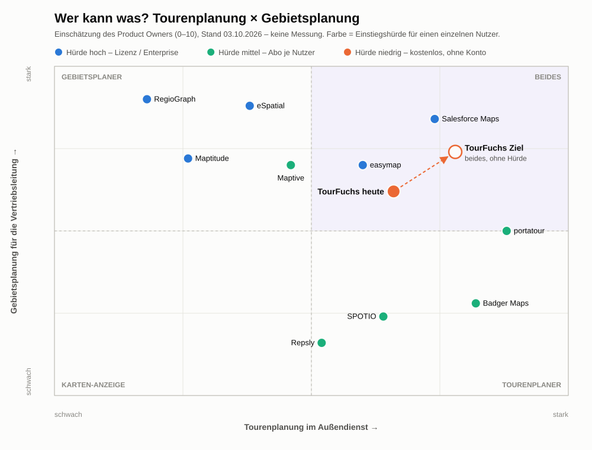

# TourFuchs – Wettbewerb

**Stand: 07.10.2026 · Rolle: Product Owner · Status: Arbeitsgrundlage**

TourFuchs spielt auf **zwei Funktionsfeldern** zugleich: **Tourenplanung** für den
Außendienstler (Moment A) und **Gebietsplanung** für die Vertriebsleitung
(GeoFuchs, Moment B). Dazu kommt eine dritte Wettbewerbsachse:
**Mitarbeiterautonomie statt zentraler Kontrollfähigkeit**. Auf den beiden
Funktionsfeldern gibt es etablierte Anbieter, aber
kaum einen, der beides in einem Werkzeug verbindet. Diese Seite beantwortet:

1. Wer ist auf welchem Feld unterwegs, und wie werben die Anbieter?
2. Was würde ein Wettbewerber tun, wenn er TourFuchs als Bedrohung sähe,
   etwa nach dem Rat einer KI?
3. Wie stellen wir uns auf, und was folgt daraus für die Roadmap?

Die verbindliche Kategorie, Werbebotschaft und die daraus folgenden roten
Linien stehen in [Produktpositionierung](positionierung.md).

> Die Recherche stützt sich auf öffentlich auffindbare Quellen (Stand oben). Sie
> ist eine Momentaufnahme, keine vollständige Marktstudie. Was eine fremde KI
> raten würde, ist eine begründete Einschätzung, keine Tatsache. Links wurden
> per Suche gefunden, nicht jeder einzeln geprüft.

---

## 1. Das Spielfeld auf einen Blick

| | Tourenplanung (Außendienst, unterwegs) | Gebietsplanung (Vertriebsleitung, Schreibtisch) |
|---|---|---|
| **Typische Anbieter** | portatour, Badger Maps, SPOTIO, Repsly | RegioGraph, eSpatial, Maptive, Salesforce Maps, Maptitude |
| **Beides** | portatour (Touren- *und* Gebietsoptimierung), easymap | |
| **Käufer** | Unternehmen, teils Einzelne | Vertriebsleitung, Controlling |
| **Preis** | Abo pro Nutzer (z. B. Badger Maps ab ca. 69 $/Monat) | Lizenzen, Enterprise-Verträge, Schulungen |
| **TourFuchs** | Außendienst-Modus | GeoFuchs |

**Unsere Besonderheit:** Ein kostenloses Browser-Werkzeug, das **beides** auf
denselben Daten kann – ohne Konto, ohne Installation. Die großen
Gebietsplaner sind Spezialwerkzeuge für Fachleute; die Tourenplaner kennen
keine Gebietsreform.

### Positionierungskarte

**Wie die Karte zu lesen ist:** Nach rechts wächst die Stärke in der
Tourenplanung (Außendienst, unterwegs), nach oben die Stärke in der
Gebietsplanung (Vertriebsleitung, Schreibtisch). Die Farbe zeigt die
**Einstiegshürde für einen einzelnen Nutzer** – die dritte Achse, auf der
TourFuchs sich am deutlichsten unterscheidet. Die Werte (0–10) sind eine
**Einschätzung des Product Owners** auf Basis öffentlicher Informationen, keine
Messung; sie sollen die Lage zeigen, nicht die Anbieter benoten.

| Anbieter | Tour | Gebiet | Hürde | Begründung |
|---|---|---|---|---|
| portatour | 8,8 | 5,0 | mittel | Starke automatische Tourenplanung (Intervalle, Öffnungszeiten, Übernachtungen); Gebietsoptimierung als Ergänzung. |
| Badger Maps | 8,2 | 2,8 | mittel | Routen, Leads, Kalender auf der Karte; Gebiete eher als Anzeige. |
| SPOTIO | 6,4 | 2,4 | mittel | Außendienst-Automatisierung mit Gebietsverwaltung, aber ohne Gebietszuschnitt im engeren Sinn. |
| Repsly | 5,2 | 1,6 | mittel | Fokus auf Handel/Konsumgüter-Außendienst, Planung eher Besuchslisten. |
| easymap | 6,0 | 7,0 | hoch | Gebiets- und Tourenplanung, klassische Unternehmenslösung. |
| Salesforce Maps | 7,4 | 8,4 | hoch | Beides stark – aber im Salesforce-CRM und über Enterprise-Verträge. |
| RegioGraph | 1,8 | 9,0 | hoch | Der Gebietsplanungs-Klassiker mit Marktdaten; keine Tourenplanung für den Außendienst. |
| eSpatial | 3,8 | 8,8 | hoch | Spezialist für Gebietszuschnitt und Ausgleich; Routing nur ergänzend. |
| Maptitude | 2,6 | 7,2 | hoch | Karten- und Gebietssoftware für Analysten. |
| Maptive | 4,6 | 7,0 | mittel | Gebiete im Browser, Routen ergänzend. |
| **TourFuchs heute** | **6,6** | **6,2** | **niedrig** | Tour (Lasso, Optimierung, QR aufs Handy, Briefing) und Gebiet (Bezirke, Cockpit, Was-wäre-wenn, Entscheidungsvorlage) auf denselben Daten – ohne Konto, im Browser. Abzüge: keine Zeitfenster/Übernachtungen, keine Marktdaten. |
| **TourFuchs Ziel** | **7,8** | **7,4** | **niedrig** | Siehe unten. |

**Wo TourFuchs hingehört – und wohin nicht:**

- **In das Feld „Beides“, aber als einziger mit niedriger Hürde.** Dort sitzen
  heute nur Lösungen mit Lizenz oder Enterprise-Vertrag (Salesforce Maps,
  easymap). Die Lücke ist nicht „noch mehr Funktionen“, sondern „beides,
  sofort, für Einzelne“.
- **Nicht nach ganz oben rechts.** Gegen RegioGraph (Marktdaten) oder
  portatour (Zeitfenster, Übernachtungen) in deren Kernfeld anzutreten, wäre
  das Heimspiel der Wettbewerber – teuer und gegen die Nischen-Entscheidung.
- **Der Weg zum Ziel ist schmal:** Die Pfeillänge entsteht durch Feinschliff
  an dem, was echte Nutzer vermissen (Praxistest, Serie-1-Rückmeldungen), nicht
  durch neue Module. Die Prüffrage bleibt: *„Hilft das unseren 10
  Außendienstlern?“*

## 2. Tourenplanung – Anbieter

| Anbieter | Kurzprofil | Marketing |
|---|---|---|
| **portatour** (impactit, Wien) | Automatische Tourenplanung mit Besuchsintervallen, Öffnungszeiten, Übernachtungen; dazu Gebietsoptimierung. Excel/CSV und CRM (Salesforce, Dynamics, Veeva). Kunden vom Selbstständigen bis 1.000+ Außendienstler. | Sachliche Erklär- und Demovideos |
| **Badger Maps** (San Francisco) | Karten-App: CRM-Daten auf Google Maps, Routenoptimierung, Leads, Kalender; Web und App Store. | Starke Inhaltsmaschine: Gründer-Podcast „Outside Sales Talk“ (einzelne Folgen ~30.000 Aufrufe), Produktvideos, offensive Vergleichsartikel auf LinkedIn |
| **easymap / EasyVisit** (Ipsos) | Web-basierte Touren- und Besuchsplanung mit Frequenzüberwachung, auch Gebietsplanung. | Webinare, Fachportale |
| **SPOTIO, Repsly** | Außendienst-Automatisierung (Tür-zu-Tür, Konsumgüter im Handel). | Klassisches B2B-Marketing |

**Links**

- portatour: [YouTube-Kanal](https://www.youtube.com/c/portatour/videos) ·
  [Kurzer Überblick](https://www.youtube.com/watch?v=2jOKmFnpsVw) ·
  [Dynamische Tourenplanung](https://www.youtube.com/watch?v=5dH2MG5nQ8g) ·
  [portatour-App](https://www.youtube.com/watch?v=4XQC4AMtnWQ) ·
  [Demo (ca. 10 Min.)](https://www.youtube.com/watch?v=Sm9FnxRP36o) ·
  [LinkedIn](https://www.linkedin.com/company/portatour/)
- Badger Maps: [YouTube-Kanal](https://www.youtube.com/channel/UC340Lg5zE8mVFmcE7u5ldlg) ·
  [Brand Demo Video](https://www.youtube.com/watch?v=Oi0XhdLXDYg) ·
  [Sell More with Badger Maps](https://www.youtube.com/watch?v=6-jxPbX56Ak) ·
  [Web App Walkthrough](https://www.youtube.com/watch?v=EafoIBPEPNU) ·
  [LinkedIn](https://www.linkedin.com/company/badger-mapping-solutions) ·
  [LinkedIn-Artikel „Is Badger Maps the best Portatour alternative?“](https://www.linkedin.com/pulse/badger-maps-best-portatour-alternative-steven-benson) ·
  [Podcast](https://www.badgermapping.com/podcast/how-i-left-my-sales-career-to-start-badger-maps)
- easymap: [Webinar Touren- und Auslastungsplanung](https://www.ipsos.com/de-de/node/1051991)

## 3. Gebietsplanung – Anbieter

| Anbieter | Kurzprofil | Für wen |
|---|---|---|
| **RegioGraph** (früher GfK, heute NielsenIQ) | Der deutsche Klassiker im Geomarketing: Gebiete planen, ausgleichen, umordnen, Berichte; dazu Kaufkraft- und Marktdaten. | Vertriebsleitung, Controlling; Lizenzsoftware |
| **easymap** (Ipsos) | Gebiets- und Tourenplanung, stark im deutschen Mittelstand. | Vertriebsleitung |
| **portatour** | Gebietsoptimierung als Ergänzung zur Tourenplanung. | Außendienst und Leitung |
| **eSpatial** | Spezialist für Gebietszuschnitt und automatischen Ausgleich; oft bei großen Neuordnungen. | Großunternehmen |
| **Maptive** | Gebiete im Browser nach PLZ oder Kunden; Ausgleich nach Umsatz, Arbeitslast, Anzahl. | Mittelstand, Preis pro Nutzer |
| **Salesforce Maps / Sales Planning** | Gebietsplanung direkt im CRM. | Salesforce-Kunden, Enterprise |
| **Maptitude** (Caliper) | Klassische Karten- und Gebietssoftware. | Analysten |

**Links**

- RegioGraph: [Vertriebsgebiete planen](https://www.youtube.com/watch?v=77EnFgCqVYc) ·
  [Vertriebsgebiete umordnen](https://www.youtube.com/watch?v=qIzID5wHICo) ·
  [RegioGraph 2024](https://www.youtube.com/watch?v=xgF4ZUmjxhA) ·
  [Gebietsberichte erzeugen](https://www.youtube.com/watch?v=9phxAumzWEQ) ·
  [Anwendung Vertriebsgebiete](https://nielseniq.com/global/de/landing-page/regiograph-applications-sales-territories/) ·
  [Booklet Gebietsplanung](https://nielseniq.com/global/de/insights/analysis/2023/geomarketing-booklet-gebietsplanung/)
- Marktüberblicke: [OMR Reviews: Vertriebsgebiete planen](https://omr.com/de/reviews/contenthub/vertriebsgebiete-planen-und-optimieren) ·
  [CRO Club: Software für Vertriebsgebietsplanung](https://croclub.com/de/tools/beste-vertriebsgebietsplanungs-software/) ·
  [Maptive: Sales Mapping Software im Vergleich](https://www.maptive.com/best-sales-mapping-software/) ·
  [Caliper: 25 Territory-Mapping-Tools](https://caliper.com/Maptitude/blog/25-best-sales-territory-mapping-software/default.htm)

## 4. Microsoft und das CRM als dritte Front

Add-ons wie **MapCopilot für Dynamics 365** zeigen die Richtung: Routen und
Gebiete per natürlicher Sprache im CRM („Zeig alle Leads im Umkreis von 50 km
und optimiere die Route“). Langfristig ist das die größte Verschiebung im Markt.
[MapCopilot (Inogic)](https://www.inogic.com/blog/2025/11/meet-mapcopilot-your-ai-powered-geo-mapping-companion-for-dynamics-365/)

Die Entwicklung ist inzwischen konkreter: Badger Maps bietet seit August 2026
einen MCP-Zugang für externe KI-Assistenten und nennt Routenplanung,
Follow-up-Mails und Briefings als Anwendungsfälle. Salesforce und SPOTIO
verbinden CRM-, Karten- und KI-Funktionen innerhalb ihrer Plattformen. Die
Behauptung „Karte plus KI ist neu" wäre deshalb falsch.

TourFuchs unterscheidet sich durch die **offene Arbeitsteilung**: Es liefert
lokal den räumlichen Kontext und eine sichtbare Briefing-Übergabe; die bereits
freigegebene Unternehmens-KI greift mit den Rechten des Mitarbeiters auf den
aktuellen Firmenstand zu. TourFuchs braucht weder CRM-Anmeldung noch KI-API.

- [Badger Maps: Verbindung mit externen KI-Assistenten](https://support.badgermapping.com/docs/maps-advanced/technical-support/how-to-connect-badger-maps-to-an-ai-assistant/)
- [Badger Maps: Pre-Meeting Briefs](https://support.badgermapping.com/docs/maps-advanced/technical-support/how-to-connect-badger-maps-to-an-ai-assistant-for-pre-meeting-briefs/)
- [Microsoft 365 Copilot: Sales Agent](https://learn.microsoft.com/en-us/microsoft-sales-copilot/use-sales-chat)
- [Salesforce Agentforce Account Management](https://help.salesforce.com/s/articleView?id=sales.account_mgmt_overview.htm&language=en_US&type=5)
- [SPOTIO-Plattform mit DASH und Next Best Action](https://spotio.com/platform/)

## 5. Die dritte Achse: zentrale Kontrolle oder Mitarbeiterwerkzeug

Die großen Plattformen verkaufen zentrale Sichtbarkeit als Nutzen. Das ist
legitim, aber ein anderes Produktversprechen:

| Anbieter | Öffentlich beschriebene zentrale Sicht |
|---|---|
| SPOTIO | GPS-verifizierte Besuche, aktuelle Teampositionen, Breadcrumbs, Routenhistorien, Audit-Logs und Leistungsansichten |
| Map My Customers | GPS-Check-ins, automatische Besuchsdauer und Live-Karte für Manager |
| Badger Maps | zeit- und ortsgestempelte Check-ins, Aktivitätsberichte, Manageransicht und Einsicht in Routen |
| Salesforce Maps | zentrale CRM-Aktivitäten und Live-Layer; das frühere mobile Live Tracking wurde zum 31.08.2026 eingestellt |
| **TourFuchs** | keine zentrale Mitarbeiteridentität, kein Hintergrund-GPS, kein Managerdashboard und keine automatische Aktivitätsmeldung |

Quellen:

- [SPOTIO: Sales Activity Tracking](https://spotio.com/features/sales-tracking/)
- [Map My Customers: Location-Based Check-ins](https://mapmycustomers.com/features/location-check-ins)
- [Badger Maps: Funktionen](https://www.badgermapping.com/features/)
- [Salesforce Maps: Live Layers](https://help.salesforce.com/s/articleView?id=sales.salesforce_maps_setup_live_layers_create.htm&language=en_US&type=5)
- [Salesforce: Ende des mobilen Live Tracking](https://help.salesforce.com/s/articleView?id=000390264&language=en_US&type=1)

Für Deutschland ist das strategisch relevant: § 87 Abs. 1 Nr. 6 BetrVG nennt
technische Einrichtungen zur Verhaltens- oder Leistungsüberwachung ausdrücklich
als Mitbestimmungsthema. Nach der Rechtsprechung des Bundesarbeitsgerichts kommt
es auf die objektive Eignung zur Überwachung an, nicht nur auf die erklärte
Absicht. TourFuchs verspricht deshalb nicht „betriebsratsfrei", sondern eine
schmalere und überprüfbare technische Architektur ohne zentralen Datenstrom für
Leistungs-, Verhaltens- oder Standortprofile.

- [§ 87 BetrVG](https://www.gesetze-im-internet.de/betrvg/__87.html)
- [Bundesarbeitsgericht 1 ABR 16/23](https://www.bundesarbeitsgericht.de/entscheidung/1-abr-16-23/)
- [§ 26 BDSG](https://www.gesetze-im-internet.de/bdsg_2018/__26.html)
- [Art. 5 DSGVO](https://eur-lex.europa.eu/legal-content/DE/ALL/?uri=CELEX%3A32016R0679)

**Wettbewerbsvorteil:** TourFuchs ist ein persönlicher Arbeitsraum. Der
Mitarbeiter entscheidet, welche operativen Arbeitsdaten per Export, Prompt,
Kalender oder Navigation bewusst nach außen gehen. Diese Grenze ist keine
fehlende Teamfunktion, sondern Teil des Produkts.

## 6. Werbung und Kurzfilme

- Die Anbieter **erklären**: Demos, Tutorials, Webinare. RegioGraph zeigt
  Bildschirm-Anleitungen, portatour Produktvideos, Badger Maps setzt auf
  Fachinhalte (Podcast) und offensive Vergleiche auf LinkedIn.
- **Emotionale Kurzfilme** im Stil der Lichterkarte haben wir nicht gefunden.
  Das beweist nicht, dass es keine gibt, aber das Muster ist klar: Niemand
  „zeigt her“.
- **Rückmeldung aus der Praxis (03.10.2026):** Die Kunden als Lichter
  darzustellen kommt sehr gut an. Das bestätigt: Der Coolness-Faktor ist ein
  echter Unterschied, kein Beiwerk.
- **Neue Botschaft (07.10.2026):** Nach dem sichtbaren Nutzen folgt das
  Vertrauen: „Ein Werkzeug in der Hand des Mitarbeiters – kein Fenster auf den
  Mitarbeiter." Keine Angstwerbung und keine Rechtsgarantie; jede Aussage wird
  mit der konkreten lokalen Architektur erklärt.

## 7. Was würde ein Wettbewerber tun? (Die Sicht einer „fremden KI“)

**Lageeinschätzung:** *„Kein Grund zur Panik.“* TourFuchs ist ein privates,
frei nutzbares Projekt ohne Support, CRM-Abgleich, Team-Funktionen und Vertrag.
Die Wettbewerber verkaufen an **Unternehmen** (Einkauf, IT); TourFuchs erreicht
**Einzelne**, die an der IT vorbei ausprobieren.

| # | Zug des Wettbewerbers | Wahrscheinlichkeit | Gefahr für uns |
|---|---|---|---|
| 1 | **Beobachten, nicht reagieren.** Eine Reaktion würde TourFuchs nur bekannter machen. | hoch | gering |
| 2 | **Vertrauen angreifen:** „Privates Tool, Schatten-IT, wer haftet, wo ist der Auftragsverarbeitungsvertrag?“ | mittel | **hoch** – das zieht in Unternehmen am stärksten |
| 3 | **Ideen nachbauen:** Lichterkarte als Heatmap, Copilot-Prompt für den Import. Ideen sind nicht geschützt. | mittel | mittel |
| 4 | **Gratis-Einstieg für Einzelne** (Solo-Tarif) – schließt die Tür, durch die wir kommen. | mittel | mittel |
| 5 | **In CRM und Copilot einbauen:** Ist Tourenplanung ein Copilot-Feature, ist sie in jedem Konzern einfach da. | steigend | **hoch** (langfristig) |
| 6 | **Gebietsplaner vereinfachen:** RegioGraph & Co. bringen eine schlanke Browser-Version. | gering | mittel – träfe GeoFuchs |
| 7 | **Den Entwickler ansprechen** – einstellen oder übernehmen. | gering | keine – eher eine Chance |

## 8. Unser Schutz – was schwer zu kopieren ist

1. **Null Hürde:** Browser, kein Login, keine IT-Freigabe, in einer Minute
   ausprobiert.
2. **Beides in einem:** Tour und Gebiet auf denselben Daten, für Außendienst
   und Leitung. Die Spezialisten bieten jeweils nur eine Hälfte.
3. **Nachprüfbares Vertrauen:** Kundendaten bleiben lokal, Datenschutz offen
   beschrieben, Nutzungszählung betriebsratsfest dokumentiert
   ([Nutzungsnachweis](nutzungsnachweis.md)).
4. **Insider im Konzern:** Der Entwickler kennt Abläufe, Firmen-KI und Kollegen.
5. **Emotion:** die Lichterkarte und die Filme.
6. **Mitarbeiterautonomie:** kein zentrales Verhaltens-, Leistungs- oder
   Standortprofil als Nebenprodukt der Nutzung.
7. **Offene KI-Brücke:** räumlicher Kontext aus TourFuchs, aktuelles Wissen aus
   der bereits freigegebenen Unternehmens-KI, verbunden durch eine sichtbare
   Nutzerhandlung.

## 9. Unsere Antworten (Produktentscheidungen)

| Zug | Unsere Antwort |
|---|---|
| **Vertrauen angreifen (2)** | Das Argument liegt bereit: lokal-first, [Datenschutzerklärung](https://tourfuchs.vercel.app/datenschutz.html), [Nutzungsnachweis](nutzungsnachweis.md) mit Betriebsrats-Teil, Open Source. Beim Konzern-Betrieb übernimmt der Konzern die Verantwortung (Roadmap, „Offene Themen“). |
| **Ideen nachbauen (3)** | Nicht verhindern, sondern schneller sein: Tempo durch echte Nutzer schlägt Nachbau. |
| **Gratis-Einstieg (4)** | Wir sind schon frei nutzbar; unser Vorsprung ist die fehlende Hürde (kein Konto), nicht der Preis. |
| **CRM / Copilot (5)** | **Mit Copilot arbeiten, nicht dagegen.** TourFuchs bereitet Prompts vor und sendet selbst nichts. |
| **Zentrale Team- und Kontrollfunktionen** | Nicht nachbauen. Kein Hintergrund-GPS, keine Manager-Routensicht, keine Ranglisten und keine personenbezogene Ereignisstatistik im persönlichen Kern. Ein späterer Unternehmensbedarf wäre eine neue Produktentscheidung, kein stilles Feature. |
| **Schlanke Gebietsplaner (6)** | Unser Gebietsplaner hängt am Werkzeug, das der Außendienst ohnehin nutzt – das kann ein reiner Gebietsplaner nicht nachbauen. |
| **Generell** | **Schmal bleiben, nicht in Funktionen konkurrieren.** Kaufkraftdaten, CRM-Abgleich, Teams und Verträge sind das Heimspiel der Wettbewerber. Prüffrage aus Roadmap 1a: *„Hilft das unseren 10 Außendienstlern?“* |

**Der beste Schutz:** 10 Menschen, die TourFuchs jede Woche nutzen – bevor es
jemand anderes merkt.

## 10. Was folgt für die Roadmap?

- **Reihenfolge bleibt:** erst der Außendienstler (Nische, Moment A), dann die
  Vertriebsleitung (GeoFuchs, Moment B). Die Leitung kommt am leichtesten dazu,
  wenn sie sieht, dass ihre Leute TourFuchs schon benutzen.
- **LinkedIn-Serie 2 „Für die Vertriebsleitung“** ist als offenes Thema mit
  Auslöser in der Roadmap: Gebietsplanung zeigen, wo die Wettbewerber teure
  Fachsoftware anbieten – und wieder mit der Lichterkarte als Einstieg.
- **Keine neuen Funktionen** aus dieser Analyse. Der Baustopp bis zum Praxistest
  gilt weiter.

## 11. Wann diese Seite neu ansehen?

- Ein Wettbewerber bringt einen Gratis-Tarif für Einzelne, eine
  Lichterkarte-ähnliche Ansicht oder einen schlanken Browser-Gebietsplaner.
- Microsoft kündigt Touren- oder Gebietsplanung als Copilot-Funktion an.
- Jemand stellt TourFuchs in einem Unternehmen als „Schatten-IT“ in Frage.
- Ein Wunsch nach zentraler Synchronisation, Managerdashboard, Live-Ortung oder
  automatischer CRM-Aktivitätsmeldung kommt auf.
- Spätestens bei der Entscheidung über den Konzern-Betrieb.

---

### Weitere Quellen

- [Badger Maps: Vergleich mit portatour](https://www.badgermapping.com/compare-portatour-field-sales/)
- [Badger Maps auf Capterra (Preis, Bewertung)](https://www.capterra.co.za/software/148607/badger-maps)
- [Starter Story: Wie Badger Maps mit einem Nischen-Podcast wächst](https://www.starterstory.com/stories/how-our-podcast-for-field-salespeople-became-one-of-the-most-popular-sales-podcasts)
- [portatour Erklärvideo (Help Center)](https://help.portatour.com/hc/en-us/articles/360023577312-Explanation-video-in-2-minutes)
- [portatour auf Softguide](https://www.softguide.de/programm/portatour-tourenplanung-fuer-outlook-mobile-salesforce-crm)
- [Capterra: Field-Sales-Software Deutschland](https://www.capterra.com.de/directory/33395/field-sales/software)
